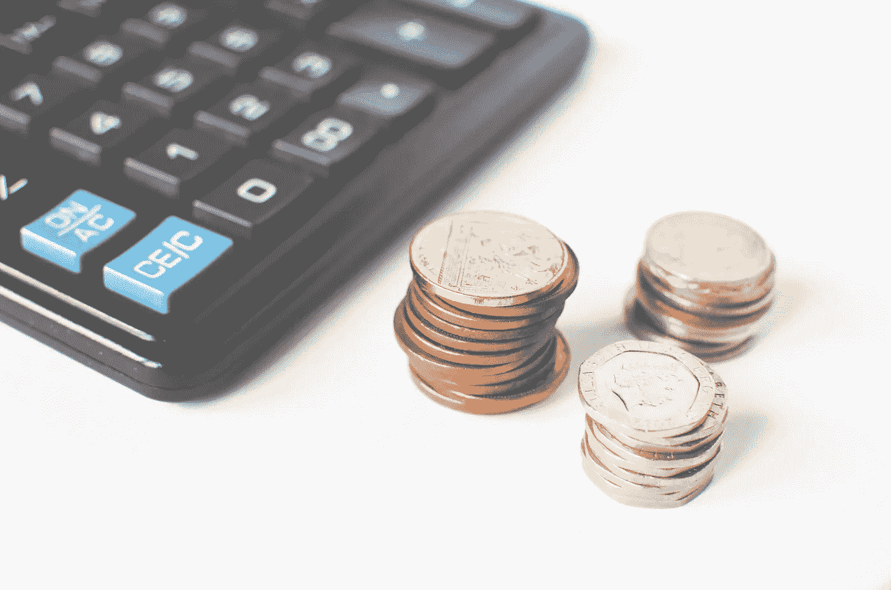

# 我如何巩固金融稳定

> 原文：<https://medium.datadriveninvestor.com/how-i-consolidated-a-financial-stability-3661df3823ed?source=collection_archive---------12----------------------->

这里有一些要点可以帮助你

我写《富爸爸穷爸爸》已经快 3 年了。从那以后，我一直用冥想来规划我的财务。一路上设置不同的里程碑，一次一个地进入下一个复杂层次。

在这三年中，我设法建立了我的财务计划:

*   我巩固了一个选股策略，并将其杠杆化为单一股票和指数基金的多元化投资组合。
*   我开始了一个私人养老金计划。
*   我建立了一个应急基金。
*   我买了我的第一处房产。
*   我什么都买了。(我的咖啡费用是🤯)

这些是将原则应用到我的具体计划中的结果。我试着整理了一些你今天可以采取的行动。我很确定他们会像帮助我达到这一步一样帮助你。

 [## 外汇投资如何帮助偿还债务|数据驱动的投资者

### 外汇是对外汇市场的投资，不同国家的货币在外汇市场上进行兑换

www.datadriveninvestor.com](https://www.datadriveninvestor.com/2019/02/13/how-forex-investment-helps-to-repay-your-debts/) 

# #1 跟踪、预算和节约

开始跟踪和预算。今天。

You do not budget like this, but he image is cool

重点是**多少**和**多少**。

你不会改善你无法衡量的事情。

第一步是认识到自己的处境。

从那里，你可以开始建设。

外面有很多工具。就我个人而言，我是从跟踪 MoneyControl 开始我的旅程的。简单而且能完成任务。

过了一段时间，我的一个朋友给我推荐了 [YouNeedAButget](https://www.youneedabudget.com/) ，我爱上了它下面的概念。

> “给每一欧元一份工作。”

这个简单的想法使我不仅对我得到的每一笔收入做预算，而且实际上迫使我意识到我花了多少钱和我做了多少预算。如果我总是超出预算，要么是我预算不足，要么是我花费过多。这种意识改变了游戏规则。

# #2 投资

自我教育。从小处着手。长得大。

这个话题太大了。不要假装是你唯一的真理来源，你应该从中吸取的第一件事是你需要学习。
[**这本书**](https://www.amazon.com/Intelligent-Investor-Definitive-Investing-Essentials/dp/0060555661) 切换了我对这个话题的心态。比当时任何其他事情都重要。也许也适用于你。

从那以后，我开始接触股票市场，在 Youtube 上关注相关人士:

*   [金融教育](https://www.youtube.com/channel/UCnMn36GT_H0X-w5_ckLtlgQ)。一般股票市场。
*   格雷厄姆·斯蒂芬。一个有趣又小气的家伙。

并辅以更多的阅读:

*   [Dhandho 投资者](https://www.amazon.com/Dhandho-Investor-Low-Risk-Method-Returns/dp/047004389X)
*   [战胜市场的小书](https://www.amazon.com/Little-Book-Still-Beats-Market/dp/0470624159)

但是当新的想法模糊了我的判断时，我总是回到格雷厄姆书中的哲学。

其次，**从小事做起舒适**。犯你自己的错误，这是你最有可能犯的。因为没有什么比从自己的错误中吸取教训更能让你成为更好的投资者了。

没有书，没有视频，没有人会比你自己更好地教会你。所以尝试一下。

最后，坚持你的计划，实现持续的增长。如果你做了功课，就会有回报。

复利是你的盟友。越快越好。

# #3 多样化

这是一个充满可能性的世界。

一旦你开始你的第一笔投资，你会发现还有更多。

在某个时候，我甚至对房地产产生了兴趣。

对我来说，买一套公寓的可能性变成了现实。不是我主动追求的东西，而是引起我注意的东西。在计算了这些数字并考虑了我的情况后，我做出了一个明智的决定。

机会来找我，别人也会来找你。这是一个你有多少曝光率和你有多少意愿去探索它们的问题。

Eggs are safer in different pods

> 虽然投资没有通用的法则，但总有聪明的一招，不要孤注一掷。

# #4 做什么

开始吧。现在。

战胜拖延症。从现在开始到达那里。确保每一天你都更近一步。设定目标，在短时间内承诺可行动的事情，并采取行动。

你应该有一个计划，因为没有事情是偶然发生的。但更重要的是，你应该开始**执行那个计划**、**持续**、**一段时间**。

不要害怕，也不要想太多。你永远都不会准备好。你会熬过去的，只要确保你坚持你的原则和策略。

# #5 享受

否则不会长久。

我坚信，要长期持续地做一件事，你必须享受它。如果你做的事情没有乐趣，你可能会坚持一段时间，但是困难时期需要的不仅仅是计划和动力。他们会要求你给予关注，并推动你的信念，直到你开始怀疑你到底是怎么开始的。

现实是，每件事都有起起落落，最终，你的计划不会像你想象的那么好。

通过享受观看经济新闻，学习如何识别新的商业机会，听一些关于首席执行官和投资者的电话会议或播客…你一定会以更清晰的思维度过艰难时期。知道你做出了**聪明的**和**深思熟虑的**的决定。

希望你喜欢到目前为止的阅读，你会发现它很有用！