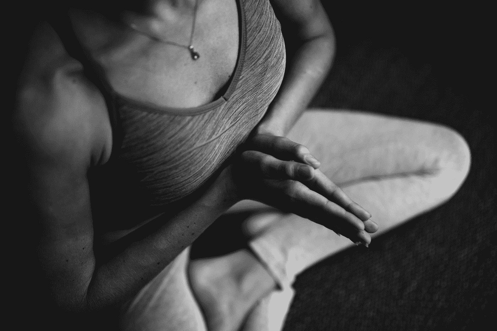
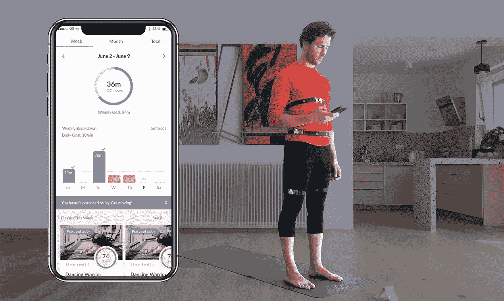
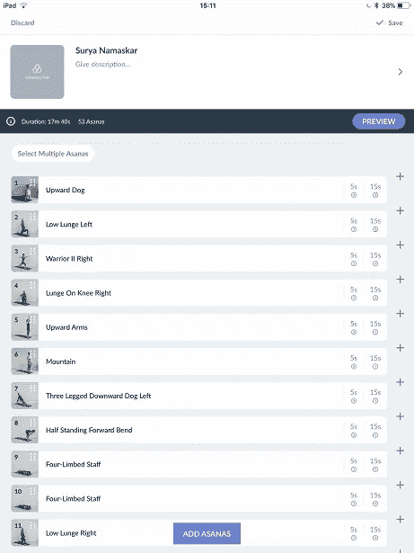

# 我是如何利用科技显著提高身体意识的

> 原文：<https://medium.datadriveninvestor.com/how-i-dramatically-increased-body-awareness-using-technology-c6a03e44ed8a?source=collection_archive---------13----------------------->

Photo by [Conscious Design](https://unsplash.com/@conscious_design?utm_source=medium&utm_medium=referral) on [Unsplash](https://unsplash.com?utm_source=medium&utm_medium=referral)

瑜伽练习最大的挑战是什么？

是发展肌肉力量，还是柔韧性，还是保持高难度体式的耐力？还是放松和释放身体所有压力的能力？

即使你变得非常强壮、超级灵活和放松，你也很难触及被称为瑜伽的终身练习的表面。在几乎每天练习瑜伽十年之后，对我来说最具挑战性的部分是时刻意识到我的身体是如何运动的，并控制和调整这些运动，以从练习中获得最大收益。

多年来，我一直在寻找激进的方法来提高我的身体意识。我尝试了瑜伽课，一对一的课程，在线课程，自我录制。所有这些都提高了我的练习，但它们并没有让我在做瑜伽时完全意识到并“呈现”出来。我的头脑不是在沉思过去的问题，就是在展望未来。我经常意识到，在大半个疗程中，我都在无意识地移动，不知道自己是如何做体式的，也不知道 T2 当时的感受。这令人沮丧。

在研究动作捕捉(MoCap)技术如何帮助职业运动员提高成绩的过程中，我偶尔会遇到一个名为 [Yoganotch](https://yoganotch.com/) 的应用。立刻就灵光一现。这就是我如何改变我的瑜伽练习，并在课程中充分展现自我的方法。

在这篇文章中，我将通过我使用这种最先进的技术来提高我的身体意识的经历来指导你，这是我从来没有想象过的。是的——这对每个人来说都是容易和容易的。如果我做到了，你也能做到。

## ***为什么瑜伽中身体意识很重要***

“瑜伽”一词源于梵语，意思是“团结”或“连接”。它指的是一种连接身体和精神的方法，我们的身体与精神和情绪状态。奥义书指出“瑜伽之所以被称为瑜伽，是因为它带来了(1)感官、头脑和生命力(prana)的统一，以及(2)通过消除头脑的多向性而在沉思中保持稳定”。瑜伽的最终目标是驾驭感官的狂热，平静心灵，实现与宇宙意识的统一。

在古代，身体和心灵之间的这种联系是通过一对一的练习来实现的。瑜伽的工具直接从老师传给学生。这在现代已经很大程度上失去了，因为瑜伽的重点是身体方面，以及集体瑜伽课程的传播。我们错过了公正的反馈，只有非常有经验和体贴的老师才能提供这种反馈——这种反馈将学生的注意力从桀骜不驯的头脑转移到最轻微的身体感觉，并将头脑牢牢地固定在“此时此地”上。

身体意识是瑜伽的精髓，掌握它意味着要特别注意你的身体如何运动，以及这些运动如何贯穿整个流程。

## **T3 什么是瑜伽士**

Yoganotch 是一个应用程序，它从放置在您身体上的小型传感器(“槽口”)收集数据，对其进行分析，并就您需要进行的调整提供音频反馈。它基于 MoCap 技术的最新进展，使用 3D 运动传感器和人工智能实时生成人类运动的精确数学模型。同样的技术已经被用于视觉艺术创作动画角色(如《指环王》中的[咕鲁或《阿凡达》中的纳威](https://www.filminquiry.com/overview-rise-motion-capture-filmmaking/))，然后扩展到其他领域，如体育和医疗保健。MoCap 不需要摄像机，因为传感器会自动识别你身体的位置并绘制你的动作，所以你甚至可以在黑暗中练习瑜伽！

Photo provided by [Yoganotch](https://yoganotch.com/)

Yoganotch 的基础是从瑜伽练习者那里收集的大量数据。它扩大了我们注意力带宽的极限，捕捉到了人类大脑无法分析或保留的关于身体运动的重要数据。

> **斯捷潘·波尔塔林(Stepan Boltalin)，Yoganotch 的创始人**:*我们创造了 notch，作为对人体意识和动作处理能力的升级。Yoganotch 体现了我们对瑜伽和自我改善的兴趣和喜爱，因为瑜伽将令人惊叹的复杂姿势与简单有效的原则相结合，有助于改善身体意识，这是很少运动系统能做到的。Yoganotch 能够实时捕捉瑜伽姿势，并提供人类可读的解释和建议，以适应特定人的表现*。

Yoganotch 通过提供公正和详细的反馈，取代了你在家练习时自己的视频记录，甚至取代了小组课上的瑜伽老师。

## ***我的目标和初期投资***

为了测试 Yoganotch 的有效性，我设定了以下目标:在四周的日常练习中使用 Yoganotch，并反思我的表现和身体意识是如何演变的。

初始投资:如果你从美国境外订购，一套最少四个凹槽传感器的价格为 299 美元，不包括运费和关税。不涉及持续成本。Yoganotch 允许免费使用其应用程序，该应用程序会定期更新新的类别和功能，他们不打算引入付费订阅。Yoganotch 可能会添加优质内容，以帮助瑜伽教师将他们的专业知识货币化，但绝不会阻止在不额外收费的情况下充分利用应用程序的价值。

## ***如何开始使用约加诺***

开始使用 Yoganotch 既简单又直接。我下载了一个应用程序(目前只兼容苹果 iOS)并创建了一个帐户。然后，您需要通过蓝牙连接将凹槽与您的设备配对。Yoganotch 应用程序为如何做到这一点提供了非常[清晰的说明](https://docs.yoganotch.com/docs/yoganotch_app_pair/)。请注意，您只能将您的槽口与一台设备配对，因此，如果您想与其他人共享或在不同的设备上使用，您需要先解除配对。

配对后，您可以通过选择一个类别来使用您的凹槽，打开并校准它们，以根据周围环境调整凹槽，并以最高精度测量您的姿势。为了校准，你需要把所有的槽口都放在基座上，关上它，把基座从一只手翻转到另一只手，逐渐增加速度。为了获得最佳结果，您需要在距离设备大约一米的地方进行校准。起初，我站得离我的 iPad 太近，所以校准失败了几次，直到我学会站得更远。

校准后，您需要将槽口插入肩带，并根据说明将它们放置在您身体的相关部位。我在我的胸部放了一个切口，在我的髋关节顶部放了一个切口，在左右大腿都放了一个切口。重要的是要确保带子在会话期间不会滑动，因为这将导致不准确的反馈。为了达到最佳效果，我穿紧身打底裤和胸罩。虽然 Yoganotch 网站建议将带子放在裸露的皮肤上以获得最佳效果，但我在使用贴身瑜伽服装上的凹槽时没有遇到任何问题，就像[这件](https://youtu.be/DsogwnMG2tY)。

## ***构建自己的会话***

一开始，我测试了 Yoganotch 平台上的几个可用类，但我真正的愿望是构建我自己的序列，这是我通过多年的实践磨练出来的。Yoganotch 有一个序列设计器，允许您通过简单地从库中拖放体式来构建自定义流程。例如，我创造了一个持续 17 分钟的 Surya Namaskar 课程，由 53 个体式组成。每个体式持续时间为 20 秒，包括 5 秒的姿势转换时间。我把同一个体式的几次重复放在一起，以增加我保持一个姿势的时间(例如，我把 3 个平板体式组合在一起，在一个平板上保持一分钟)。

Screenshot of the Yoganotch UI

建立我自己的会话既直观又有趣。不过也有不好的一面。有些体式没有视频指导(例如全猴式)，所以你需要用心去了解它们。反馈的水平似乎也因不同的体式而不同，尽管总的反馈非常详细和中肯。音频评论将用户的注意力吸引到某些身体部位(例如，“拉长你的脊柱”或“挺直你的臀部”)，建议用户应该纠正他们的姿势。有时反馈更笼统(例如“检查你的胸部”)，但这仍然是有帮助的，因为它邀请你反思姿势，而不是机械地从一个姿势移动到另一个姿势。

> **斯捷潘·波尔塔林，Yoganotch 的创始人**:*当我们开始开发 Yoganotch 时，我们不得不承认，我们大大低估了对瑜伽进行 3D 运动分析的复杂性和挑战性。Yoganotch 突出的一点是将语言线索映射到我们的软件所做出的解释的复杂性，这是瑜伽学习过程的核心。因此，我们有一个庞大的指令库，它是基于凹槽传感器测量的数据动态生成的。对于每一秒钟，我们都可以提出几十个可能的建议，所以我们必须根据特定的姿势、它在序列中的位置、练习者的整体技能水平以及他们的偏好来对它们进行优先排序。我们正在计划推出一个更大程度的个性化服务，您听到的建议将与您的生物特征参数以及您最近的实践历史相关，同时保持对我们用户安全的关注*。

总而言之，音频反馈是 Yoganotch 应用程序的核心，非常有用。在使用 Yoganotch 仅仅四周后，我已经注意到我的练习有了相当大的改进。当你练习瑜伽多年后，很容易变得过于自信，不再适当关注体式的细微差别。通过口头指示，Yoganotch 帮助我将注意力重新集中到我当时正在做的姿势上。Yoganotch 结合了对你身体运动的精确分析和从许多练习者那里收集的数据，它将你的注意力准确地导向需要改进的姿势方面。即使是瑜伽老师也不一定能发现这一点，至少在小组课上不能，因为在小组课上，每个学生的时间都非常有限。从这个意义上说，智能技术的出现，比如 Yoganotch，可能是一个好兆头。这可能是将最新的技术进步与古老的瑜伽传统相结合的起点，瑜伽完全是个人化的，根据每个学生的能力而定。

## ***衡量这个——衡量标准对瑜伽有用吗？***

Yoganotch 不仅提供实时反馈，它还分析以前的数据，并根据每个体式的细分，从 1 到 100 给每个环节打分。这些分数作为一个参考点来跟踪你的练习每天是如何变化的，以及你的特定体式的表现是如何发展的。例如，我可以立即看到，在短短一周的时间里，我的下犬式姿势从 65 度提高到 82 度，因为我听从了约格诺奇的建议，挺直了臀部，放低了胸部。Yoganotch 也有工具来设定每周和每月的目标，并根据这些目标跟踪你的进展。

也就是说，我对将度量引擎应用于 yoga 并不完全满意。度量引发比较，比较鼓励竞争，而竞争违反了瑜伽的基本原则之一——[【非暴力】](https://www.yogapedia.com/definition/4/yoga)。广受欢迎的印度古鲁奥修曾经说过:“比较……是最大的疾病……因为每个人都是独一无二的，比较是不可能的……。

瑜伽提倡同情每一个生物，包括我们自己。这意味着我们应该关心和感激地对待我们的身体，而不是在追求完美或更高的表现分数时超越它的界限。另一方面，收集和分析关于身体运动的定量数据的能力是 MoCap 技术提供最大价值的地方。如何才能使评分系统与瑜伽中的非暴力不比较方法相协调？

> Yoganotch *的创始人 Stepan Boltalin 说:“我们的指标引擎在国内外都是一个热门话题，因为许多练习者将评分系统视为迈向竞争和远离瑜伽基础的一步。虽然我们设计评分并不是为了激励竞争行为，而是作为一个参考框架，供人们反思他们的练习的演变，但我们很高兴有机会了解我们的设计决策如何影响人们的瑜伽练习。在收集了我们的观众的意见后，我们正在重新设计我们的指标引擎，以确保它能够帮助人们从 Yoganotch 的实践中获得最大价值。*

重温标准的表现指标，让瑜伽练习反映出你的个人优势和局限性，这是非常受欢迎的。最终，瑜伽是一条向所有人开放的道路；技术应该作为个性化和灵活性的工具，帮助将焦点从纯粹的“物质”转移到更深层次的意识。

## ***结果:四周有什么变化***

连续四周每天使用 Yoganotch 技术，我见证了我实践中的明显进步。首先，它帮助我意识到最轻微的身体动作。通过基于从我身体实时收集的数据给出口头建议，该技术将我的注意力吸引到每个体式的宝贵细微之处，并揭示了需要更多工作的领域。第二，它是个性化的，符合我自己的实践 Yoganotch 决心通过更深层次的个性化来进一步发展这一点。Yoganotch 的反馈并不抽象，也不容易被误解，它准确地反映了我的身体是如何运动的。第三，Yoganotch 非常容易使用:设置很简单，你不需要摆弄相机，尽量保持在它的视线范围内，然后回放序列，以了解你做得有多好。你的瑜伽流是不间断的，所以你可以完全专注于你的练习，而不是技术。

总而言之，Yoganotch 极大地提高了我的身体意识，让我专注于我的动作，并在练习的每一个时刻都保持专注。正如一位古代瑜伽大师所说:“瑜伽带你进入当下，这是生命存在的唯一地方”。

*原载于 2020 年 11 月 12 日 https://www.datadriveninvestor.com**的* [*。*](https://www.datadriveninvestor.com/2020/11/12/how-i-dramatically-increased-body-awareness-using-technology/)