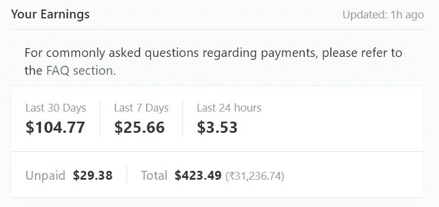
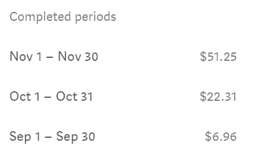

# 我是如何在空闲时间兼职赚到 424.45 美元的。

> 原文：<https://medium.datadriveninvestor.com/how-i-earned-424-45-as-a-side-hustle-in-my-free-time-640922edc2cb?source=collection_archive---------9----------------------->

## 如果你在正确的平台上，网上赚钱是可能的

Money vector created by studiogstock — [www.freepik.com](http://www.freepik.com)

我总是试图在网上赚钱。由于新冠肺炎·疫情，我的公司把我的报酬减少到 50%，这让我彻底崩溃了。对我来说太可怕了。我还有 10，000 美元的学生贷款要还。在新冠肺炎开始的日子里，情况是最糟糕的。

我口袋里没有钱；我睡了很多个晚上，做着噩梦。然而，我知道我就要没钱了；我开始思考如何在网上赚钱。

在新冠肺炎一级防范禁闭期间，由于严格的一级防范禁闭，我在家办公的时间较少。我有很多空闲时间。上帝看到了我的痛苦，Quora 邀请我加入他们的伙伴计划。

2016 年起我是 Quora 上的活跃作家；我写了很多有用的答案，但是 Quora 从来没有给我发过合作邀请。我接受了他们的邀请，加入了他们的合作伙伴计划。

我上学时为一份每周时事通讯撰稿。在一次禁闭期间，我发现了自己的写作爱好。我开始在不同的平台上写作，比如 Medium 和 Vocal。早些时候，我只在 Quora 上写作。

是时候通过网上写作赚钱了。我觉得为钱写作没什么问题。我开始着手我的被动收入来源，秘密地。这是我这辈子做过的最好的决定。你和你的被动收入来源一起成长，同样的事情也发生在我身上。

# 我开始在 Quora 上提问

在 Quora 上写问题就能赚。Quora 付钱给你不是因为你写东西，而是因为你问问题。

是不是听起来怪怪的！

这是他们的商业模式。总是很难发现硅谷领导人在想什么。你可以通过提问在 Quora 上赚很多钱。为此，Quora 必须邀请你加入合作伙伴计划。

Screenshot from Author

加入合作伙伴计划后，我问了大约 12000 个问题，在 6 个月内赚了 380 美元。我最初几个月的收入远远低于现在的收入。我每月都在分享它。

1.  五月-9.23 美元
2.  6 月-17.56 美元
3.  八月-22.67 美元
4.  九月-81.89 美元
5.  十月-73.78 美元
6.  11 月-120.09 美元

Quora partner program 的工作原理类似于复利效应，即你在努力工作数月后获得的回报。

Quora 的收入取决于搜索引擎优化，这是你的问题是在谷歌首页排名，你会赚得更多。你必须了解 SEO。Quora 的域名权限更高，为 95。如果你的问题有足够的答案，你的问题会很快得到排名。

在 Quora 上赚钱很难，我是通过做研究和向其他合作伙伴学习来赚钱的。我把它加入了我的被动收入流。

 [## React Native 如何提高移动应用开发者的生产力？数据驱动的投资者

### React Native 是一个有益的框架，可以帮助您使用 JavaScript 设计应用程序。这种结构包括…

www.datadriveninvestor.com](https://www.datadriveninvestor.com/2020/11/30/how-react-native-improves-the-productivity-of-mobile-app-developers/) 

# 我找到了媒体和有声媒体来赚钱

通过网上写作赚钱对我来说很难。我从未尝试过自由职业，但将来会尝试。为了赚取可观的被动收入，我开了自己的博客，但它没有得到任何关注。

我在我的博客上投资了 100 美元，却什么也没赚到。我在谷歌上发现了 Medium，并加入了它。我人生中第一次通过在网上写作赚钱。在媒体上写作对我来说是一种特权。我已经赚了 75 美元。我知道数量很少，但会更多，我开始在平台上付出更多努力。

我赚了，

*   9 月份 6 美元
*   10 月 23 美元
*   11 月 48 美元

通过出版大约 60 个故事。

Screenshot by author

最近我在有声媒体上写文章，我在那个平台上赚得不多，但坚持两个或更多的平台来构建未来的投资组合总是好的。

媒体和有声媒体都是最好的博客平台，我正在练习写作，并赚了一大笔钱投资股票市场。

# 赚取被动收入如何帮助我支付账单

每月 100 美元会改变我的生活吗？我们总是寻找更大的数量。让我告诉你，如果你有适当的投资计划，你可以加倍这一数额。

我用我的被动收入进一步投资股票和比特币。我承担风险；这有助于赚更多的钱。归根结底，我们都是为了钱而活，这是我们的首要任务。清晰、恰当的投资计划帮助我实现了我的财务目标。

# 外卖食品

当我回顾我的生活时，我总是没钱，陷入财务问题，但当我开始赚取被动收入时，我在财务上变得更加稳定。

没有大学或学校告诉你如何在经济上独立和稳定。你必须开辟一条出路。是时候总结一下，我们的故事，

1.  寻找潜在的被动收入来源
2.  开始一天一天的成长
3.  投入时间和金钱去学习新事物
4.  将你的被动收入投资于股票和比特币

## 获得专家视图— [订阅 DDI 英特尔](https://datadriveninvestor.com/ddi-intel)