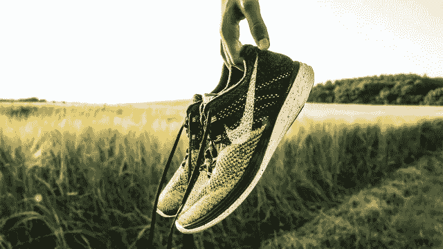
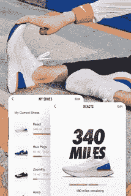

# 我为什么会爱上 Nike+ run club

> 原文：<https://medium.datadriveninvestor.com/how-i-fell-in-love-with-nike-run-club-eda928ec94e0?source=collection_archive---------23----------------------->

## 快乐或悲伤只是运行

## 每天跑 5000 米…

Photo by [Kristian Egelund](https://unsplash.com/@kristianegelund?utm_source=unsplash&utm_medium=referral&utm_content=creditCopyText) on [Unsplash](https://unsplash.com/s/photos/running?utm_source=unsplash&utm_medium=referral&utm_content=creditCopyText)

上周我 20 岁了。是的，我知道你在想什么。衰老让我和 20 年代初的人一样害怕。在我的生日前夜之后，我开始对变老感到恐慌，我紧张了。不知何故，那天晚上我设法睡着了。第二天早上，当我从床上起来的时候，我听到了那些来自我膝关节的恐惧的声音。这让我更加害怕。所以我开始看关于长寿的视频，也读 Ikigai(日本人长寿快乐的秘诀)。跑步是所有视频中唯一共同的提示。然后我在谷歌上冲浪，了解了 NRC(Nike+ run club)。

## 鞋子有里程吗？

在 NRC 中添加我的跑鞋后，它显示了这双鞋可以跑多少英里。只有在 NRC 之后我才知道鞋子有里程数(LOL)而且会过期。

> 最近对一些跑步研究发现的研究表明，即使一周或一个月只跑一次，过早死亡的风险也会降低 27%。

每天，NRC 都用 tintintinnabulation 叫醒我。NRC 从不容忍我不参加日常训练。所以我在早上 6 点整做好准备，穿上鞋子。而且，如果我试图作弊，它会抓住我。

# 在别人面前

我知道 NRC 从来不会在我的朋友面前让我失望。即使我无视它的通知，它也总是试图让我保持体形。即使卸载后，它还是会给我发邮件。貌似 NRC 也爱我(LOL)。那些以前忽视我的女孩现在开始回短信，归功于 NRC。每当我在 Instagram 上发布我的日常记录时，人们都会问，我是怎么做到的？这种欣赏让我感到精力充沛，我的大脑分泌更多的多巴胺，帮助我跑得更远。

# 把我和其他跑步者联系起来

NRC 帮助我建立了一个跑步部落，激励我保持动力。耐克教会我，跑步真正是关于旅程，而不是目的地。有一个和你一起踏上相同旅程的团队是让你在“不那么令人兴奋”的跑步日保持责任感的好方法。NRC 创造灵感。正如我过去看到的激励我保持领先的挑战板，但耐克从未就此止步。它在你不跑的地方嘲笑你。

Photo by [Raghu Nayyar](https://unsplash.com/@raghunayyar?utm_source=unsplash&utm_medium=referral&utm_content=creditCopyText) on [Unsplash](https://unsplash.com/s/photos/friends?utm_source=unsplash&utm_medium=referral&utm_content=creditCopyText)

我从未想过这个跑步部落会变成一个家庭，但 Nike+ Run Club 让这成为可能。跑步之后，我们会去咖啡馆，在那里度过一段美好的时光。

> 如果它没有挑战你，它不会改变你

# 小礼物！

我每天跑步是因为耐克给我的那些小成就贴纸。我喜欢这样。就像每当妈妈下班回家时，婴儿都期待着太妃糖一样，我也期待着 NRC 的贴纸。

> 我想坦白，我可能不会说出口，但我至少可以通过我的语言表达出来。我爱你 NIKE+ RUN CLUB。你彻底改变了我的生活，给了我生活新的意义。我无法想象没有你的日子。我太爱你了。

剧终

*最初发表于*[*【https://weekendblogbydk.blogspot.com】*](https://weekendblogbydk.blogspot.com/2021/01/how-i-fell-in-love-with-nike-run-club.html)*。*