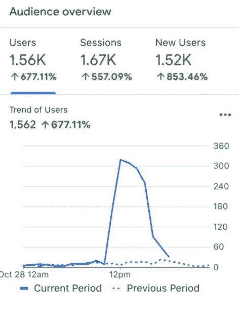
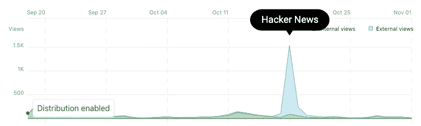
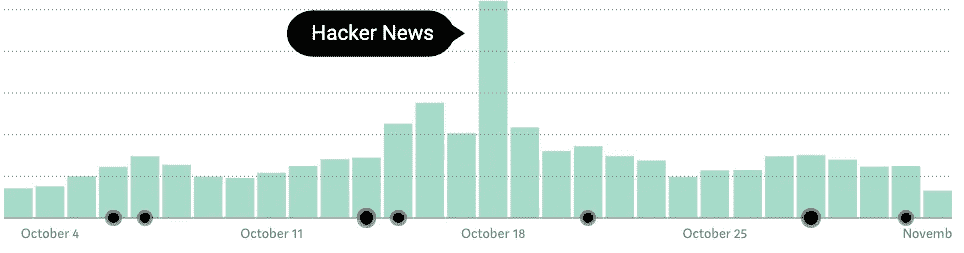
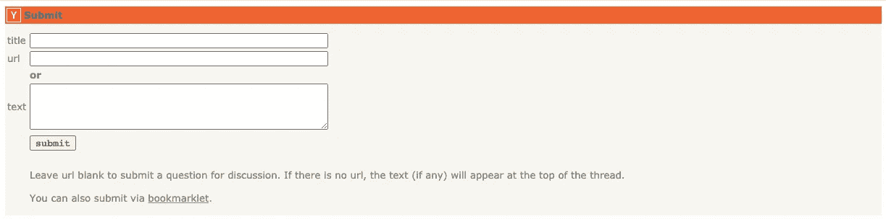

# 我如何通过黑客新闻获得新鲜网站的即时流量

> 原文：<https://medium.datadriveninvestor.com/how-i-get-instant-traffic-to-fresh-websites-with-hacker-news-9630637e9cb?source=collection_archive---------8----------------------->

## 以及为什么它能很好地与介质一起工作。

Photo by [Toni Koraza](https://unsplash.com/@tonikoraza?utm_source=unsplash&utm_medium=referral&utm_content=creditCopyText) on [Unsplash](https://unsplash.com/@tonikoraza/stats?utm_source=unsplash&utm_medium=referral&utm_content=creditCopyText)

*刚出炉并且已经形成趋势*是描述好的注释的极好方式 [*绘制在 PDF*](https://www.goodannotations.com/tools/draw-on-pdf) *登陆*页面。

新的登陆页面在最初几周几乎没有得到个位数的关注。SEO 优化和拥有受众的道路漫长而坎坷。谷歌需要时间去了解你的网站，并根据其权威性进行排名。

只有当你的内容通过审核，你才可能开始得到一些关注。

温迪·皮索(Wendy Piersall)说:“只有当所有人都先爱你的时候，谷歌才会爱你。”。

# 社交媒体广告和 Adwords 可以帮助你启动这一过程，但还有另一种方法。

为广告付费是一种在有针对性的关注上花钱的可靠方式。

但是，即使是付费广告，你仍然必须抓住信息，并产生有利可图的线索。否则，你只是在浪费钱。

滚雪球般增加你的项目、故事和登陆页面的最佳方式是激起人们的兴趣，开始讨论，并获得社交分享。口碑是互联网上最强大的营销力量。

Perry Steward， [Good Annotations](https://www.goodannotations.com/) 的创建者，将他的新登陆页面带到了 Hacker News，并围绕他的新 PDF 注释工具引发了一场社会讨论。人们[分享了他们对 PDF 文档的不满](https://news.ycombinator.com/item?id=24916721),并就如何改进好的注释提出了意见。

答对了。佩里正在学习如何改进产品，帮助更多的人。

一个看似不起眼的新登录页面的浏览量在一个下午就上升到了 1562 次，推动了该网站在谷歌上的发展，并在第二天继续给更多的新用户。

# Dropbox 最初是黑客新闻上的一个病毒故事，后来变成了一家价值 120 亿美元的公司。

Dropbox 的创始人 Drew Huston 在黑客新闻上分享了一个关于 2007 年年中 u 盘[死亡的短片。](https://www.ycombinator.com/library/6S-on-starting-and-scaling-dropbox-yc-w07)

数百个文件共享平台那时已经充斥了互联网，大多数人只会给自己发邮件。如果你跳转到最初的 Dropbox 主题，你会发现许多人甚至看不到 Dropbox 的未来，认为提供这样的服务是多余的，甚至是愚蠢的。

然而，黑客新闻上的病毒式讨论将 Dropbox 推向了聚光灯下，并推动该公司成为大规模采用云技术的先驱之一。Drew Huston 从这些讨论中获得了足够的动力，设计了一个更好、更面向用户的 Dropbox 版本，并将他的产品推向大众市场。

如今，Dropbox 在全球拥有 [6 亿活跃用户](https://dropbox.gcs-web.com/index.php/static-files/8ccb3453-e70a-430c-96db-1e20badae0d3)。

Author’s Screenshot/Good Annotations

# 你可以在媒体上使用黑客新闻获取外部信息。

我在黑客新闻上分享了一个[朋友的链接](https://medium.com/illumination/why-you-shouldnt-overlook-friend-links-7eeae4d777ca)，一天之内就获得了 1490 次浏览。

故事讲的是[我在 Upwork](https://medium.com/the-ascent/heres-how-i-made-1-703-in-my-first-month-on-upwork-eea580ecb21f) 的前三周如何赚了 1703 美元。标题激起了足够多的滚动读者的兴趣，让他们停下来，读完故事，然后查看我在媒体上的其他内容。浏览量/阅读量比率非常高，当天我所有的媒体报道的浏览量都翻了一番。

越来越多的人开始阅读我的故事，我可能会帮助其他自由职业者在 Upwork 上找到优秀的客户。

Author’s Screenshot/Good Annotations

# 任何人都可以向 Hacker News 提交一个故事，但不是所有东西都会飞起来。

我希望人们不要给 HN 发关于世界上任何事情的垃圾邮件。

**首先**，发送什么都行不通。你的内容会被标记，甚至被关闭。你还破坏了一个奇妙的在线社区，它逃脱了将观点装进有偏见的泡泡中的社交算法。

**第二**，Medium 不是一个赚钱的平台，即使很多作家每个月的收入都是 10000+美元。如果你拼命为钱写作，你在这里是不会成功的。Medium 是一个讲故事的平台，人们在这里阅读有趣的东西，并学习一些他们试图发展的技能。

垃圾邮件在这种环境下无法生存。

## 黑客新闻鼓励“满足个人求知欲”的内容。

你不需要成为一个真正的黑客就可以从智力上吸引人。

我绝对不是黑客。你可以分享个人发展故事、产品发布、设计工具和具有煽动性的媒体故事。

我关于 Upwork 的报道产生了特别的影响，因为许多自由职业者抱怨 Upwork 的底层竞争和狡猾的客户。我在这个平台上有了不同的体验，并找到了六个我愿意与之无限期合作的出色的人。

对我来说，Upwork 一点也不危险，这让人们很好奇。

Hacker News Submit Form

## 黑客新闻可以帮助你启动项目，启动登录页面的搜索引擎优化，并引发与民主用户群的社会讨论。

该平台允许任何带有简短标题的链接。

文本框是可选的，您不必填充它来提交您的故事。添加标题和链接，如果你使用 Medium，我鼓励你分享朋友链接。朋友链接是避免付费墙的一种方式。你可以在头像旁边的虚线菜单里找到好友链接。

然后，单击提交，帮助您的故事获得更广泛的受众。当你提供真正的价值时，人们会来讨论你的想法的优点。

额外的浏览量和 SEO 果汁也没那么差。