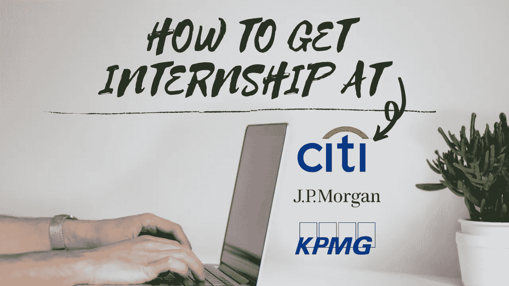

# 如何在像毕马威、摩根大通和 CITI 这样的公司实习

> 原文：<https://medium.datadriveninvestor.com/how-i-got-an-internship-with-companies-like-kpmg-jp-morgan-citi-eb575f4d5d52?source=collection_archive---------19----------------------->

如果你点击这篇文章纯粹是基于标题，那么让我告诉你保持多巴胺在你体内流动，因为我要告诉你如何才能在像毕马威、摩根大通和 CITI 这样的公司获得实习机会。

就像我一样，我肯定你们中的许多人被困在家里，不知道疫情什么时候会结束，如果你来自英国，情况会更糟，因为我们刚刚进入第三/第四次封锁……我已经记不清了。但关键是很难被大公司认可，所以我来帮你，告诉你如何在这些公司获得一些实践经验。

在过去的几个月里，我遇到了一个被称为“*虚拟实习”*的概念，以及这些实习工作旨在帮助学生在家里与毕马威(KPMG)、摩根大通(JP MORGAN)等大公司一起工作时获得实践经验的方式。这些公司经常把这作为一种替代方案，从基本的 indeed / LinkedIn 职位转移到实际上提出一个商业问题，学生可以在实习中解决这个问题。

因此，我看到了一个获得一些实践经验的机会，并决定自己做一个，因为我刚刚完成了商业分析硕士学位，获得了一级学位分类…我认为这将是一个测试我的技能并看看我迄今为止学到了什么的好方法。

因此，我在毕马威进行了“ [*数据分析咨询实习*](https://insidesherpa.s3.amazonaws.com/completion-certificates/KPMG/m7W4GMqeT3bh9Nb2c_KPMG_L8mi7yznZ3aShivPn_completion_certificate.pdf)*，在那里我接受了 3 个主要领域的测试:*

1.  *识别任何数据质量问题*
2.  *从数据中获得洞察力*
3.  *创建仪表板以显示数据*

*这次实习确实给我提供了现实世界如何运作以及公司如何与各种客户合作的实践经验。完成虚拟实习后，你还将获得一份“ [*”结业证书*](https://insidesherpa.s3.amazonaws.com/completion-certificates/KPMG/m7W4GMqeT3bh9Nb2c_KPMG_L8mi7yznZ3aShivPn_completion_certificate.pdf) ”，你可以把它放在简历上，它有助于增强你的个人资料。*

*现在，你怎么做这个实习？万一你被困住了，你需要什么帮助？*

*因此，我在我的 youtube 频道上创建了一个完整的虚拟实习演练视频，我在其中回顾了每项任务，您可以点击下面的链接，它会将您重定向到**毕马威的演练视频**:*

*毕马威虚拟实习—[https://bit.ly/3sXiMLf](https://bit.ly/3sXiMLf)*

*要**注册虚拟实习**请点击下面的链接:*

*虚拟实习报名—[https://bit.ly/39qGNme](https://bit.ly/39qGNme)*

*另外，如果你想和我联系，那么**在我的社交网站上和我联系***

*   *领英—【https://bit.ly/3oylRi2 *
*   *github—[https://bit.ly/3nvxdC8](https://bit.ly/3nvxdC8)*

> *“祝你们虚拟实习好运！!"*