# 我如何使用 Python 和深度学习帮助世卫组织应对非洲最致命的医疗危机之一

> 原文：<https://medium.datadriveninvestor.com/how-i-helped-the-who-deal-with-one-of-africas-deadliest-medical-crisis-using-python-and-deep-be259de48f08?source=collection_archive---------5----------------------->

## 关于如何结合 Python 和 DL 以 98%的准确率检测一个人是否患有疟疾的完整指南。


Photo by [Adrianna Van Groningen](https://unsplash.com/@arosephotos?utm_source=medium&utm_medium=referral) on [Unsplash](https://unsplash.com?utm_source=medium&utm_medium=referral)

> “我真的很惊讶，尽管我对人工智能、计算机科学或医学一无所知，但阅读这篇文章却如此容易！”

答据**世界卫生组织(世卫组织)**统计，仅在 2018 年，超过**2.28 亿**人**被诊断**患有疟疾，其中 **416 000** **人丧生**。虽然这些数字本身就令人担忧，但更令人担忧的是，总病例数(2 . 13 亿例)的 93%以及总死亡数(27 . 2 万例)的 67%来自非洲地区。

事实上，疟疾被认为在世界大部分地区已经被根除。图 1.0 显示了大多数(如果不是全部)观察到疟疾仍然令人担忧的地方。

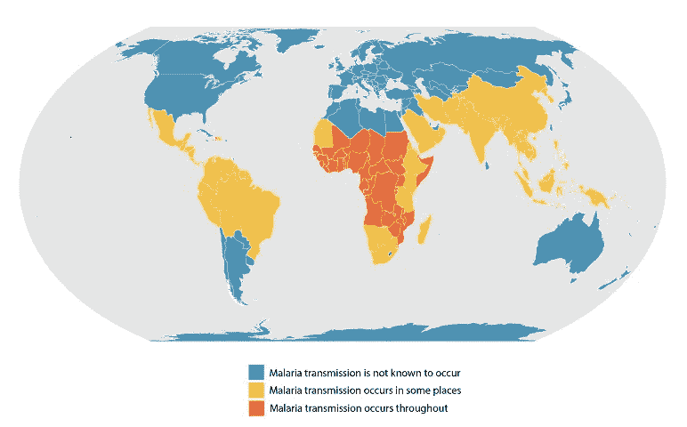

[1.0\. An approximation of the parts of the world where malaria transmission occurs.](https://www.cdc.gov/malaria/about/distribution.html)

换句话说，如果你生活在欧洲或北美，你几乎没有机会接触到疟疾(在家)。充其量，你可能在新闻中听说过。

尽管上述疾病具有致命性和严重性，但与大多数其他疾病一样，聚光灯转移了目标，COVID19 受到了全世界的关注，同时忘记了疟疾等疾病不会仅仅因为一种新的致命病毒的出现而存在。

# 目录

## 只是想看看这是怎么回事和最终结果？

*(6 分钟阅读时间)*

[简介](#c253)
[什么是疟疾？](#37a9) [问题](#2d21) [项目宣言(大概是你为什么在这里)](#87c4) [成果/结论](#e036)

— — — — — — —

## 对这项工作背后的代码真正感兴趣，并想详细检查它？

*(12 分钟阅读时间)*

[简介](#c253)
[什么是疟疾？](#37a9) [问题](#2d21) [项目宣言(我的解决方案)](#87c4)
[关键术语](#ccb0)
[**创建解决方案**](#1af2) **- M *方法呈现
-准备数据集和工作环境
-库
-数据集
-编码***
[结果/结论](#e036)

# 什么是疟疾？

如前所述，西方人对疟疾这个术语的接触是有限的，如果不是不存在的话。因此，对什么是疟疾以及为什么疟疾如此致命有一个基本的了解是很重要的。

疟疾也称为“丛林热”，是一种通过蚊子传播的传染病，可影响人类和其他动物。这种疾病是由属于疟原虫群的微生物引起的。疟疾最常见的传播途径是被感染的雌性按蚊。感染发生的方式如下:

1.  蚊子叮咬潜在的受害者
2.  寄生虫通过蚊子的唾液进入人体血液。
3.  寄生虫进入肝脏，在那里成熟并繁殖。

关于疟疾的更多信息，这段视频提供了一些有趣的附加信息:

# 有什么问题？

虽然有许多专门治疗疟疾的治疗中心，但问题是更多农村和(来自大城市的)偏远地区的公民没有采用大规模检测和治疗的有效方法。

根据 CDC，疟疾诊断以下列形式之一发生:[临床诊断](https://www.cdc.gov/malaria/about/disease.html)、[显微镜诊断](https://www.cdc.gov/malaria/diagnosis_treatment/diagnostic_tools.html#tabs-1-1)、[抗原检测](https://www.cdc.gov/malaria/diagnosis_treatment/diagnostic_tools.html#tabs-1-2)、[分子诊断](http://www.cdc.gov/dpdx/diagnosticProcedures/blood/moleculardx.html)、[血清学](https://www.cdc.gov/malaria/diagnosis_treatment/diagnostic_tools.html#tabs-1-3)。

然而真正的问题是什么？为什么我现在要参与检测疟疾？

如前所述，由于新型冠状病毒，**人们的注意力已经从这种致命疾病**上转移开来。似乎这还不够，非洲国家已经开始重新分配资源来对抗新冠肺炎。不幸的是，分配给这场新的致命斗争的资源以前被用于防治疟疾的竞赛。即使在那时，资源也不够。医务人员过去和现在都不够专业，不具备检测和治疗疟疾所需的知识。这就是为什么计算机模型是合适的。也就是说，在不需要专门设备和医务人员的情况下，对受感染的患者进行快速和大规模的检测。

疟疾检测已经很有限了。限制它，甚至更多，将会有致命的后果。这一合乎逻辑的论断促使世卫组织在 2020 年 4 月 23 日敦促各国迅速行动起来，拯救撒哈拉以南非洲疟疾患者的生命。

[](https://www.who.int/news-room/detail/23-04-2020-who-urges-countries-to-move-quickly-to-save-lives-from-malaria-in-sub-saharan-africa) [## 世卫组织敦促各国迅速行动，拯救撒哈拉以南非洲疟疾患者的生命

### 对驱虫蚊帐运动和抗疟药品供应的严重干扰可能导致疟疾

www.who.int](https://www.who.int/news-room/detail/23-04-2020-who-urges-countries-to-move-quickly-to-save-lives-from-malaria-in-sub-saharan-africa) 

可悲的是，随着新冠肺炎病毒的不断演变和变异，人们认为疟疾患者的命运只会变得更糟。

# 项目宣言(我的解决方案)

看着上面发生的事情，我意识到事情**不会变好**。如果**政府**不**愿意**或能够**保护他们的公民**并为他们提供**有效**和**廉价的方法**来识别他们是否是当前的疟疾受害者，那么**其他人必须这么做。**

**记住**！科学家们一致认为，从疟疾中幸存下来的最重要的方法是早期检测。

记住前面提到的思维过程，**响应世卫组织的求助**，在这篇论文中，我将展示我在**建立和比较不同模型**的进展，如果一个人**患有疟疾**成功** **检测到**。**

该模型需要一张**简单的血液图像**，并据此做出预测。首选这种测试形式的原因是**实施起来的简易程度**。有许多便携式业余显微镜，既便宜又能在非洲各地的市场上买到。除此之外，还有特定的手机摄像头扩展可以用来采集相同的血液样本。

> “真令人吃惊！仅仅是想到作者只有 16 岁，就让我不寒而栗，沉思自己的人生选择。”

# 关键术语

这是至关重要的，以便开始熟悉将在本文中使用的某些关键术语。

## 卷积神经网络(CNN)

在[深度学习](https://en.wikipedia.org/wiki/Deep_learning)中，**卷积神经网络** ( **CNN** ，或 **ConvNet** )是[深度神经网络](https://en.wikipedia.org/wiki/Deep_neural_network)的一类，最常用于分析视觉意象。基于它们的共享权重架构和[平移不变性](https://en.wikipedia.org/wiki/Translation_invariance)特性，它们也被称为**平移不变性**或**空间不变性人工神经网络** ( **SIANN** )。[【1】](https://en.wikipedia.org/wiki/Convolutional_neural_network#cite_note-:0-1)[【2】](https://en.wikipedia.org/wiki/Convolutional_neural_network#cite_note-:1-2)它们在[图像和视频识别](https://en.wikipedia.org/wiki/Computer_vision)[推荐系统](https://en.wikipedia.org/wiki/Recommender_system)[【3】](https://en.wikipedia.org/wiki/Convolutional_neural_network#cite_note-3)[图像分类](https://en.wikipedia.org/wiki/Image_classification)[医学图像分析](https://en.wikipedia.org/wiki/Medical_image_computing)以及金融[时间序列](https://en.wikipedia.org/wiki/Time_series)中有应用。


A convolutional neural network architecture

CNN 是[多层感知器](https://en.wikipedia.org/wiki/Multilayer_perceptron)的[正则化](https://en.wikipedia.org/wiki/Regularization_(mathematics))版本。多层感知器通常意味着全连接网络，即一层中的每个神经元都与下一层中的所有神经元相连。这些网络的“完全连通性”使得它们容易出现[过度拟合](https://en.wikipedia.org/wiki/Overfitting)数据的情况。

(关于 CNN 的更多信息，[这篇文章是一个很好的资源)](https://towardsdatascience.com/a-comprehensive-guide-to-convolutional-neural-networks-the-eli5-way-3bd2b1164a53)

## 迁移学习

用于迁移学习的定义取自[这篇](https://towardsdatascience.com/what-is-deep-transfer-learning-and-why-is-it-becoming-so-popular-91acdcc2717a)文章。

*迁移学习是深度学习(和机器学习)中的一种方法，其中知识从一个模型转移到另一个模型。*

> *Def:模型 A 使用大型数据集 D.a 成功训练以解决源任务 T.a。但是，目标任务 T.b 的数据集 D.b 太小，妨碍了模型 B 的有效训练。因此，我们使用模型 A 的一部分来预测任务 T.b.* 的结果

一个常见的误解是，训练和测试数据应该来自同一个来源或具有相同的分布。

使用迁移学习，我们能够在不同的任务中使用全部或部分已经预先训练好的模型来解决特定的任务。

在吴恩达的 youtube 视频中，可以找到对迁移学习的精彩解释:

## VGG-19 模型

VGG 是一种卷积神经网络架构，由牛津机器人研究所的卡伦·西蒙扬和安德鲁·齐塞曼于 2014 年提出。该模型被提交到**大规模视觉识别挑战赛 2014 (ILSVRC2014)** 上，在 ImageNet 上取得了 92.7%的 top-5 测试准确率。ImageNet 是最大的可用数据集之一。它有 1400 万张手工标注的图片。


[Architecture of a VGG-19 model](https://www.researchgate.net/figure/llustration-of-the-network-architecture-of-VGG-19-model-conv-means-convolution-FC-means_fig2_325137356)

## 图像增强

**图像增强**通过不同的处理方式或多种处理方式的组合，如随机旋转、平移、剪切、翻转等，人工创建训练图像。

## 过度拟合

在统计学中，**过度拟合**是“与特定数据集过于接近或精确对应的分析结果，因此可能无法拟合额外的数据或可靠地预测未来的观察结果”。[【1】](https://en.wikipedia.org/wiki/Overfitting#cite_note-1)**过拟合模型**是一个[统计模型](https://en.wikipedia.org/wiki/Statistical_model)，它包含的[参数](https://en.wikipedia.org/wiki/Parameter)比数据所能证明的要多。[【2】](https://en.wikipedia.org/wiki/Overfitting#cite_note-CDS-2)过度拟合的本质是在不知不觉中提取了一些剩余变化(即[噪声](https://en.wikipedia.org/wiki/Statistical_noise)),就好像这些变化代表了潜在的模型结构。

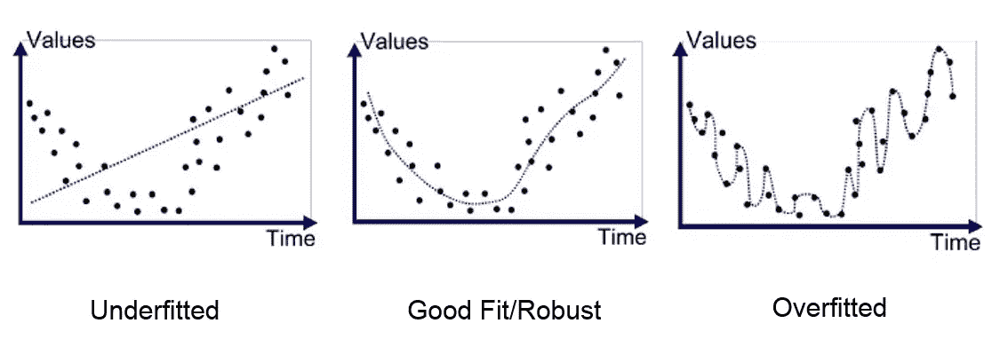

## 纪元

历元是机器学习中使用的术语，表示机器学习算法在训练时已经完成的通过整个训练数据集的次数。

## 批量

批量大小是机器学习中使用的一个术语，指的是一次迭代中使用的训练样本的数量。

# 创建解决方案

## 介绍的方法

在这篇文章中，我将测试三种不同的深度学习技术，以检测疟疾。

*方法 1:卷积神经网络(CNN)*

*方法二:用冻结的预训练 CNN 进行迁移学习*

*方法 3:微调预训练的 CNN 与图像增强*

# 准备数据集和工作环境

首先，需要安装受支持的 python 版本。为此，导航到此[链接](https://www.python.org/downloads/)，并按照所选操作系统的说明进行操作。

我将使用 Python 3.6.9 和 Ubuntu 18 . 04 . 4 LTS 作为我的操作系统。然而，所有受支持的 python 版本都是受欢迎的。

在继续安装所需的库之前，还必须安装 pip。(我很确定 pip 在 2.7.9 之后的所有 python 版本中都有，但是如果 pip 还没有安装，请遵循本指南的[。)](https://pip.pypa.io/en/stable/installing/)


# 图书馆

以下库应该与 pip 一起安装:

```
pip3 install numpy
pip3 install pandas
pip3 install matplotlib
pip3 install sklearn
pip3 install cv2
pip3 install tensorflow
pip3 install scipy
```

# 资料组

拥有正确的数据集无疑是任何数据科学项目最重要的方面之一。在这种情况下，我们需要的数据集是人类血液样本的档案，分为受感染和健康两类。

您获取所述数据库的方式完全取决于您的偏好方法。在这种情况下，我将使用包含总共 27，558 个分类图像的 Kaggle 数据集，在这里找到。

# 编码

既然库和数据集都已经设置好了，是时候开始模型的实际编码了(我将使用 Jupyter 笔记本)。

我将从导入所有必需的库和依赖项开始:

既然已经导入了所有内容，我将把数据集导入到模型中。

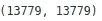

似乎两个文件夹(“被寄生”和“未被感染”)各有 13，779 张图片。

我将使用熊猫数据框，因此将创建一个名为“数据”的数据框，它有两个特征，“文件名”和“标签”。

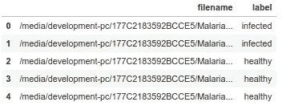

所有深度学习模型都需要训练和测试集。在这种情况下，我们还将添加一个验证集。因此，数据的 **70%** 将被设置为**训练数据**， **20%为测试数据**，而 **10%** 为**验证集**。

由于提供给模型的图像的性质，出现了一个关键问题。用户将输入他/她自拍的照片。这些图片将会有不同的大小，方向等。这可以通过使用一些方便的库来解决，如“cv2”。

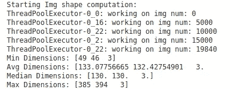

理想的图像大小应该是 125x125 像素。我将使用并行处理，以加快加载和调整每个图像所需的计算速度。

每一张图片现在都应该转换为 125x125。绘制数据总是一个好主意。也就是说，让我们来看一个数据集的示例包。


在健康的和受感染的血细胞之间可以容易地观察到某些模式。要构建的模型应该能够正确识别受感染细胞和健康细胞之间的核心差异，并对它们进行分类。

在此之前，应设置一些基本设置(“BATCH_SIZE”和“EPOCHS”可以更改，以便达到更高的精度)。

通过完成这一步，我们已经成功地调整了图像的尺寸、时期、批量大小，并对分类标签进行了编码。

## 模型 1:卷积神经网络(CNN)

为了开始创建第一个模型，我将定义模型的架构。

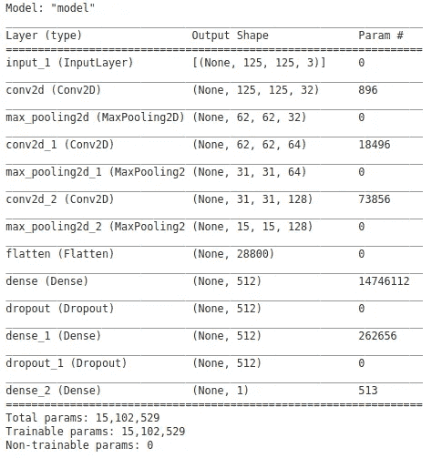

First model’s architecture

从上面可以看出，该模型由三个卷积和汇集层、两个密集层以及用于正则化的漏失层组成。

现在是训练模型的时候了:

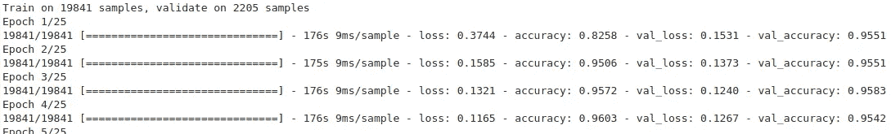

Training the first model

为了对模型的进展和准确性有一个清晰的视角，我将绘制它的准确性和损失曲线。

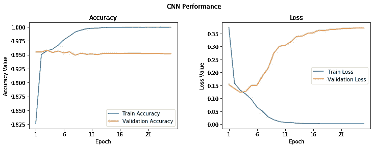

First model’s performance

虽然训练数据的精确度很高，但是也有一些过度拟合。不过，我将保存这个模型，以便以后使用。

## 模型 2: *用冻结的预训练 CNN 进行迁移学习*

我将使用 TensorFlow 来导入 VGG-19 并冻结卷积块，以便作为一个特征提取器。密集图层将被添加到末尾并执行分类。

目前，总共有 28 层，其中 6 层是可训练的。我将使用与第一个模型相同的设置，并训练它查看结果。

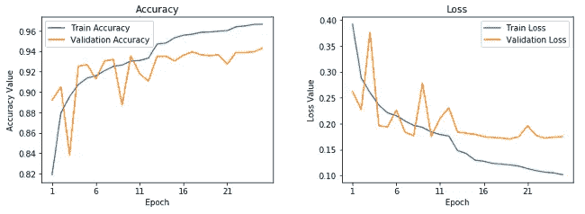

Second model’s performance

第二种模型似乎没有第一种模型拟合得好。同时，它的准确性也略低。

## 模型 3: *微调预训练 CNN 与图像增强*

在这个模型中，我将微调 VGG-19 模型的最后两个模块。还将进行一些图像增强，以便创建原始图像的更好的、改变的版本，并达到更好的结果(验证数据集显然不会被增强，因为它将被用于评估每个回波的模型性能)。

让我们来看一些增强图像:

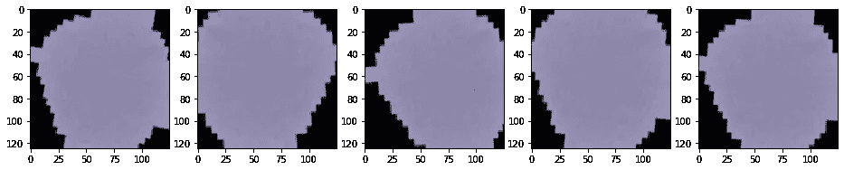

Augmented images sample

与原图差异明显。接下来，我将制作模型，同时确保最后两层是可训练的。

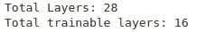

我现在将做一些最后的改动(降低学习率等)，并训练最终模型。

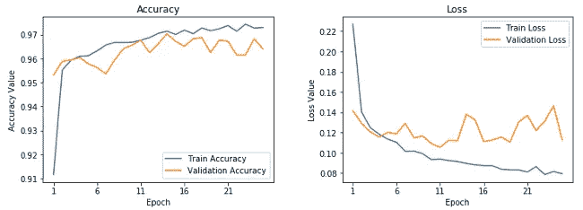

Third model’s performance

所有三个模型的培训都已成功结束。为了评估它们的准确性和 f-1 分数，我将使用来自 Github 的开源第三方代码的一个片段。代码的作者是“DIP”，在这里可以找到。

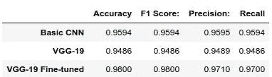

# 结果/结论

在创建并测试了所有三个模型之后，我得出了一些结论。

*   **第一个模型**(一个基本的 CNN 模型)，给出了 **95.95%，**的准确度和 F1 分数，但是观察到显著的过拟合。
*   **第二个模型**(一个 VGG-19，冷冻预训练模型)给出了一个准确度和 F1 分数 **94.87%** 。
*   最后，**第三个模型**(一个 VGG-19 微调模型)呈现了 98.0%的精确度和 F1 分数**。**

简单来说，三个中最好的能够以 98%的准确率将血液样本分类为感染或未感染。这是非常可取的，因为这意味着**它可以大大超过医生的分类准确性**。还值得一提的是，血液样本图像的大小、质量各不相同。通过使用数据扩充，所有图像都得到了显著改善，并且通过该模型对其进行分类成为可能。

[](https://www.datadriveninvestor.com/2020/02/26/surviving-in-a-digital-age-of-instability/) [## 在不稳定的数字时代生存|数据驱动的投资者

### 如果你是一名计算机科学家，你可能已经注意到新的框架不断出现。编程…

www.datadriveninvestor.com](https://www.datadriveninvestor.com/2020/02/26/surviving-in-a-digital-age-of-instability/) 

总之，很明显，大量采用这种模式可以挽救数以千计甚至数百万计的生命。因此，研究人员不断超越以前的模型并提高模型的准确性是至关重要的。

# 你想了解更多吗？

如果你想**提高你的知识**并且对**用机器学习赚钱感兴趣**，我**强烈鼓励你**阅读下面**列出的文章**:

[](https://medium.com/swlh/did-i-just-succeed-in-detecting-breast-cancer-from-a-single-image-with-python-and-machine-learning-3ed24780e354) [## 我刚刚是不是成功地用 Python 和机器学习从单幅图像中检测出了乳腺癌？

### 如何结合 Python 和 ML 检测一个人是否患有乳腺癌的完整指南 98.24%…

medium.com](https://medium.com/swlh/did-i-just-succeed-in-detecting-breast-cancer-from-a-single-image-with-python-and-machine-learning-3ed24780e354) [](https://medium.com/@filippedounis/millennials-this-is-the-unconventional-money-making-technique-you-were-looking-for-3b47c7384c60) [## 千禧一代！这是你一直在寻找的非常规赚钱技巧

### 如何使用 python 和 ML 以 0 美元启动资金制作成千上万的完整蓝图。

medium.com](https://medium.com/@filippedounis/millennials-this-is-the-unconventional-money-making-technique-you-were-looking-for-3b47c7384c60) [](https://medium.com/datadriveninvestor/predicting-oil-prices-with-machine-learning-and-python-324153c457ba) [## 用机器学习和 Python 预测油价

### 使用 Python 和机器学习预测“黑金”价格的完整指南，误差小于 0.3%

medium.com](https://medium.com/datadriveninvestor/predicting-oil-prices-with-machine-learning-and-python-324153c457ba)