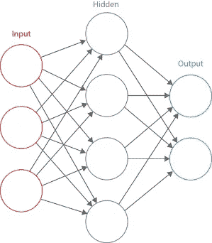
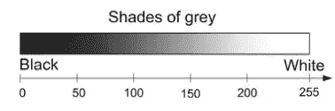
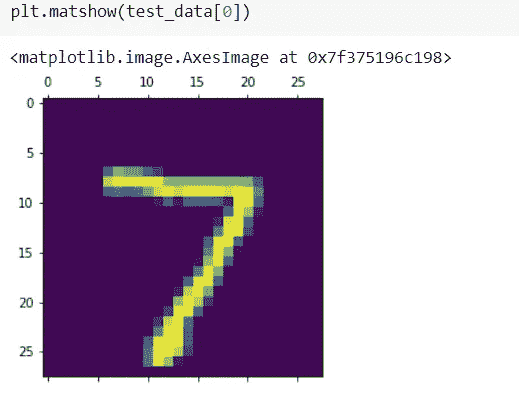
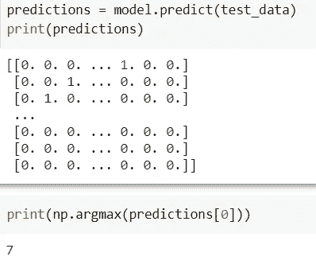
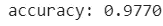

# 基于 MNIST 数据集的数字分类

> 原文：<https://medium.datadriveninvestor.com/how-i-learned-to-code-an-ai-in-a-week-81430939d799?source=collection_archive---------14----------------------->


[source](https://www.surveycto.com/blog/how-artificial-intelligence-is-changing-development/)

我们都经历过——害怕失败，因为自我怀疑而停滞不前，等待难以捉摸或正确的时机来唤醒我们麻痹的大脑。事实是，永远没有“正确”的时机。*只管去做，不要多想。*

寒假期间，我设定了一个目标，要完成一门人工智能课程，并编写一个人工智能程序。哈哈，但是我有吗？没有。虽然我在寒假期间很有效率，但我几乎做了所有的事情，除了编写一个人工智能！我花了几个小时浏览关于人工智能的文章和研究论文，但从未真正动手，因为我觉得自己还没有“准备好”，而且我的编码技能**几乎不存在……**

## 我的方法是什么？

*   首先，我通过这门[课程](https://www.udemy.com/course/python-for-data-science-and-machine-learning-bootcamp/)学习了 python 的基础知识
*   我上了几堂课，然后看了/读了一堆代码
*   还看了一堆教程比如[手写数字的神经网络](https://www.youtube.com/watch?v=iqQgED9vV7k)，[用 TensorFlow 识别数字](https://www.youtube.com/watch?v=rml9oBQT8rw)

令人惊讶的是，我确实理解了神经网络是如何工作的！！我去开始复制:)

## 基于张量流的 MNIST 数字分类


Image by [Josef Steppan](https://en.wikipedia.org/wiki/MNIST_database#/media/File:MnistExamples.png)

我只是很高兴我的模型可以在我的 GPU 上运行，否则它可能会花费我更长的时间，但本质上，创建这个神经网络的目的是训练它，以便它可以将图像与它们相应的标签(包括数字 0-9)匹配。MNIST 数据集由数字介于 0 和 9 之间的 28 x 28 像素灰度图像组成。它有 60，000 个训练集和 10，000 个测试集。它总共有 70，000 张图片，这使它成为训练我的神经网络的一个很好的数据集。



[Source](https://ip.cadence.com/applications/cnn)

```
import tensorflow as tf
from tensorflow import keras
import matplotlib.pyplot as plt
%matplotlib inline
import numpy as np
mnist = tf.keras.datasets.mnist
```

首先，我开始导入所有需要的库，以及导入 MNIST 数据集(它已经包含在 Kera 的数据集中)。在建立模型之前，我们应该将数据标准化。每个像素是 8 位，因此每个像素的范围是 2⁸ = 256 种可能性(不包括零)。



[Source](https://hacktildawn.com/2017/05/02/reconstructing-artistic-style/)

```
(training_data, training_labels), (test_data, test_labels) = mnist.load_data()training_data, test_dtat = training_data/255, test_data/255
```

除以 255，我们可以将 0–255 数据范围表示为 0.0–1.0 之间的数字。

```
model = tf.keras.Sequential ([**tf.keras.layers.Flatten(input_shape=(28,28)),****tf.keras.layers.Dense(128, activation=tf.nn.relu),****tf.keras.layers.Dense(128, activation=tf.nn.relu),****tf.keras.layers.Dense(10, activation=tf.nn.softmax)**])
```

该部分是我们开始构建神经网络的时候——基于具有密集层的顺序模型。网络的第一层由 784 个节点组成。这是因为它采用 28 乘 28 的图像，并将其“展平”。本质上，展平过程将二维矩阵转换为向量。28 = 784.所以第一层有 784 个节点。


[Source](https://towardsdatascience.com/a-simple-guide-to-convolutional-neural-networks-751789e7bd88)

加粗的第二和第三行/层是具有 128 个节点的隐藏层。最后，输出层有 10 个节点，每个节点对应 0 到 9 之间的一个数字。

```
model.compile(optimizer= tf.optimizers.Adam(),loss='sparse_categorical_crossentropy',metrics=['accuracy'])
```

该模型从随机权重开始，这可能导致不准确的结果，因此实现了优化器。优化器是将神经网络的特征改变为权重/学习速率以减少损失的算法/方法。

```
model.fit(training_data, training_labels, epochs=10)
y=model.evaluate(test_data, test_labels)
```

现在，我们可以使用数据集来训练模型。历元数是我们希望模型经历的时间量。请记住，如果将 epochs 设置得很高，可能会导致过度拟合，因为模型会变得过于适合这个特定的数据集。这就是为什么数据集被分为训练和测试，以便我们可以看到模型在新数据下的表现。就是这样！这里是完整的[代码](https://colab.research.google.com/drive/1UXMzleTlKwQiWD8PlmG4X36oenCGJ8fj?usp=sharing)。

## 形象化

让我们做一些运行，但一些可视化！



而且模特猜对了！本来是 7:)毕竟模型准确率 97.7%。虽然这是一个相对简单的项目，但我真的很喜欢这样做！

如果你喜欢这篇文章，给它一个👏并在 medium 上关注我:)另外，请随时在 [LinkedIn](https://www.linkedin.com/in/bernice-lien-b40b9014b/) 上与我联系。