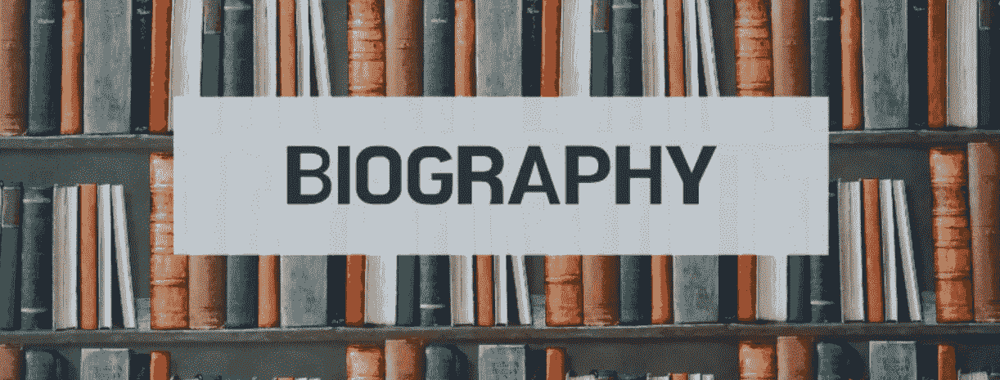
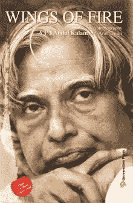
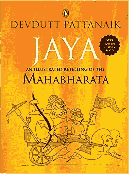
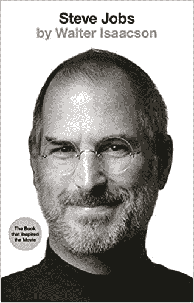
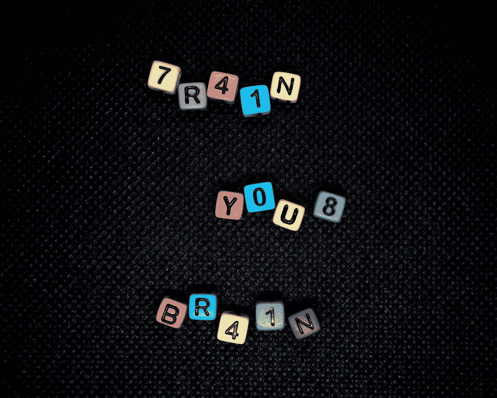

# 我如何在一个人身上度过一百万次生命

> 原文：<https://medium.datadriveninvestor.com/how-i-lived-a-million-lives-in-one-71408df38023?source=collection_archive---------8----------------------->

Source: www.[y](https://youthreachmalta.org/wp/wp-content/uploads/2020/01/BIOGRAPHY.png)outhreachmalta.com

不要！这不是答案。但在一定程度上确实有效。正确答案是**自动传记。(更通用的版本可能是媒体。)**

> 我得到的最好的赞美之一是在我 18 岁的时候。就像这样，“瓦姆西！你比你的年龄成熟和有计划。你 15 岁(顺便说一句，我写这篇文章的时候已经 21 岁了)，但是你的思想和成熟是一个 21 岁的人。你从不同的角度思考不同的角色，试着站在人们的角度，评估他们的反应。精益求精”——我的导师(舒巴尼先生)。

我不是一个有超能力的天才儿童，但我对童年发生的几乎所有事情都有清晰的记忆。我脑海中有我的影像，可以追溯到我的童年；那时我三岁，我记得和父亲一起骑自行车，我记得我上幼儿园的第一天，令人惊讶的是，我甚至记得我一年级的朋友。我得到了我的第一辆自行车；我记得我的第一次受伤(以及随后的几次)。

> 正如谢尔登·库珀曾经说过的，“你的头脑是你最大的财富！”

但是我花了很多时间去理解事物是如何工作的，人们是如何表现和反应的，以及他们为什么要这样做。即使现在，我仍然努力找出一个人真正的个性，但我相信我是正确的。

我八年级的时候不太喜欢看书。但是我非常有兴趣去了解一些伟大的人物，如[史蒂夫·乔布斯](https://amzn.to/2YQBZRS)和[APJ·阿卜杜勒·卡拉姆博士](https://amzn.to/2BSXyIq)。我以极大的热情开始，但不知何故发现很难坚持下去，无法完成它们。但是三个月后，我突然有了阅读摩诃婆罗多的冲动。我终于在亚马逊上订购了一本名为 [Jaya](https://amzn.to/3eRBbBI) 的书，并在 4 天内完成。

Book Covers: [Wings of Fire](https://amzn.to/2BSXyIq), [Jaya](https://amzn.to/3eRBbBI), [Steve Jobs](https://amzn.to/2YQBZRS)

我只是迷失在时间中，真正享受这部史诗。出于某种原因，我可以将自己与 Karna(摩诃婆罗多的一个角色)紧密联系起来，尤其是角色特征。从那时起，我开始更加喜欢这部史诗，因为现在我认为这个角色就像是我自己的一样。这个过程起初发生在潜意识层面，花了我好几年才明白我身上发生了什么。但是我真的被《摩诃婆罗多》和其中一些史诗般的场景所震撼。

现在我重新开始我的剩菜，并考虑自己在他们的鞋子和阅读它们。在传记中的每一个人生转折点，我都会停下来问自己，“*在这样的位置上，你会怎么做？如果这样的事情发生在你身上，你会有什么反应？”*还有很多这样的问题。

问这样的问题很容易，但最终得到正确答案却不容易。

这是因为我们必须从他们最基本的本性和他们的生活环境来理解这个角色，同时更加重视与他们相关的先前改变生活的事件。了解他们的性格类型也很重要。了解他们的生活价值观、伦理观和道德观。这并不容易，主要是因为各种各样的因素，比如这个人的态度，他们的情绪，能力，优势，弱点，他们在一段关系中的表现，他们如何对待自己的另一半，他们的朋友圈子，家庭，经济状况，等等。

尝试应用上述技巧的最困难的部分之一是，你是否知道他们现在是谁，他们对世界产生了什么影响，他们现在是什么行业，或者他们处于什么位置(就业方面)，甚至他们有多成功。你开始把他们生活中发生的每一件事联系起来，并以某种方式说服自己，这导致了他现在的样子。这种对它们的预先了解是尝试应用这种技术时的主要缺陷。当我了解史蒂夫·乔布斯，甚至 APJ 阿卜杜勒·卡拉姆博士时，我也遇到了这种情况，因为他们都是众所周知的人物，无需介绍。

因此，当你知道他们的工作时，训练你的思维会困难得多。

Photo by [Margarida Afonso](https://unsplash.com/@mrafonso1976?utm_source=medium&utm_medium=referral) on [Unsplash](https://unsplash.com?utm_source=medium&utm_medium=referral)

解决这个问题的唯一方法是清理和清空你的大脑，让它们不再是你所知道的。就当这是一个新的开始，你刚才听到了他们的名字。当你继续读下去的时候，考虑到你对他们的了解只有这么多，也就是说，直到你学会为止。这在实践中非常困难。但我找到了出路。拿一张白纸，边读边写下来。记录 it 上的重大事件，包括正面的和负面的。这样你就不会迷失方向，就能知道该看什么，并根据你对他们的简短记录和他们的个性来预测可能的行动。

**虽然这一切看起来太花哨，但随着时间的推移，你实际上可以做得更好。**

在玩了一些这种技术后，我对如何在现实生活中应用这种技术印象深刻。比如我如何预测某人的行动或者他们接下来会说什么。老实说，我觉得自己像夏洛克·福尔摩斯(这可能会受到我把我的策略应用到实际的[福尔摩斯书](https://amzn.to/3ggkRdV)中的强烈影响)。我一直把这种方法应用在我曾经消费的任何媒体上，包括书籍、电影、电视节目、连续剧、网飞、动漫。诸如此类的。

有时重新阅读书籍或任何内容，只在次要角色(或任何不同的角色:主要角色或次要角色)上使用这个强大的工具。你开始以非常非常不同的方式理解同一个故事。你那时喜欢什么(当你在主角的帽子下)，现在可能会改变你对他们的看法。

> 我这样做只是为了对生活有不同的看法。最近，他们试图利用已故演员苏尚特·辛格·拉吉普特的故事。其中有些部分我可以很好的理解。他将永远是一个真正的明星。

这个工具是最强大的心理学进步之一，可以用来提高你的情商，理解他人，建立强大的联系，以及读懂人。你可以利用这个工具，改善你的个人生活，并产生影响。

这就是你如何真正地在一个人身上活出一百万个生命。

PS:这是我自己建立的技术，对我来说非常有用。虽然对其他跟随的人来说，它可能不会给出确切的结果，但你肯定会对生活有不同的看法。