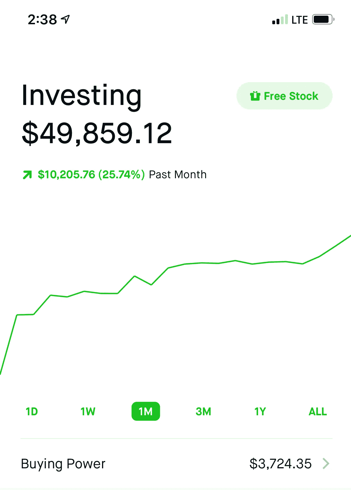
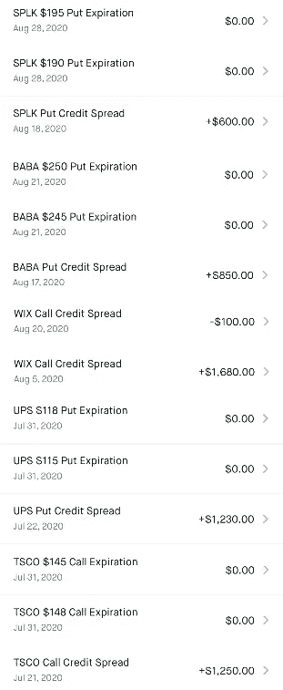

# 我如何在股票市场上一个月赚了 10，000 美元

> 原文：<https://medium.datadriveninvestor.com/how-i-made-10-000-in-a-month-in-the-stock-market-ed7bc16dcbfa?source=collection_archive---------1----------------------->

My July — August Portfolio Performance

最近，似乎每个人和他们的祖母都在谈论股票市场。尤其是在公司估值真正开始增长的上个月左右。

我来这里是为了延续这一趋势。让我告诉你我上个月在股票市场的经历。

我做得很好。

考虑到股票市场持续下跌，我的收益并不是天文数字。事实上，大多数人在上个月可能做得很好。如果你想看到一些真正惊天动地的收获，请前往 Reddit 上的/r/wallstreetbets。

然而，与 subreddit 上的大多数人不同，我没有将我祖母的全部遗产投入到《每周深度》杂志，因为特斯拉的资金需求。

我决定采用一种不那么令人兴奋的策略，但也不像将美元成本平均化到指数基金那样乏味。

以下是我为了在一个月内赚到 10，000 美元而做的三件事。

 [## 利用股市相关性的最佳方式|数据驱动的投资者

### 当阿尔弗雷德·温斯洛·琼斯开创了世界上第一个“对冲”基金(后来“d”被去掉了)时，他让其他投资者大吃一惊…

www.datadriveninvestor.com](https://www.datadriveninvestor.com/2020/02/02/the-best-way-to-use-stock-market-correlations/) 

# 信用利差

交易信用利差是我上个月最赚钱的策略。

[信用利差](https://www.investopedia.com/ask/answers/042215/whats-difference-between-credit-spread-and-debt-spread.asp)是一种期权策略，它包括买入和卖出期权合约以获得溢价。

7 月和 8 月，许多科技公司公布了季度收益。我注意到了一个趋势，即科技公司的股价会在财报发布前的一周大幅上涨。公告发布后，股票价格从小幅下跌到进一步飙升。

因此，我在科技公司盈利前一周交易了科技公司的[看涨看跌期权价差](https://www.fidelity.com/learning-center/investment-products/options/options-strategy-guide/bull-put-spread)，期权在公告发布后几天到期。

股票价格在一周内的上涨如此极端，以至于即使股票因令人失望的收益公告而下跌，期权仍然会毫无价值地到期(这是你在交易信用利差时想要的)。

本质上，如果股票上涨或保持不变，你就会赚钱。如果股票大幅下跌，你只会赔钱。

如果一只股票上涨太多，该公司可能需要一份强劲的收益报告才能继续上涨。在这种情况下，我可能已经决定交易我认为收益报告一般或糟糕的公司的[空头看涨期权价差](https://www.fidelity.com/learning-center/investment-products/options/options-strategy-guide/bear-call-spread)。

这种策略本质上与看跌期权价差相反。如果股票下跌或保持不变，你就赚钱了。如果股票大幅上涨，你只会赔钱。

以下是我在过去一个月左右创作的一些戏剧。

A list of some of my trades

# 运行车轮

我上个月使用的另一个有利可图的策略是在高波动股票上运行[轮子](https://optionstradingiq.com/the-wheel-strategy/)。

轮盘包括出售股票的现金担保看跌期权。然后，当股票被转让时，你卖出你刚刚收到的标的股票的备兑买入期权。

我把这个策略用在了我不介意持有的高波动股票上。股票的波动性越高，你卖出期权的溢价就越高。此外，因为我不介意拥有股票，如果股票被转让也不是世界末日。

上个月，我卖出了 E.V .股票的每周看跌期权和看涨期权。即 NIO 和 WKHS。

这两只股票给我两个框都勾选了。我不介意持有这些股票，因为我相信电动汽车领域有很大的长期增长空间。还有，这些股票波动很大。正因为如此，我能够以高溢价出售这些期权。

# 普通老股票(并卖出它们的备兑买入期权)

个人股票的资本收益弥补了我 8 月份剩余的收益。

这里没什么可看的。

我的主要持股是迪士尼、阿里巴巴、Nio 和西南航空，它们都表现不错。除了持有这些股票的资本收益之外，我还卖出了一些基础股票的看涨期权，以获得一些额外的资金。

# 下一步是什么

这些都不是投资建议。在进行任何交易之前，请做好自己的尽职调查。

过去的几个月是反常的。在我公认的短暂交易经历中，我从未见过科技股如此快速的增长。因此，我使用的一些交易策略可能需要调整以保持有效。

至于不久的将来，我将坚持对我有效的方法，并继续探索其他策略。

**访问专家视图—** [**订阅 DDI 英特尔**](https://datadriveninvestor.com/ddi-intel)