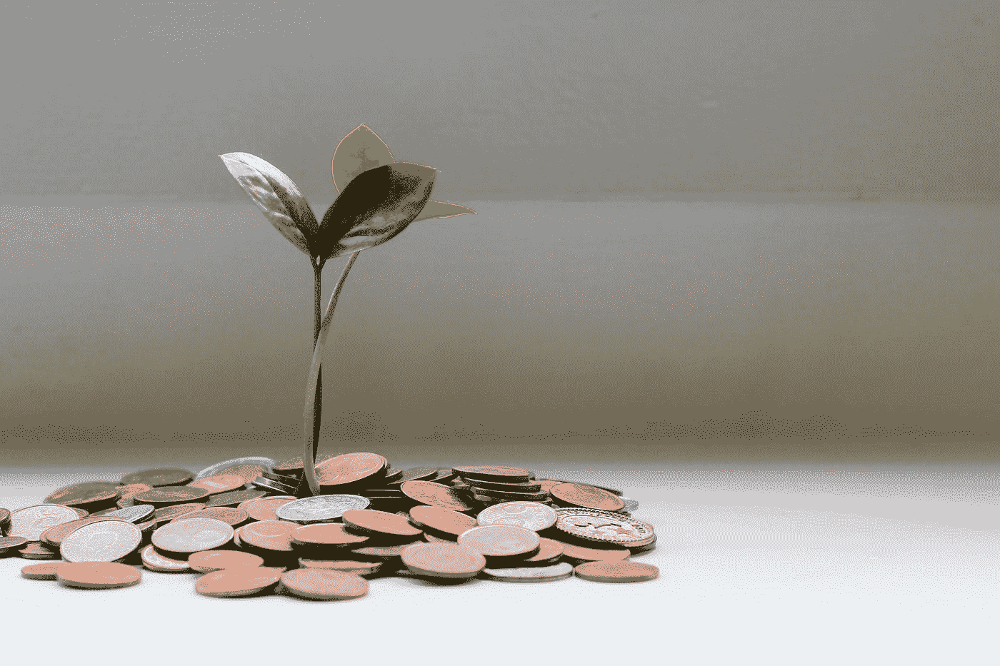

# 一天下午我如何从家里赚了 545 美元。

> 原文：<https://medium.datadriveninvestor.com/how-i-made-545-from-home-one-afternoon-edcf5632063c?source=collection_archive---------19----------------------->

## 是的，只需要大约 30-40 分钟。

Photo by [Micheile Henderson](https://unsplash.com/@micheile?utm_source=medium&utm_medium=referral) on [Unsplash](https://unsplash.com?utm_source=medium&utm_medium=referral)

我知道这个数目并不惊人，但对我来说却很惊人。尤其是当我女儿在房间里安静地睡觉时，我却呆在家里。

谁都可以做。你看，我丈夫和我都有点……喜欢游牧。我们不断在家里和车库里堆积填充物，以备不时之需。

 [## 为什么大多数人在日内交易中亏损(以及如何不成为他们中的一员)|数据驱动的投资者

### 日内交易很难，大多数人都赔钱。我确实有。事实上，我曾经在一个单一的损失更多的钱…

www.datadriveninvestor.com](https://www.datadriveninvestor.com/2020/09/23/why-most-people-lose-money-day-trading-and-how-to-not-be-one-of-them/) 

所以今天我决定在我们的生活中创造一些空间，同时在我们的口袋里赚些钱。我选择了像我的固定自行车，我的小女孩的旧婴儿车，我得到全新的书籍，以及其他类似的东西。拍了照片，并开始把它们贴在脸书市场和 E bay 上。这是从人们到目前为止一直询问的事情中得出的一些结论。我还有很多东西要卖。

使用和出售我们不再需要的物品在很多方面帮助了我们、地球和其他人。从回收，到少花钱，到拿回你的一些钱去买一件即使不完美也是好的东西。

希望越来越多的人意识到他们的房子里堆满了可以出售的物品，并从中获利。

## 访问专家视图— [订阅 DDI 英特尔](https://datadriveninvestor.com/ddi-intel)