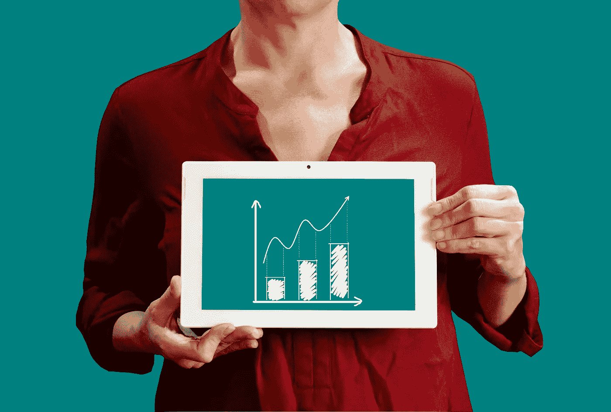
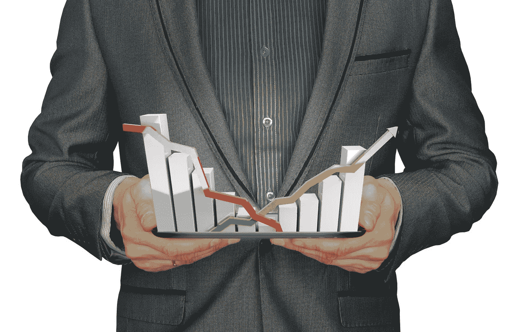

# 去年我如何在股票市场获得超过 50%的回报

> 原文：<https://medium.datadriveninvestor.com/how-i-made-over-50-return-last-year-in-the-stock-market-db28b8c4fbc3?source=collection_archive---------4----------------------->

## 我用来在 2020 年战胜市场的 7 步系统

Image by [Tumisu](https://pixabay.com/users/tumisu-148124/?utm_source=link-attribution&utm_medium=referral&utm_campaign=image&utm_content=4819676) from [Pixabay](https://pixabay.com/?utm_source=link-attribution&utm_medium=referral&utm_campaign=image&utm_content=4819676)

2020 年 3 月，我在这里看着股市崩盘，世界正在分崩离析。新冠肺炎疫情变得越来越严重，世界上大多数政府都在对其公民进行某种形式的封锁，关闭其经济以减缓疾病的传播。

***标普 500 指数从 2 月份的 3381 点跌至 3 月份的 2438 点，短短几周跌幅达 28%。*** 人们对旅游、休闲和能源等整个行业的未来产生了重大担忧——世界将关闭多久，人们还会像以前一样旅行吗？

那时，我仍然是一个“[有效市场理论](https://www.investopedia.com/terms/e/efficientmarkethypothesis.asp)”的投资者，我的大部分股市财富都投资在低成本指数基金中，比如我为孩子设立的 401k 和 529 计划等税收优惠账户。我只是简单地读过沃伦·巴菲特和价值投资的书，但我不确定自己是否理解到足以将其付诸实践。至多，我希望衰退会创造一个买入机会，但即使是新冠肺炎也没有将标准普尔 500 指数降至历史估值水平，这让我只能低声下气。

我对整个市场价格的失望，以及我在封锁期间新获得的额外阅读时间，促使我更详细地研究价值投资。

> 我很幸运这样做了，因为我能够为一个经纪账户提供资金，该账户在过去一年中产生了超过 50%的回报，远远超过了标准普尔 500(和我的预期)。

让我告诉你我是如何做到的。

## 早期错误

我做的第一件事是观察严重低迷的个股，如航空股和能源股。几年来，我一直在学习[期权](https://www.investopedia.com/terms/o/option.asp)，在纸上练习以更好地理解它们是如何工作的，而 ***现在是开始卖出这些股票*** 看跌期权的机会，原因有二:

*   保险费非常高
*   股票价格处于历史低位

我开始为嘉年华邮轮公司(Carnival Cruise Lines)、达美航空公司(Delta Airlines)、西方石油公司(Occidental Petroleum)等公司出售看跌期权。我卖出的看跌期权相当划算(意味着合约价格低于当前价格)，所以即使股票进一步下跌，我也不太可能被分配(或被迫买入)股票。

***这些看跌期权大部分过期一文不值，所以我得以保留支付的溢价，以再利用卖出更多的看跌期权*** 。我做这个赚了几千美元。然而，我最终还是持有了少量的三只股票:嘉年华邮轮公司、达美航空公司和西南航空公司。

正当我为自己学到了新东西并从中获得丰厚利润而沾沾自喜时，我读到沃伦·巴菲特刚刚卖掉了他所有的航空公司股票，因为他认为这些股票的未来风险太大。

> 哎哟！我的泡沫破灭了。巴菲特是我的英雄，他在卖我买的东西。

也许是时候重新评估我的策略了。也许我在出售这些期货不确定的股票的看跌期权时冒了比我应该冒的更大的风险。

Photo by [Gratisography](https://www.pexels.com/@gratisography?utm_content=attributionCopyText&utm_medium=referral&utm_source=pexels) from [Pexels](https://www.pexels.com/photo/man-person-street-shoes-2882/?utm_content=attributionCopyText&utm_medium=referral&utm_source=pexels)

## 投资者教育

所以我开始看书。我读过一些由(或关于)业内最著名的价值投资者撰写的关于投资的文章，包括霍华德·马克斯、沃伦·巴菲特、本杰明·格拉哈姆、塞斯·卡拉曼等等。

我最大的收获是阅读了本杰明·格拉哈姆和大卫·多德的《证券分析》。格雷厄姆是沃伦·巴菲特的老师，也是价值投资这门学科的创始人。我学到了许多重要的东西，但最重要的三件事是:

*   **购买企业，而不是股票**——投资不是拥有一张会升值或贬值的纸，投资是成为一家赚钱企业的部分所有者
*   市场是狂躁抑郁的——格雷厄姆称之为市场先生，他会定期在乐观和悲观两方之间剧烈波动；这些应该被忽略，除非它们创造了买卖的机会
*   **有安全边际地购买** — 你必须评估企业的价值，并确保你的购买价格比这一估值低很多；这有助于你确保自己免受假设错误或市场变化的影响

我被迷住了。我终于明白了什么是价值投资，我看到了一条前进的道路，如何找到潜在的便宜货，估计这些股票的价值，并在安全边际内买入。

## 我的系统

我开始每个月用资本投资我的经纪账户。我继续卖出看跌期权，但我现在这样做不仅仅是因为股票在下跌，而是因为我有兴趣以一个好价格拥有这家公司。我的高级策略如下:

1.  **使用各种筛选工具和其他方法，如低市盈率([【P/E】](https://www.investopedia.com/terms/p/price-earningsratio.asp))、低自由现金流价格( [P/FCF](https://www.investopedia.com/articles/fundamental-analysis/09/free-cash-flow-yield.asp) )、低市净率( [P/B](https://www.investopedia.com/terms/p/price-to-bookratio.asp) )、高股本回报率( [ROE](https://www.investopedia.com/terms/r/returnonequity.asp) )、高股息率等等，来识别** **的好股票**。
2.  **分析** **那些股票**确定它们的价值和我愿意支付的最高价格(价值减去安全边际)。
3.  **卖出看跌期权**以我的买入价格或更低的价格卖出那些看起来很便宜的股票，收取的溢价立即被放回我的经纪账户，为额外的卖出看跌期权提供资金。
4.  如果股票不贬值，保持溢价；或者，如果股票下跌，我会以一个好价钱买下一家我想拥有的公司。
5.  **拥有** **股票**，收取股息，参与升值。
6.  **以我愿意卖出的价格卖出我持有的股票的看涨期权**(价格是通过第二步的基本面分析选择的)。
7.  **如果股价没有超过执行价，保持溢价**；或者，如果价格上涨超过我的卖价，那么我**卖出股票**，拿走我的利润，把我的资金转移到其他便宜的公司。

虽然耐心很重要，但我并不是在试图寻找像巴菲特那样优秀的企业，我可以永远持有，这非常困难，需要不同的策略。

> 我更像格雷厄姆那样是一个量化投资者，专注于评估一家企业的价值，在股价被低估时买入，一旦接近全部价值时卖出。

Image by [Gerd Altmann](https://pixabay.com/users/geralt-9301/?utm_source=link-attribution&utm_medium=referral&utm_campaign=image&utm_content=516278) from [Pixabay](https://pixabay.com/?utm_source=link-attribution&utm_medium=referral&utm_campaign=image&utm_content=516278)

## 结果

我很幸运在嘉年华邮轮公司、三角洲航空公司和西南航空公司都做得很好。我以足够低的价格买入它们，即使它们有风险，我也能以良好的回报退出这些头寸。

在更好地理解这一过程后，我买了一些股票，包括(注意，在截至 2021 年 2 月 8 日的当前价格下，我不认为这些例子中的任何一个是好的购买):

*   **瓦莱罗(VLO)**9 月份股价为 47.54 美元，股息收益率为 8.2%——当前股价为每股 64.79 美元
*   **沃尔格林公司(WBA)**5 月份股价为 37.41 美元，股息率为 5%，当前股价为 49.93 美元
*   **HolyFrontier(HFC)**9 月份股价为 21.46 美元，股息收益率为 6.5%——当前股价为每股 31.93 美元

当以相对于价值的显著折扣(使用较大的安全边际)购买股票时，预期会有良好的回报，但未知的是时机。 ***由于 2020 年股票市场的性质，这个时机比我预期的要快得多*** ，我已经开始卖出我持有的一些股票的看涨期权，因为它们接近我对全部价值的估计。

> 总体而言，自去年年初以来，我的年化回报率为 53.7%。

这包括出售期权(看跌期权和看涨期权)、股息和价格升值。因为我每个月都在为我的经纪账户提供资金，所以我用总收益除以月平均余额来计算。

此外，我还开设了一个平行的纸质账户，只投资于标准普尔 500，每次我向我的经纪账户投入真钱时，我都会向假账户投入等量的纸币，以对比我的表现。

使用这个账户，我会在标准普尔 500 产生 33.4%的回报(由于美元成本平均，比 1 年期标准普尔 500 15%的回报率高很多)。我使用这种方法是因为如果我只使用低成本的指数基金，它能更准确地反映我的投资方式。因此， ***我对标准普尔 500 指数 15%的利润率的估计比仅仅使用通用年回报率*** (假设你在年初投资所有资本，而不是每个月增加一些)更保守。

## 缺点

每个系统都有它的缺点。目前我看到的主要问题是 ***我错过了一些很好的机会*** 。几个月前，我开始卖出 Foot Locker (FL)的看跌期权，试图在 37.50 美元或更低的价格买入，但这只股票上涨了，现在是每股 50 美元。我保留了我的保费，但我错过了增长的机会，这本来可以赚更多的钱。

在购买时非常严格有助于保护我的劣势，但如果我对自己的标准稍微宽松一点，也会让我赚不到更多的钱。我对这个结果很满意，因为我可以以最小的资本损失风险获得稳定的回报。

> 我宁愿每年赚 20%以上，也不愿一年赚 100%，第二年亏 80%。

另一个主要问题是，由于美联储的宽松货币政策，股市继续上涨，因此以较高折扣收购公司的机会可能开始消失。

Image by [mohamed Hassan](https://pixabay.com/users/mohamed_hassan-5229782/?utm_source=link-attribution&utm_medium=referral&utm_campaign=image&utm_content=3207895) from [Pixabay](https://pixabay.com/?utm_source=link-attribution&utm_medium=referral&utm_campaign=image&utm_content=3207895)

## 摘要

作为一个新的价值投资者，我能够在一年的大部分时间里利用好公司以好价格出售，这帮助我获得了高于市场的回报，如上所述。

随着价格继续上涨，这个系统能工作多久还有待观察，但就目前而言，我认为这是一个击败市场的可靠方式，几乎没有下行风险。

我现在全力投入价值投资，把我的有效市场时代抛在脑后。我希望我上面的想法能帮助你提高你的投资水平。

你是如何战胜市场的？

*请注意，我在这里没有涉及税收，因为这超出了本文的范围，但只要说一旦考虑到税收，我在市场上的优势就足够了。期权费和短期资本利得一样，按普通收入税率征税，因为市场正在快速上涨，我将拥有短期资本利得。*

## [点击这里获得我的新电子书《积累财富的内幕指南》的免费样本](https://buildingarks.gumroad.com/l/rykij)

image by author

# 建造方舟

在职业生涯早期，我遵循传统的理财建议，努力积累财富，之后我开始学习投资。十多年后，我在经济上有了保障，并通过房地产和股票市场朝着完全财务独立的方向努力。我已经成功地建造了我的金融方舟，帮助我度过任何可能到来的风暴。

我创建了 [Building Arks](https://buildingarks.medium.com/about-building-arks-fa2edcf2f584) 来帮助像你一样忙碌的专业人士忽略主流建议，建立真正的财富。

Image by [jeffjacobs1990](https://pixabay.com/users/jeffjacobs1990-7438739/) on pixabay

如果你想在我每次发布新故事的时候收到邮件通知，你可以在这里加入我的邮件列表。

***想开始在介质上写作赚取额外收入？我第一年挣了 6000 多美元。加入这里成为会员，每月只需 5 美元。我将免费为你赚取一部分订阅费，你可以无限制地阅读像我这样的作者的数千篇文章，还可以开始自己的写作事业。***

## 资源

这里有一些关于价值投资的额外资源，你可能会觉得有帮助:

 [## 如何通过投资获得成功

### 来自本杰明·格拉哈姆的永恒教训

medium.com](https://medium.com/the-innovation/how-to-find-success-with-investing-411fb59d54f8)  [## 我如何在一个月内从股票市场赚了 6000 多美元的现金流

### 学习如何让市场为你服务

medium.com](https://medium.com/datadriveninvestor/how-i-made-over-6-000-in-cash-flow-from-the-stock-market-in-one-month-ab29fed5abc8)  [## 教孩子投资的新方法

### 我们如何利用游戏来改善我们的金融教育。

medium.com](https://medium.com/datadriveninvestor/a-new-way-to-teach-your-kids-about-investing-c7c2707ca934) 

我与列出的任何网站都没有关系，也没有从任何合作伙伴或我的文章推荐中赚钱。我不是律师，会计师，或注册理财规划师。所有材料都是基于我的知识和经验，出于提供信息的目的而真诚呈现的。它无意取代专业建议。在做出任何法律、税务或财务决定之前，你都应该向专家咨询。