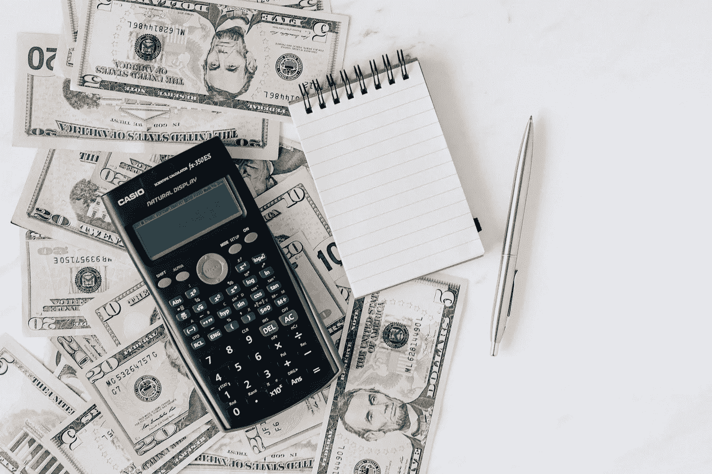

# 我如何在一个月内从股票市场赚了 6000 多美元的现金流

> 原文：<https://medium.datadriveninvestor.com/how-i-made-over-6-000-in-cash-flow-from-the-stock-market-in-one-month-ab29fed5abc8?source=collection_archive---------0----------------------->

## 学习如何让市场为你服务

Photo by [Karolina Grabowska](https://www.pexels.com/@karolina-grabowska?utm_content=attributionCopyText&utm_medium=referral&utm_source=pexels) from [Pexels](https://www.pexels.com/photo/woman-holding-fan-of-us-dollar-bills-4968652/?utm_content=attributionCopyText&utm_medium=referral&utm_source=pexels)

我 ***曾经认为，股市主要是为了升值的投资，而不是现金流。我会把钱投入低成本的指数基金，看着它们随着时间的推移而增值，希望退休时能有足够的钱生活下去。***

由于标准普尔 500(或几乎任何其他指数)不提供太多的股息(根据 multpl.com[和](https://www.multpl.com/s-p-500-dividend-yield)的数据，目前为 1.51%)，我想我将不得不开始抛售我的股票，以获取我的股票收益，并有钱生活。

> 在标准普尔 500，一个 100 万美元的账户目前每年只能提供 15100 美元的股息，几乎不够维持生活！

现在我知道有一个更好的方法，我用它在 12 月产生了超过 6000 美元的现金流。

## 红利

我现金流的第一部分来自股息。去年 12 月，我投资了 185，000 美元的经纪账户支付了 2，806 美元的股息(计算得出的年现金股本回报率为 6.1%)。大多数股息都是按季度发放的，所以 12 月是一个重要月份，但由于我的账户中有很大一部分是现金(我稍后会解释原因)，我的股票股息收益率甚至更高。我的股票投资组合的预期年股息率是支付价格的 7.5%。

> 这意味着，对于 100 万美元的投资，我每年将获得 75，000 美元的股息，相比之下，在标准普尔 500 进行同样的投资只能获得 15，000 美元。这对财务自由有多么大的影响啊！

***现在，寻找分红不错的个股，比只买一只低成本的指数基金要复杂得多。你必须花时间接受教育，学习如何对公司进行估值，这样你就能确保在一个好价格买入它们，并持有它们，直到市场意识到它们被低估，价格达到全部价值。如果你买股票只是因为它们支付了很好的股息，那么当它们不升值时，或者如果未来股息被削减，你可能会失望。所以做好功课，明智选择。***

我强烈推荐任何想挑选个股的人阅读本杰明·格拉哈姆和大卫·多德的经典著作《证券分析》。本杰明·格拉哈姆是沃伦·巴菲特的老师，这本书彻底改变了我投资股市的方式。

## 选项基础

我在 12 月份收到的剩余现金(3262 美元)来自于[期权](https://www.investopedia.com/terms/o/option.asp)。对于那些不熟悉期权的人来说，期权是一种金融合约，允许所有者在某个日期以某个价格购买或出售股票(或其他基础资产)的权利(或期权)。看涨期权赋予所有者以约定价格购买资产的权利，而看跌期权允许所有者以约定价格出售资产。与期货合约不同，期权合约不一定要被使用，它可以被所有者允许到期。

***期权是股票市场的一种保险形式。*** 举个例子，假设我拥有 1000 股苹果(AAPL)股票，这是我几年前以每股 50 美元的价格买入的，现在它的交易价格是每股 143 美元。如果我担心苹果股票今年会贬值，我可以为 AAPL 购买 10 份看跌期权合约(每份合约 100 股)，执行价为每股 130 美元，2022 年 1 月 21 日到期(一年后)，每股 14.88 美元。

这意味着 ***我可以购买保险来保护我的苹果股票不受损失。如果我今天支付 14，880 美元，我可以给自己一个期权，在下一年以每股 130 美元的价格出售我的 1000 股苹果股票，如果价格低于这个数额的话。和财产一样，保险可以保护你免受损失。如果苹果股票在这一年中下跌，我知道我总能以每股 130 美元的价格卖出。***

Photo by [Karolina Grabowska](https://www.pexels.com/@karolina-grabowska?utm_content=attributionCopyText&utm_medium=referral&utm_source=pexels) from [Pexels](https://www.pexels.com/photo/calculator-and-notepad-placed-over-stack-of-usa-dollars-4386373/?utm_content=attributionCopyText&utm_medium=referral&utm_source=pexels)

## 销售选项

12 月份我所有的期权现金流都来自卖出期权。每笔交易都有两面性。 当一些投资者以期权的形式为他们的投资组合购买保险时，另一些投资者正在出售这种保险。当我卖出一份看跌期权合约时，我同意在某个日期以给定的价格买入 100 股相关股票。

使用上面的同一个例子，如果我为苹果投资者出售看跌期权，那么我将获得 14，880 美元的溢价，并承诺如果明年价格低于 130 美元，我将以 130 美元的价格购买股票。

如果价格没有下跌，期权到期时变得一文不值，那么我会保留在合约开始时收到的 14880 美元现金溢价，以我认为合适的方式进行投资。如果价格确实下跌，那么我仍然保留溢价，但我现在必须以每股 130 美元的价格购买 1000 股苹果股票。当然，我的实际成本基础是每股 115.12 美元(130 美元执行价减去收到的 14.88 美元溢价)。

你会接受一年后以每股 115.12 美元的价格购买苹果股票吗？如果答案是肯定的，那么为什么不卖出一些看跌期权呢？你保留溢价，要么什么都不做，要么以一个好价格买入股票——你赢了！

请注意，从 185，000 美元的账户余额中每月获得 3，262 美元的现金超过了 20%的年现金收益率(每年 39，144 美元除以 185，000 美元的投资)。

> 按照这个收益率，100 万美元的账户余额每年可以产生 20 万美元。现在我们正在谈话！

有一点需要注意的是，你需要保持账户中的可用现金来购买你承诺购买的股票，这也是我保持大量现金的原因。这些现金正在产生高回报率，被用作潜在保险赔付的储备，因此它们没有闲置。

## 价值投资期权

在我看来，成功卖出期权的主要诀窍是，你必须为任何一种结果感到高兴，从而消除你的风险。

如果我根据[基本面分析](https://www.investopedia.com/terms/f/fundamentalanalysis.asp)确定了一只我乐意持有的股票和一个我乐意支付的价格，那么我就准备好卖出这只股票的看跌期权。不管怎样，我都保留溢价，最糟糕的情况是，我以一个好价格买了一只我想拥有的股票。

一旦我拥有了股票，并基于同样的基本面分析知道了卖出的价格，那么我就能够卖出该股票的看涨期权，我承诺在某个日期以给定的价格卖出我的股票。

***这个系统强大得不可思议。*** 我在扎实的研究基础上选择我想拥有的股票，然后我选择买入的价格，每月卖出保险获得报酬再买入股票。一旦我拥有了股票，我就可以得到报酬，向另一个方向出售保险，月复一月地出售看涨期权，最终只能以我认为合理的价格卖出股票。

我不仅参与了一只被低估股票从低价到全价的升值，还通过卖出看跌期权和看涨期权获得现金流，此外还有我持有股票时支付的任何股息。

> 这个系统的回报是巨大的，下跌是有限的，如果你知道你在做什么，这是一个低风险的投资策略。

## 把所有的放在一起

总之，我能够在一个月内产生超过 6000 美元的现金流，归功于两个词: ***价值投资*** 。

回顾一下这个过程:

1.  使用基本面分析识别被低估的股票(通常支付丰厚的股息)
2.  开始以你愿意支付的执行价卖出这些股票的看跌期权，收取溢价，再投资到投资组合中
3.  拥有股票，收取股息，并参与升值
4.  卖出看涨期权以获得额外的现金，最终在股票达到全价时卖出

所有产生的现金目前都被重新投资到投资组合中，让我可以卖出更多的看跌期权，但正如你所看到的，这种类型的活动可能有助于实现财务自由。

Image by [Pexels](https://pixabay.com/users/pexels-2286921/?utm_source=link-attribution&utm_medium=referral&utm_campaign=image&utm_content=1867908) from [Pixabay](https://pixabay.com/?utm_source=link-attribution&utm_medium=referral&utm_campaign=image&utm_content=1867908)

以下是基于 12 月的数据:

*   每季度分红 2，806 美元=每年 11，224 美元
*   每月出售期权的 3，262 美元=每年 39，144 美元
*   总年度现金流= 50，368 美元
*   总投资= 185，000 美元
*   投资的总年现金收益率= 27%
*   100 万美元账户的潜在年现金总收益= 27 万美元

我的朋友们，这就是财务自由 ***，比你在 500 年代从 100 万美元中得到的 1.5 万美元要好得多！现在，并不是每个月都会这么好，但这无疑是我在日常工作之外积累财富的正确道路上迈出的一步。我会继续让你了解我的账户的进展情况。我去年才开始这个新策略，我已经爱上它了！但是和任何事情一样，考验将是我是否能年复一年地保持这样的表现。只有时间能证明一切。***

***注意，这些技术我都是在纸上研究实践了好几年才使用真钱的。如果你不知道自己在做什么，期权可能会非常危险，所以在你开始拿你的资本冒险之前，一定要花时间接受教育。***

让我知道你在股票市场是如何产生现金流的！

## [点击这里获得我的新电子书《积累财富的内幕指南》的免费样本](https://buildingarks.gumroad.com/l/rykij)

image by author

# 建造方舟

在职业生涯早期，我遵循传统的理财建议，努力积累财富，之后我开始学习投资。十多年后，我在经济上有了保障，并通过房地产和股票市场朝着完全财务独立的方向努力。我已经成功地建造了我的金融方舟，帮助我度过任何可能到来的风暴。

我创建了 [Building Arks](https://buildingarks.medium.com/about-building-arks-fa2edcf2f584) 来帮助像你一样忙碌的专业人士忽略主流建议，建立真正的财富。

Image by [jeffjacobs1990](https://pixabay.com/users/jeffjacobs1990-7438739/) on pixabay

如果你想在我每次发布新故事的时候收到邮件通知，你可以在这里加入我的邮件列表。

***想开始在介质上写作赚取额外收入？我第一年挣了 6000 多美元。*** [加入这里成为会员每月只需 5 美元。](https://buildingarks.medium.com/membership)我将免费为您赚取一部分订阅费，您可以无限制地阅读像我这样的作者的数千篇文章，还可以开始自己的写作事业。

## 资源

下面是一些关于价值投资和现金流的附加文章，你可能会觉得有用。和往常一样，如果你想了解某个特定的主题，请告诉我:

 [## 实现财务自由的秘密

### 我用来衡量自己进步的一个标准。

medium.com](https://medium.com/makingofamillionaire/the-secret-to-achieving-financial-freedom-7d7608af29ae)  [## 教孩子投资的新方法

### 我们如何利用游戏来改善我们的金融教育。

medium.com](https://medium.com/datadriveninvestor/a-new-way-to-teach-your-kids-about-investing-c7c2707ca934)  [## 如何通过投资获得成功

### 来自本杰明·格拉哈姆的永恒教训

medium.com](https://medium.com/the-innovation/how-to-find-success-with-investing-411fb59d54f8) 

我与列出的任何网站都没有关系，也不从任何合作伙伴或我的文章推荐中赚钱(除了 Medium)。我不是律师，会计师，或注册理财规划师。所有材料都是基于我的知识和经验，出于提供信息的目的而真诚呈现的。它无意取代专业建议。在做出任何法律、税务或财务决定之前，你都应该向专家咨询。