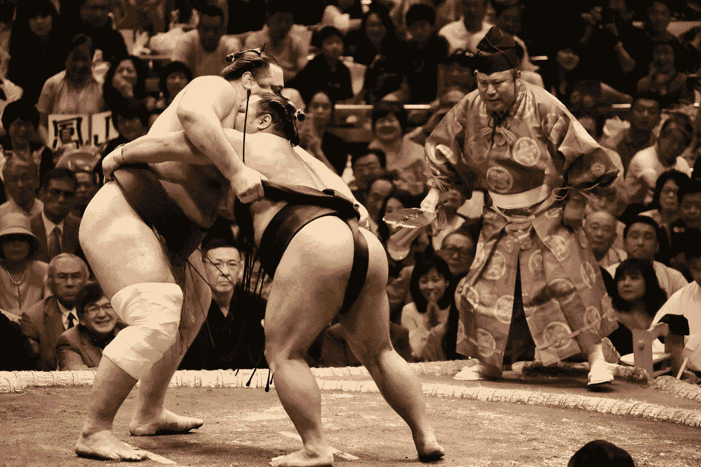

# 我是如何克服最尴尬的时刻的

> 原文：<https://medium.datadriveninvestor.com/how-i-overcame-my-most-embarrassing-moment-e47fad0231e9?source=collection_archive---------19----------------------->

每个人在生活中都会有带来绝对尴尬的时刻。我的很早就开始了。

Photo by Bob Fisher on Unsplash

体育竞赛有助于平衡生活中的竞技场。

至少我六年级的时候，蔻驰·多德是这样告诉奥克赫斯特小学六年级、七年级和八年级的学生的。

学校的新体育馆最近开放了。

我们已经有了一个有组织的篮球队，但我猜校长正在说服蔻驰尽可能多地使用新体育馆来证明它的存在！

这可能就是这一点疯狂的原因:

**第一届多年级奥克赫斯特初级摔跤锦标赛**

我当时并没有意识到这一点，但在任何类型的体育比赛中，一个六年级学生打败一个八年级学生都是不寻常的；更不用说一项需要摔跤的力量和技巧的运动了。

除了正常的到期差异之外；当时主流学术思想的哲学是，八年级学生必须通过同等学力考试，然后才能在当地高中毕业。

这一点不容含糊。它被刻在石头上。

这导致了任何数量的 16 和 17 岁的八年级学生。

比赛将在一个寒冷的冬天的星期五下午举行，从蔻驰·多德第一次宣布比赛开始。

整个比赛将在新体育馆的舞台上进行。整个学生团体坐在覆盖体育馆地板的折叠椅上见证了这一过程(否则将被用作两个篮球场，篮板可以被举起并固定在天花板上)。).

每个人都期待着那个特别的星期五下午的最后一节课。坐下来看你的朋友和同学摔跤。

比赛将是一轮三分钟。

获胜者晋级。

蔻驰·多德列了一份种子选手的名单，得到了沃尔赫斯校长的同意。

他当然不知道学校里任何人的摔跤能力。我认为他对孩子们在其他运动中的表现做出了判断。

正如你可能已经猜到的那样，许多战斗人员在学业上表现不佳，而且年龄大得多。

与 NCAA 锦标赛类似，体育老师认为最不可能赢得锦标赛的孩子会与体育老师认为最有可能赢得锦标赛的男孩摔跤。

经过淘汰赛，今天剩下的两个最好的男孩将会为冠军而对决。

不管身高，体重，年龄，年级。

奥克赫斯特元素学院的第一届摔跤比赛对蔻驰的评价基本上是基于直觉。

事情就是这样发生的:我被安排在第一场比赛中与 17 岁的八年级恶霸博比·丹克斯沃斯摔跤。

我 11 岁，上六年级

下周五下午，在全校面前。

嗯——至少每个人都有整个周末来忘记结果。

我整个星期都很紧张。我哥哥试图教我他在什么地方学到的握法，这让我更加紧张。

我的表弟基特也没帮上忙，他兴高采烈地重复着鲍比要“踢我的屎！”

基特会想出更多办法来接近我..

星期一很糟糕；星期二稍微差一点；星期三和星期四晚上我睡得不多。

我并不羞于承认，我害怕博比会在我所有的同学面前痛打我，羞辱我，让我难堪。

他高大、强壮、吝啬。

我觉得他从来没有喜欢过我。

星期五下午以后，我再也不能在学校露面了。

我甚至可能会受伤。

星期五的早晨很不寻常，因为我爸爸送我去了车站。

他一定感觉到了我的不安。当公共汽车看得见了，要停下来了，他轻轻地搂着我说:“你能行的，布莱恩；为了你妈妈。”说完，他转身开始向房子走去。

**谢谢爸爸！**

不用说，锦标赛是学校一整天的话题——参与者和观众都一样。

有人向我表示祝福，大多是六年级的同学。

*一个我认为不喜欢我的女孩说她希望鲍比不会杀我。*

在我们去礼堂之前，这些家伙给了我很多关于新货舱的指导。

那个 pussy Slocum 说他很高兴和 Dunksworth 一起在舞台上的是我而不是他——就在我们去体育馆之前。

新礼堂/体育馆——我想到的唯一一个词是——宏伟——都是为锦标赛而建的:

500 把折叠椅排列得很漂亮。学生和老师都很快充满了能量和期待。

透过窗帘，我看到基特和我六年级的同学坐在中间几排。年级是根据身高来安排的，一年级学生坐在最前面。我甚至以为我在体育馆后面看到了看门人克里夫。

这真了不起！

我和鲍比的比赛是第一场。

当我们站在舞台边等着被介绍时，博比使劲捏了我一下。

在蔻驰·多德宣布了我们的名字后，我走上台去，感觉很害怕。每个人都在大喊大叫；*有些人可能称之为欢呼..*

我握了握鲍比的手；他差点捏碎我的手指，向我展示他有多强壮——我猜。

吹哨子；比赛开始。

好像所有的事情都是同时发生的。

在比赛的前两三秒。

鲍比:

1.  把我扔在垫子上。
2.  用剪刀把他的腿缠在我的腹部。
3.  他捏得很紧

**导致:**

消化气体从我被压碎的胃、小肠、大肠、肝脏、胰腺和胆汁中可怕地排出。

我听孩子们说过，在你溺水之前，你的一生会在你眼前闪过——非常快。

被挤的时候看到的是:

1.  鲍比的眼睛鼓了出来。
2.  蔻驰·多德显然很沮丧，他拍了拍鲍比，示意比赛结束了
3.  看到坐在第一排的一年级和二年级学生捂着嘴大笑。关于这一点，我可能是错的。

鲍比最终赢得了锦标赛。

回家的公交车上，没人说屁的事。

我的父母听说了这场比赛；父母听到你不想让他们知道的学校活动的方式。

他们也没提。

第二天像往常一样，星期六的家庭新闻出来了。在他们的“学校见闻”专栏中，他们详细报道了这次锦标赛。该专栏只报道了鲍比邓克斯沃斯如何在周五不败，并可能在高中摔跤的伟大。

*如果他过了八年级！，我想。*

我活下来了。

关于这个问题，我最后要说的是:

**我现在 78 岁了:邓克斯沃斯，我算算你一定有 84 岁了。**

你现在想试试我吗？