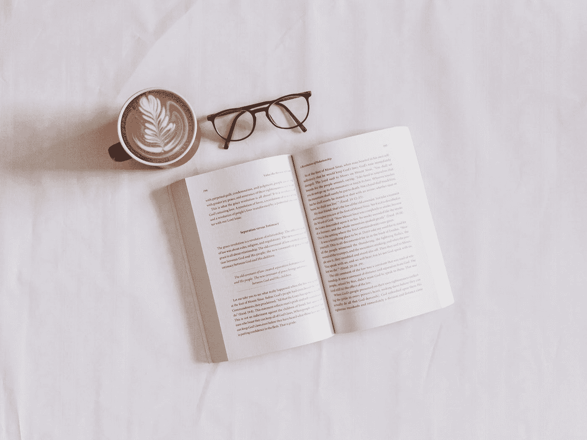
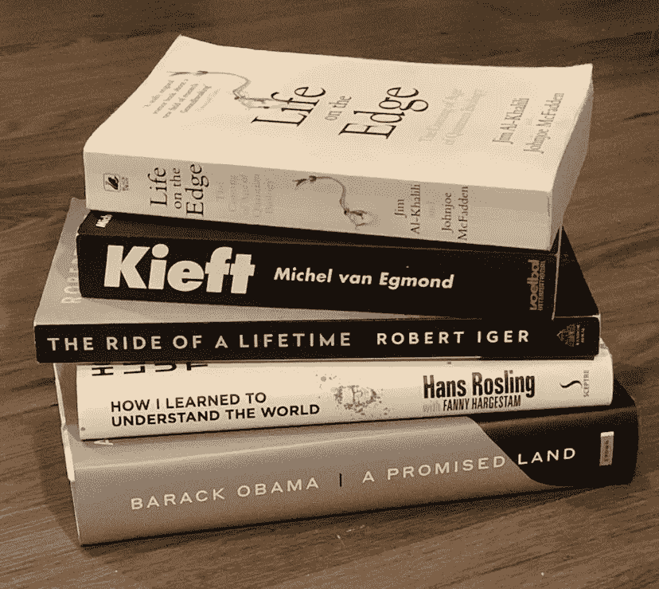

# 上个月我读了 4 本书

> 原文：<https://medium.datadriveninvestor.com/how-i-read-4-books-last-month-1e365071086d?source=collection_archive---------11----------------------->

## 继续以这样的速度阅读。以下是我的 3 个入门建议。

作为一个孩子，我从来没有真正读了很多。然而，在大学期间，我开始越来越喜欢阅读，但总是有点慢，因为我很慢，我很难坚持阅读，因为看完一本书感觉好像永远都不会结束。在接下来的几年里，我有几个阶段可以很快地读完一两本书，但是过了一段时间后，我发现自己读的书又花了太长时间。去年 11 月，我读完了一本书，这本书我读了几个月，然后我突然改变了我读书的方式。从那以后，我几乎每天都读书，在 12 月份读了 4 本书。因为我喜欢读真正能教会我一些东西的书，所以我从不读小说。

Photo by [Sincerely Media](https://unsplash.com/@sincerelymedia?utm_source=medium&utm_medium=referral) on [Unsplash](https://unsplash.com?utm_source=medium&utm_medium=referral)

## 1.挑选较小的书籍

我真的被读完的书所激励，它给我一种成就感，让我对阅读更有热情。我经常在同一天开始下一本书，因为我喜欢保持动力。但是为了做到这一点，我从上个月开始挑选页数不多的书。我发现了一些不到 250 页的好书，每一页都让我觉得在完成我的书的过程中有所不同，这让我比平时读得更久，并且更容易在大约一周内完成一本书。这次成功给了我更多的动力，给了我继续前进和阅读的能量。

## 2.选择内容简单的书

由于我并不真的读很多小说，而是喜欢从书中学习一些东西，所以有时我最终会选择那些充满相当困难主题的书。举个例子，我去年 11 月完成的那本书(我读了几个月)是关于量子生物学的。这本书叫做《T2 边缘的生活》，非常有趣。特别是作为一名纳米生物学的学生，内容确实打动了我，但由于我大多在早上或晚上阅读，这样一个深入研究量子物理学和生物学的主题，很难在晚上 11 点保持专注。

## 3.让它成为一个微小的习惯

我经常试图养成阅读的习惯，每天至少阅读一小时或 30 分钟。这从来没有工作，因为你需要能够适当地计划这一点，例如当你在晚上有一些活动时，你的习惯在那一天会立即失效。然后我试着每天至少读 30 页，但结果是一样的。最后，我试着把习惯做得很小，这让完成习惯变得非常容易。我现在使用一个名为“高效”的应用程序，你可以在那里追踪你的习惯。我加了一天看 10 页的习惯。从那时起，我把它变成了一种习惯。我现在只需要读 10 页，这真的不是很多。这种微习惯的好处在于，大多数时候，我不会在看完 10 页后停下来。如果我有时间的话，我会继续阅读，通常会达到 30 页以上，这在过去对我来说是非常罕见的。当然，有时候我确实只读了 10 页，但这没关系。只要我每天至少读 10 页，我就会一直读下去，并且会读完足够多的书。

The picture was taken by the [Author](https://stafbauer.medium.com/)

希望这些建议有所帮助，你也能达到你的阅读目标。

**进入专家视角—** [**订阅 DDI 英特尔**](https://datadriveninvestor.com/ddi-intel)