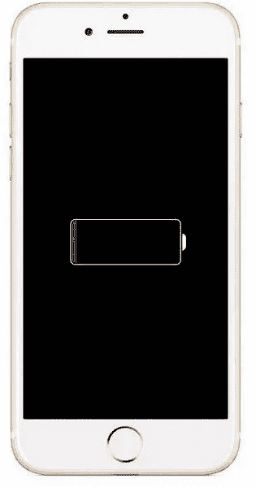

# 我是如何用吹风机复活我的旧 iPhone 的！

> 原文：<https://medium.datadriveninvestor.com/how-i-revived-my-old-iphone-with-a-hairdryer-bd2347bbe445?source=collection_archive---------0----------------------->

## 强硬派会神奇地修理手机吗？不，但是先看看这个故事。

嗯，这个故事就像你想的那样古怪，而且它几天前刚刚发生在我身上。让我们一步一步来，最后进行技术解释。

# 介绍

自从我做出改变，回到 Android 设备后，我的旧 iPhone 6 已经在抽屉里积了 6 到 8 个月的灰尘。

这是一个让我非常高兴的决定，但这是另一个故事了。无论如何，我必须从手机中获取一些信息，这些信息现在又与我相关了。

通常我认为电池没电了，所以我让它充了大约 2 个小时的电，什么也没有。手机只显示低电量，当我拔掉电缆时，它立即关机。在这一点上，我的手机被卡住了，就像左图所示，我几乎被打败了。

经过一个小时的谷歌搜索和寻找可能的解决方案，我看到了这种从吹风机吹热空气的方法，然后手机神奇地打开了。我的怀疑是通过屋顶，但我不顾一切地从我的手机上获取信息，所以我必须尝试一下。所以它是如何工作的，对任何想跟随我脚步的人来说都是这样。

1.  拔下手机插头，如果你有手机套，就把它拿掉。
2.  **将手机放在地上，显示屏朝下。**
3.  **将吹风机调到最高档，持续 45-60 秒。离手机 10 厘米左右。**
4.  **趁热把它插回充电器插头的端口**。

免责声明！这将使你的保修失效，所以你要自己承担风险。

> 瞧啊。

苹果标志立刻出现在我的手机上。我很震惊，根本没想到会有这种效果。慢慢地我开始关注技术方面的事情，我开始明白了。

手机几乎没有“电力”了，所以要启动它需要更多的电力。有时他们会在一段荒谬的时间后充电，比如 20 个小时，然后开始充电，有时他们就不充电了。

热量产生电阻，电阻随着电流增加电压增加。一个增加的电压或“果汁”使手机启动并工作大约 10 分钟成为可能，这就是我获取我需要的信息所需要的一切。

 [## 使用谷歌搜索趋势预测首次申请失业救济人数|数据驱动的投资者

### 几年来，我的重点一直是使用多种替代数据来预测宏观经济统计数据…

www.datadriveninvestor.com](https://www.datadriveninvestor.com/2020/03/25/using-google-search-trends-to-predict-initial-jobless-claims/) 

我继续用它做实验，在让它充电几天后，手机现在运行正常。电池百分比在自己开机后一开始就非常错误。它在我眼中从 4%到 85%再回到 10%之间波动。

这很奇怪，但电池现在保持了我上次使用时的正常电量，应用程序和游戏工作没有任何问题。根据它自己的软件，电池健康状况为 82%，但我对此表示怀疑。

# 结束语

这是我的故事，我必须告诉别人，因为对我来说，这是迷人的。我希望你喜欢它，我正在为每个人制作更多高质量的帖子。

如果你对这篇文章有任何问题或建议，请不要犹豫，在评论区回复。喜欢你读的东西吗？为什么不关注我的媒体简讯，这样你就不会错过我未来的任何文章了？很简单，点击[这里](https://kgabeci.medium.com/subscribe)输入你的邮箱地址，然后按订阅。

你喜欢阅读媒体上的文章吗？考虑成为会员，有很多功能，你将获得所有创作者的内容，每月只需 5 美元。使用[这个链接](https://kgabeci.medium.com/membership)，你也帮我赚一小笔佣金，点击成为会员，输入你的信息。

**访问专家视图—** [**订阅 DDI 英特尔**](https://datadriveninvestor.com/ddi-intel)