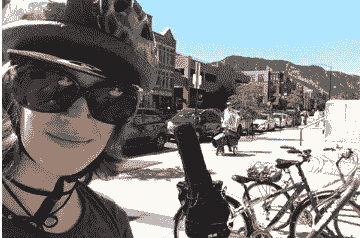
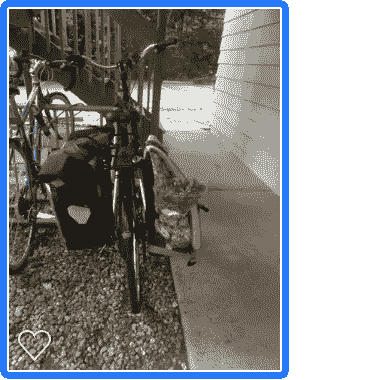

# 我如何在 2018 年节省 8000 美元的交通费用

> 原文：<https://medium.datadriveninvestor.com/how-i-saved-8k-on-transportation-67000be09982?source=collection_archive---------3----------------------->

# 细目分类:我如何比普通美国家庭少花了 80%

Another Saturday, another ride — this time taking my banjo to a friend’s house.

如果有人给你钱让你乘坐公共交通工具或骑自行车而不是开车，会怎么样？他们需要给你多少钱才能让你觉得有一点点诱惑？

这样如何——如果每次你下班回家，有人递给你一张崭新的 20 美元公共汽车票？

对我来说，这已经成为常态。我每天都可以出去散步、骑自行车、坐公交车——每天回家都会在银行里存上 21.81 美元，否则我会花在开车上。

“那不是我的生活！”你可能会说。嗯，也不是我的。我必须让它发生。

2018 年，我离开了纽约——和我所有住在东海岸的家人——来到科罗拉多。你会问为什么是科罗拉多？我看了美国和墨西哥的数百个小城市，选择了科罗拉多州，因为它有一些小城市，在那里我可以只用公共汽车、自行车和双脚四处走动。

我为自由做好了准备。

数学很简单:**省钱最简单的方法就是减少你的前三项开支。对我们大多数人来说，依次是住房、交通和食物。(在这里阅读更多关于我是如何做到的。)**

 [## 我的退休年龄是 95 岁。现在是 45。

### 我采取了三个步骤来重获新生

medium.com](https://medium.com/swlh/my-retirement-age-was-95-now-its-45-c866979a6acb) 

是的——对美国家庭来说，交通是[第二高的花费。交通成本比食品成本高出 31%，是我们的第三大支出。](https://20somethingfinance.com/transportation-costs/)

运输统计局估计，美国家庭平均每年仅在交通上的花费就达 9737 美元。这一支出的绝大部分与购车有关。

 [## 外汇投资如何帮助偿还债务|数据驱动的投资者

### 外汇是对外汇市场的投资，不同国家的货币在外汇市场上进行兑换

www.datadriveninvestor.com](https://www.datadriveninvestor.com/2019/02/13/how-forex-investment-helps-to-repay-your-debts/) 

但是我们真的都需要汽车吗？事实是，我们大多数人住在离学校和商店一两英里的地方。对大多数美国人来说，距离超市的平均距离是 2.14 英里(T1)——一小段步行或骑自行车的距离。事实上，2018 年全国家庭旅行调查报告称，[在美国进行的 35%的旅行](https://slate.com/business/2018/05/rich-young-americans-drive-less-than-their-low-income-peers.html)是 2 英里或更少。

My bike after a quick ride to Trader Joe’s to pick up some groceries. And a basil plant, residing in the cupholder 😋

对于需要车的人来说，我们还需要像现在这样开吗？([如果我们把车停在不到 1 英里的地方会怎么样？](https://www.epa.gov/greenvehicles/what-if-we-kept-our-cars-parked-trips-less-one-mile))

我们可能一天只使用汽车几个小时，但我们每周 7 天、每天 24 小时都付费拥有它们。汽车的绝大部分时间——确切地说是 95%的时间——汽车是停放着的，也就是存放着。我们只是付钱让汽车一天 23 小时‘待命’，而不是实际驾驶它。它基本上相当于一个随叫随到的现代家庭司机。

美国神话是，“我不能住得离任何东西更近。住得近是有钱人的事！”然而。每年额外的 8k 美元(9700 美元减去我 2018 年花的 1800 美元)是一大笔钱。

基于标准的 30 年期抵押贷款，额外的 8000 美元意味着你可以将你的购房价格范围扩大 24 万美元(30 年内每年 8000 美元)。

现在，这笔钱将用于你的抵押贷款，而不是快速贬值的汽车。

让我们来谈谈健身费用，如果你更多地骑自行车和步行，这些费用也可以用于你的抵押贷款。

事实证明，骑自行车上下班比去健身房更有益健康。

然而，18 岁至 65 岁的美国成年人平均每年在健身上花费 1786 美元。*(其中 400 美元是健身房会员费。)一生下来，那就是 84000 美元:比大多数人上大学的花费都多。

 [## 这是千禧一代在健身上的疯狂支出

### 对这些积极向上的千禧一代来说，投资健康是无价的。一辈子健身的代价…

www.marketwatch.com](https://www.marketwatch.com/story/this-is-the-insane-amount-millennials-are-spending-on-fitness-2018-01-21) 

如果你目前锻炼不够，每周 5 天 30 分钟的步行(或骑自行车)将会为你每年节省 2500 美元。

因此，如果你住得足够近，可以步行和骑自行车，你可以投入超过 1 万美元的抵押贷款。同样，通过 30 年的抵押贷款，相对于住得更远和开车上下班，你可以多买 30 万美元的房子。另外，回收美国人每天花在通勤上的 45 分钟以上的时间——或者至少转化为锻炼时间。

对许多人来说，负担能力因素是不真实的。相信“我住不起近一点！”这通常是因为没有考虑到他们为了住得更远而支付的交通和健身房会员的可观“租金”。

## 我的费用明细

我 2018 年的交通支出分为两类:自行车通勤、公交和像 Lyft 这样的乘车共享。

1.  **自行车费用:**

二手自行车:270 美元

根据我的需求进行维护/修理:90 美元

一辆自行车的所有配件——比如挡泥板和头盔:586 美元

**新自行车总成本为 947 美元**

除了自行车，袋子是去年自行车花费的最大部分。我一共花了 260 美元买了 3 个耐用的防水包。我还买了一个座位，一个头盔，几把锁，一个可以拉杂货的后座😊，以及一些有助于夜间通勤的优质灯具。🚴‍♀

今年我有望减少支出。我带着我需要的大部分装备来到了 2019 年。我有望比去年少花一半的钱——全年 350 美元骑自行车。我很有兴趣看看这一切在 5 年或 10 年的时间里是如何平均的。

**2。中转:**

这个数字是人为压低的。为什么？我的雇主从 2018 年 4 月至 12 月提供了一张公交卡作为就业补贴。

然而，我在 2018 年的前 3 个月住在纽约。我的公交通行证每月 120 美元，可以无限制地乘坐地铁和公交车，3 个月共计 360 美元。好的一面是，因为通行证是税前支付的，我节省了大约 87 美元的税款，如果我把这笔钱花在开车上，我就会支付这笔税款。
公交:360 美元
节税:-$87
科罗拉多备用公交紧急通行证$25

**公交总成本:299**

**3。乘车共享**

要在这个自行车和步行基础设施都不达标的国家实现无车，你必须有点创意。幸运的是，现在是 2019 年，与我成长的 90 年代相比，现在有了更多的选择。Lyft 和当地自行车共享计划的骑行共享帮助我到达离我家不容易骑自行车的地方，或者在我不舒服骑自行车的时候在深夜旅行。

**共乘和共骑自行车费用:530 美元**

**—总运输成本:1775 美元—**

那又怎样？

每个人都能这样做吗？在纽约、明尼阿波利斯和旧金山，当然。在美国的大部分地区，没有。

如果你住的地方离杂货店和其他便利设施平均只有 2 英里，你可以通过少开车多骑自行车来大大降低你的交通费用。你每骑一英里而不是开车一英里，你就能在汽油、折旧和汽车维护上节省 50 美分。但是 1800 美元的年支出在大多数没有公交的地区是一个相当难以实现的目标。

所以让我们来谈谈每个人*都能*做的事情:向你所在的县或城市询问骑车和步行的安全地点，以及跨越这些额外里程的公交路线。没有人应该*需要*拥有一个 2 吨的大罐去买一加仑的牛奶。

当人们告诉我生活在一个公共汽车/自行车友好型地区是多么幸运时，我知道他们是对的。与此同时，我的区域因为一种方法而变得“幸运”:请求公共汽车和自行车道。只是问问。就是这样。

吉纳从她在科罗拉多州的新家骑自行车和步行。在 www.frugalkite.com[找到她](http://www.frugalkite.com)。

______

*   一项对 1350 名美国人的调查显示: (健身房会员费每月 33 美元。运动鞋 14 美元/月，补品 56 美元，服装和配饰 35 美元)* 12 = 1656 美元([研究](https://www.marketwatch.com/story/this-is-the-insane-amount-millennials-are-spending-on-fitness-2018-01-21) )
    +家庭健身器材 130 美元/年([研究](https://www.sportsrec.com/487016-the-average-money-spent-on-gym-equipment.html) )
    =总计 1786 美元