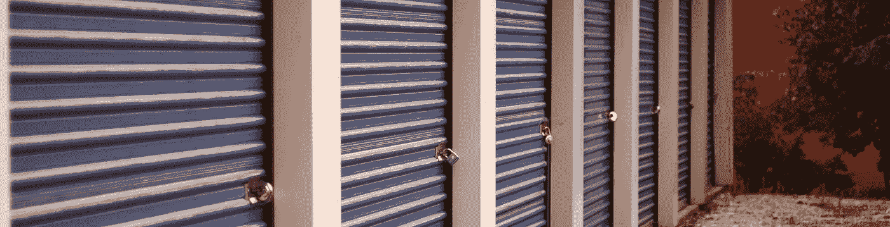
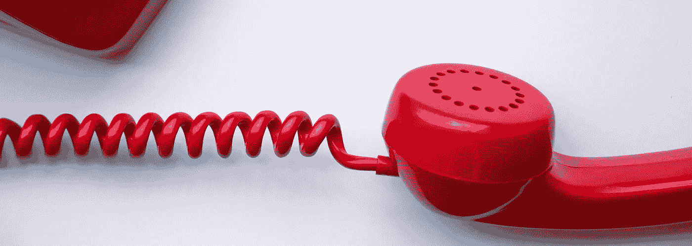
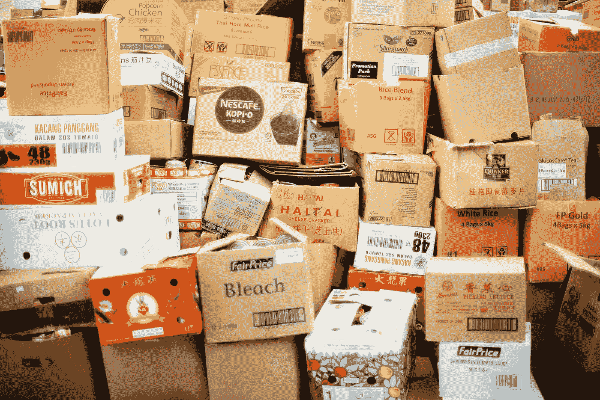
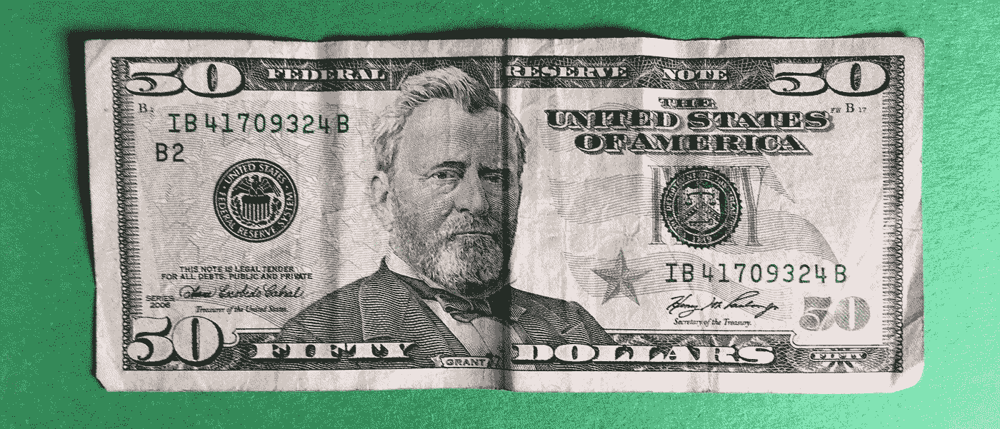
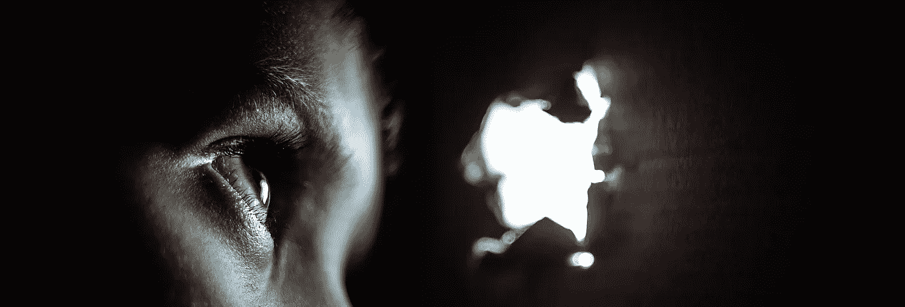
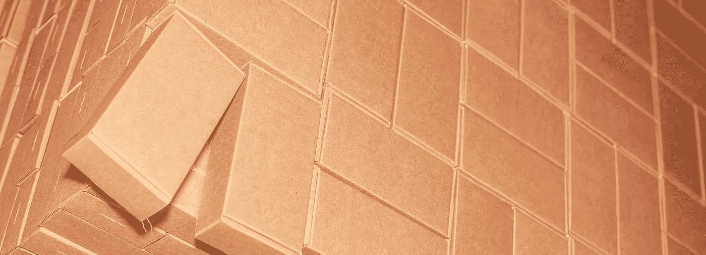
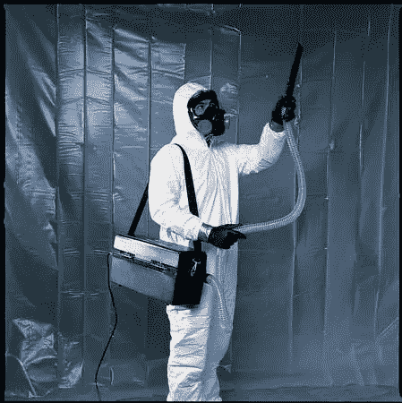
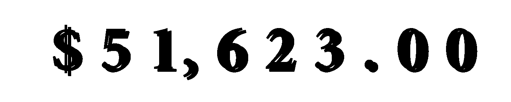
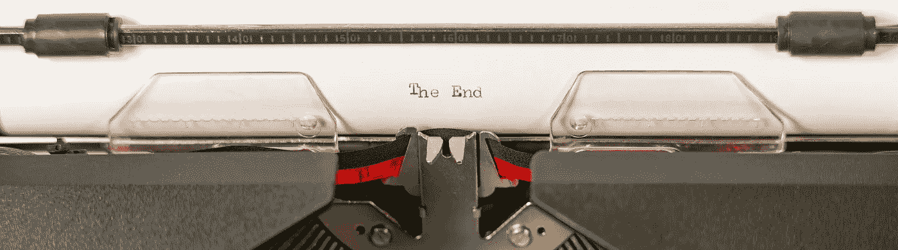

# 我如何把我最后的 150 美元变成 3 万美元

> 原文：<https://medium.datadriveninvestor.com/how-i-turned-my-last-150-dollars-into-30k-1b3ac5f27995?source=collection_archive---------3----------------------->

## 这一收购创造了一个催化剂，激发了一个繁荣的业务翻转存储单元

Image by © Watchara on Adobe Stock

> "谷底成了我重建生活的坚实基础."
> **——j . k .罗琳**

# 别无选择

早在 2005 年初，我有一个洞可以爬出来。

不深究细节，挣扎，一次大伤，一次地域转换，把我带到了一个资源匮乏的地方。还要付房租以及购买食物和其他费用。

我的银行账户只剩下微薄的 150 美元，我失业了，没有任何福利或帮助。很明显，我必须做点什么，而且要快。

住在曾经是鸡舍的地方，有一天在一次头脑风暴中，一个想法出现了。

易贝网站是我的朋友，知道如何上市、销售和发货，我的努力集中在寻找可以销售的东西上。

但是怎么做呢，只剩下 150 美元，食品室里还需要食物。

今天我的记忆力不太好，无法准确地分享我是如何想出这个计划的，但在这里。

Photo by isaac jarnagin on Unsplash

> "如果你从未跌入谷底，那你就没有上过伟大的学校."
> **――马特肖娜·德里瓦约**

# 拨打电话兑换美元

凭借我在网上销售的知识和一个已建立的易贝账户，销售我的作品获得了几千个好评，销售很容易

产品可以在短短几天内变成现金。

如果你有库存，但我没有。

当地一家仓储公司的老板告诉我他们是如何处理遗留物品的。大多数企业每月都有拍卖。

我的想法是收集电话号码，打电话给仓库，询问下一次拍卖是什么时候。然后我将这些数据、日期、时间和地址转移到我的谷歌日历中。

Photo by [Miryam León](https://unsplash.com/@miryam_leon?utm_source=unsplash&utm_medium=referral&utm_content=creditCopyText) on [Unsplash](https://unsplash.com/s/photos/telephone?utm_source=unsplash&utm_medium=referral&utm_content=creditCopyText)

> “当这场终极危机到来时……当我们无路可退时——这正是我们从内部爆发、完全不同的另一面浮现的时刻:一种力量、一种未知来源的安全感突然浮现，从超越理性、理性预期和希望的地方涌出。”埃米尔·涂尔干

# 是时候采取行动踏入未知的领域了

开车去第一个拍卖会，我最后的 150 美元决定开始从我的裤子口袋里给我发无声信息。你知道，那个看不见的声音信息时不时地出现在我们的脑袋里。

它在说拿我们最后的 150 美元去冒险是多么愚蠢。我们，钱和我，需要保持距离，这样才能买到食物。至少我们可以吃饱，为即将到来的无家可归做准备。像熊准备冬眠一样为漫长的冬天增肥。这个声音太有意义了，我差点转身回家。

我的第一站是一家夫妻店，不是像公共仓库或 U-Haul 那样的大公司。当时并不知道，这将是一个非常好的意外收获。上帝知道我需要的不仅仅是一点点运气。

驶进停车场，出现了一小群拿着手电筒的人。我的第一个菜鸟错误浮出水面，我没有想到带来一个。当时是冬天，在一天的晚些时候，拍卖开始时，黑暗将笼罩着我们。

Photo by Papaioannou Kostas on Unsplash

> “当我在底部向上看时，主要问题可能不是‘我如何走出这个洞？’事实上，主要的问题可能是‘我如何摆脱我用来挖它的铲子？
> **——克莱格·d·劳恩斯布鲁**

# 规则

加入这个团队后，我听到了拍卖人的声音，他概述了该做和不该做的事情。

付款将以现金支付。

**将增加 15%的买家溢价。**

除非提供营业执照&经销商 ID 号，否则将增加销售税。

不要进入储物柜，物品会从门边被看到。

**禁止触摸物品。**

**手势加上类似“是”的声音表示出价。**

> 我的大脑或者可能是我口袋里最后的现金说，“哇，这么多规则，我们离开这里吧。”

**我们将有 48 小时的时间来删除这些项目，否则将增加滞纳金。**

**如果没有购买所需的现金，将导致投标被取消，物品将被提供给下一个最高出价者。**

违反任何规则，我们都会被要求离开。

**拍卖时不准互相抚摸。**

我从来没有弄清楚拍卖人是想搞笑，还是，这实际上是一个规则。真的没关系，可悲的是我没有人可以爱抚。

Photo by chuttersnap on Unsplash

> 我爱钱。我喜欢它的一切。我买了一些不错的东西。给我买了一双 300 美元的袜子。有一个毛皮水槽。电动狗抛光机。一件汽油动力高领毛衣。当然，我也买了一些愚蠢的东西。 **—史蒂夫·马丁**

# 它终于开始了

锁被切断了，巨大的金属滚动声在狭小的走廊里回荡。

当一个装满数百个箱子的储物柜出现时，人类发出了一系列的呻吟声和其他各种声音。几乎什么也看不见，除了那一大堆提醒我们，这不会是一次野餐。这一次最多只能算一次失败。

显然每个人都喜欢掷骰子，它一直涨到 2500 美元。你猜对了，我的钱说:“看，反正我也不够，我们在浪费时间。”

**“滚出去”**

虽然他(钱有性别吗？)说得有道理，我不能。我的好奇心现在变得太强了，风险似乎吸引着我。这可能是我最初陷入困境的原因，然而讽刺的是，风险需要从灰烬中升起。

Image by Grandfailure on Adobe Stock

> “有时发生在你身上的最糟糕的事情，你认为你无法生存的事情…是让你变得比过去更好的事情。”**——詹妮弗·韦纳**

# 排除疑虑

不可否认的是，对当前努力的成效的怀疑正在蔓延，变得越来越强烈。然后我听到另一把锁被切断的声音，还有金属滚动打开的声音。

这一个与上一个相似，但是更整洁。

在左边的角落里是一个便宜的层压橱柜，又高又窄。它早就应该被用作柴火了，我对它毫无兴趣。在那和右侧之间有一大片空旷的水泥地面。这就是我的大脑告诉我的大约 200 个盒子堆放和组织的地方。所有干净，崭新的白色纸箱。

在其中一个书架的上面是一个被切开的盒子里的一些东西。后来我才知道，这是为我们设计的，目的是为了吸引投标。

幸运的是，只有大约 6 个投标人。一个人可能已经在第一个储物柜上花光了他的钱，正在犹豫不决。五个有 20 个口袋的投标人可能比我有更多的现金。

当拍卖人开始竞价时，我想，当有人说“这里面有些真钱”时，我心中的希望又一次破灭了。

"有人出 1000 美元吗"他大声说。

然后开始了他们做的快速歌唱拍卖师的摇篮曲。

"一千美元，一千美元，一千美元，给我一万美元"

## 没有任何东西

他不断地放弃出价，“现在七块五”，他叽叽喳喳地说，“给我七块五……”

没有人出价让我有时间学习。大多数人不感兴趣，我借了一个手电筒。检查标签和被拿走的物品。

白色全身特卫强套装。某种帆布带。

一种局部头盔式装置。一块电池和某种过滤器。甚至有垫布靴做脚套。一些塑料软管。

最后，他把价格一路降到了 25 美元。我们仍然很困惑，但我已经做出了决定。

有人认为 25 美元已经够低了，于是大喊“耶，耶！”

拍卖人，“我出价 25 25 25 美元，现在是 50 50 50 50 美元，出价 50 美元，现在是 50 美元。”

Image by the author Christopher Boswell

> 我喜欢从拍卖会上收集东西——我们英国人真的是囤积者和收藏家。 **—乔纳森·安德森**

**“yeeepppppp！”一滴汗水开始在我的额头上形成，从我的嘴里出来。我进去了，只有两个竞标者，祈祷他的口袋不要太深吧。我试着用心灵感应向他传递一个信息，告诉他我可以达到他想要的高度，但无论如何我都会赢。**

它还没有工作，因为他出价 75 美元。照这样下去，只要再有两个出价，我就出局了。我试图找到一种比这更高的方式，想知道谁可能愿意借我一些钱。我没有信用卡或任何备用资金。

不由自主地，我的嘴动了，它说:“你在浪费我们的时间。”

也许我以为我们在玩扑克，他们称之为虚张声势。他开始摇头，没等拍卖师再问下一个出价，我有力地说:“一百。”

我的小游戏传达了一种意愿，那就是尽可能地去赢。没有人知道我有 150 美元的上限。实际上更低，因为我需要支付销售税和买家溢价。

他也不等拍卖人开口，就说 110 美元，试图和我的虚张声势相媲美。不经意地将上涨的势头从 25 美元的增量变为 10 美元。他就要完成了，我给他一个小小的侧身微笑，然后说“125.00 美元”

拍卖人开始感到厌烦，于是加入进来，阻止任何人再以 10 美元的价格递增。“好吧，我有 125，125 美元，谁给我一个合适的？一个合适的，一个合适的，150 美元的出价。150 150 150 150 150……125 美元一次，两次，以 125 美元的价格卖给了新的竞标者。”

我赢了！

Image by Pete Linforth from Pixabay

> "世界是一个拍卖行，每个人都成为拍卖的受害者."**——埃桑·塞加尔**

# 越来越好了

感觉相当知己，一些真正有价值的东西在那里，我就是知道。从现在开始，我们需要远见和良好的决策。当我开始关门时，另一个竞标者走过来说:“你真的想要那个柜子吗？”

我几乎窒息了一些吐笑得如此努力，但抓住自己，意识到一些表演仍然是必要的。“是的，这就是任何价值所在。”我撒谎了。

令我惊讶的是，他当场出价 100 美元买下了它。我差点又吐了，在说“啊，好吧”之前，我试图看起来像是在思考这个问题

他递给我一张 100 美元的钞票，然后把箱子拖到人行道上。我关上门，赶在任何人改变主意之前赶紧去办公室付款。

当我走向办公室时，我笑得合不拢嘴，意识到我刚刚收回了大部分投标。我现在只剩下 35 美元左右。我怎么会出错呢？我内心知道我不能，然后感到一种解脱感。也许我将能够开始挖掘我以某种方式创造的洞。

Image by Free-Photos from Pixabay

> "有趣的是你用茶匙把自己挖进了一个洞里."
> **――莱昂内尔·施莱弗**

# 是时候领取我的赏金了

到了办公室，经理问我赢了哪个单位，我告诉他。当他开始计算账单时，他写了一张收据，问我认为里面的东西是什么。我的回答是我不知道，我还在装傻，因为我的卡车里还没有装任何东西。

当他开始告诉我他是如何调查的时候，他的声音因为兴奋而变得更快了，试图在谷歌上搜索关于这些衣服的信息。

许多最好的储物柜都被仓库管理员拿走了。

只是他自己缺乏知识和远见，才让我买下了这个单位。我心里对他的愚蠢又笑了笑，他把事情搞砸了。

他接着解释了他如此努力的原因。“你能相信那个家伙为那个单位买了 10 万美元的保险吗？我差点又吐了！

## “我无法想象为什么”我撒谎。

我的头脑在飞速运转，它思索着 10 万美元。

对我所拥有的一切的疑惑，完全消失了。很明显，我的第一次投标和赢得了巨大的成功。我付了钱，谢过他，然后马上去把这些整洁干净的白色盒子装满我的卡车。

我等不及了，要跑三趟才能把它运回家。

Photo by Curology on Unsplash

> “没有一个洞深到无法攀爬。即使是你深陷其中的那个也不行。永远不要放弃自己。”
> **——维内特·拉兹·卡普尔**

# 我甚至没有车库

事情是如何发生的，它们如何带来对其他事物的需求，这真的很有趣。

我挑了我能找到的最便宜的房子，没有地方放这些东西，我也没有多余的储物空间或车库。

我有一个简易的顶篷帐篷。我把它摆好，放下一些货盘，然后把箱子装进去，装满了整个 10 英尺乘 10 英尺的正方形。这是太平洋西北部的冬天。几乎每天都下雨。我需要另一个解决方案来保存和保护这些库存。但那要等到我确定我有什么之后。

我拿了一个已经打开的盒子。

我的调查显示，我已经购买了 210 套洁净室服装，设计供人们在受保护的科学环境中穿着。这种宇航服可以防止皮肤细胞、毛发和其他污染物从人体脱落，从而破坏实验。

Image provided by Toro.com

每个盒子里都有一套全套服装，从头盔到靴子。包括防止污染物进入洁净室环境的 HEPA 过滤器。电池供电的过滤器将空气从宇航服中抽出，而不是吸入。

我需要认识一个洁净室采购经理来销售这些产品，但我没有。

我需要考虑一下，看看会有什么解决办法。

> 障碍是成功的必要条件，因为在销售中，就像在所有重要的职业中一样，只有在经过多次斗争和无数次失败之后，胜利才会到来。— **奥格·曼迪诺**

# 是时候盈利了

一觉醒来，我就有了答案，它是在我睡觉的时候突然出现的。我的无意识大脑在休息的同时工作。多么有效的小器官啊，我很兴奋。

如果我只是颠倒两根电线，改变电池的极性，通过 HEPA 过滤器从宇航服中抽出空气的电动机就会被转换。结果，过滤器吸入空气，在将空气泵入面罩之前进行净化。

我迅速抓起一把螺丝刀打开一个过滤器盒，试了一个。它运行得非常好，我现在有 210 套过滤服，可以用于油漆、木材整修或任何其他人们在恶劣或污染的空气中工作的活动。是时候快速行动了。

我打电话给一个朋友，让他过来给我做一套衣服作为交易。我拍了他穿西装时的照片，然后把第一件衣服贴在易贝上进行为期 3 天的拍卖。

几分钟内就有人出价了。最后，8 个竞标者会有一场战争，都试图赢得我的新项目。整个网站上没有其他类似的产品。最终售价为 247.00 美元。我的第一笔交易产生了利润，剩下 209 套衣服，使我有了盈余。

当我的大脑计算时，我欣喜若狂，247 x 209 美元= 51，623 美元！在接下来的三年里，我每周都会卖出几个这样的白色小盒子。

Image by the Author Christopher Boswell

> 每个人都靠卖东西为生。罗伯特·路易斯·史蒂文森

我最终没有达到上面的数字，因为后来我满足了需求，价格下降了一点。此外，我给了一些了，我没有抱怨一点，并认为这是一个巨大的胜利，一个改变你的生活类型的胜利。我需要慢慢卖，否则我会压低自己的价格。

现在，我需要做的就是找到另一个单位翻转。

这一事件提出了对仓库的需求，以保护产品。我动作很快，找到一个地方，然后用工作室的灯和一个漆成白色的壁龛来装备它，以拍摄物品。我放了一台电脑进去，并增加了网络连接。

在接下来的 5 年里，这个装置可以养活我和更多的人。我甚至有一个存储战争类型的系列的想法，但从未采取行动，有人做了。

# 总结一下

永不放弃！如果我们继续行动，利用微薄的资源留下一些不平凡的东西，我们可能从来没有计划或预见可能出现。

继续前进，挖出来，如果你愿意，我做到了！

干杯，克里斯托弗

## [请点击此链接欣赏音频版本。](https://www.patreon.com/posts/33350540)

℗版权所有 Christopher Boswell 2020 保留所有权利。

Image by the [Author Christopher Boswell](https://www.shutterstock.com/g/chrisboswell?rid=732238&utm_medium=email&utm_source=ctrbreferral-link)

当克里斯托弗不在家写作时，他会在美国的某个地方旅行或拍摄照片。他喜欢生成图形设计、处理图像或视频，以及驾驶他的无人驾驶飞行器。更多的消遣包括遛狗、背包旅行和划独木舟。他目前住在太平洋西北部。在 www.RealWindowCreative.com[了解更多信息。](http://www.RealWIndowCreative.com.)

请在 Patreon 上帮助支持我们获得更多的艺术、播客、视频和写作。

 [## 顾客结账台| Patreon

### Patreon 正在为新一代创作者赋能。支持和参与艺术家和创作者，因为他们活出自己的…

www.patreon.com](https://www.patreon.com/bePatron?u=4824008)  [## 特朗普列车现象

### 渴望变革的选民选择了一个能把民主党人推下悬崖的人。

medium.com](https://medium.com/realwindowcreative/the-trump-train-phenomenon-2e8ee189c162)  [## 在创业之旅中，拥抱学习|数据驱动的投资者

### 好像建立一个数百万美元的公司还不够困难，企业家必须额外照顾他们的…

www.datadriveninvestor.com](https://www.datadriveninvestor.com/2018/10/16/on-the-entrepreneurial-trek-embrace-the-learning/)  [## 声音频率如何影响人体

### 深刻的信息导致刺激，疼痛缓解或放松，没有副作用或药物

medium.com](https://medium.com/change-your-mind/how-sound-frequency-effects-the-human-body-ff73e6e0b011)