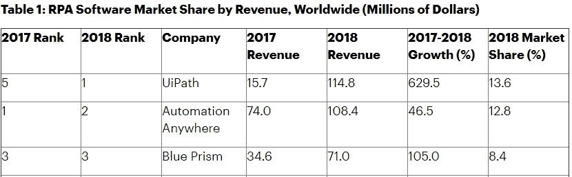

# 我如何使用 RPA 通过自动化节省计算机上的时间

> 原文：<https://medium.datadriveninvestor.com/how-i-use-rpa-to-save-time-on-my-computer-through-automation-73bf396e0f27?source=collection_archive---------6----------------------->

## 将学习 RPA 作为您 2020 年的首要任务之一

Photo by [Alex Knight](https://unsplash.com/@agkdesign?utm_source=unsplash&utm_medium=referral&utm_content=creditCopyText) on [Unsplash](https://unsplash.com/s/photos/automation?utm_source=unsplash&utm_medium=referral&utm_content=creditCopyText)

你多久在电脑上做一次重复性的工作？这取决于你的角色和你有什么软件。如果你正在从事某种深度学习或数据科学项目，那么你可能已经从网上进行了大量的复制和粘贴。或者，如果你是一名客户关系经理，你可能已经为差评生成了支持票，以便以后跟进。

 [## 不管准备好了没有，革命就在我们面前|数据驱动的投资者

### “对于技术如何影响我们的生活和重塑经济，我们必须形成全面的全球共识……

www.datadriveninvestor.com](https://www.datadriveninvestor.com/2019/02/12/ready-or-not-the-revolution-is-upon-us/) 

你可以编写或购买软件来加速这样的工作，但实际上你可以不用编码就能完成，而且可能是免费的！

# RPA —机器人流程自动化

不，它不是有胳膊有腿的机器人。机器人流程自动化是基于软件机器人和人工智能(在某些情况下)的业务流程自动化技术。RPA 系统通常包含以下元素:

1.  通过屏幕抓取或 API 集成与其他系统通信(以编程方式访问系统)
2.  用于设置机器人的用户界面
3.  决策制定——这可以使用基于流程图的工具、记录初始手动运行的步骤和/或使用人工智能进行手动编程
4.  远程触发 RPA 程序运行的计划系统

# 为什么使用 RPA？

来自[德勤全球 RPA 调查](https://www2.deloitte.com/bg/en/pages/technology/articles/deloitte-global-rpa-survey-2018.html):“采用 RPA 的好处是显著的。据报道，回报不到 12 个月，平均 20%的全时当量(FTE)能力由机器人提供。RPA 在多个方面继续达到并超过预期，包括:提高合规性(92%)、提高质量/准确性(90%)、提高生产率(86%)、降低成本(59%)。”

# 您可以使用 RPA 做什么？

仅举几个例子:

1.  预订、索赔和发票管理，例如检查发票，通过交叉引用不同的系统进行支付。
2.  客户关系管理，例如生成支持票是包含差评的评论。在这种情况下，人工智能可以用来识别负面情绪。
3.  人力资源流程，例如简历筛选和候选人入围名单。
4.  而对我来说，就是从网络上收集训练数据进行深度学习。

# 谁是这个领域的大玩家？

From [Gartner](https://www.gartner.com/en/newsroom/press-releases/2019-06-24-gartner-says-worldwide-robotic-process-automation-sof)

UIPath 和 Automation Anywhere 都有免费的社区版，见[这里](https://www.uipath.com/start-trial)和[这里](https://www.automationanywhere.com/products/community-edition)。

Blue Prism 没有免费的社区版，但是有一个[学习版](https://www.blueprism.com/learning-edition/)可以给你 30 天的许可。它可能更适合大型组织，而不是中小型企业，因为完整版非常昂贵。

# 让我们在新的一年里学习新的东西吧！

我不会写教程，因为三大巨头都有自己的在线课程，你可以从他们那里获得认证: [UIPath](https://www.uipath.com/rpa/academy) ， [Automation Anywhere](https://university.automationanywhere.com/) 和 [Blue Prism](https://community.blueprism.com/communities/learning/learningcommunity1) 。