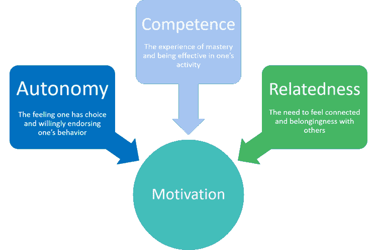

# 我如何运用自我决定理论来获得动力

> 原文：<https://medium.datadriveninvestor.com/how-i-used-self-determination-theory-to-get-motivated-eb778e3bb91?source=collection_archive---------11----------------------->

我对被激励和做艰苦工作的新观点。

Photo by [Zoltan Tasi](https://unsplash.com/@zoltantasi?utm_source=medium&utm_medium=referral) on [Unsplash](https://unsplash.com?utm_source=medium&utm_medium=referral)

今年早些时候，我遭遇了我的智能手机瘾。虽然我不能证明这两者有关联，但我也注意到我的注意力持续时间缩短，缺乏动力，并且推迟更困难的事情去做更愉快的活动。

为我的博客写点东西？呃，可以等等。运动？现在不行。做晚饭？我可以明天叫外卖做饭。学习我感兴趣的新技能或话题？我的大脑太累了。我想要所有这些事情的结果。我喜欢他们的想法。但是除了强迫自己去做，想要去做很难。这就是动机吗？

我觉得这不应该这么难。当然，自律是一件你可以在缺乏动力的情况下建立起来的事情。很有可能，你不会每天都 100%有动力。但我觉得还有别的原因。

我决定把它弄个水落石出。我决心在我的研究中证明我的智能手机正在腐蚀我的大脑([不是](https://www.bakadesuyo.com/2018/03/attention-span/)；这是大脑对此做出反应的方式)，但无意中发现了一些让我震惊的东西:[自决理论](https://selfdeterminationtheory.org/theory/)，一种基于心理学的解释人类动机和个性的方法。

在自我决定理论下，动机不是放之四海而皆准的。这是我们所有人都渴望的。基本原则是相同的，但它们以一些有趣的方式混合和匹配。

开始理解自我决定理论最简单的方法是了解基本心理需求。这些据说是 SDT 的核心，激励着我们所有人。

[Photo Courtesy of URMC](https://www.urmc.rochester.edu/community-health/patient-care/self-determination-theory.aspx)

## 能力

需要感觉我们在某件事情上是有效的和有成就的。

## 自治

需要感受到对我们的生活、选择和行为的控制。

## 相关/联系

在某种程度上，需要与他人互动并感到亲近

 [## 在家工作如何提高我的工作效率|数据驱动型投资者

### 在家工作确实激发了我最大的潜能，让我更有效率。因为在家工作给了我…

www.datadriveninvestor.com](https://www.datadriveninvestor.com/2020/07/29/how-working-from-home-increased-my-productivity/) 

我们的行为据说是由这三种需求驱动的。只有当这三者都达到令人满意的程度时，我们才达到“自我决定”，正如这个理论所定义的，而不是你可能知道的传统定义。

用自决理论中心的话说:

> 在需求不断得到满足的情况下，人们将有效地发展和发挥功能，并体验健康，但在需求受到阻碍的情况下，人们将更有可能表现出不健康和非最佳功能。

## 内在动机与外在动机

基于我们已经了解的动机，现在让我来介绍一下内在和外在动机。虽然上面提到的心理需求是动机的核心组成部分，但内在和外在动机是我们经历的动机的[类型](https://positivepsychology.com/self-determination-theory/)。

内在动机是内在的——它让你自我驱动，高度重视个人道德和核心，给你一种自我满足感，就像任何外部奖励一样好。类似于自我验证。

因此，外在动机是外在的。它以经验数据和外部验证的形式出现。考试分数、员工评估、视频游戏统计、团队销售排名。也可以是表扬和口头肯定。

理查德·m·瑞安和爱德华·l·德西在 2000 年的一篇论文中很好地总结了这一点 [*当代教育心理学*](http://selfdeterminationtheory.org/SDT/documents/2000_RyanDeci_IntExtDefs.pdf)

> 最基本的区别是内在动机和外在动机，内在动机是指做某事是因为它本身有趣或令人愉快，而外在动机是指做某事是因为它会导致一个可分离的结果。

对于你这个外行人来说，这一切意味着什么？你是来学习动机的。

它可以变得非常深刻和复杂，但为了简单起见，它只是一种进一步描述和标记我们动机的方式。

理解什么样的事情会激励我们以及为什么会激励我们是很有帮助的。例如，我有外部动机。我喜欢看到我做得很好的经验数据。我非常注重表现，只是一般而言，但尤其是职业方面。我男朋友不是。他绝对是一个更有内在动力的人。这就是我们每个人的天性。

这是很有帮助的背景，但是为了这篇文章，我将把它留在这里。

## 我如何使用自我决定理论

作为免责声明:我并没有按照最初的意图来应用这个理论。有很多研究和科学数据。我甚至没有深入研究该理论使用的所有微型理论和术语，但我仍然收集了一些关于人类动机以及如何将其应用到我的生活中的有价值的东西。

本质上，这又回到了三个基本的心理需求:能力、自主和联系。

我可以经常安排一个晚上的活动来满足这些需求，以获得最大的生产力。在我追求一些智力或体力要求更高的事情之前，找出我的基本动机需求已经成为一条有效的捷径。

电子游戏是我最喜欢的援引自我决定理论的方式。它们很有趣，但也很有价值。掌控一场战斗或完成一个谜题是一种很好的感觉——做一些需要技巧的事情让我觉得自己有能力。在这些时刻我感觉很好。

视频游戏还实现了我如此渴望的 SDT 的连接方面，因为我通常在网上聚会上与我的男朋友或朋友聊天时玩。所以这就像我们在一起，即使我们不做同样的任务，甚至不玩同样的游戏。这和一起出去玩，一起参加活动没什么不同。现在，我比以往任何时候都更需要联系。

本质上，我意识到满足对电子游戏的渴望不仅仅是懒惰；这都是 SDT 的一部分。我“渴望”玩的体验，因为我潜意识里想满足这些需求。

这个想法是，在玩完电子游戏后，根据 SDT，我将已经满足了三个基本心理需求中的两个。因此，应该更容易专注于需要更多努力和脑力的更难的任务。这些任务表面上看起来并不那么令人满意，但在将来会有回报:比如编辑视频或为一篇文章做一些研究。

实际上，这并不是一个完美的激励工具。毕竟，这不是一颗神奇的药丸。你还是要逼着自己去做工作。你还是要出现，做那些你在乎做的事情。这不是一个完美的理论，它会改变你做每一件事情的方式。

但它将帮助你评估你的需求——为什么你倾向于某些活动而远离其他活动，为什么你可能会避免你的待办事项清单上的一些事情，在继续前进之前你可能需要满足自己的需求。

视频游戏也不是唯一的例子。

也许我发现自己滚动 Twitter 太多了。是的，这是大脑对新信息的渴望，正如之前一篇链接文章提到的，但我也喜欢评论和与人互动。这是连接显现的需要。给自己时间和我的推特朋友交流锻炼了我对联系的心理需求。满足这一需求最终帮助我放下手机，稍后开始工作。

或者举个例子，做任何选择都可以满足我对自主的需求。简单地反思我的选择和成就(毕竟，我是外部激励的)可以帮助加强我的自主性，尤其是在我感到被打倒和无助的日子里。

然而，并不是我一天中的每一件事情都可以追溯到 SDT。从根本上说，自我决定理论讲的是动机，事实上，当你考虑到人类的情感、生理和心理需求的范围时，它是相当狭隘的。但它为我感到抗拒或逃避时绘制了蓝图。我错过了什么？我现在渴望什么？为什么？

这些是你在寻找动力时可以问自己的问题。答案可能比你想象的要近。

## 访问专家视图— [订阅 DDI 英特尔](https://datadriveninvestor.com/ddi-intel)