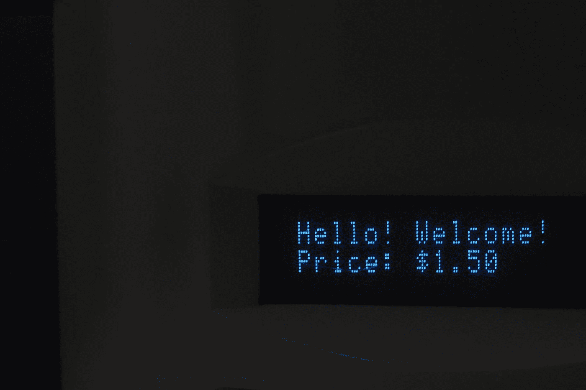

# 我如何使用简单的数据分析来选择高性能密码

> 原文：<https://medium.datadriveninvestor.com/how-i-used-simple-data-analysis-to-select-high-performing-cryptos-a8669a841636?source=collection_archive---------6----------------------->

## 这是他们现在的位置

Photo by [Algernai Hayes](https://unsplash.com/@lemonaide?utm_source=medium&utm_medium=referral) on [Unsplash](https://unsplash.com?utm_source=medium&utm_medium=referral)

大约一个月前，我发表了一篇名为“用 Python 抓取加密价格”的文章，我认为这将有助于人们在投资加密货币之前获得他们自己进行分析所需的数据。

 [## 用 Python 实现网络抓取加密价格

### 这是最美味的汤

towardsdatascience.com](https://towardsdatascience.com/web-scraping-crypto-prices-with-python-41072ea5b5bf) 

除了努力帮助其他人，我还坚信，随着 DeFi 的崛起和全球围绕货币政策的疯狂，牛市很快就会到来。我不确定，只是猜测，但事后看来，我是对的。

CoinMarketCap Market Cap from July -> August of 2020

贴完教程，我决定自己用，拉数据分析。我添加了按市值每天对每枚硬币进行排名的排名，并进行一些基本分析，以确定在一段时间内排名的变化。

我的论点相对简单，但却有效——在密码市场中存在着强大的动量效应。不断升级和超越他人的硬币将在社交媒体上火起来，并保持这种趋势。我获得了一份硬币清单，这些硬币在数量上通过了测试，但实际上还需要做一些额外的定性研究(不是一个明显的骗局，也不是什么适销对路的概念)，以支持我的数字，并过滤掉垃圾。

在花了一些时间研究之后， [**我决定在我的时事通讯**](https://bryology.substack.com/p/silly-season-is-upon-us) 上发表一些我挑选的硬币，以及为什么我认为市场会进入牛市。我挑选了以下几个我觉得有很强信号爆发的硬币:

*   虚拟身份证
*   海洋议定书
*   卡瓦
*   dos 命令:更改文件名
*   阿克罗波利斯

# 我表现如何？

在我的简讯帖子中，我从来没有给出价格预测，因为我想说实话(没有人真正知道)。相反，我只是用级别动量来暗示我所认为的牛市中可能出现的上涨。撰写调查结果的日期是 7 月 11 日(7 月 12 日出版)，所以我们将把它作为开始日期。当然，由于在牛市中一切都会上涨，我们将以比特币的涨幅为基准。

 [## 为什么参与正确的加密交换至关重要|数据驱动型投资者

### 到目前为止，与黄金和美元相比，加密货币，尤其是比特币，已经显示出巨大的增长

www.datadriveninvestor.com](https://www.datadriveninvestor.com/2020/07/16/why-engaging-with-right-crypto-exchange-matters/) 

## 顶级硬币作为基准

根据 coinmarketcap.com 的数据，2020 年 7 月 11 日，比特币收于 9240 美元，截至 2020 年 8 月 6 日，比特币收于 11779.77 美元。不到一个月就上涨了 27.5%。相当令人印象深刻，但在牛市期间，比特币可能会落后于其他货币。

以太坊实际上是这波牛市的最佳基准，该股 7 月 11 日收于 239.46 美元，8 月 6 日收于 394.96 美元，涨幅为 64.9%。以太坊在此期间的表现优于大多数硬币。

## 我的分析选择的性能

*   **V-ID**:7/11/20 收盘 0.298 美元排名 330，8/6/20 收盘 0.547 美元排名 200。 **83.5%** 增重。
*   **海洋协议**:7/11/20 收盘 0.131 美元排名 123，8/6/20 收盘 0.321 美元排名 87。 **145%** 增益。
*   **卡瓦**:7/11/20 收盘 1.72 美元排名 103，8/6/20 收盘 3.38 美元排名 88。 **96.5%** 增益。
*   **任**:7/11/20 收盘 0.182 美元排名 58，8/6/20 收盘 0.231 美元排名 58。 **26.9%** 涨幅。
*   **Akropolis**:7/11/20 收盘 0.0087 美元排名 396，8/6/20 收盘 0.0292 美元排名 149。 **235.6%** 涨幅。

> 我所选股票的平均收益约为 147%。

## 概括起来

我对事情的结果非常满意。我分析的第一部分的平均表现优于比特币和以太坊。我挑选的 80%的股票表现优于以太坊，以太坊被认为是业绩的基准。我的选股没有一只损失价值，但这在牛市中很典型。

这证明了多做几次分析来潜在地发现更多能产生高回报的宝石是值得的。一点点工作可以走很长的路。

我会在我的时事通讯中做更多的研究和额外的分析。一定要订阅，这样才不会错过。

**访问专家视图—** [**订阅 DDI 英特尔**](https://datadriveninvestor.com/ddi-intel)