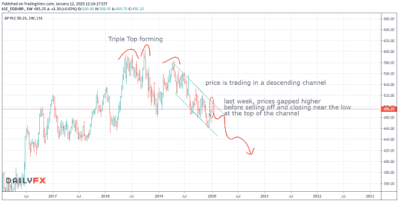

# 我如何看待即将到来的油价下跌

> 原文：<https://medium.datadriveninvestor.com/how-im-playing-the-upcoming-decline-in-oil-prices-4bcc4b93dba0?source=collection_archive---------21----------------------->

**本周一周交易:*空头 BP***

尽管上周中东地缘政治紧张局势导致油价飙升，但一段时间以来，油价图表一直指向低位。当你考虑长期前景时，你实际上可以从这些峰值中获利，在这种情况下，通过做空它们，就像 9 月份一样。

在长期看跌趋势和模式的背景下，价格的这一峰值也很快被抛售，形成了一个大范围的周关键反转棒。有了这种清晰的前景，我认为未来一两周油价的任何反弹都应该被做空。

 [## 2019 年即将改变世界的技术|数据驱动的投资者

### 很难想象一项技术会像去年的区块链一样受到如此多的关注，但是……

www.datadriveninvestor.com](https://www.datadriveninvestor.com/2019/01/17/the-technologies-poised-to-change-the-world-in-2019/) 

虽然我本人不从事石油交易，但我在一只相关的英国股票——英国石油公司——发现了一个有趣的现象。下面是我的图表注释。

外汇交易现在有点枯燥，很少有明确的机会。没有必要强迫他们，我们可以看看其他市场或只是耐心等待。

记住，交易是马拉松，不是短跑。

强行进行不存在的交易会导致亏损…

我确实在假期里做了几笔黄金和美元兑日元的大宗交易，但美元现在已经在当前水平找到了一些支撑。尽管美元的长期前景依然黯淡，但这可能会进一步推高美元。

但是就像我上面说的，没必要强求机会。我也不愿意在长期前景不利的情况下买入美元。

*你想学习如何从市场中持续获利吗？* [*点击此处*](https://mangrovetrading.krtra.com/c/3KAB289jeYYf/kOJV) *，我们将通过一系列免费培训视频带您一步步了解我们的整个交易策略。*

请注意，一如既往，这不是投资建议，您应该在做出任何投资决定之前咨询您的财务顾问。我不是财务顾问，提供这些信息只是为了提供信息和教育目的。