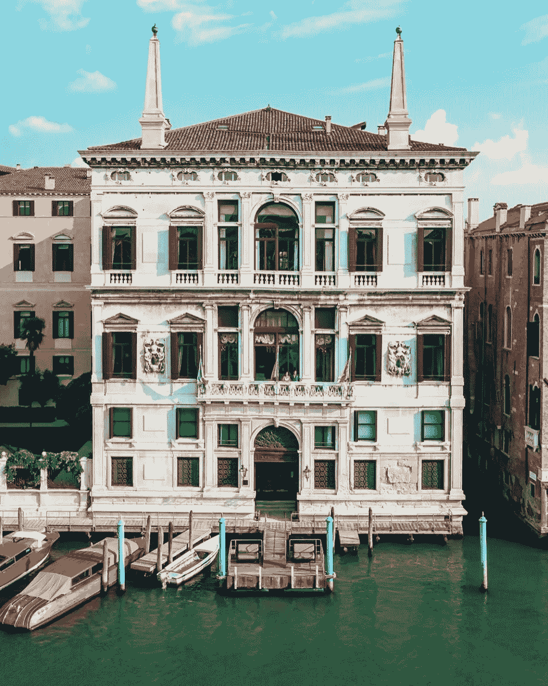

# 我如何通过改进预算来增加投资

> 原文：<https://medium.datadriveninvestor.com/how-increased-my-investments-by-improving-my-budgeting-4b8b54c7fe10?source=collection_archive---------18----------------------->

## 如果你根据人们的观点来塑造自己的观点，你永远不会富有。

预算对于成功的财务旅程的重要性是显而易见的。[一份组织良好的预算将对你的财富积累过程产生直接影响。](https://medium.com/makingofamillionaire/getting-rich-without-abdicating-of-your-life-56773c2d34f0)尽管如此，由于其高度的个性化，还是会产生一些问题。

我们是不同的，我们的品味不同，我们的必需品和消费环境也不同。为了帮助你安排预算，我求助于我们的长者——他们的智慧是多么的伟大！将塞内卡永恒的建议和处理支出的原则与我的个人经验结合起来，将为你的框架开发提供一些基础。

结果，一个人将发展出一套适用于自己生活的原则，而不是去记忆一般的规则。

## 活得好好的

关键时刻有助于向我们展示我们需要什么来生存和生活得更好。在浏览了塞内卡的《斯多葛派的信》之后，这两个关于我们欲望的概念，作为财务规划的框架是相当明显的。

首先，我们必须明白什么是最基本的。第二，我们必须弄清楚我们需要什么才能生活得好(简单的回答是避免无休止的旅程或没有尽头的事情，以及地位游戏)。

因此，我们基于简单的启发法为我们的财务计划建立了一个客观的框架。

在过去的两年里，我一直采用的一条规则是将我们的基本支出，包括我的储蓄和投资，设定为固定成本。其余的我避免预算，因为大部分是与享受当下相关的费用，[比如和妻子去意大利餐馆](https://medium.com/datadriveninvestor/taking-small-actions-that-will-make-you-rich-ad46b9d145bc)。

 [## 金融行业如何受益于机器学习发展和人工智能|数据驱动的投资者

### 在快速变化的金融世界中做出正确的决定并抓住机会可以让你的…

www.datadriveninvestor.com](https://www.datadriveninvestor.com/2020/07/28/how-finance-sector-can-benefit-by-machine-learning-development-and-ai/) 

我用两条规则来调节这种休闲消费:

1.  至少将这些费用的 50%进行再投资
2.  从不使用信用卡，除非是为了赚更多的钱

第一条规则将帮助我判断我是否真的需要我要买的东西，因为我必须至少存下该价值的 50%。这帮助我控制了一些消费冲动(定制衬衫、威士忌、鞋子、星巴克、餐馆……)。

有多少次我认为我需要升级我的手机？例如，按照这条规则，我必须拿出 1500 美元来购买新的 iPhone，其中 500 美元将用于投资。我认为这条规则可以让你永远处于双赢的局面。

> 通过节省一部分休闲开支，你正在建立一个鸡蛋窝，它将在多年后给你带来果实，同时满足你现在的愿望。

如果你不需要升级你的手机，你会把它放在一边休息或做一个侧推，并尝试重新安排你的支出。

第二个规则只是一个防御机制，以避免使用信贷休闲。信贷是一种赚更多钱的机制(例如，用房地产)，应该只在那种情况下或在一些非常紧急的情况下使用。

有一个健康的信用评分将允许你进入房地产投资和杠杆被动收入。也将为未来的投资和商业机会打开大门。

债务不是用来旅游，培养你的 Instagram 游戏，或者买化妆品的。

## 避免无休止的旅程和地位游戏

每一段旅程都应该有一个终点，就像一个故事或小说。一般的目标和正在进行的竞争会把你拖入一场莎士比亚式的、永无止境的争论，就像《罗密欧与朱丽叶》一样。两个争斗的家族有着如此古老的宿怨，以至于没有人知道他们最初为什么要争斗。

> 不能停止的地位游戏和欲望(例如上瘾)应该避免。

塞内卡认为，我们应该追求自然的欲望，就其特性而言，这些欲望是可以被抑制的。我能想到无数这样的事情，大多数时候，这不是关于物品本身，而是关于你对这些东西的感觉。

举个例子，如果有一天你想吃一个奇巧，仅仅是为了当下的味道，那是可以的。但是如果你要吃东西是因为它成了一种瘾，你应该避免它。

上瘾是恶习。它们也是无尽的旅程；从长远来看，你永远不会满足。

一个简单的经验法则:

> 如果你的一个愿望可以得到满足，这是一次值得的旅行。不要用无止境的追求来愚弄自己。

这种启发可以扩展到生活的其他方面。

自然欲望是有限的。那些被断言在虚假需求中的人，除了一些地位游戏，没有停止，没有结局。

## 停止玩地位游戏

想想对新车的渴望。它的味道，它给人的感觉……当你买下它，开着车窗第一次开车的时候，那是多么的美妙。窗外的风，你的音乐…还有那股味道。有趣的是，这些感觉在几周内就消失了。你对新买的车的感觉几乎消失了。

这些是你应该尽量避免购买的东西。当然，你只活一次，买你的车，但不要沉迷于这种永恒的追求满足感。

当福尔图娜给你恩惠的时候，是时候做好准备，并加强对她的拒绝。

遵循一个精心制定的预算，将保证你在困难时期的安全(想象一个被封锁的疫情……)。

在经济复苏期间，为下一次危机做准备。正如我们所做的那样，危机总是会提供更多赚钱的机会，并通过帮助那些需要帮助的人来展示你的人性。

**访问专家视图—** [**订阅 DDI 英特尔**](https://datadriveninvestor.com/ddi-intel)