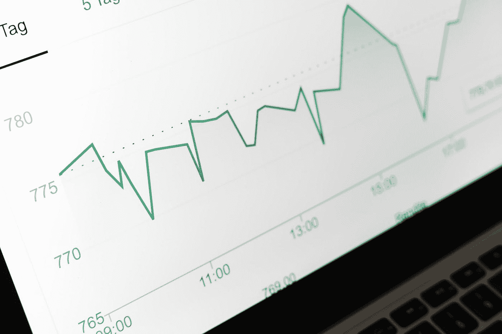

# 指数基金如何运作，以及 5 个入门要点

> 原文：<https://medium.datadriveninvestor.com/how-index-funds-work-and-5-to-get-started-with-74cc7fc3a2d?source=collection_archive---------10----------------------->

Photo by [Markus Winkler](https://unsplash.com/@markuswinkler)

## 作为投资者需要考虑的投资策略。

对于典型的投资者来说,“指数基金”是一个家喻户晓的名字。与购买沃尔玛(Walmart)、特斯拉(Tesla)或耐克(Nike)等单个公司的股票不同，购买指数基金意味着投资于一个更大、更普遍的图景。

对于投资者来说，这是一个很好的机会，他们可以采取被动的投资方式，而不是主动管理投资哪家公司。随着指数基金的历史和投资它们的利弊，你会读到大约 5 个指数基金，你今天就可以开始。

请继续阅读，开始行动吧！

**关于指数基金**

在 1976 年 8 月 31 日之前，许多人对广泛市场投资组合的想法不屑一顾，认为它只会促进平均结果。然后，先锋 500 (VRINX)作为世界上第一个指数共同基金推出。起初没有多少人感兴趣，但许多人慢慢开始意识到在市场上广泛投资与试图战胜市场的结果。

这里的想法是，模仿整个市场或部分市场可能比专注于特定公司更好。也就是说，如果市场作为一个整体做得越来越好，那么希望基金将匹配这一势头。指数基金是不同公司股票的组合。如果你相信广义上的市场会上涨，你的想法对那些相信指数基金的人来说并不牵强。

 [## 2020 年最佳短期投资选择精选资源|数据驱动型投资者

### 投资是增加你净财富的一个好方法。如果你通过遵循一个严格的…

www.datadriveninvestor.com](https://www.datadriveninvestor.com/2020/03/28/handpicked-resources-for-the-best-short-term-investment-options-of-2020/) 

指数基金也有好处。他们在投资组合多样化方面非常出色。可以说，它们的建立是为了避免把所有的鸡蛋放在一个篮子里。基金会为你做这件事，而不是你自己去找出不同的组合。由于市场的一般性质，这些基金通常会获得强劲的长期回报。

如果你是一个喜欢购买和持有股票的投资者，而不是经常感觉需要检查你的投资组合并做出改变。此外，指数基金在成本方面也更有优势。资金管理在费用率中起着重要作用，因为人工管理单个股票需要花费精力。因为便宜的指数基金不涉及这种程度的关注，相比之下，这些费用相当低。与高达 2.5%的费用率相反，指数基金的费用率通常最多为 0.5%。就退休投资而言，指数基金如此受欢迎有一些原因。

然而，除了优点，也有一些缺点。像任何事情一样，指数基金肯定容易受到市场崩溃或波动的影响。由于指数基金不涉及太多的人力管理，直觉或判断的一些好处可能会消失。事实上，没有太多的灵活性，因为这些基金将始终包含相同的公司在他们的部门。最大的担忧之一是指数基金可能提供有限的收益。如果你所有的钱都投资于指数基金，如果你在某家公司投入更多，你可能会错过一个繁荣的机会。

**5 只著名指数基金**

如果你是新手，并且有兴趣了解更多，这里有几个指数基金供你探索。

Vanguard Div 增值(VIG)跟踪公司的普通股，这些公司的股息记录随着时间的推移不断增加。它旨在跟踪纳斯达克美国股息达成者精选指数的表现，并根据其在该指数中的权重以大约相同的比例持有每只股票。一年前，每股价格在 117 美元左右，但自那以后已经涨到了 127 美元左右。

Vanguard Mega-Cap (MGC)衡量美国大盘股的投资回报，旨在跟踪 CRSP 美国 Mega Cap 指数的表现。这个指数基金涉及费用率在 0.07%左右。

iShares 中型股(IJH)寻求跟踪 S&P 中型股 400 指数的结果，该指数衡量美国股票市场中型股的表现。虽然其约 90%的资产是证券和存托凭证，但另外 10%可能是期货、期权和掉期合约等。现在每股价格约为 190 美元，但如果你在一年前投资，它会是 188 美元左右。

iShares 小型股(IJR)类似于 iShares 中型股，只是它专注于美国股票市场的小型股部分。这只股票的价值比一年前低了几美元。

先锋信息技术(VGT)，我个人最喜欢的，跟踪摩根士丹利资本国际美国可投资市场指数/信息技术 25/50 的表现，由信息技术领域的大，中，小型美国公司的股票组成。全球行业分类标准定义了这一类别的资格。目前的费用率为 0.1%，自一年前以来，每股价格上涨了约 100 美元。

下次见！

*【注:本文并非理财建议。]*

**访问专家视图—** [**订阅 DDI 英特尔**](https://datadriveninvestor.com/ddi-intel)