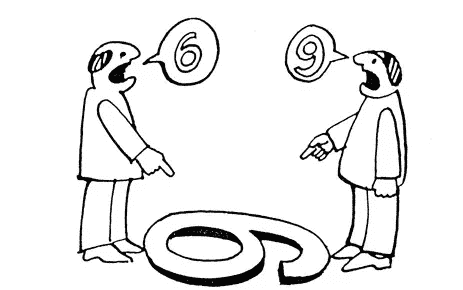
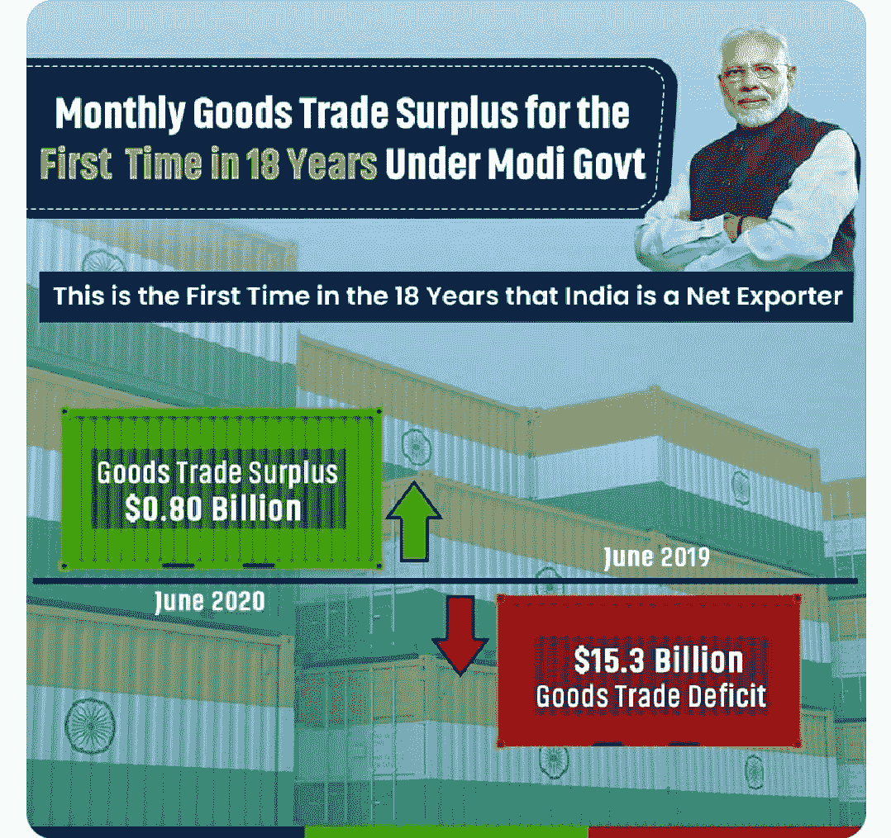
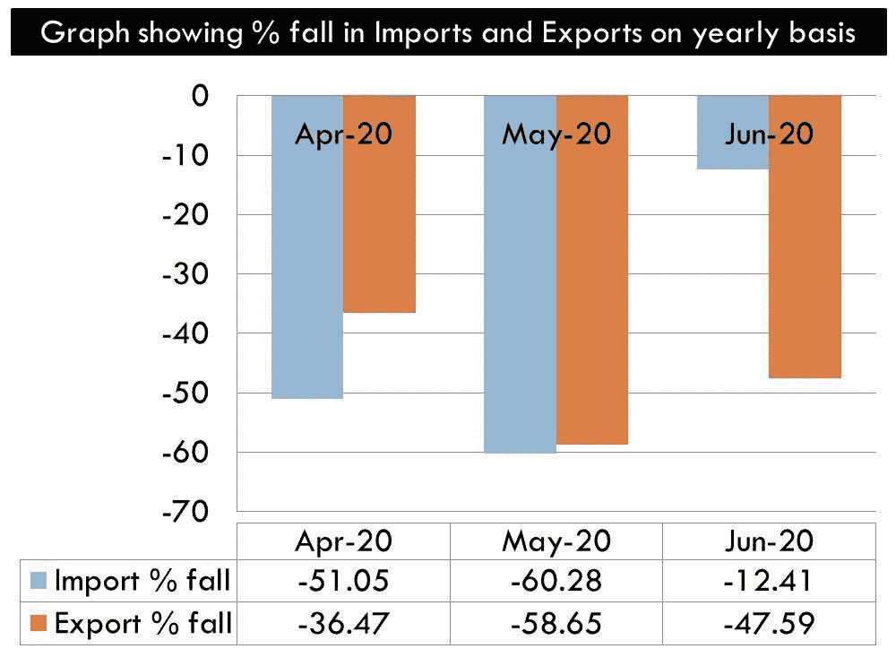

# 印度如何实现 18 年来首次贸易顺差！

> 原文：<https://medium.datadriveninvestor.com/how-india-achieved-trade-surplus-for-the-first-time-in-18-years-f8a3fd4b52b2?source=collection_archive---------14----------------------->

## 皮尤什·戈亚尔斯先生推特上的奇怪案例。

7 月 15 日，印度铁道部长皮尤什·戈亚尔先生在推特上发布了一条让所有人都摸不着头脑的消息！

这完全是关于观点。但是，这一次我觉得，皮尤什·戈亚尔先生在玩弄数字。这就是统计数字。它可以用来(读误用)适合一个人的叙述。

[(Source)](https://www.google.com/search?q=perspective+9+and+6&sxsrf=ALeKk00CfFH99fJJs4cUEaCwjq2oBYI5sg:1595395664040&tbm=isch&source=iu&ictx=1&fir=KMkiHJ3xzEpabM%252C6OWRLNAz-0FTuM%252C_&vet=1&usg=AI4_-kSlfQD1Z2B8W9XVvKK2D0pPq3EwQA&sa=X&ved=2ahUKEwiu69L-j-DqAhUO7XMBHSvXACcQ9QEwAnoECAoQGg&biw=1280&bih=610#imgrc=KMkiHJ3xzEpabM)

让我们来解码。

印度的贸易包括进口和出口。现在什么时候，

1.  进口>出口，存在贸易逆差。
2.  出口>进口，有贸易顺差。

就印度而言，进口几乎总是超过出口。因此，我们多年来一直有贸易逆差。但是后来 2020 年 6 月，事情发生了变化！

这是皮尤什·戈亚尔先生发的推特！

> 出口的快速好转:实现总理纳伦德拉·莫迪吉的 Atmanirbhar Bharat 的愿景，18 年来第一次，印度 6 月份录得月度商品贸易顺差！

不仅如此，他还发布了一张图片，称 2019 年 6 月印度的贸易逆差为 153 亿美元，2020 年 6 月，印度的贸易顺差为 8 亿美元。这是 18 年来印度首次出现月度贸易顺差。

[(Image credited to Mr. Piyush Goyal’s twitter handle)](https://twitter.com/PiyushGoyal/status/1283401539466350594)

但是，现实却不一样。从技术上讲，印度实际上有贸易顺差，但贸易顺差只是一个简单的计算。这只是意味着我们的出口略多于进口。那真的没什么大不了的！

 [## 对有商业头脑的投资者有用的行为经济学概念|数据驱动的投资者

### 在美国企业界，高斯统计，对我们周围世界的确定性解释，以及理性…

www.datadriveninvestor.com](https://www.datadriveninvestor.com/2020/07/09/helpful-behavioral-economics-concepts-for-the-business-minded/) 

我这样说是因为印度的进口因需求不足而下降。此外，由于封锁，我们无法出口我们的全部能力。因此，出口也有所下降。

这是数字，

1.  与 2010 财年第一季度相比，2011 财年第一季度印度进口下降了 52%。
2.  2011 财年第一季度，印度的出口下降了 37%。相比 2010 年第一季度。
3.  每月进出口数字如下:
4.  2020 年 4 月:进口下降 51.05%，出口下降 36.47%
5.  2020 年 5 月:进口下降 60.28%，出口下降 58.65%
6.  2020 年 6 月:进口下降 12.41%，出口下降 47.59%

(Created by author using MS Power Point)

你看，无论从哪个参数来看，这都不是一个好消息！需求不足导致进口下降怎么可能是好事？以任何标准衡量，出口下降怎么能被视为经济复苏的迹象呢？

只是进口的下降比出口的下降更多，印度正在经历'贸易顺差'般的情况，并且在短短一个月内' 2020 年 6 月'。

我是皮尤什·戈亚尔先生的崇拜者，但这次他只是试图描绘一幅美好的画面。印度要实现真正意义上的贸易顺差还有很长的路要走！

**进入专家视角—** [**订阅 DDI 英特尔**](https://datadriveninvestor.com/ddi-intel)