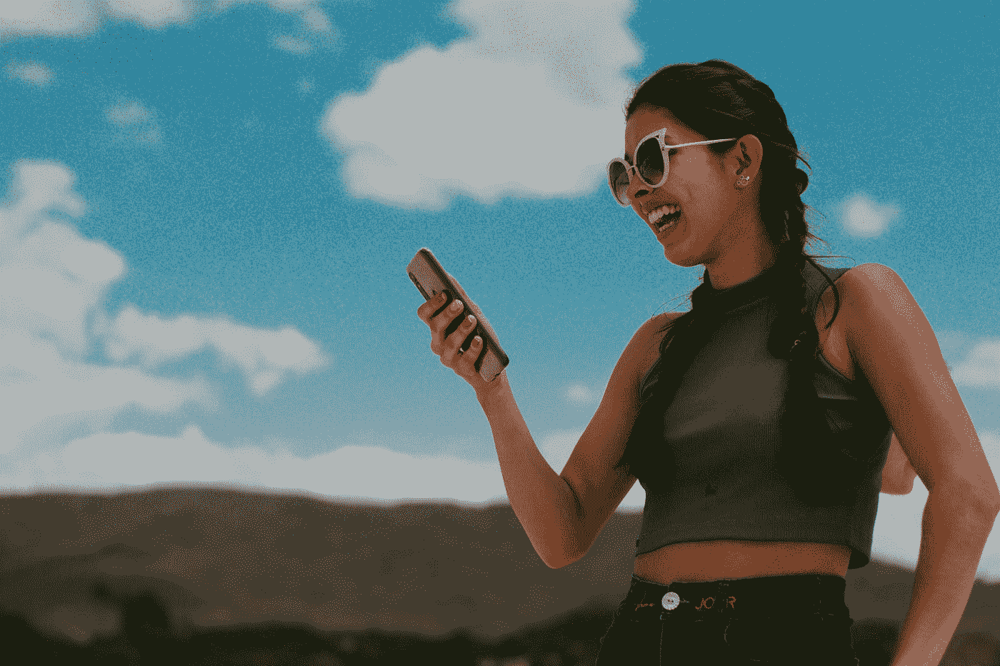

# 有影响力的人如何通过一个视频赚到 100 万美元

> 原文：<https://medium.datadriveninvestor.com/how-influencers-are-making-1-million-dollars-on-a-video-af1d340c4018?source=collection_archive---------22----------------------->

## 社交媒体影响者正涌向 Snapchat Spotlight，以获得他们每天 100 万英镑的份额

Photo by [Carol Magalhães](https://unsplash.com/@carolexm?utm_source=medium&utm_medium=referral) on [Unsplash](https://unsplash.com?utm_source=medium&utm_medium=referral)

我们都知道，任何社交媒体社区，如抖音、Instagram 或 youtube，最有影响力的人都在赚大钱。

## Snapchat 最近宣布，将向在他们平台上发布短片的创作者每天支付 100 万美元。

## 收听播客:

## Snapchat 的新短视频平台**聚光灯**于 11 月 23 日发布。自从他们宣布将在最受欢迎的内容的制作者中分配至少 100 万美元以来，有影响的人已经飞往该平台上传他们手机上的所有内容。

19 岁的 TikToker[**Cam Casey**](https://www.tiktok.com/@itscamcasey?lang=en)从 11 月份开始上传到 Spotlight，估计到目前为止他已经赚了 270 万美元。凯西向《纽约时报》解释说，他加入 Spotlight 是一时兴起。他的第一个贡献是一个经典的可乐瓶爆炸——一个已经在他相机胶卷里的预制视频。在他发布视频几天后，Snapchat 通知他，这个视频非常受欢迎，他每天 100 万美元的分成将达到几十万美元。凯西现在每天上传多达 120 个新视频，淹没了聚光灯。

创作者 **David Dobrik** 还透露，他通过在平台上发布三四个视频，在一周内赚了 10.3 万美元。

自从他们成立以来，Spotlight 已经向 1000 多名创作者支付了超过 5000 万美元——并且它计划在可预见的未来继续每天 100 万美元的计划。

我们不知道它是如何决定哪些创作者制作“顶级”视频的，也不知道用什么公式来分配每日 100 万(创作者是按次付费的吗？每次观看时间？).我们也不知道每天有多少创作者获得报酬，或者平均支出是多少，但纽曼称赞了 Spotlight 的系统，他说，“你不必要求获得报酬，你不必加入任何计划，你只需发布一个视频，如果它做得好，你就可以获得报酬。”

Photo by [Meghan Schiereck](https://unsplash.com/@meghanschiereck?utm_source=medium&utm_medium=referral) on [Unsplash](https://unsplash.com?utm_source=medium&utm_medium=referral)

为热门内容付费的社交媒体平台有:

## Youtube:

Youtube 向成为付费合作伙伴计划一部分的创作者付费。用户可以通过在他们的视频上播放广告或者通过 YouTube 的 Red premium 服务收集订阅来赚钱。

## TikTik:

病毒式视频平台向其创造者提供有限的广告收入，所以在你辞掉日常工作之前，你需要依靠赞助商的帖子、商品和成千上万的关注者。

## Snapchat:

它**将每天支付**100 万美元给**表现最好的职位的创造者**。为了挣钱，Spotlight 的视频提交者不一定要有大量的追随者。

## Instagram:

**你可以通过以下方式在 **Instagram** 上**获得**付费**:为希望出现在你的观众面前的品牌创建赞助帖子。成为代销商并通过销售其他品牌的产品赚取佣金。

## **来社交媒体上找我:**

[www.instagram.com/jacquelinejax](http://www.instagram.com/jacquelinejax)
[www.twitter.com/jacquelinejax](http://www.twitter.com/jacquelinejax)
[www.facebook.com/jacquelinejaxartist](http://www.facebook.com/jacquelinejaxartist)https://medium.com/@JacquelineJax

# 你可能也喜欢

 [## 当今音乐界的突发新闻

### 从 2021 年要看的播客到引领全球潮流的歌曲，以及哪个音乐团体正在建立一个…

link.medium.com](https://link.medium.com/ElWjgI1A0bb)  [## 如何在 10 天内获得 10 万 Instagram 粉丝？

### 快速发展 instagram 的策略

jacquelinejax.medium.com](https://jacquelinejax.medium.com/how-do-i-get-100k-instagram-followers-in-10-days-cd83b32a391c)  [## 为什么抖音是最好的社交媒体网页音乐

### 抖音与索尼签署协议，获取海量音乐目录

link.medium.com](https://link.medium.com/eh14oQEQubb)  [## 为什么 Spotify 在播客上投入巨资

### Spotify 斥资 2.35 亿美元收购播客平台 Megaphone

link.medium.com](https://link.medium.com/46duA87skbb)