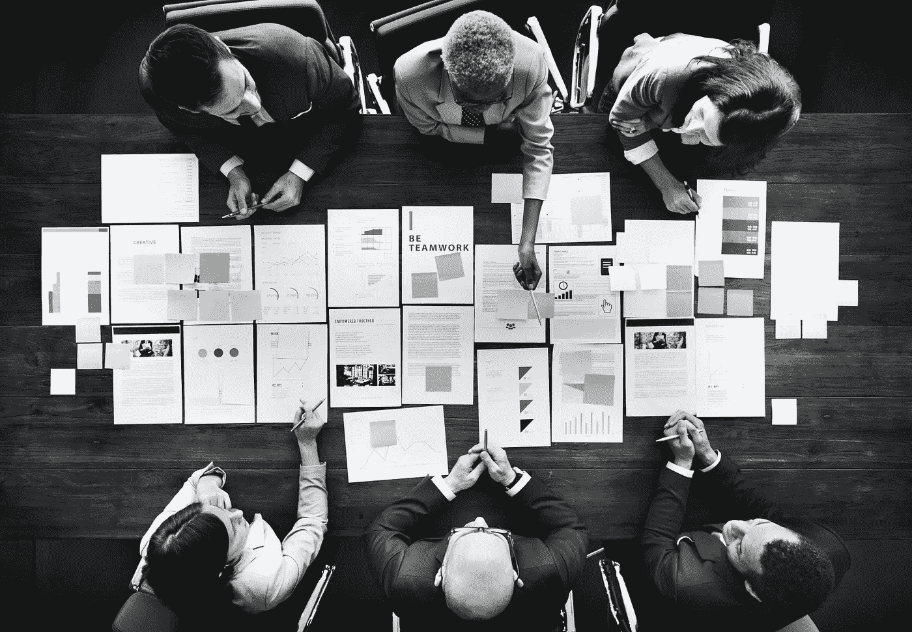
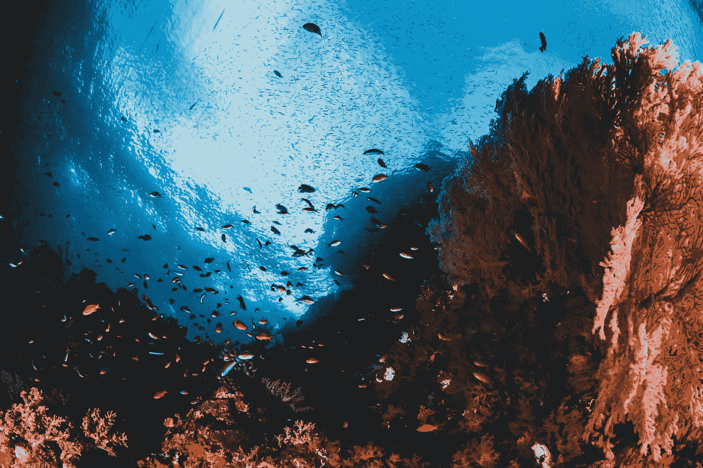
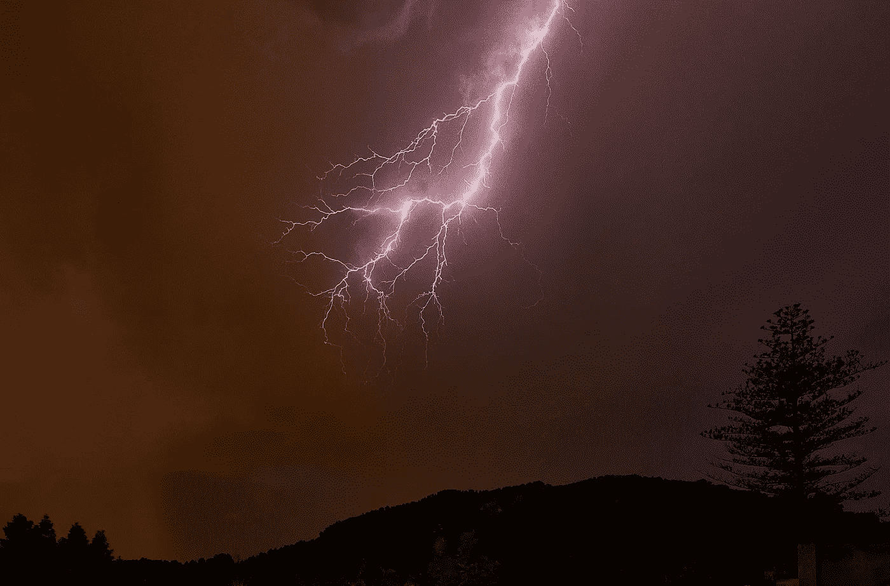

# 互联网垄断如何扼杀竞争，把用户变成商品。

> 原文：<https://medium.datadriveninvestor.com/how-internet-monopolies-kill-competition-and-turn-users-into-a-commodity-99398feb7de4?source=collection_archive---------6----------------------->

如果你还没有注意到，互联网不再是同一个自由主义乌托邦，一个自由竞争的空间和一个人人条件平等的发射台。

过去是这样，但现在不是了:互联网极客时代的全盛时期在 2000 年代到来。这十年是从发明家到营销人员，从企业家到经理，从初创公司到公司，从竞争到垄断的转变时代。

这种转变的象征性结束可以在 2018 年看到，当时谷歌正式放弃了其著名的道德使命*不要作恶*。相反，现在是时候把同样著名的*贪婪是好的*放在谷歌主页面上了。

浪漫创业的互联网正被大企业的互联网所取代。不再是以前那种“我们是你和我的血亲”,一个极客和一个用户，一个创业公司和一个用户，而是出现了对立实体的分层——企业反对用户。“用户”这个词反映了旧互联网的范式，那时服务在等待愿意使用它们的人。现在，衡量互联网业务效率的标准是留住人才并使用他们的能力。

现代互联网越来越不是基于对人们有用的能力，而是基于使用他们。对用户的好处不再是他们的主要任务，而是一种工具，有助于吸引更多的人并留住他们更长时间，以便使用他们。

互联网越来越变成一个地方，主要产品不是开发者的头脑、劳动和才能生产的数字产品和服务，而是用户自己，他们不再是用户，而变成了被使用的人。

 [## 用户体验和我们的数据哪个更有价值？数据驱动的投资者

### 客户体验的货币化将会越来越快。这一趋势的商业化始于…

www.datadriveninvestor.com](https://www.datadriveninvestor.com/2019/10/11/whats-more-valuable-user-experience-or-our-data/) 

就其本身而言，当不再清楚谁使用谁时，用户和服务的共生关系的加强是互联网发展和复杂化的自然结果。问题在于这种新型关系的片面性，在这种情况下，企业已经适应并将其用户转化为一种产品，而用户仍抱有错觉，认为是他们在使用比如脸书，而不是脸书在使用他们。

所有这些幻觉都与虚伪的常春藤紧密缠绕在一起，以防止它暴露得更久。对用户的尊重被 PR 取代了。谷歌和脸书本身同时卷入了世界某些地方(例如中国和缅甸)的侵犯人权丑闻，以及其他地方(主要是在他们的家乡美国)支持 SJW 议程的象征性姿态。第一种只是生意。第二是公关。因为人权方面的公关比跟着他们要便宜的多。

但是，即使我们把自己限制在用户和平台之间的关系的本质上，而不是平衡各方的利益，企业凭借其平台和生态系统完全占据主导地位。

谷歌和 Yandex 向用户出售付费服务，但同时他们并没有停止从用户身上挖掘数据。比如 Yandex，训练对 Yandex.Disk 上个人相册内容中图片的识别。

脸书甚至不隐瞒他们的业务是用户，而不是服务，不提供没有广告的付费版本，甚至是可选的。免费是一个丑陋现实的美丽封面，在这个现实中，付费用户只能带来固定收入，而从“免费”用户那里赚钱的方式只受到他们经理的独创性的限制。

用户不再是好客之家这场免费盛宴的客人，而是它的主菜。

# 生态系统化

最值得尊敬的方法(相对于互联网资本主义的其他鲨鱼)来自苹果和 Spotify 这样的公司，它们继续向用户出售硬件和服务，而不是用硬件和服务购买用户，再转售给其他所有人。但这种差异在更广泛的背景下并不那么显著。所有这些公司，从谷歌到苹果，从亚马逊到 Yandex，都在参与同一个项目来“生态系统化”用户。

生态系统化是企业向多平台水平的横向扩展，尽可能多地参与用户的日常任务。

这不仅增加了每个个人用户的数字档案的价值，因为收集了关于他们的各种类型的信息，而且在未来增加了他们转移到另一个平台的“成本”。

这不仅仅是传输数据本身。公司用软实力留住用户。生态系统中创造的舒适是这样的，当试图离开它时——例如，用 Android 替换 iPhone 或用 Windows 替换 Mac，用户会立即在小细节中感觉到他们的损失，如各种同步的简单性。因此，为了进入另一个舒适的生态系统，他们需要立即更新整个电子设备，或者呆在“家里”。

只有让用户参与到这个项目中的方式不同——免费和带广告或者付费和不带广告——而方向是相同的。

生态系统化是数字版的农奴制。农奴制也是从地主(平台)和农民(使用者)之间的一种伙伴关系开始的。地主给了农民土地，农民为地主生产了一种产品，作为交换，他享有相对的商业自由——比如他可以每年“毁约”一次，去找另一个地主(圣乔治节)。

这些关系的问题在于，个体农民对地主的影响远不如个体地主对农民的影响大。

农民根本没有选择:所有的土地都属于地主(我们说的是所有的大地主，包括教会和沙皇)。这给了地主一切机会来稍微改变利益的平衡，越来越有利于他们，直到这导致了一个自然的结果:将农民束缚在完全的农奴制中，即实际上将他们置于奴隶的地位。

同样的事情现在也发生在互联网上:互联网公司的成长不仅仅是以新用户和新业务为代价——它们将现有的公司从市场中驱逐出去，填满了整个空间，不仅挤走了竞争对手，也挤走了竞争的可能性。

亚马逊就是一个很好的例子，它的每一个新分拣中心都无情地铲除了附近的所有小企业。此外，这不仅是他们运作的副作用，也是一项有目的的政策:有些情况下，亚马逊只是重复他们提供的卖家的产品线，并以倾销价格复制，事实上，接管了他们的业务利基。

亚马逊能够负担得起，不仅因为它是一个市场，还因为它可以获得关于其商家业务流程的封闭信息。就信息的价值和不受控制地获取信息的风险而言，杰夫·贝索斯现在是世界上最富有的人。

也就是说，早期互联网的自由主义乌托邦正在变成它的现实噩梦——一个被垄断者瓜分的世界——这正在我们所有人的眼皮底下发生。

这些公司及其代言人的成功故事——从盖茨到扎克伯格，从乔布斯到马斯克——也是公共关系的产物，是与现代神和巨人一起创造现代神话的产物，这些神和巨人仅仅凭借他们的思想、工作和才华将地球扛在肩上。这些神话以真实事件为基础，通过忽略不符合叙事的细节来达到预期的效果，这会模糊史诗般的形象。

这些神话是全世界企业家和开发者的希望灯塔。而在现实中，企业的历史沉浸在先驱者的传奇中(在车库中成长、在宿舍中起步并取得成功的公司)，已经发展到如此大的规模，以至于跟随他们的脚步变得完全不可能。在最好的情况下，其中一个巨头会注意到你并买下你。现在，这是一个新的成功范例:不是开办自己的农场，而是去找一个更有权势的地主。

从这个意义上说，互联网的发明类似于欧洲人殖民美洲的历史(唯一的区别是在互联网被发现之前没有人生活在互联网上):新世界只是在一段时间内是一个无限可能的空间，直到帝国最终在它们之间划分它。

当然，硬币还有另一面。进步，用户体验的改善(在生态系统内部，每年都变得更加舒适和惬意！).对定制文件的训练开发了神经网络。广告商越来越了解他们的消费者，使得广告更有针对性，因此也不那么烦人。理想的广告是一种感觉上完全不像广告的广告，而是一种及时给出的有益建议。因此，在这里，整个平台控制也包裹在一个舒适的软毯中，承诺减少广告的烦恼。

平台、服务和技术的发展，全球人民之间沟通的协调和深化，也许是现代世界的主要成就，预示着人类文明发展的一个突破，而不是一个步骤。

进步的好处不是问题，这是无可争议的。问题是，在一个更加美好、更加舒适、透明和数字化的新世界里，这些利益将如何分配。

通信革命展开的速度是有代价的:新的资源、机会、技术和赚钱的方式出现得如此之快，以至于绝大多数人类和相当一部分企业都无法适应它，而不卷入一场争夺新市场中第一块奶油的疯狂竞赛……这使你能够在大量感兴趣的企业和用户来到之前，打开、捕捉和划分新的利基市场。互联网市场按照被反垄断监管机构忽视的蛮荒西部法则发展的时间越长，最强大的参与者的整合和强化就越深入，扩大了与潜在竞争对手的差距。

类似的分层也发生在劳动力市场，让比其他人更早掌握新技能的专家在激烈的竞争出现之前就在职业生涯中获得成功。然而，没有一个专家可以填补整个劳动力市场，而公司可以无限增长，不仅超过竞争对手，还可以占领整个市场，消除竞争。

因此，当进步的好处惠及大多数人时，他们的最大份额已经被少数人分走了。大公司不受控制的增长，企业和平台的整合和垄断描绘了一幅一方日益占优势的画面，企业少数，新的互联网贵族正在我们眼前形成。

# 少数商业巨头将控制互联网的大部分

1)作为一个市场(即它的用户)，

2)作为企业(把竞争对手的市场进入价格提高到天价)，

3)作为一种资源(主要是一种金融资源，在其支配下积累——通常是离岸的——巨大的货币资源)。

问题是，所有这些公司都是在纳税人的钱大量施肥的土地上成长起来的。硅谷巨头的神话创造者忘记的部分是对教育的公共投资(硅谷植根于斯坦福)，以及始于冷战时期、至今仍未枯竭的政府订单的货币雨。

直到用户和互联网巨头之间关系的糖果花束期尚未结束，媒体上冒犯的推文或毁灭性的出版物迫使跨国公司在任何琐事上改变路线的可能性仍然存在。

# 当它结束时，企业将拥有:

1)所有主要平台——内容、服务、交易、通信，

2)可能——对通信渠道的控制(美国的网络中立法已经被取消)，

3)所有服务器容量和存储的数据(随着 5G 的普及，大多数个人档案将存储在网上，只有用户和一家大型公司才能访问，其他任何人都不能访问)；

4)地球上大部分地区所有互联网用户的所有数据(也许，中国除外。但是有自己的 corporations)，包括非公开数据，比如个人“云”的内容。数字生态系统化的另一个很好的隐喻。“云”。

5)通过其垄断地位赚取的所有资金，小心翼翼地存入离岸账户。

6)控制用户对他们控制的平台的访问以及用户在平台上的言论自由。

7)对媒体的影响力，要么已经从拥有硅谷的同一个口袋里买来，要么极度依赖大企业作为广告商和流量来源。媒体正在转向社交网络上的受众，社交网络由企业所有，企业正在变成垄断企业——会出什么问题？

# 为了防止这种情况，是时候放慢钟摆并把它摆回来了。

要做到这一点，用户必须意识到他们的兴趣。要意识到生态系统化和企业合并的温暖感觉就像青蛙周围刚刚开始变热的牛奶。公司的利益不再与其用户的利益平行，而是越来越对立。垄断企业自己不会去垄断化，他们不会分享被占领的市场，他们不会从被拿走的利润中纳税——只有国家有资源、经验和权威去做这件事。

在之前的科技突破成果最终被蚕食之前，去思考教育和科学，也是国家可以负担得起的，也是国家力所能及的。

过去完全信任国家的想法没有实现。完全信任企业的想法就在我们眼前走进了死胡同。为了摆脱这种疯狂的摇摆，人们需要停止相信社会主义和资本主义的单色意识形态——并学会看到这两种方法的优点和缺点。

有必要利用消费主义的好处和政府的保护——但同时不要相信大资本或老大哥。

好消息是，现在，人类第一次拥有了集大众教育、组织和行动于一体的工具——互联网。直到现在，大部分人都是作为用户在里面的。

虽然大多数人在互联网上越来越舒服，但垄断者不应该被允许将自写作以来最重要的文明发明私有化，以换取用户体验的改善和云空间的增加。

如果你想阅读更多文章，你可以访问我们的 [Geniusee 博客](https://geniusee.com/blog)。

原文出处:[此处](https://geniusee.com/single-blog/how-internet-monopolies-kill-competition-and-turn-users-into-a-commodity)。

## 获得专家观点— [订阅 DDI 英特尔](https://datadriveninvestor.com/ddi-intel)