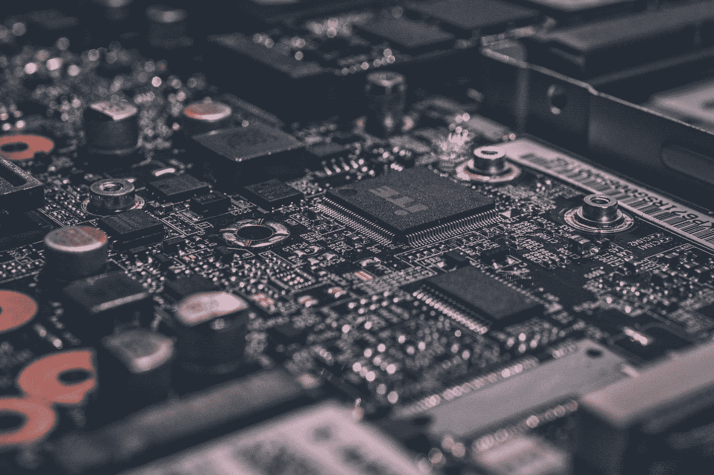
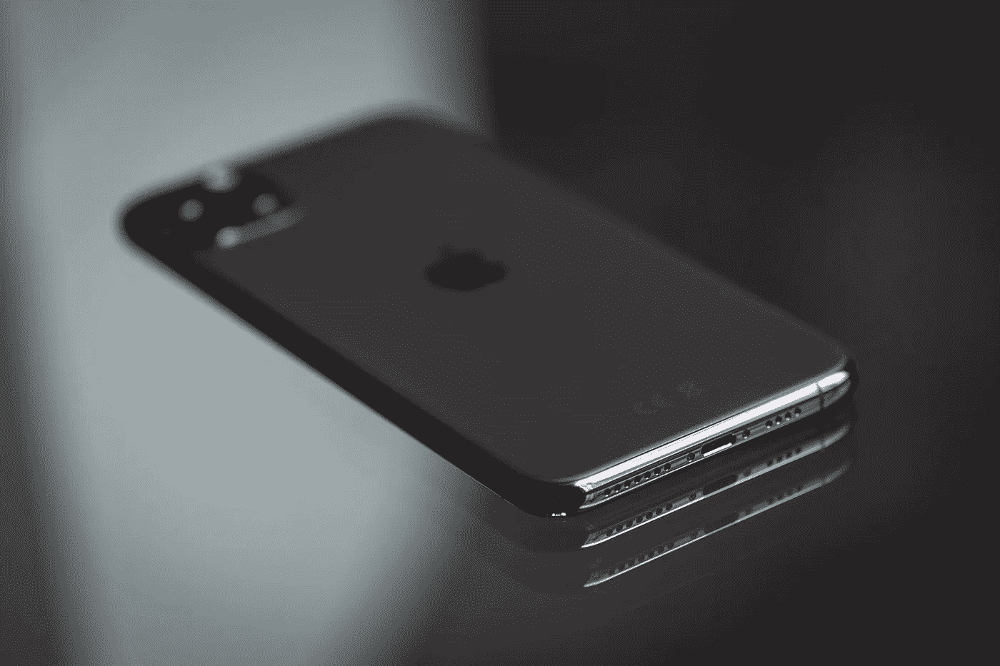

# 移动应用开发中集成的物联网如何推动您的业务发展

> 原文：<https://medium.datadriveninvestor.com/how-iot-integrated-in-mobile-app-development-can-boost-your-business-5161e752cfe4?source=collection_archive---------6----------------------->

移动应用程序开发和物联网在过去几年中一直处于高峰期。智能系统越来越多地影响着我们的生活，如今，移动设备是技术和人之间的纽带。

# 利用移动物联网设备转变业务流程

主要由于信息和通信技术的传播，技术创新在大多数经济和社会领域的渗透率呈指数增长。在未来 10-15 年内，预计将会出现根本性的飞跃，这将与物联网移动应用的开发相关联。无需人工干预即可运行的家用电器(例如，数字化生产框架中的机器人系统)的互联程度迅速提高。经济部门的数字化转型正在改变人与机器之间的互动性质。在 2025 年之前的这段时间里，引入物联网技术的经济效应估计为每年 2.7 万亿至 6.2 万亿美元。

物联网的使用正在改变业务流程，提高整个价值链的效率，最终导致新的商业模式和市场的形成。物联网的主要应用领域是供应链、货运和资产管理、机器诊断和遥测、库存管理、工业自动化控制、实时设备监控等。

通过引入物联网系统实现常规生产操作的自动化将加强技术链参与者之间的整合。供应商、物流、营销，甚至消费者都会发生在一个单一的信息领域。这将提高市场生产的灵活性和速度，并降低优化成本。

# 移动应用和物联网

由[亚历山大·德比耶夫](https://unsplash.com/@alexkixa?utm_source=medium&utm_medium=referral)在 [Unsplash](https://unsplash.com?utm_source=medium&utm_medium=referral) 上拍摄的照片

最近，将设备功能与物联网集成的移动应用开发公司数量急剧增加。早在 2009 年，联网设备的数量就超过了地球人口。我们可以说，我们已经生活在一个相互联系的世界中，只是到目前为止还不太明显。[麦肯锡大学预测](https://european-iot-pilots.eu/wp-content/uploads/2017/10/D04_01_WP04_H2020_CREATE-IoT_Final.pdf)到 2025 年，物联网对全球经济的贡献将在 3.9 至 11.1 万亿美元之间。

这项技术已经渗透到生活的许多领域:交通控制系统、联网汽车、电力网络、医疗指标分析设备、家用电器、定制追踪器。甚至户外广告也已经变得“智能”,允许你个性化广告牌上的信息。在许多领域，物联网的使用现在非常成功，并且具有成本效益。

人与“智能系统”交互的中心界面是移动应用程序。定制产品说明了这一点。比如智能牙刷。除了手机，我们还能在哪里看到刷牙质量的数据？你可以在智能咖啡机里煮咖啡，而不用离开沙发，或者直接从商店里看你的智能冰箱里还剩下什么。

但这一概念不仅渗透到 B2C 领域。很多燃气管网已经挂满了控制传感器。工程师只有一个中央控制点是不够的，他们需要配备移动应用程序。因此，他们可以接收相关数据，并“在现场”与系统进行交互。

物联网手机 app 可以做什么？

*   观察(设备、传感器、视频的读数)
*   分析(构建图表和报告)
*   管理(打开/关闭、启用/禁用、触发警报、发送消息以及执行许多其他操作)。

# 物联网应用到底是如何工作的？

为了更好地理解物联网可以给移动应用带来什么优势，我们需要知道它们是如何结合在一起工作的。例如，让我们考虑一下为汽车司机利用物联网的[定制移动应用程序开发](https://swagsoft.com.sg/mobile-app-development/)。有一种假设认为驾驶质量与事故数量有关。这反过来影响了保险成本。因此，保险公司提出在汽车中构建一种特殊的设备，从 CAN 总线收集数据。所有关于用户驾驶汽车的数据都被传输到服务器。该应用程序允许用户分析他们的驾驶风格，并调整它以获得良好的折扣。

还有另一种有趣的应用程序——充当服务器的应用程序。也就是说，它是一个完全成熟的路由和数据处理中心，独立地执行业务逻辑。例如，咖啡馆的自动化系统采用柜台服务模式，提供收银台服务。乍一看，很简单。该系统由几十个连接到局域网的设备组成，用 iPad 或 iPhone 控制。该网络在不访问互联网的情况下自主运行，但是，如果有网络，它会与云同步。一些 iPads 放在收银台，一些放在厨房和酒吧，其他的放在服务员那里。现金小工具在设备之间路由订单，并获取执行统计数据。它们与外围设备交互:打印机、财政登记员、现金抽屉和读卡器。甚至税务报告也通过联网的财政登记员在线发送。

由于物联网，世界变成了一个所有东西都通过小设备连接起来的地方，这使得信息随处可得。物联网的发展与分析革命、计算机发展的前沿和 5G 移动网络密切相关。从医疗保健到教育，从智能办公室到智能家居，物联网将逐渐成为主流。谷歌已经发布了 Android Things，以利用其技术增加物联网的实施。对商业移动应用程序开发、连接到互联网的设备以及允许您使用它们的移动应用程序的需求不断增长。越来越多的新手技术的部署迫使移动应用开发者朝着这个方向发展。

最初发布:[https://www . embedded-computing . com/home-page/gauging-the-IOT-mobile-app-market](https://www.embedded-computing.com/home-page/gauging-the-iot-mobile-app-market)