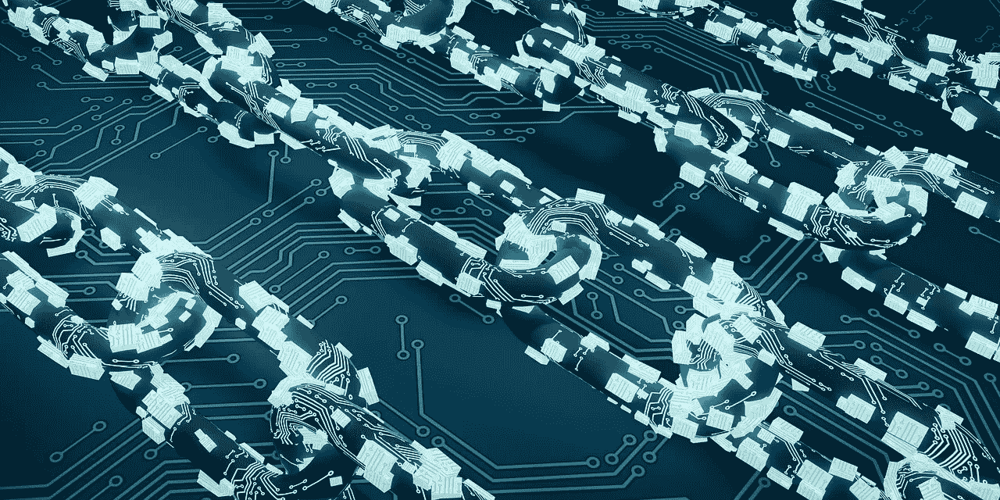

# 使用 IBM 区块链的物联网如何帮助您构建可靠的商业解决方案！

> 原文：<https://medium.datadriveninvestor.com/how-iot-with-ibm-blockchain-can-help-you-build-reliable-business-solutions-3ddf4e459066?source=collection_archive---------17----------------------->

## 将物联网与区块链技术相结合，开辟了构建商业解决方案的新途径，而无需在集中式 IT 基础设施上花费太多。

你有没有用过智能微波炉，用合适的时间烹饪你的食物？或者听说过智能篮球，它收集你投球的数据，然后你的教练可以检查这些数据，为你制定个人训练计划？

我们中的许多人甚至可能知道智能镜子，它可以显示各种信息，如日期、天气、温度等。至少智能手表和健身手环是我们都很熟悉的东西。

今天，几乎每个设备都带有传感器，可以收集数据并传输到云端。物联网不仅改变了我们的工作方式，也改变了我们的生活方式。物联网解决方案在几乎每个行业都有越来越多的采用，无论是医疗保健、制造、仓储、运输还是其他行业。企业正抓住一切机会利用物联网推动智能运营。

 [## 物联网和采矿业的未来|数据驱动的投资者

### 物联网可以做出重大贡献的领域之一是采矿！2 月 3 日，在开普…

www.datadriveninvestor.com](https://www.datadriveninvestor.com/2020/03/02/internet-of-things-and-the-future-of-the-mining-industry/) 

但是，如果我告诉你，这些基于智能物联网设备的解决方案并不那么“智能”呢？

随着物联网设备和基于云的物联网解决方案的增长，我们已经看到了一些问题，例如处理通过各种设备生成的大量数据以及相关的安全风险。

那么，有什么解决办法呢？

一种解决方案是将物联网与区块链配对，以构建可靠的商业解决方案。以下是区块链技术如何解决与物联网相关的问题。

# 为什么把 IoT 和区块链配对？

**#更安全地跟踪数据**

支持物联网的设备通常很小，内存和处理能力较低，这使得它们对其跟踪的数据不太安全。这些智能设备收集各种数据，如健身数据、财务记录和其他容易被黑客攻击的个人信息。比方说，你有一个智能手表，它通过云存储你的健身数据，有人可以访问你的所有健身数据。什么人能接触到你的财务数据？很可怕，不是吗？

物联网设备需要更好的安全性，这可能是我们将它与区块链技术集成在一起的结果。由于区块链使用分布式交易分类帐，它将交易存储在参与的多个服务器中，而不是在单个服务器上。借助区块链的分布式架构，它解决了物联网设备中的大部分安全相关问题。

**#通过交易历史增强透明度**

在进行商业交易时，您可能需要限制对物联网设备数据的访问。您可能需要将您的物联网数据的访问权限授予某些业务方，并且只授予少数成员一定的权限。

通过使用分布式账本和基于共识的安全机制，将物联网设备与区块链相集成使这成为可能。分布式分类账将各方联系在一起，并为每个人提供不可逆的交易列表和历史记录。这有助于提高透明度和双方之间的信任。

**#通过去中心化提高安全性**

使用物联网设备收集的大多数数据都存储在集中式数据库中，存在单点故障的潜在问题。数据库崩溃会使整个系统瘫痪。此外，这种数据的安全漏洞也是很有可能的。随着越来越多的物联网设备被使用，与物联网设备相关的数据管理和安全正成为一个主要问题。

区块链有共享数据的节点(计算机或连接的设备),使它们保持最新。区块链数据在节点上存储、传播和保存，降低了单点故障的风险。

**#通过智能合约实现交易自动化**

可以通过物联网设备自动化某些交易或服务，因为大多数物联网设备都能够进行自动化交易。例如，如果你的智能家居的灯泡熔断，它可以自动订购新的。

由于使用了智能合约，与区块链的集成使这些自动化交易更加高效。智能合约是区块链上带有预设规则的代码。一旦满足规则，合同就会被激活。使用智能合约，您可以使您的交易更加高效、精确和透明。

**#大规模运营的可扩展性**

传统的集中式物联网解决方案不具备大规模运营的可扩展性。随着物联网设备数量的增长，基于云的集中式物联网系统无法处理如此大规模的信息认证、连接和交换。

具有点对点分布式账本的区块链的去中心化特性确保了可扩展性。

区块链技术允许将处理能力分配到任何需要的地方。区块链的分布式账本技术、加密、多步验证为物联网面临的安全威胁提供了答案。因此，IOT 和区块链正面临着许多商机。

# 使用 IBM 云的物联网解决方案

借助庞大的智能设备网络，物联网能够基于支持云的互联物理设备创建新服务。IBM cloud 支持许多物联网解决方案。IBM 云支持的物联网解决方案有三个主要层次:

**#设备/网关**

包括所有联网的智能设备和传感器，这些设备和传感器从环境中收集数据，并安全地传输这些数据，以便进行分析和处理。基于数据和分析，采取行动。

**# IBM 沃森 IOT 平台**

IBM 基于云的物联网解决方案的下一层是 IBM Watson 物联网平台，它从物联网设备中获取数据，并提供数据分析以及广泛的认知服务。这些服务可用于处理物联网设备的各种传感器收集的原始、非结构化数据。IBM 沃森 IOT 平台提供的一些这样的服务是机器学习、机器推理、自然语言处理和图像分析。

**# IBM 云**

基于 IBM 云的 IOT 解决方案的下一层是 IBM 云。IBM Cloud 是一个基于开放标准的云平台。我们可以用它来开发、执行和管理应用程序和服务。

IBM cloud 支持物联网应用，并增强应用中的分析和认知能力。为此，它使用了几个运行时和服务。

# **IBM 区块链支持的物联网解决方案**

通过为您的物联网设备利用区块链分布式账本，您可以大大提高数据的安全性。您还可以获得可扩展的物联网解决方案。

IBM 提供了一个区块链平台，这是一个灵活的软件即服务产品，通过 IBM Cloud 交付。它是一个受管的全堆栈区块链即服务(BaaS ),使您能够在首选环境中部署区块链组件。IBM 区块链产品可以帮助您在产品开发过程中构建、运营和发展您的区块链网络。

借助 IBM 的沃森物联网平台，参与团体可以使用来自物联网设备的信息。它可以将这与运行在 IBM 区块链网络上的智能合同结合起来。

你的业务是否涉及一群当事人之间的协议？你需要与多方分享有价值的信息吗？如果是，那么具有物联网数据的区块链开辟了自动化业务流程的新途径，而无需建立昂贵的集中式 IT 基础设施。

如果你喜欢你所读的，请与你的网络分享！