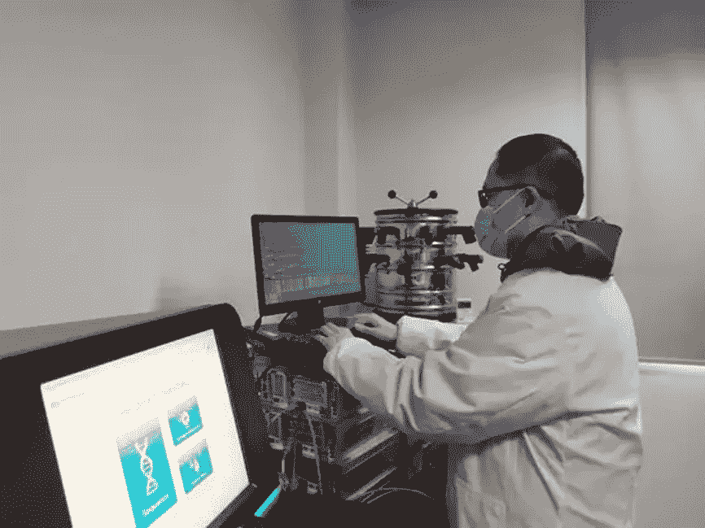
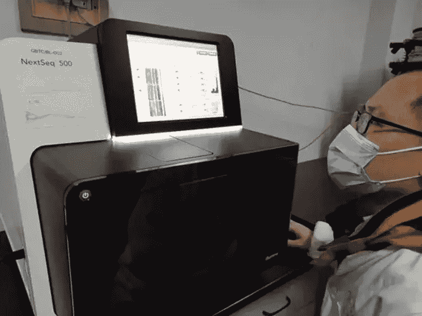

# 阿里 DAMO 学院如何帮助抗击新型冠状病毒的爆发？

> 原文：<https://medium.datadriveninvestor.com/how-is-alibaba-damo-academy-helping-to-fight-the-outbreak-of-the-novel-coronavirus-eeb65648ac2?source=collection_archive---------21----------------------->

阿里巴巴 DAMO 研究院正在使用人工智能算法来抗击新型冠状病毒(新冠肺炎)的爆发。2 月 1 日，浙江省疾病预防控制中心(浙江省疾控中心)推出了自动化全基因组检测和分析平台。利用阿里巴巴 DAMO 研究院开发的人工智能算法，他们可以将对新型冠状病毒引起的肺炎疑似病例进行基因分析所需的时间从几个小时减少到 30 分钟。这大大减少了诊断时间，并允许准确检测病毒突变。

Dr. Gu Fei, an algorithm expert from Alibaba DAMO Academy, performs genetic detection and analysis at the CDC.

新型冠状病毒的爆发仍然是中国的一个严重问题，快速准确的诊断对于控制疫情尤为重要。根据官方信息，冠状病毒拥有任何病毒中最长的基因序列之一，总长度为 29847bp。在临床诊断中，必须将患者样本与病毒的基因序列进行比较才能做出诊断。

目前医院普遍采用核酸检测法，只能检测出病毒基因组的一部分。但是如果病毒发生变异，这种检测方法可能就再也检测不出来了。

Structure of the novel coronavirus

与传统的核酸检测方法不同，全基因组检测技术可以对疑似病例的病毒样本进行全基因序列分析和比对，以有效防止因病毒突变导致的误诊。该平台由阿里巴巴 DAMO 研究院和 Matridx 生物技术公司联合开发，采用全基因组检测方法。它的主要优点是大大减少了检测时间。

 [## AI 将军是否已经超过了人类的智力容量？数据驱动的投资者

### 不仅在游戏中，而且在劳动力市场上，机器都比人类聪明。在今天的许多领域，使用…

www.datadriveninvestor.com](https://www.datadriveninvestor.com/2020/02/12/has-general-ai-exceeded-the-intellectual-capacity-of-humans/) 

在基因分析阶段，阿里巴巴 DAMO 研究院和阿里云弹性计算服务团队提供的系统还提供了快速的病毒基因组拼接能力，允许技术人员快速准确地捕捉变异的病毒序列、二级结构和三维结构。这些信息为病毒疫苗和药物提供了基础。

Setting the parameters for genome detection and analysis

算法创新提高了诊断效率。阿里巴巴 DAMO 研究院对冠状病毒基因组进行了特征分析，并开发了多种算法模型。在序列比对过程中，阿里巴巴 DAMO 研究院引入了分布式算法设计，以提高比对效率。在病毒基因组拼接阶段，使用分布式 de Bruijn 图算法来精确检测病毒变体。

浙江省疾控中心基因测序主任孙毅博士表示:“基于阿里云强大的计算能力和阿里巴巴 DAMO 研究院提供的新算法，该平台可以支持病毒分析。未来，它将能够在短时间内覆盖整个范围的确诊病例，为后续的疫苗和药物开发奠定坚实的基础。”

我们采访了阿里巴巴 DAMO 研究院的算法专家，他们对该平台的描述如下:

# 这个平台有什么特点？

这个自动化全基因组检测和分析平台是由浙江省疾控中心、阿里巴巴 DAMO 研究院和 Matridx 生物技术公司联合开发的高通量测序平台。它为浙江省疾病预防控制中心提供了全自动库创建和分布式计算分析能力，以缓解和控制新型冠状病毒爆发。Matridx Biotechnology 开发了一种用于构建全自动高通量测序文库的组件，使技术人员只需两个小时即可完成过去需要 12 个小时才能完成的工作。每个测序过程都会产生大量数据。阿里巴巴 DAMO 研究院使用分布式分析算法，将样本基因组分析所需的时间从几个小时减少到半个小时。同时，由于分布式算法的使用，病毒基因组拼接的速度从 30 分钟或 1 小时降低到仅 15 至 30 分钟。此外，与传统的核酸检测方法不同，该平台可以检测病毒的整个基因组，以避免病毒突变导致的假阴性。

# 阿里巴巴 DAMO 研究院提供的算法有什么价值？

阿里巴巴 DAMO 研究院分析了新型冠状病毒基因组的特征，并根据 PDB 等公共数据集的数据优化和训练了算法。病毒检测和病毒变异分析基于开源算法，我们设计了分布式算法来加速分析过程。在病毒基因组拼接后，我们应用使用比尔斯特姆+ DNN 方法训练的模型来预测病毒蛋白质的二级结构。同时，阿里巴巴 DAMO 研究院目前正在研究基于病毒基因组测序的蛋白质三维结构预测模型和药物筛选模型。

在继续与全球爆发的疾病进行斗争的同时，阿里云将发挥自己的作用，并尽其所能帮助其他人与冠状病毒进行斗争。点击[*https://www . Alibaba cloud . com/campaign/supports-your-business-anytime*](https://www.alibabacloud.com/campaign/supports-your-business-anytime?spm=a2c41.14100182.0.0)，了解我们如何支持您的业务连续性

# 原始来源:

 [## 阿里 DAMO 学院如何帮助抗击新型冠状病毒的爆发？

### 阿里巴巴 Clouder 2020 年 3 月 6 日 667 阿里巴巴 DAMO 学院正在用 AI 算法对抗小说的爆发…

www.alibabacloud.com](https://www.alibabacloud.com/blog/595954?spm=a2c41.14100182.0.0)