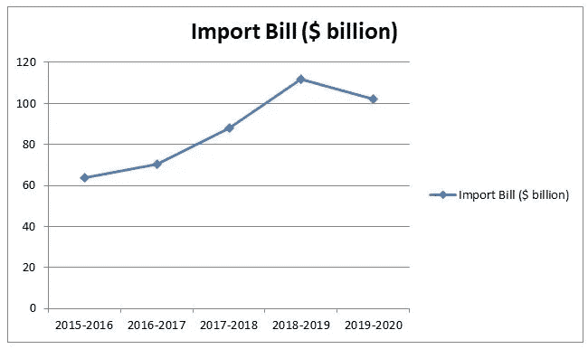
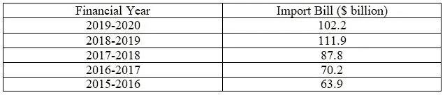
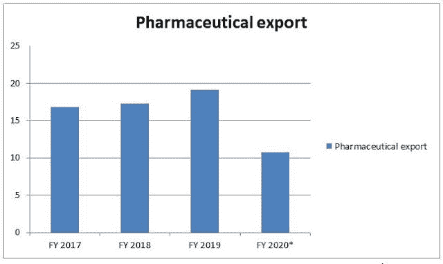
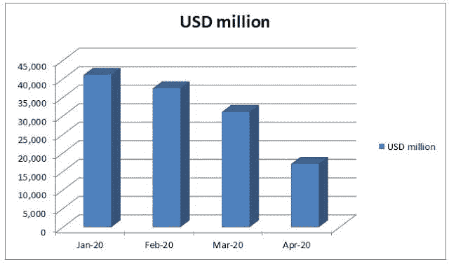

# 印度是如何增加其外汇储备的？

> 原文：<https://medium.datadriveninvestor.com/how-is-india-proliferating-its-foreign-exchange-reserve-1673a47ff8b4?source=collection_archive---------18----------------------->

## 新德里的成就

金钱是世界上所有经济活动的核心。政府需要现金来维持日常活动。当局通常通过资本收益或收入收益筹集资金，即通过出售商品和服务或贷款。国家通常对获得贷款犹豫不决，因为国家必须支付利息等。并且只申请较长期限的贷款。因此，大多数政府官员。试图使用来自收入收益的资金，但在当前的冠状病毒中，危机当局没有足够的储备，因此各国现在将注意力转向他们的外汇储备以应对其需求。

 [## 如果资本主义失败了，那么还有什么选择呢？数据驱动的投资者

### 在当前政治领域的修辞之旅中，我们都可以面对面地接触到流行词汇，如…

www.datadriveninvestor.com](https://www.datadriveninvestor.com/2020/03/16/if-capitalism-is-a-failure-then-what-is-the-alternative/) 

因此，最终，各国的外汇储备迅速下降。沙特阿拉伯王国、中华民国(台湾)和香港是少数几个国家的例子。很少有国家的外汇储备仍保持正增长。其中一个国家是印度。

Change in Foreign Exchange

——【www.RBI.org 

过去几周，印度外汇储备持续增加。那么，一个拥有世界第二大人口的国家是如何不仅能够维持，而且能够增加其储备的呢？让我们弄清楚。

**IMF 将外汇储备定义为**

*“县货币当局可用于满足国际收支融资需求的外部资产。”*

**根据牛津参考，外汇储备的意思是**

*“一国政府或中央银行为干预外汇市场而持有的流动资产。这些包括黄金或可兑换的外币。它们不包括一国银行或其他公司持有的外币或短期外国证券的流动余额。在紧急情况下，其中一些可能会增加一个国家的外汇储备。”*

在当前竞争激烈的世界中，拥有大量外汇储备是必须的。外汇储备有不同的用途，它有助于稳定货币，也有助于显著提高经济实力，并有助于爆发。国家在国际市场上的声誉提高了。当一个国家的支出少于收入时，这个国家的外汇储备就会增加，反之亦然。印度的外汇储备在一周内增加了 16.22 亿美元。那么，印度如何才能最大限度地降低支出，增加收入呢？

# 1.降低石油进口费用-

印度是一个权力饥渴的国家。2018 年，它以 51.23 亿桶/日(估计值)在全球排名第三，即 1119 亿美元，现在它已经萎缩了 9%，至 1020 亿美元。它为新德里省下了数十亿美元。

India’s Oil Import Bill

India’s Oil Import Bill

*   [www.economictimes.com](http://www.economictimes.com/)

这种口袋大小的下降也为印度节省了至少 90 亿美元。直接存入国家外汇储备。油价下跌也有助于印度降低成本。事实上，新德里正在利用上述事件，不仅填补其石油储备，而且还与美国达成协议，借出额外的石油储存。

更多的见解你可以阅读我以前的博客'[新冠肺炎&油价下跌](https://onkarjadhavv.blogspot.com/2020/04/covid-19-decreasing-oil-prices.html)'，在里面我已经详细谈过了。

# 2.增加药品出口-

自去年以来，印度制药业一直处于上升趋势。它已经开始在国际市场上获取更多的份额。

India’s Pharmaceutical Export

(2020 年* —随着时间的推移，该数字可能会上升)

冠状病毒危机给印度公司带来了积极的推动。最引人注目的事件是羟氯喹。印度目前向近 97 个国家出口了 2 . 85 亿台平板电脑。今年上半年，总额从 12.2 亿美元增加到 55 亿美元。在危机时刻，印度制药业确实帮助国家赚取了更多的现金。

# 3.消耗进口-

印度的进口往往多于出口。在历史上的大部分时间里，印度经济都面临着贸易赤字，尽管贸易赤字正在减少，但它正在损害经济。在当前的危机中，印度的进口急剧下降。

India’s depleting Imports

-印度商业和工业部

与去年相比，印度的进口下降了 58.65%。印度黄金进口下降 99.92%，石油产品进口下降 55.01%，煤炭和煤球下降 43.82%，电子产品下降 59.06%，钢铁下降 47.93%等。据记录，印度在 2020 年 4 月创下了十一年来的新低。有很多观点我没有使用，但它们对印度外汇储备的激增产生了重大影响。

# 那么接下来呢？

拥有可观的外汇储备并不能保证发展。印度获得了非常好的提振，新德里应该利用这一点。印度的外汇储备正处于历史最高水平，它应该合理利用这些储备。印度经济正在收缩，许多公司面临问题，人们失去了工作，全国各地都存在移民工人的问题。所有这些问题都需要尽快解决，但至少新德里不会面临流动性紧缩的问题。印度的名声比以前好了很多。印度很容易获得贷款等。这将有助于改善印第安人的生活。还有很长的路要走，新德里已经有了基础，现在一切都取决于它对抗当前危机的决定。

# 结论-

1991 年 1 月，印度的外汇储备达到最低点，为 12 亿美元，这足以支持该国未来 10 天的外汇储备，现在，印度拥有 4934.8 亿美元的世界第五大外汇储备。从 1991 年到 2020 年，印度走过了漫长的道路，但我觉得新德里不应该就此止步。与中国等老大相比，印度的外汇储备仍然微不足道。印度不应该就此止步，应该推进自己的边界。

*最初发表于*[*【https://onkarjadhavv.blogspot.com】*](https://onkarjadhavv.blogspot.com/2020/06/how-is-india-proliferating-in-its.html)*。*