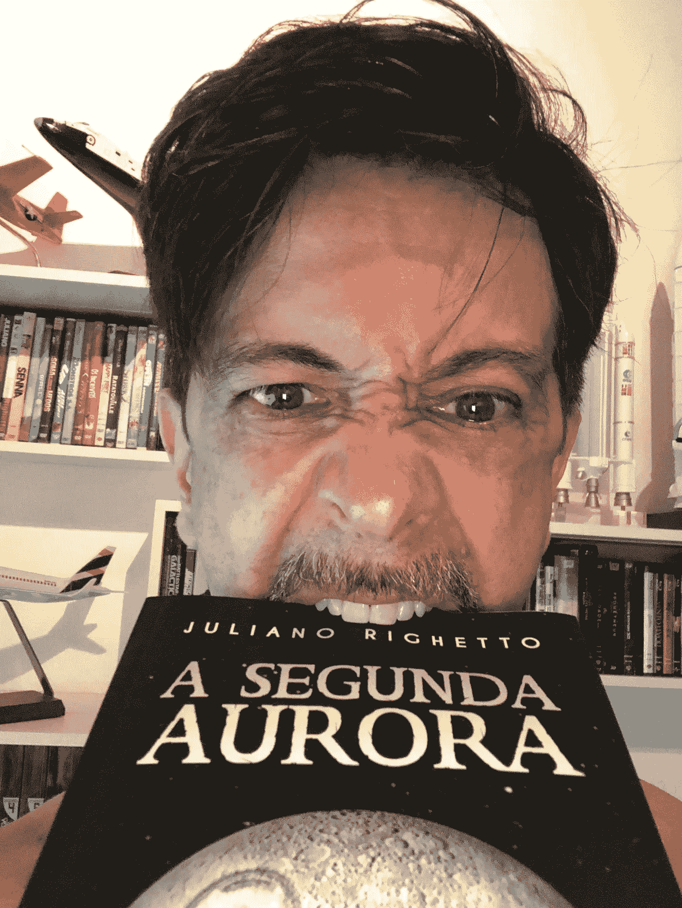

# 书的写作过程如何？

> 原文：<https://medium.datadriveninvestor.com/how-is-the-book-writing-process-3fba40cbce1e?source=collection_archive---------22----------------------->

## 一个作家应该采取什么步骤来组织他的想法和建立他的故事？

我是作家兼编剧。我作为合作者参与创作了四部肥皂剧和两部迷你剧，写了三部小说。由于我的创作过程在三个场合都是一样的，所以我将详细描述其中最艰难的一个，即“第二个黎明”的英文版:

Me biting my cub. Photo by the author.

## 灵感

写“ [A Segunda Aurora](https://www.chiadobooks.com/livraria/a-segunda-aurora) ”的想法——目前只有葡萄牙语——来自我在我们的一份报纸上读到的一个故事,*Folha de so Paulo*。它向我介绍了[斯瓦尔巴全球种子库](https://pt.wikipedia.org/wiki/Svalbard_Global_Seed_Vault)，这是一个在靠近北极的挪威岛上建造的建筑，这里保存着来自世界各地的种子。因此，如果未来几年出现危及种植园、人类食物供应和植物多样性的灾难，我们可以从种子库中提取样本，恢复世界植物群落。

读到斯瓦尔巴特群岛，我想象着寻找宝藏的故事会是史诗般的。多么重要、根本、同时又优雅的目标啊！简直无法抗拒！所以我开始构思这个故事。它将在什么时候发生。我的角色会在哪里。他们需要种子的原因是什么。参与这项工作的人是谁。在定义这一切，主要是悲剧的原因，时间，以及情节发生的地点时，我开始了一个历时三年的阶段。

这项研究。

因为我是一个注重细节的人，所以我想创造一个真实的宇宙。我倾向于很容易与不一致的故事脱节，所以我确保这不会发生在我的读者身上。是的，这是一部虚构的作品，它发生在一个与我们非常不同的时代，但那里写的一切都有科学依据。这是三年的研究。所有的细节都经过深思熟虑和研究。

## 结构化

我很清楚我想如何开始我的故事。我也知道，那是最后一行，确切的结尾。由于其史诗般的特征，它也知道它的大小。我需要时间让人们爱上我的角色，从而能够为他们欢呼和感动。然后书就变大了……六百三十页，分十五章。

然后，我有了故事的大纲，一个“骨架”，在那里我可以逐渐地放入“填充物”我决定开始将是神秘的…这些人是谁？他们在哪里？什么时候？他们为什么那样做？我放点小提示来澄清疑惑。然而，我不想让神秘的气氛持续到故事的结尾。那不是我的目标。我打算让读者知道这是一个什么样的世界，从而理解我笔下人物的思想是如何运作的。这是让读者参与其中，同时让他们思考的好方法。“在这种情况下，我会做同样的事情吗？”“这些人做的决定和我们今天做的有那么大的不同吗？”

然后我继续构建每一章。每当我开始一个，我知道它会如何结束。然而，我不知道在这一章的开头和结尾之间会发生什么。那是我不得不写的巨大冲动…想知道将会发生什么的渴望！是的，当然，我的思想创造了一切，但我只是在写作过程中意识到了一些事件。正是由于这种“无知”,产生了许多令人兴奋的事情…比如…

## 人物

我的故事有一个主要目标:寻找种子。谁会寻求，他们为什么要这样做，我只知道我创造的角色。是需求让一个人物脱颖而出。这种需求不一定是像目标那样有形的东西。可能是出于同情，爱，幽默，邪恶，冲突…

> 作家需要感受到故事的需求，并以最佳方式为故事情节的成熟提供必要的东西。

我能说出一些角色的名字以及让我创造他们的需求。比如 Tine，就是开启剧情的女生。她是一个渴望乐趣和知识的青少年。我之所以这样创造她，是因为我需要一个足够勇敢的人在夜间离开这座城市——这是被禁止的——并最终见到将在本书第一季中弥漫的神秘生物。Tine 是可爱的，鲁莽的，好奇的…她很快让读者爱上她。因为有一天，我们都像那样。而且很容易认同自己最好的一面。

主角之一的迪蒂不久后进入故事。她是一个年轻的成年人，已经比 Tine 更有责任感了…但也同样好奇。她在城市里有一个角色；她是“历史学家”，这个术语与她现在的意思非常不同。事实上，她是一个讲故事的人。她的职责是维护这些人的遗产。她与 Tine 关系密切，因为她每天都给这个城市的所有儿童和青少年讲故事。这种亲和力使她开始做她起初认为是天籁的白日梦。如果迪蒂不是如此好奇和聪明，这个故事会死在那里。“闭嘴，姑娘！你不知道你在说什么！”

> 正是推进故事发展的需要定义了角色的特征。

## 情节的展开和过程的变化

我说过，我一般是根据之前定义好的情节的“骨架”来想出每章的开头和结尾。我还说我会根据剧情的要求来塑造每个角色。问题是，在很多时候，角色的介绍最终会在故事中引起如此大的动荡，以至于你最终决定改变你的路线。

我有许多案例要描述，但最重要的是我的角色，卡罗琳。最初的想法是让她成为一个习惯如此不同和具有革命性的角色，以至于她会在最保守的人群中产生恐惧。而这种恐惧，在剧情的某个点上，会导致她被谋杀。

我想震惊一下。我试图让读者思考一个人的信仰是否应该与另一个人的生活重叠。就像最近在巴黎发生的教授谋杀案，因为他在课堂上展示了一幅漫画而被斩首。

卡罗琳生来就有一个使命，那就是将这一信息传递给读者。然而，她比我想象的要坚强得多。愚蠢和势利，起初她应该是一个不太愉快的人…但是，不知何故，她的不愉快变成了热。她开始拉所有的幽默场景，在某一点上，Tine 的友谊，一些我从来没有计划过的。

当活力二人组成立时…

杀死卡罗琳是不可能的。

我没有杀她。我给了她另一个目的地，一个对我和读者都更令人兴奋和愉快的目的地。

她也是。

> 是的，他们说的是真的…有时候，人物主宰了作者。

## 结论

我有个好主意。在我开始写作之前，我研究了所有我需要的东西。我做了一个简单客观的“主体结构”。然后，我把它分成十五个小结构，我的十五章。然后我把它们填好，注意剧情的要求，我想赋予它的基调，以及每个角色的需求。

期待下一章。和我的读者一样，我想知道我的脑海里为这个故事准备了什么惊喜。我是我的第一个读者。

唯一不同的是我看的页面是空白的。