# 冠状病毒是如何影响全球经济的？

> 原文：<https://medium.datadriveninvestor.com/how-is-the-corona-virus-affecting-the-global-economy-b93933f26e7d?source=collection_archive---------8----------------------->

在撰写本文时，2019-nCoV 冠状病毒感染人数为 48.206([https://www . nytimes . com/2020/02/13/world/Asia/China-Corona virus . html](https://www.nytimes.com/2020/02/13/world/asia/china-coronavirus.html))并呈上升趋势，死亡率为 2/3%。虽然冠状病毒似乎没有过去的 SARS 那么致命，但它传播得更快——见下文中国国家卫生委员会的一项研究。

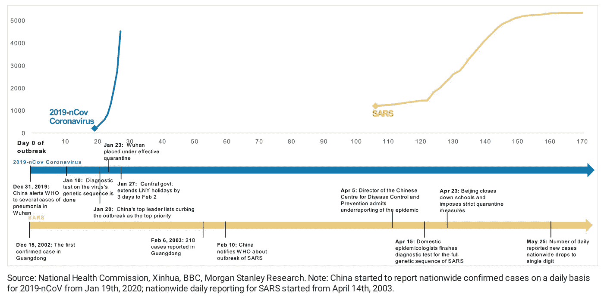

在接下来的几个月里，这种病毒可能对全球经济产生什么影响？暂时减速？衰退？这将取决于本文将要探讨的几个场景。

 [## 另一场精心策划的全球经济危机正在逼近？如果我们的数据经济可以帮助它|数据…

### 我们的 DApp 的开发，称为 DECENTR，目前正与我们的 R&D 同步进行，作为我们即将到来的…

www.datadriveninvestor.com](https://www.datadriveninvestor.com/2019/03/06/another-engineered-global-economic-crisis-looming-not-if-our-data-economy-can-help-it/) 

**病毒前的全球经济**

在电晕病毒成为问题之前，在经历了艰难的 2019 年(从宏观角度看)讨论贸易战、地缘政治紧张局势和全球制造业产出放缓之后，2020 年 1 月的全球经济有望实现周期性复苏。由于全球贸易紧张局势的缓和，这种复苏可以从最近一些领先指标的方向变化中看出——见下图(来源:MS)。

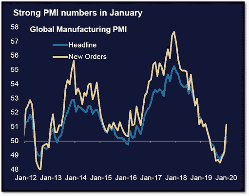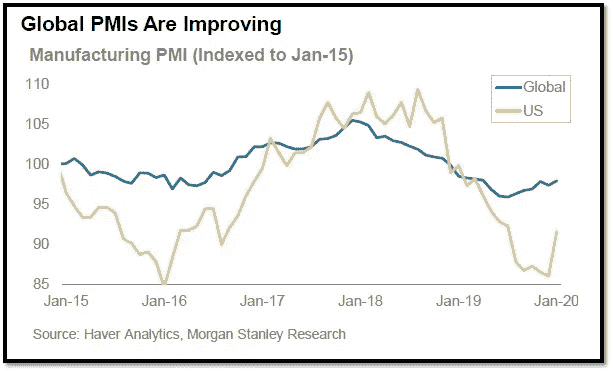

但是现在情况变了。

 [## 冠状病毒:中国曾经繁华的城市陷入停滞

### 中国宣布又有 97 人死于冠状病毒。这使得死亡总人数达到至少 1115 人…

www.aljazeera.com](https://www.aljazeera.com/news/2020/02/coronavirus-chinas-bustling-cities-standstill-200212155801769.html) 

半岛电视台的这段视频(上图)显示，病毒的爆发已经使中国的一些城市陷入停滞。多达 80 个中国城市处于部分封锁状态:现场建设已经暂停，许多餐馆和食品连锁店(包括星巴克和麦当劳)已经在选定的地点关闭，旅游目的地也暂时关闭。为了让你了解对人们出行的影响，中国交通运输部证实，截至 1 月底，全国客运量同比下降了 64%。

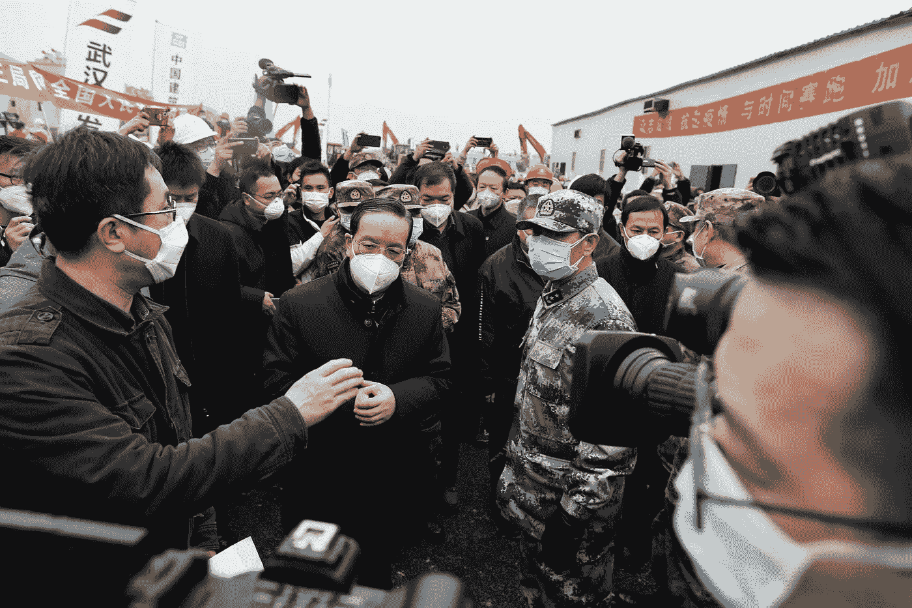

Chinese party leadership visiting an hospital in the Hubei province — Source: NY Times, China daily, Reuters

**从中国走向世界**

我们都知道，与 10 年前相比，中国在全球经济中的地位越来越重要，日常生活中的这种变化将在多个方面影响当地和全球经济。首先，中国从其他新兴市场(从非洲、拉丁美洲、中东和俄罗斯开始)购买大量商品——从金属到农产品到石油。它还从发达经济体购买工业和技术零部件。其次，它向世界各地出口原材料、零部件、成品和服务。

一方面，中国消费者呆在家里，不消费商品和服务，包括运输和物流。另一方面，中国工人被指示呆在家里，这影响了工业生产，限制了本应处理进出口物资的封闭港口的活动。来自中国的延迟发货不仅影响到中国企业，也影响到它们的海外贸易伙伴，这些伙伴依赖供应来维持业务运转。有趣的是，亚洲各地从中国进口商品的中小企业正目睹自己的产品滞留在中国港口，如果没有库存，预计将损失高达 70-80%的销售额，直到情况有所改善。从时装业开始，全球品牌正在告知客户，从材料、工厂和物流的角度来看，他们在中国的供应链可能会面临挑战，影响到 2020 年下半年的销售。

为了更清楚地了解中国进出口的商品类型，请看看下面麻省理工学院的可视化(截至 2017 年的最新数据)。此外，点击这里查看中国最大贸易伙伴的名单([https://en . Wikipedia . org/wiki/List _ of _ the _ largest _ trading _ partners _ of _ China](https://en.wikipedia.org/wiki/List_of_the_largest_trading_partners_of_China))。

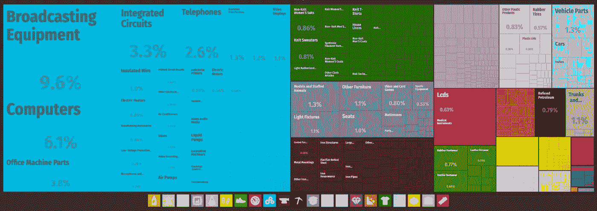

from MIT — exports have a total value of USD 2.4 trillion (2017)

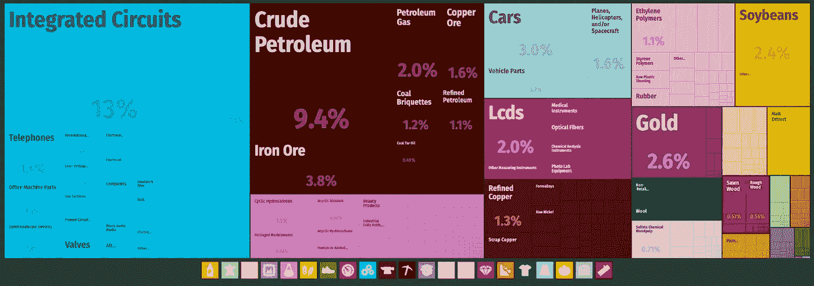

from MIT — imports have a total value of USD 1.5 trillion (2017)

从上述得出第一个结论，并见证了对传染的恐惧严重影响了中国的运输和物流(以及对未来中国和全球石油需求的假设)，石油是对最新发展反应最消极的资产类别，价格迄今下跌了约 20%。

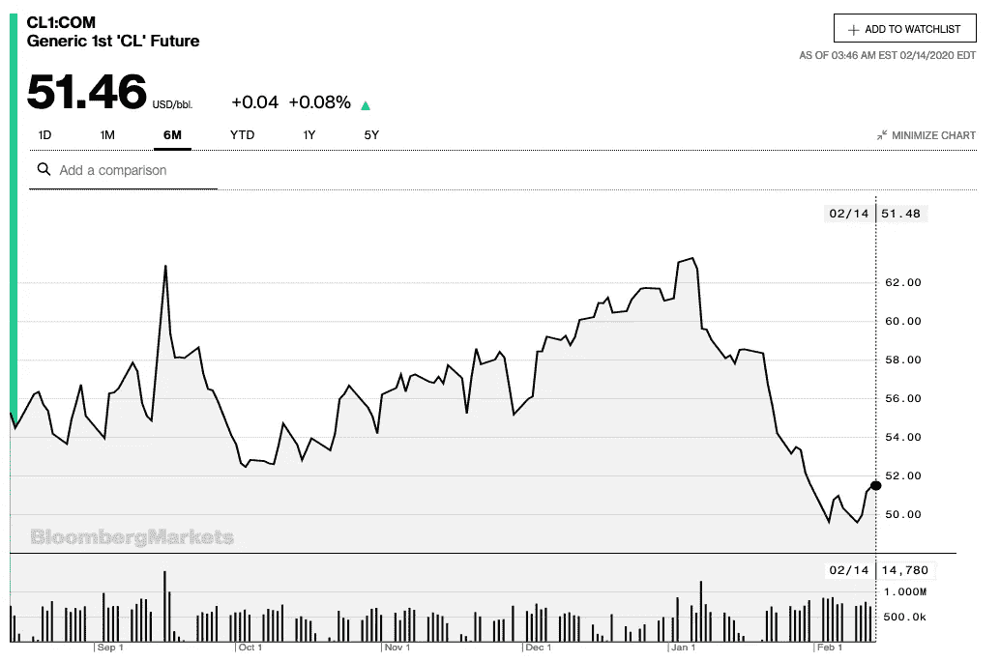

**经济场景**

为了对该病毒对中国和世界其他地区的潜在长期影响建立一些良好的情景，我们需要对工业生产、消费、供应链和物流在多长时间内不会以正常的步伐和速度运行做出假设。

如果工厂暂停期不再延长，假设病毒将被控制在大约。从现在(2 月)起的两个月内，考虑到工业生产和关键服务部门的中断，今年第一季度对中国 GDP 增长的拖累可能限制在 0.5%-1%(这意味着对该季度全球 GDP 增长的影响为 0.1%-0.2%)。最有可能的影响将是暂时的，因为工业活动和贸易可能会在今年第二季度迅速反弹，以满足国内和全球的补充库存需求，而夏季过后，人们的消费可能会出现一些补偿性增长。

如果病毒遏制在更长时间内无效/不可能，情况就不同了。在更积极的情况下，随着中国工厂关闭或部分开工至少 3 至 4 个月，全球供应链转移到其他国家，今年上半年对中国 GDP 的影响至少为 2%(意味着对中国 GDP 的年度影响为 1%，从预期的 5.5%增长到 4.5%或以下，这是 1991 年以来从未见过的缓慢速度)，这将使 2020 年的年度 GDP 从+3%左右变为 2.7%，这将是一个相对有意义的变化。

为了直观显示来自第三方的一些数字，请看这张图表:

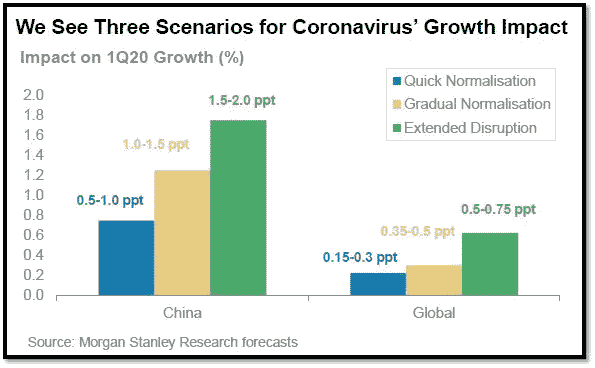

**金融市场的反应**

金融市场的反应是什么？奇怪。

一方面，与病毒“接近”的不稳定和高风险资产已经反映了恐惧和即将到来的经济问题，正如预期的那样。中国股市在 1 月底到 2 月初之间下跌了 10%以上，然后随着感染得到某种程度的控制，情绪变得更加积极:事实上，中国股市现在已经部分恢复，今年迄今只下跌了 3%左右。

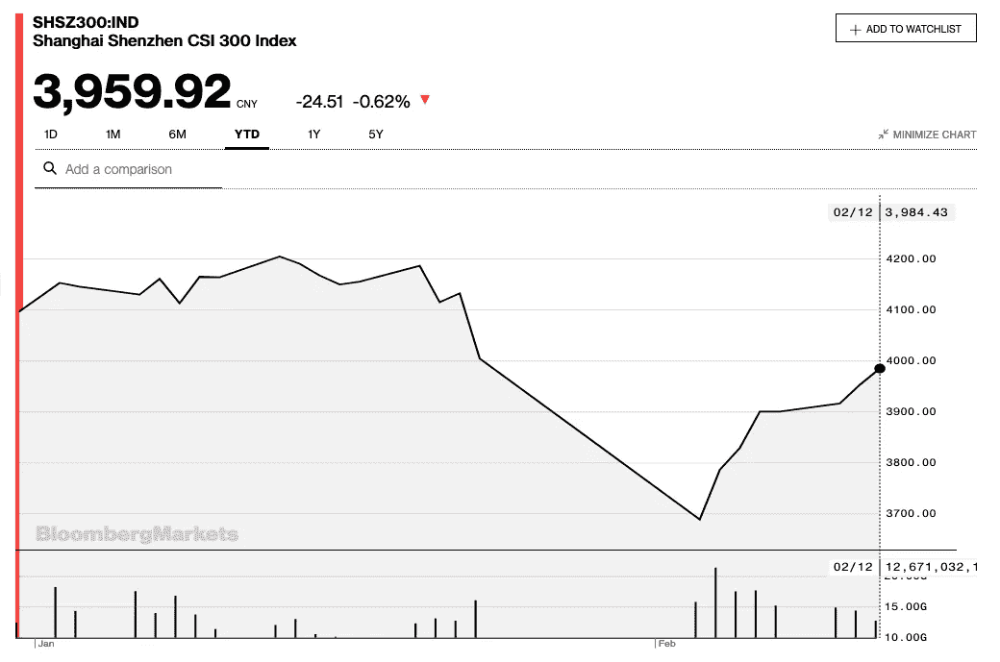

另一方面，与预期相反，许多其他全球风险资产类别继续表现出色，或者在最糟糕的情况下几乎没有变化。例如，美国科技股指数今年迄今上涨了 8%以上，而新兴市场债券(新兴国家政府和企业发行的证券)本应受到恐惧的广泛影响，但几乎忽略了这个问题——这可能是因为过去几年央行在金融市场上提供了令人难以置信的资金，在市场下跌时立即追逐。当然，更具防御性的资产——如美国国债——表现良好。看看下面的图表就知道了。

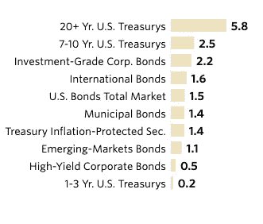

Wall Street Journal, YTD figures to 12 February 2020

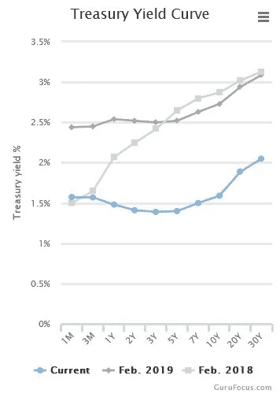

投资专业人士更感兴趣的是市场目前的定价。到 2 月中旬，美国收益率曲线的某些部分已经反转。你可以在左侧图表的蓝线中看到(来源:美国财政部)，1 年至 5 年期的利率比 3 个月期的利率低，这与正常情况相反。

这种倒挂的意义很明显:市场乐于将资金借给 3/5 年期的债券，获得的收益比现在少。这种明显非理性的行为可以解释为市场情绪从兴奋转向预期未来 12/24 个月可能出现严重的经济放缓，这种放缓将使央行有理由降息以支持未来的增长。

正如我们之前讨论过的，人们的印象是，在中国遏制冠状病毒不应该使全球经济陷入停顿。金融市场在这个话题上似乎过于消极。除非美国收益率曲线没有考虑到经济周期后期可能出现的更普遍的放缓，未来几年经济不会出现太多疲软，无法证明可接受的增长是合理的。也许吧？利率市场定价中最令人不安的部分，是与股市不可阻挡的上涨形成鲜明对比，这看起来完全矛盾。

**投资者的下一步行动**

由于金融市场的交易价格都非常昂贵(由于 2019 年几乎所有资产类别都大幅上涨)，病毒造成的破坏仍然难以量化，美国大选开始出现在新闻中，因此很难立即找到明确而廉价的机会。我确实预计，由于利率仍然很低，主要投资者将继续增加美国和全球股票，同时谈论已经处于牛市 10 年的疯狂昂贵的政府债券。

不过，购买防御性政府债券似乎仍与驾驭央行宽松政策和市场恐惧的浪潮有关:否则你会如何对冲你的押注？价格更好的固定收益资产类别仍然是新兴市场债券——对于那些能够忍受波动的人来说——以美元计算，收益率约为 5%,比升值的高收益债券更加多样化，风险更低。

在股票市场上，价格通常是由对证券需求的增加推动的。令人好奇的是，2019 年美国股市疯狂反弹，而投资者却在做相反的事情:从资产类别中撤出资金，至少到 2019 年 11 月为止。如果没有人参与，为什么美国股市会上涨？请看下面的图表，它对我来说非常有趣:回购是答案。

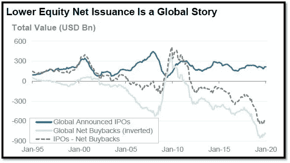

股票供应受到严重影响，因为公司购买更多的股票，作为回报股东价值的唯一方式。即使投资者需求疲软，你在图表(虚线)中看到的股票净供给的缺乏也在推高价格。现在投资者争相购买，发现好交易“感觉”晚了。事实上，我开始担心什么是值得的。害怕错过(或 FOMO)效应，意思是个人散户投资者加入市场反弹太晚，买入任何感觉热门的东西，以免失去赚钱的机会，通常是时候更加关注昂贵的估值，并最终限制你对高风险市场的敞口。

谈到 FOMO，我们以一个有趣的话题结束:有人能向我解释一下特斯拉股票的情况吗？？？

很快聊！

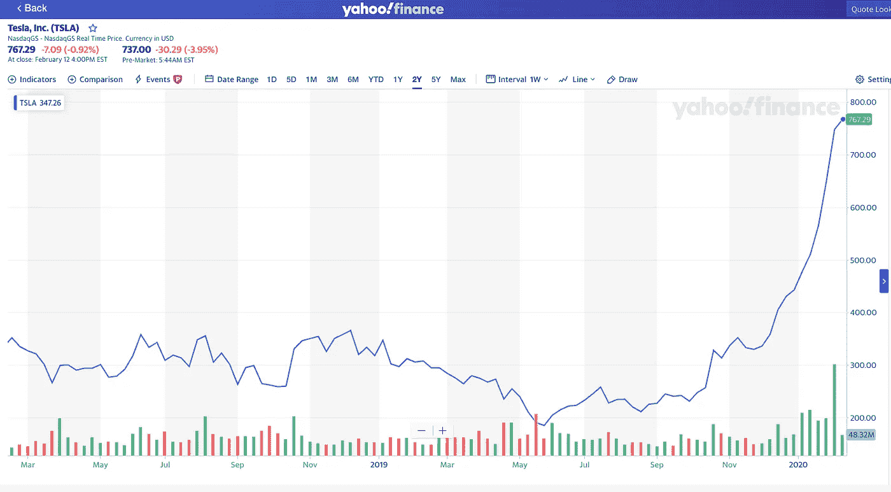