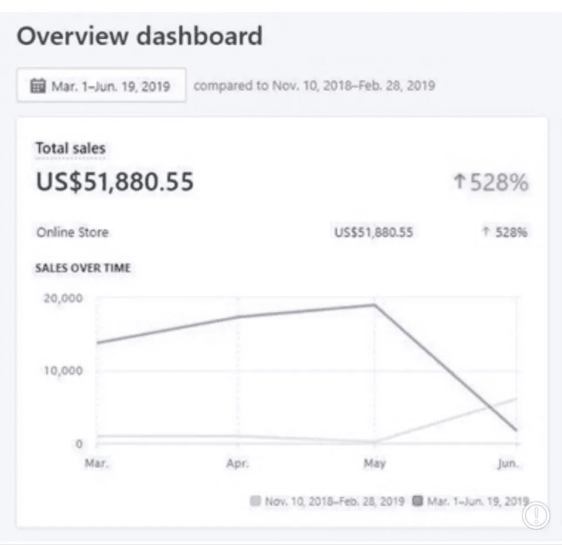

# 我如何通过不为任何人写作而成为一个更好的人

> 原文：<https://medium.datadriveninvestor.com/how-ive-become-a-better-human-being-by-writing-for-nobody-8e80461fdec9?source=collection_archive---------21----------------------->

深入了解为零读者写作的感受

Photo by [Fabrizio Verrecchia](https://unsplash.com/@fabrizioverrecchia?utm_source=medium&utm_medium=referral) on [Unsplash](https://unsplash.com?utm_source=medium&utm_medium=referral)

在一个如此强调喜欢、分享和关注的世界里，我发现为任何人写作都是极其平静的。

喜欢、分享和关注已经成为“社会地位”的象征。它们证实了我们在网上的存在。

没有他们，你会有什么感觉？

如果你创造了一个内容，而这个世界上没有一个人给你的内容一个“赞”、“评论”、“分享”或上帝禁止的“关注”，你会有什么感觉？

对我来说，至少可以说，这是令人耳目一新的。感觉可以让思想自由了。我终于可以真正地发挥创造力，而不用先入为主地想我的内容会如何表现。

> 让我感到振奋的是，我不再担心我的内容会获得多少赞、分享和关注

# 像病毒一样传播并不像宣传的那样

自 2017 年以来，我的遗愿清单项目之一一直是创建一个可以传播的内容。你知道，获得数百万的浏览量和数以万计的赞和分享。

我一直认为，当这种情况发生时，我会觉得自己‘成功了’。从某种意义上说，我已经成了*的名人*。

> 像病毒一样传播的梦想总是让我觉得这证明了我是一个人。对我来说，如果我像病毒一样传播，这个世界上的人们会知道我的存在

无论是我做傻事的视频，还是我从头开始创造的迷因，传播的想法总是让我兴奋。

然后就发生了。

2019 年 7 月，我在钓鱼领域创建了一个脸书页面(我甚至不钓鱼)。我这样做是因为在 2019 年 2 月，我创建了一个主要销售渔业产品的 Shopify 商店。

我通过一个非钓鱼页面，在我店里的一些钓鱼产品上投放了脸书的广告，令我惊讶的是，其中一些产品表现非常好。49 天内总销售额达到 51，880.55 美元。

这太棒了。我真的不敢相信正在发生的事情。

因为我的成功，我觉得我可以主宰渔业利基，所以我开始了脸书渔业网页和成功继续。

一个又一个视频在网上疯传。我们说的是每个视频有 100 万到 200 万的浏览量(有机的)。看起来我真的不会做错事。

我卖的是从中国直接运来的产品。我的视频在网上疯传*，但*我仍然不满意。有东西不见了。

 [## 定义新冠肺炎时代的“生活”|数据驱动的投资者

### 我和妻子即将进行一个月的自我隔离，以避免感染冠状病毒。我们都 70 多了…

www.datadriveninvestor.com](https://www.datadriveninvestor.com/2020/04/23/defining-life-in-the-time-of-covid-19/) 

# 像病毒一样传播并赚了一大笔钱并没有让我开心

我只是不能把我的手指放在上面。我的视频像病毒一样传播，我卖出了很多产品*但是*在我灵魂的某个地方有一个断开。

当然，表面上我对正在发生的事情感到非常高兴，但是我开始想，我能不能在我的余生都卖渔业产品？

答案当然是 ***见鬼不！我甚至不钓鱼！***

因此，我很快发现，在我的内心深处，我出售钓鱼产品的这家 Shopify 商店，与我想要在这个世界上留下的印记并不一致。

我并不真正快乐。

> 作为一名企业家，我总是在做真正让我开心的事和做我必须做的事之间徘徊，以维持我的生意

我很失望，病毒式传播没有达到我的期望。

病毒式传播和创造 100%由观众驱动的内容并不适合我。感觉我生活在谎言中。

我的意思是，我提供高质量的产品，尽管你可能听说过来自其他国家的直运产品的恐怖故事，我提供卓越的客户服务。所以我几乎拥有了成功秘诀的所有要素，但是缺少的是激情。

我对钓鱼毫无热情。因此，尽管我在这个领域表现得非常出色，也非常了解买家，足以通过脸书培养冲动购买，但我无论如何都无法与渔业世界建立联系。

这让我意识到，如果我在玩创业的长期游戏，我将不得不用我充满激情和彻底享受的活动来充实我的一天。

# 写作对我来说是一种治疗，尤其是在没人看的时候

相比较而言，决定在媒介上写作让我*消失在人群中*。

通常，我每天都会在我为客户运营的社交媒体页面和我自己运营的页面上为(集体)数百万粉丝创建内容。

不要误会我，我真诚地感谢所有这些追随者，但从技术上讲，我是其他品牌的代言人，而不是真正的我自己。

决定在 Medium 上写作最初是为了测试普通人是否能在这个平台上赚钱，但它很快变成了我的避风港。我的逃亡。

我对这个平台没有任何期望。

> 我承认，当我开始使用 Medium 时，我带着所有关于‘T8’病毒式传播的情绪。我最初的想法是在这个平台上“一鸣惊人”,但我在其他平台上已经多次这样做了，我觉得我再也没有什么需要向自己证明的了

能够做自己的感觉很舒服，*终于*。

我终于感觉自己在打破围墙。我很脆弱。

当我写作的时候，我真的会尽可能的清晰和简洁，这样如果有人，像你一样，碰巧看到我的文章并完整地阅读了它，那么你就真的能感受到我的想法。

我发自内心地写作。这不是我*必须制作*的内容，这是我*热衷于制作的内容。*

有很多了不起的作家，尤其是在这个平台上。我们都有自己独特的方式。我甚至不打算假装我可以赶上他们中的大多数，但我觉得自己又活过来了。

我觉得我在提供发自内心的有机价值，而不是制造价值来安抚一个品牌的追随者。

写作没有期望，或者别有用心，感觉很自由。

> 也许有人会看这个，也许不会。也许有人会给这篇文章“鼓掌”，也许他们不会。也许这篇文章会被分享，或者更好的是，被策划和特写，也许不会。无论这篇文章发生或不发生什么，都不会改变这样一个事实:当我接近这篇文章的结尾时，我感到非常满意

当我写作的时候，我觉得我给这个世界释放了良好的纯净的有机能量，因此我觉得自己是一个更好的人。

我真诚地向世界展示最好的自己，不求回报。遗憾的是，这对我来说确实是第一次。

我总是抱着一种“我能得到什么”的态度来工作，没有给自己施加不必要的压力很好。没有失败的感觉真好。

很多时候，当我们花了几个小时在内容和 it 上，因为缺乏更好的词，失败了，感觉一点也不好。我这里没有中号的，很好。

然而，我非常感激，在我在 Medium 上发表第二篇文章后，我被要求作为一名作家为创新贡献力量，老实说，这让我很震惊。

被邀请为一份出版物投稿真的让我重新评估我想在这里完成什么，这只是做我自己。

# 最终想法

降低你的期望听起来可能会适得其反，但有时这样做，你会对结果感到惊讶。

如果你发现你把很多价值放在了喜欢、分享和关注上，也许你可以试着回归基础，在一个充满激情的地方做你想做的任何事情。

我不是质疑你的热情，我只是说，像病毒一样传播，或者如此关注喜欢、分享和关注有时是没有成效的，因为你可能会在这个过程中迷失自己。

创作内容有时就像一个仓鼠轮子，我不想看到你陷入这种行为，我真的希望你成功。

对我来说，为基本上不存在的追随者写作释放了一些非常必要的空间，让我在其他领域更有创造力。

也许从这个角度来看会对你有帮助。我希望如此。

## 访问专家视图— [订阅 DDI 英特尔](https://datadriveninvestor.com/ddi-intel)