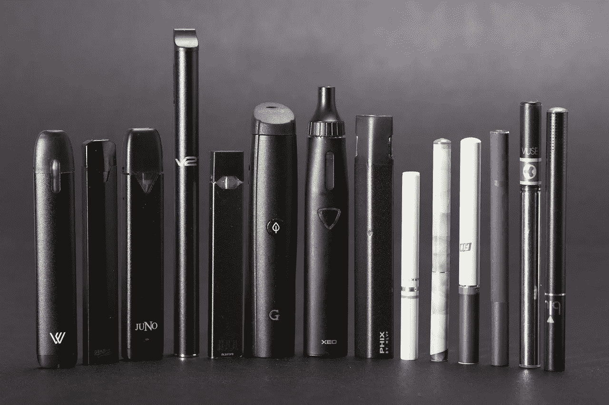
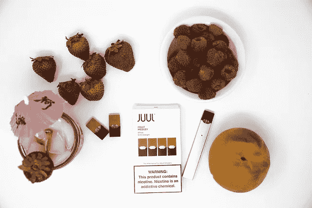

# 朱尔是如何引起流行性感冒的

> 原文：<https://medium.datadriveninvestor.com/how-juul-caused-a-vaping-epidemic-c2ee7d00d045?source=collection_archive---------3----------------------->

## 完整分析是什么将该公司转变为 130 亿美元的庞然大物

That thing in his Hand? Nope. Not a Pen Drive. That’s a Juul.

众所周知，香烟对健康有害，全世界的消费者都在努力戒烟。

毫不奇怪，如今电子烟市场的规模已经超过 120 亿美元，并且正以年增长率 20%的巨大 CAGR 增长。

在一个不断增长的足够大的市场规模出现问题的地方，你总会发现一些饥饿的企业家在暗处生闷气。

因此，在这篇文章中，我将讨论朱尔的聪明策略——美国电子烟领域最大的玩家，坐拥[130 亿美元](https://www.bloomberg.com/news/articles/2020-05-08/juul-labs-cuts-its-internal-valuation-by-35-to-13-billion)的估值。我将剖析他们的策略，并讨论其背后的原理——他们是如何运作得如此之好，以至于让整整一代人迷上了 vaping。

 [## 2020 年最佳短期投资选择精选资源|数据驱动型投资者

### 投资是增加你净财富的一个好方法。如果你通过遵循一个严格的…

www.datadriveninvestor.com](https://www.datadriveninvestor.com/2020/03/28/handpicked-resources-for-the-best-short-term-investment-options-of-2020/) 

# 漂亮

我们是苹果小孩。我们在优雅的设备上浏览美丽的网站。是的，我们被伟大的设计经验宠坏了。

在 21 世纪，形式和美学在建立任何产品的品牌识别中起着关键作用。

朱尔时尚而轻松的布局有助于它与消费者建立联系。它被特别设计成类似于已经在年轻人中流行的著名科技产品 iPhone。朱尔看起来更像一个很酷的小玩意，而不是一个药物输送装置，被普遍称为电子香烟的[*iPhone*](https://www.thetimes.co.uk/article/why-teenagers-are-addicted-to-their-juuls-the-iphone-of-e-cigarettes-dtswdsswg)。

不过，这种相似性并不令人惊讶。事实证明，朱尔的创始人是在斯坦福设计学院相识的，其中一人在苹果公司设计了多年的产品。

> 是的，就像奶奶现在有 iPhones，孩子现在有 jul，因为它看起来很现代。我们更相信现代的东西，所以我们使用它，因为我们相信我们不会有任何问题。我们可以信任它。

Image by [Ethan Parsa](https://pixabay.com/users/sarahjohnson1-9536297/?utm_source=link-attribution&utm_medium=referral&utm_campaign=image&utm_content=3576177) from [Pixabay](https://pixabay.com/?utm_source=link-attribution&utm_medium=referral&utm_campaign=image&utm_content=3576177)

# 紧凑尺寸

自从 1930 年第一支电子烟问世以来，它们的形状、大小和颜色都模仿了传统香烟。电子烟总是体积庞大。

另一方面，朱尔明白今天的年轻人更喜欢时尚简约的设备。此外，他们意识到，一些用户可能会对使用大型电子烟感到不舒服，因为对一些人来说，使用一支电子烟并不是一种荣誉。他们理解用户的情绪和不安全感。

基于这些见解，朱尔被设计出来。它可以被带到任何地方。这是一个精简版，没有不必要的功能，没有大量的蒸汽，也没有复杂的加油或充电。

# 上瘾的

你可以随心所欲地涂上各种光泽和釉料，但如果味道不对，一切都会化为乌有。意识到这一点，该公司采取了 3 个关键步骤来制作美味和令人上瘾的消费品。

**高尼古丁浓度:**典型的电子烟每毫升 vape 液体中含有 6 至 30 毫克尼古丁。一个朱尔豆荚装 59 毫克。尼古丁量越大，成瘾性越大。

**更易吸收:**朱尔拥有尼古丁释放的专利系统。与电子烟相比，朱尔的一种产品使用的盐能让尼古丁更快、更顺畅地被人体吸收，而且刺激性更小。

**甜味:**朱尔利用甜味吸引年轻人。我们都喜欢甜味，不是吗？

By [Sarah J.](https://pixabay.com/users/sarahj1-13768134/?utm_source=link-attribution&utm_medium=referral&utm_campaign=image&utm_content=4508937) from [Pixabay](https://pixabay.com/?utm_source=link-attribution&utm_medium=referral&utm_campaign=image&utm_content=4508937)

# 最后一击:精明的广告

> 这不是吸烟或 vaping，这是 Juuling，兄弟。

在了解用户行为的同时击中了正确的点，并将这些见解甜蜜地融入到他们的产品中——朱尔现在着眼于拼图的最后一块。他们在社交媒体上投入巨资，赞助 Twitter 和 Instagram 上的内容。

朱尔被作为一种体验产品进行营销。它应该让你感到放松，与你的朋友联系，体验自由。这是从混乱的世界走向平静的大门。

Juuling became a status symbol and a way of celebration.

像*享受快乐时光*和*与快乐共度美好时光*这样的口号灌输了这样一种观念，即每一段放松的时间都应该伴随着快乐。

JUUL advertising 的一个核心信息是，使用该产品可以为您的生活增添舒适和快乐。它类似于早期的烟草宣传，这很可怕。

社交媒体上的帖子以年轻迷人的模特为特色。使用了像*“a # juul moment 的自由”*这样的标语。

朱尔推动青年聚会，在著名的音乐节上举办奢华的蒸汽酒吧，比如《夜间仙境》。

# 留给你一个问题

显然，朱尔吸引了整整一代人。凭借敏锐的用户研究和无可挑剔的产品开发，他们赢得了所有奖项。
1。社交验证
2。使用方便
3。上瘾的味道
4。视觉吸引力

但是让我们在这里花一点时间。伦理呢？

据朱尔创始人称，该产品专门针对吸烟者，旨在帮助他们戒烟。然而，联邦数据显示，将近 21%的高中生吸烟，迫使 FDA 宣布青少年吸烟是一种“流行病”

尽管朱尔声称它从未打算影响儿童，但包括 T2 在内的研究通过大量证据揭露了他们声明中的虚伪。

因此，虽然朱尔可能已经帮助一些吸烟者戒烟，但它引发了另一个问题。它让新一代人对尼古丁上瘾，可能导致长期健康影响。

当美国参议员[致信](https://www.fda.gov/news-events/press-announcements/statement-fda-commissioner-scott-gottlieb-md-new-enforcement-actions-and-youth-tobacco-prevention?utm_source=Eloqua&utm_medium=email&utm_term=stratcomms&utm_content=link&utm_campaign=CTP%20News%26Connect%26SOS%3A%20Juul%20Actions%20%28New%29%20-%2042418)命令朱尔停止使用吸引儿童的口味和设计时，创始人承诺 3000 万美元用于打击未成年人使用。然而，这就够了吗？

> 上瘾不是一个阶段。这不像是孩子从青少年成长为成年人之后的事情。~斯坦顿·格兰茨(UCSC 大学教授)

作为营销人员，我们可以运用无数的心理学原理和说服策略来“转化更多的线索”。但偶尔，我们应该停下来反思——我们的营销努力让世界变得更美好了吗？

朱尔的出发点可能是好的:设计一个公共健康问题的解决方案。但事实证明，他们的产品创造了一个新的。

**访问专家视图—** [**订阅 DDI 英特尔**](https://datadriveninvestor.com/ddi-intel)