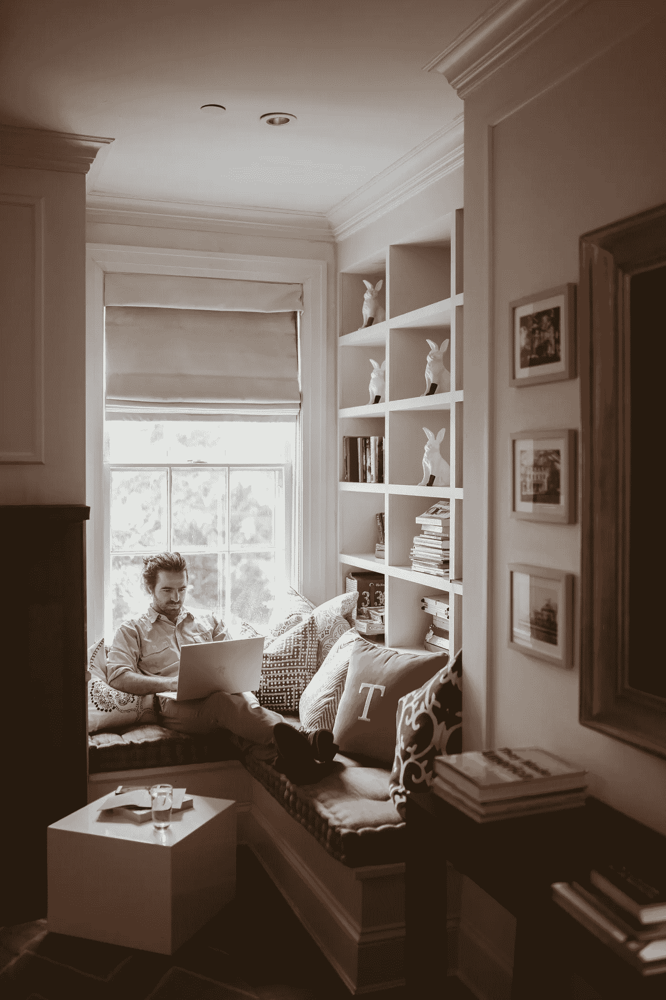

# 锁定给我上了宝贵的一课

> 原文：<https://medium.datadriveninvestor.com/how-lock-down-taught-me-valuable-lessons-493d196420c9?source=collection_archive---------37----------------------->

## 在家的这段时间彻底改变了我的生活。

Image is taken from www.pexels.com

对于像我这样有旅游癖的人来说，呆在家里不是一件容易的事情。起初，我花了很大的力气才说服自己呆在家里。但后来，一切都变成了新的例行公事，我开始享受而不是抱怨。

我是一个自由的人，喜欢在晚上散步，下班后与朋友和家人聚会。有时，我离家的时间会延长，我妈妈会因为我晚上回来晚了而责骂我。我妻子也经常因为我没有早点回家而生我的气。

但是我的朋友和工作总是在那里拖我一段时间。

但是，由于封锁，除了呆在家里别无选择。突然实施的时候，大家什么都担心。作为我兄弟姐妹中的老大，我可以说，是唯一挣钱养家的人，负责照顾家庭以外的所有家务，我也很担心。

但是我的担心很快就消失了。一部分是因为我在一所大学当老师，领着固定工资。但就这样，我确实在晚上做兼职的时候赚了一点外快。

因此，随着封锁，我的收入大幅缩水，我不得不补充我的薪水，以平稳地承担我的家庭开支。

现在你可能会想，有了一份固定的教学工作，我为什么还要工作挣更多的钱呢？

嗯，是因为，就像我前面提到的，我几乎一个人挣钱养家，因为我父亲从 2018 年 3 月开始就不工作了。那时他的生意破产了。之后，他想休息，休假一年左右。然后他试图重新开始；他是一名出租车司机，但由于停工，他不能出去工作。

如前所述，我们是五兄弟，我是哥哥。紧跟着我的兄弟在一家私人机构工作，他被解雇了。肯定的，他零花钱的责任也落在了我的肩上。

 [## 定义新冠肺炎时代的“生活”|数据驱动的投资者

### 我和妻子即将进行一个月的自我隔离，以避免感染冠状病毒。我们都 70 多了…

www.datadriveninvestor.com](https://www.datadriveninvestor.com/2020/04/23/defining-life-in-the-time-of-covid-19/) 

我的三个兄弟还在学习。年轻的在学校学习，比他大的刚刚被他的中级年级录取，而中间的在攻读英语学士学位。

所以，他们学习很忙。我也不想让他们工作，因为我真的希望他们先完成学业。之后，他们可以分担我的负担。

回到主题，我开始寻找新的赚钱方法。我偶然发现了自由职业者，并在一开始相当成功。

但是，如果你想把自由职业作为一份兼职工作，或者只是为了让你的休息日富有成效，老实说，自由职业并不太有利可图。

是的，如果你把它作为一份固定的兼职工作，会更有成效。

对于那些声称和鼓吹自由职业者可以选择在自己喜欢的时间工作或者干脆不工作的人…

他们部分错了。

但事实是，一旦你进入自由职业市场，获得了工作和收入的自由，你就不再自由了。

是的，在你获得了乐趣之后，乐趣将会消耗你所有的时间。

所以，如果你是那种更喜欢与人交往，却几乎抽不出时间的人，那就忘了自由职业吧。

因为，有了自由职业，你一天天地受到限制。你所有的活动，有时是非常重要的活动，必须牺牲——仅仅是为了盯着屏幕——日复一日地找工作。

为了避免更多的分心，让我开门见山。

关键是，封锁给我提供了大量的机会去阅读更多的书，看更多的电影，学习新的技能。

是的，除了其他事情，我还学习了自由职业。我学会了使用微软 Word、Powerpoint、Excel，不仅如此，我还学会了如何成为一名成功的自由职业者。

我还学习了新的写作技巧，开了一个博客，不太成功。但是寻找读者让我找到了媒介。

媒介是我内心深处一直在寻找的东西。作为一个有抱负的作家，我一直想有一个来源，在那里我可以自由地写作和出版，拥有广泛的读者。

对我来说，没有什么能比中等更好了。它给了我自由去实践我喜欢的东西——写作。

我从媒体中得到的好处是，它有一个漂亮的无广告版面，拥有数百万读者。在这里，人们可以畅所欲言，不怕指责或批评。

大多数时候，读者是合作的，他们欣赏作家的作品。他们的赞赏往往被包裹在温和的批评中，以求改进，这是件好事。

所以，当你做你喜欢的事情，并从高质量的读者那里得到反馈时，你一定会得到提高。他们的参与也会带来金钱上的回报，也会提升你的士气。

读者是作家想要的。有了像你这样的优秀读者，作家就能飞向天空的极限。

最后，有了这个媒介，我开始追求我长久以来的梦想，成为一名伟大的作家。我很有希望，通过定期的写作练习，我将很快实现我的目标。

随着封锁，我也花了更多的时间和家人在一起。它让我们所有人都从枯燥的日常生活中解脱出来，有更多的自由时间来更满意地呼吸。

一个人通过与家人在一起而获得的满足感是最重要的事情。人们意识到有更多的时间和家人在一起是非常必要的。和孩子在一起的时间越长，一个人就越了解他们。

随着时间的推移，我越来越了解我的孩子们。得知我的孩子们如此爱我，我重新振作起来。

我相信，外面的每个人都很忙。有时很难找到更多的时间陪伴家人。缺乏时间往往会导致更严重的后果，有时会变成一场噩梦。

因此，封锁在很多方面是塞翁失马，焉知非福。这给了我们充分的时间来重新思考。它解除了我们所有与直系亲属无关的义务。这给了我们一种优先感。

现在，我相信，每个人都认为我会给他们的日常事务、业务带来变化，或者重新考虑工作，重新安排事情的优先顺序。我相信，对我们所有人来说，锁定后的生活将与锁定前的生活截然不同。

因为任何事情都会给我们一个教训。对每个人来说，这个教训就是为了我们自己和家人的利益，重新思考和重新考虑我们到目前为止一直在做的事情。

因此，随着锁打开了我们的眼睛，以严峻的现实生活，我们生活在一个空洞的生活。在吸取了这些教训之后，我决心要做这些事情:

*   通过每天至少两天写一篇完整的文章，成为一个成功的作家。
*   给我的家人更多的时间，因为家庭是最重要的。
*   为未来生活中的任何大事做好准备。
*   让自己更灵活，以便学习更多，享受更多。
*   为了在业余时间不断学习更多的技能，目前，我参加了两门课程:WordPress 和平面设计。
*   最后但同样重要的是，我期待成为一名全职自由职业者。

我将分享更多锁定课程的心得。但是，现在，轮到你思考并告诉我们你学到了什么，你想在生活中改变什么？

## 访问专家视图— [订阅 DDI 英特尔](https://datadriveninvestor.com/ddi-intel)