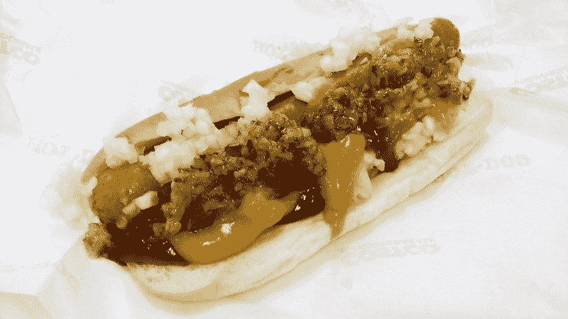

# 好市多赚钱机器还能撑多久？—市场疯人院

> 原文：<https://medium.datadriveninvestor.com/how-long-can-the-costco-money-machine-survive-market-mad-house-78cdd262f85c?source=collection_archive---------11----------------------->

好市多批发公司(NASDAQ: COST) 可能是世界上最赚钱的零售商。

例如，Statista 报告称，2019 年 11 月 30 日，782 家商店的季度收入为 370.4 亿美元。相比之下，**沃尔玛(纽约证券交易所:WMT)** 报告称，2019 年 10 月 31 日，全球 11，766 家门店的季度收入为 1279.91 亿美元。

事实上，好市多声称有 60 个仓库，年销售额超过 2.5 亿美元， *Investopedia* [报道](https://www.investopedia.com/stock-analysis/061915/how-much-does-costco-store-sell-each-year-cost.aspx)。此外，好市多声称有两个仓库，年销售额为 4 亿美元。

此外， *Investopedia* 估计，2018 年美国好市多商店的平均年销售额为 1.6 亿美元。相反，Statista [估计](https://www.statista.com/statistics/269775/costcos-average-sales-per-warehouse-worldwide/)全球好市多商店的平均年销售额为 1.76 亿美元。

# 好市多赚钱少了吗？

尽管成功了，好市多赚的钱却少了。为了解释这一点，好市多在 2019 年 11 月 30 日报告了 48.07 亿美元的季度毛利。然而，该季度毛利低于 2019 年 8 月 31 日的 61.88 亿美元。

此外，好市多的季度收入从 2019 年 8 月 31 日的 474.98 亿美元降至 2019 年 11 月 30 日的 370.4 亿美元。此外，好市多的季度共同净收入从 2019 年 8 月 31 日的 10.97 亿美元降至 2019 年 11 月 30 日的 8.44 亿美元。

然而，好市多批发公司的营业收入从 2019 年 8 月 31 日的 14.63 亿美元下降到 2019 年 11 月 30 日的 10.81 亿美元。此外，好市多的运营现金流从 2019 年 8 月 31 日的 22.93 亿美元降至 2019 年 11 月 30 日的 21.02 亿美元。

 [## 为什么包容性财富指数比 GDP 更能衡量社会进步？|数据驱动…

### 你不需要成为一个经济奇才或金融大师就能知道 GDP 的定义。即使你从未拿过 ECON 奖…

www.datadriveninvestor.com](https://www.datadriveninvestor.com/2019/03/08/why-inclusive-wealth-index-is-a-better-measure-of-societal-progress-than-gdp/) 

然而，好市多的期末现金从 2019 年 8 月 31 日的 13.71 亿美元上升至 2019 年 11 月 30 日的 90.27 亿美元。因此，好市多批发公司正在产生更多的现金，尽管它赚的钱少了。此外，好市多的期末现金从 2018 年 11 月 30 日的 67.78 亿美元增加到 2019 年 11 月 30 日的 90.27 亿美元。

# 杰夫·贝索斯的黑仔好市多:亚马逊 Prime

亚马逊 Prime 是好市多批发公司生存的最大威胁。解释一下，好市多通过出售订阅和提供低价锁定客户忠诚度来赚钱。

订阅迫使顾客在好市多购物，因为他们为此付费。好市多用低价奖励订阅持有者。

Prime 使用同样的商业模式；订阅和低价格，并增加了在家购物和免费两天送货的便利。因此，我认为杰夫·贝索斯把 Prime 设计成了一个好市多杀手。

事实上，作家布拉德·斯通声称，贝佐斯从好市多联合创始人吉姆·辛尼格尔那里获得了 Prime 会员系统的灵感。具体来说，Sinegal 在 2001 年喝咖啡的时候向贝佐斯解释了 Costco 的会员制度，Stone [在](https://bobmorris.biz/what-jeff-bezos-learned-from-jim-sinegal-founder-of-costco) [*The Everything Store:杰夫·贝索斯和亚马逊时代*](https://www.amazon.com/Everything-Store-Jeff-Bezos-Amazon/dp/0316219266/ref=sr_1_1?s=books&ie=UTF8&qid=1385639623&sr=1-1&keywords=the+everything+store+jeff+bezos+and+the+age+of+amazon) 的第四章写道。

“会员费是一次性的痛苦，但每当顾客走进来看到比其他地方便宜 200 美元的 47 英寸电视时，这种痛苦就会加剧，”吉姆·辛尼格尔说。“它强化了这个概念的价值。顾客知道他们会在好市多找到真正便宜的东西。”

因此，人们在亚马逊上购物，因为他们在那里找到便宜的东西。此外，**亚马逊(NASDAQ: AMZN)** 顾客需要通过在 Everything 商店购物来证明他们在 Prime 上花的钱是合理的。

# 亚马逊 Prime 对好市多

亚马逊声称 Prime 在 2019 年假日季吸引了超过 500 万新会员， *Quartz* [报道](https://qz.com/1775584/amazon-says-more-than-5-million-people-signed-up-for-prime-in-a-week/)。

然而，这些亚马逊新客户中有很大一部分开始免费试用 Prime。我认为这些顾客中的许多人会在完成假日购物后让 Prime 会员资格失效。

据《今日美国》 [报道，*全食超市和亚马逊生鲜的免费食品配送使 Prime 不断扩张。这项两小时的服务可以在超过 2000 个美国社区提供。*](https://www.usatoday.com/story/tech/2019/10/29/amazon-prime-members-now-get-free-food-delivery-whole-foods/2485468001/)

Statista [估计](https://www.statista.com/statistics/546894/number-of-amazon-prime-paying-members/)亚马逊 Prime 在 2019 年 6 月拥有 1.05 亿美国用户。相比之下，Statista [估计](https://www.statista.com/statistics/718406/costco-membership/)好市多在 2018 年全球拥有 9430 万会员。

因此，亚马逊 Prime 在一个国家(美国)的会员生态系统比整个好市多会员系统还要大。鉴于这些数字，我不得不怀疑好市多能否与亚马逊 Prime 竞争。

例如，亚马逊可以从订阅中赚到足够的钱，通过大幅打折来降低好市多的价格。此外，亚马逊本可以让 1.05 亿美国人在 Prime 购物。

# Costco 是价值投资吗？

2020 年 1 月 6 日，市场先生严重高估了好市多(Costco)的价值，达到每股 291.20 美元。所以我觉得 Costco 远不是一个价值投资。

然而，我相信好市多仍然是一个伟大的收入和股息股票在任何价格。事实上，好市多在 2019 年 10 月 31 日支付了 65₵股息。

总体而言，2020 年 1 月 6 日，好市多每股股票的股息收益率为 0.89%，年化股息为 2.60 美元，股息支付率为 31.75%。此外，Dividend.com[将 15 年的股息增长归功于好市多批发公司。](https://www.dividend.com/dividend-stocks/services/discount-variety-stores/cost-costco/)

归根结底，我认为好市多批发公司是一只你会从中赚钱的好股票。然而，好市多面临着与亚马逊 Prime 的死亡竞赛，这可能会摧毁其业务。

我建议人们不要买好市多，因为市场先生定价过高。然而，好市多仍然是一只值得持有的好股票，因为它的股息很高。

*原载于 2020 年 1 月 7 日 https://marketmadhouse.com***。**