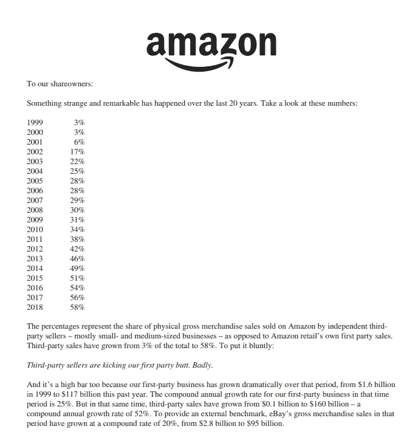
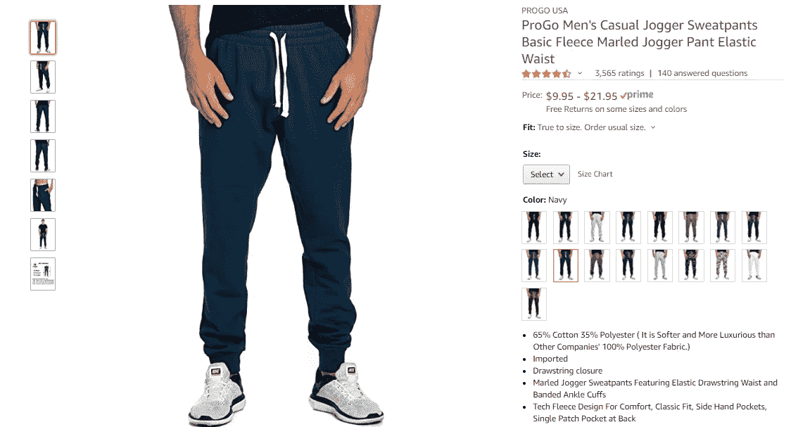
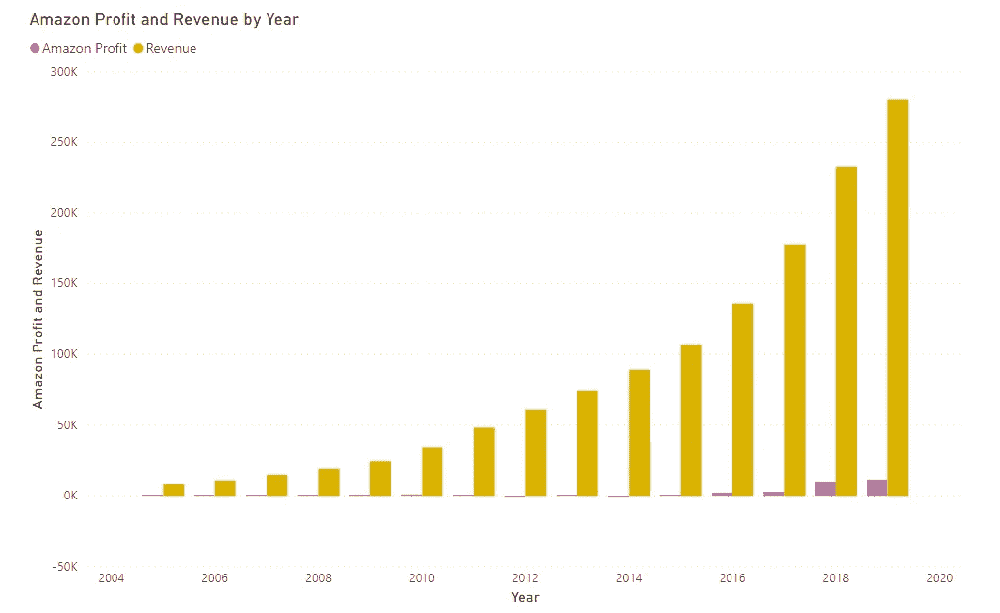
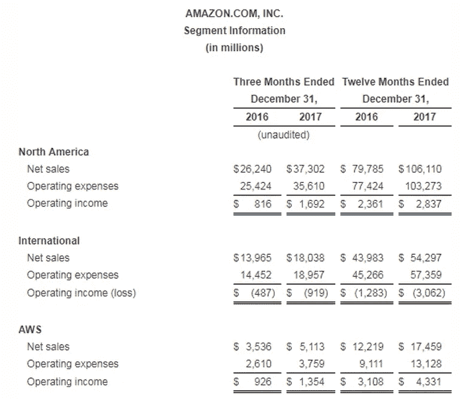

# 亚马逊从第三方卖家那里偷东西有多久了？

> 原文：<https://medium.datadriveninvestor.com/how-long-has-amazon-been-stealing-from-its-third-party-sellers-d81334fe6c6d?source=collection_archive---------1----------------------->

## 美国联邦贸易委员会、国会和司法部都很好奇

Source: Martin Lopez on [Pexels.](https://www.pexels.com/photo/woman-sitting-on-chair-2157191/)

2005 年底，亚马逊的销售收入为 90 亿美元。

到 2019 年底，这个数字现在是 2800 亿美元。

亚马逊在过去十年经历了无限的增长。亚马逊为创业者创建了创办微型企业的基础设施，让第三方卖家走向了世界。然而，这个基础设施和它的示意图是由亚马逊独自拥有的。在这种趋势下，亚马逊在后台默默成长，没有质疑也没有批评。

直到现在。

亚马逊以来自杰夫·贝索斯的这条消息开始了其 2018 年[年度报告](https://s2.q4cdn.com/299287126/files/doc_financials/annual/2018-Annual-Report.pdf):

Source: Amazon [2018 annual report](https://s2.q4cdn.com/299287126/files/doc_financials/annual/2018-Annual-Report.pdf).

贝佐斯明确表示。市场的增长归功于第三方卖家。更重要的是，他“直截了当”地说“第三方卖家正在踢我们第一方的屁股。厉害。”

这就是贝佐斯对亚马逊的评价；一个公平、一致、平等的市场，允许企业家接触渴望新产品的广大客户群。根据贝佐斯的说法，相比之下，亚马逊在销售自己的商品方面做得很糟糕。

 [## 数据驱动始于数据素养|数据驱动的投资者

### 光是听到“数据”这个词就令人生畏。老实说，只有 21%的全球员工对自己的工作充满信心

www.datadriveninvestor.com](https://www.datadriveninvestor.com/2020/03/22/data-driven-starts-with-data-literacy/) 

对于一个市场来说，提供自己的产品来代替它从分销商那里得到的品牌产品是很平常的。Ralphs 由 Kroger 所有，在其杂货店销售 Kroger 产品。好市多卖柯克兰。众所周知，自有品牌产品有助于提高利润率，并经常在利基领域与品牌产品竞争。

但克罗格和好市多不是亚马逊。

虽然贝佐斯对亚马逊作为自有品牌卖家的糟糕处境轻描淡写，但美国联邦贸易委员会和大多数第三方卖家并不认同这一观点。

亚马逊不是杂货店。它没有一个特别的东西可以卖。你可以购买任何东西，从当天送达的西红柿，到棺材，再到微型可建造房屋。[他们的网站每月也有超过 1.5 亿的顾客。](https://en.wikipedia.org/wiki/Amazon_(company)#Products_and_services)

在过去的几年里，亚马逊开始销售自己的品牌产品，从亚马逊基础和必需品到他们拥有的服装品牌，如 Goodthreads。

这是事情发生奇怪转折的地方。华尔街日报发表了一整篇文章，记录了亚马逊明显的欺诈行为。Amazon 保存了关于供应商、销售价格、产品和供应商信息的所有信息。然而，亚马逊否认他们窃取第三方卖家信息是为了在自己的市场上更好地竞争。

> 亚马逊副总法律顾问内特·萨顿(Nate Sutton)告诉国会，“(亚马逊)不直接使用个人卖家数据进行竞争”。

然而，根据亚马逊过去和现在的员工的说法，这是不正确的:

> “我们知道我们不应该这样做，但是，与此同时，我们正在制造亚马逊品牌的产品，我们希望它们能够畅销。”—前亚马逊员工

亚马逊既是市场运营商，也是卖家。除此之外，它的第三方卖家支付高额的广告费用，并为购买他们产品的顾客获得最高的搜索结果。亚马逊拥有所有这些信息，亚马逊拥有不受限制的权力来查看他们想要的任何一个拼图。他们可以看看哪里的利润率高，哪里的销量被推高，以及客户流量的趋势如何。关于亚马逊在自己的市场上销售自己的产品，有很多问题:首先，当你的卖家支付额外费用做广告，而市场运营商可以免费获得这些位置时，它是如何运作的？

实际上，这种情况有许多相关的问题:

1.  如果亚马逊可以从类似的分销商那里以更大的分销量销售同样的产品，那么是什么阻止了他们削弱自己的第三方卖家呢？如果你的销售毫无理由地开始下滑，你如何证明这一点？
2.  亚马逊存在于一个黑盒子里。如果他们只是删除代码，隐藏他们公然欺骗和窃取第三方卖家的事实，会发生什么？
3.  亚马逊卖他们想要的任何东西。他们所做的大部分都是秘密的，在网上进行的。[你能在什么时候证明他们滥用了他们的规模和权力？](https://www.natlawreview.com/article/amazon-wins-ruling-results-searches-brands-it-doesn-t-sell)
4.  当亚马逊意识到它不再需要为第三方卖家的产品做广告，因为它可以通过销售自己的产品和放弃广告收入来赚更多的钱时，会发生什么？

亚马逊想要成为自己平台上的卖家，这就产生了很多开放式的鸿沟。美国联邦贸易委员会、国会和司法部都已经开始独立调查像亚马逊这样的公司在市场上的绝对支配地位。

在《华尔街日报》的文章中，他们描述了亚马逊如何推出了一款与已经销售的行李箱极其相似的行李箱。最奇怪的是，在那个时候，第三方卖家几乎占据了亚马逊所有的行李箱包销售。然而，唯一开始与他们竞争的人是亚马逊自己。

我在自己的一些项目中看到过这一点。我喜欢通过第三方卖家 ProGo USA 从亚马逊购买一条运动裤。他们在亚马逊和易贝上都有卖。然而，在购买了这个项目几年后，我开始注意到亚马逊在亚马逊必需品下发布了自己的产品。

Joggers I purchase on Amazon through third-party, [ProGo USA](https://www.amazon.com/Sweatpants-Elastic-X-Large-Charcoal-Slanted/dp/B07BGFV6CG/ref=sr_1_1?dchild=1&keywords=jogger+progo&qid=1591311925&sr=8-1).

[Amazon’s own jogger](https://www.amazon.com/Amazon-Essentials-Womens-Standard-Sweatpants/dp/B07BJ8GJJ4/ref=sr_1_2?dchild=1&keywords=jogger%2Bamazon&qid=1591311945&sr=8-2&th=1), released a year or two after I began purchasing ProGo’s.

亚马逊曾经为男士提供这种慢跑者。但是，我规定他们把它改成女性，因为他们希望能够区分产品，如果他们被发现直接偷窃，他们会有一个防御。

当你仔细观察这两个慢跑者时，你会发现他们是一样的:

1.  它们都有三个横跨腰线的水平铆钉。
2.  他们都有同样的袖口在底部关闭。
3.  拉绳是相同的，并且设计相同。
4.  材料是一样的。
5.  针脚是一样的。

有太多的事情太相似了，不可能是巧合。

有一点不同:女子慢跑者背后没有口袋。但这个产品是我亲自看到的一个演变，即使我再也找不到男子慢跑。以前是一模一样的产品，抄袭。

正如我在上面指出的，亚马逊很容易否认它在自己的市场上从成功的卖家那里窃取利润，因为它看到了高利润。我敢肯定，如果这篇文章被亚马逊团队发现，我上图中的产品也会被删除。

这就是问题的实质。他们可以为所欲为，因为如果证据立即被删除，就不会有证据。

Amazon’s net income (noted in millions), 2004–2020\. Source: [Amazon Investor Relations](https://ir.aboutamazon.com/overview/default.aspx).

这些是亚马逊的净收入数字。这告诉你他们每年赚了多少利润。注意，在 2012 年和 2014 年，他们没有赚钱。那些年，他们负债累累。

如果我们加上那几年的收入，情况看起来就更奇怪了。

Amazon’s net income and revenues (noted in millions), 2004–2020\. Source: [Amazon Investor Relations](https://ir.aboutamazon.com/overview/default.aspx).

从营收数据可以明显看出，亚马逊在过去 20 年里有了相当大的增长。然而，不太清楚为什么他们在过去的三年里只有真正的利润。

直到你开始研究亚马逊网络服务:

Source: [Amazon Investor Relations](https://ir.aboutamazon.com/overview/default.aspx).

我们清楚地看到，亚马逊网络服务约占公司总销售额的 10%,但占总营业收入的 70 %- 80%。

这一点很重要:第三方卖家本质上已经付钱给亚马逊，让它把他们的产品放在搜索页面的顶端好几年了。这给亚马逊带来了可观的利润，主要是因为每个月都有数亿客户搜索亚马逊。

他们的数字房地产的租金极其昂贵。

但这种说法与贝佐斯一开始发出的信息背道而驰。他告诉股东们，“第三方卖家”正在踢他们的屁股。

亚马逊是一个反资本主义的伟大故事。第三方卖家并没有打败亚马逊。第三方卖家正在补贴亚马逊最终销售自己产品的真实计划。如果亚马逊正在销售近 3000 亿美元的非自有产品，并且几乎没有盈利，那么最终缺少的就是为第三方卖家提供一个平台。最终目标是创造一个所有产品都是他们自己的场所。

而且，亚马逊拥有这样做的所有数据和所有工具。有了一个由卖家发展起来的市场和一个非常受欢迎的数字景观，没有什么可以阻挡他们慢慢刷掉第三方卖家并开始从他们的成功中获利。他们没有与第三方卖家竞争。事实上，绝不应该允许亚马逊在自己的平台上销售。这与整个商业平台背道而驰，破坏了实际竞争的效率和结构。一个通过榨干建立市场的卖家来欺骗系统的市场所有者，不是资本主义的胜利。

这是法律组织和销售者就反垄断违法行为进行的许多对话的核心。

以下是 Dana Mattioli 在《华尔街日报》上所说的话:

> 这家在线零售巨头长期以来一直声称，包括向国会声称，当它制造和销售自己的产品时，它不会使用从网站的第三方卖家那里收集的信息——这些卖家认为这些数据是专有的。
> 
> 然而，对亚马逊自有品牌业务 20 多名前员工的采访以及华尔街日报查阅的文件显示，员工们正是这么做的。据知情人士透露，这些信息可以帮助亚马逊决定如何为一件商品定价，复制哪些功能，或者是否根据其盈利潜力进入一个产品细分市场，包括一名现任员工和一些参与其中的前员工。

我会更进一步。我并不是认为亚马逊不应该销售他们自己的产品。那就是他们绝对不应该销售自己的产品。在一个如此松散的数字化、变化和修改的世界里，规则制定者成为了市场制定者、市场所有者、法官和陪审团，这种情况需要被制止。他们控制了美国 50%的电子商务销售额。

亚马逊不会死，因为不允许他们卖自己的产品。他们肯定会损失很多估值，而且，他们应该这么做。他们现在在市场上有一系列明显的问题，包括:

1.  假冒产品。
2.  盗窃。
3.  平台上 50 万第三方卖家的管理。
4.  一个现实的方法来阻止一家收入 3000 亿美元却亏损经营的公司的出血。
5.  无法经营一家没有网络服务补贴的公司。

这些话题中有很多都没有在任何媒体上讨论过。然而，在我看来，这是十年来亏损的主要原因。

这是贝佐斯致股东的年度信中的另一个关键部分:

> 为什么独立卖家在亚马逊比在易贝卖得好得多？为什么独立卖家能够比亚马逊自己高度组织化的第一方销售组织发展得更快？
> 
> 没有唯一的答案，但我们知道答案的一个极其重要的部分:我们帮助独立卖家与我们的第一方业务竞争，投资并向他们提供我们可以想象和制造的最好的销售工具。有许多这样的工具，包括帮助卖家管理库存、处理支付、跟踪货运、创建报告和跨境销售的工具——我们每年都在发明更多的工具。但最重要的是亚马逊和 Prime 会员计划的履行。结合起来，这两个计划有意义地改善了从独立卖家购买的客户体验。随着这两个项目的成功，大多数人现在很难完全理解这两个产品在我们推出时是多么的激进。我们冒着巨大的财务风险，并在经过大量内部辩论后，投资了这两个项目。随着时间的推移，我们必须继续大量投资，尝试不同的想法和迭代。我们无法肯定地预见这些项目最终会是什么样子，更不用说它们是否会成功，但它们被直觉和内心所推动，并被乐观所滋养。

尽管任何人都可能愿意相信亚马逊帮助其第三方卖家，但任何针对第三方卖家的调查都会说这不是真的。亚马逊做得比易贝好，并不是因为它为企业家提供了更好的工具——相反，这是因为世界上所有的客户都希望免费的两天送货和快速履行。Ebay 没有这些，因为易贝实际上是一家稳定的公司，带来稳定的利润；另一方面，如果没有网络服务，亚马逊很难生存下去。

如果贝佐斯所说的毫无疑问是真实的，那么国会、司法部和美国联邦贸易委员会都不会调查亚马逊与其第三方卖家之间相互作用的性质。

它肯定不会关注那些承认亚马逊内部的做法极其违法的前员工。

## 访问专家视图— [订阅 DDI 英特尔](https://datadriveninvestor.com/ddi-intel)