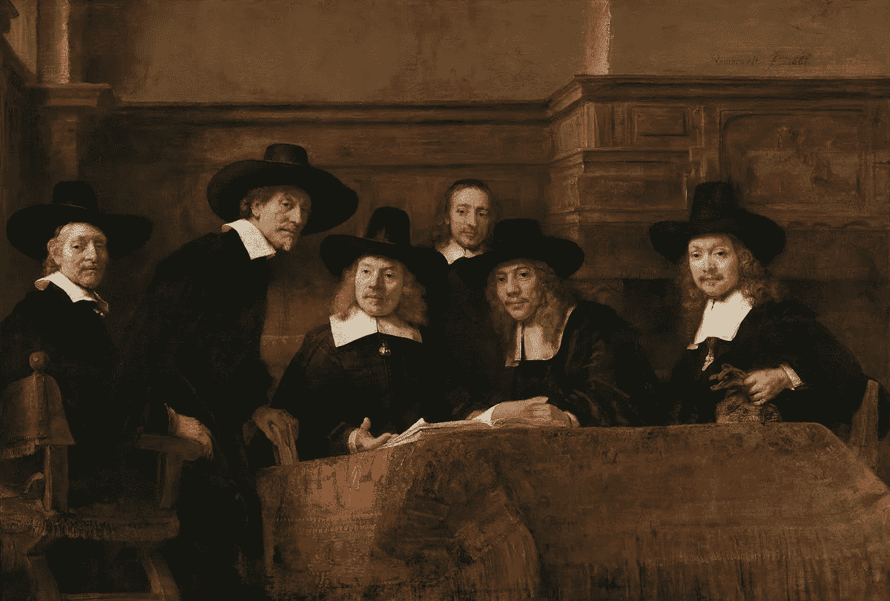

# 如何看待艺术能让你成为一个更好的思考者、沟通者和领导者

> 原文：<https://medium.datadriveninvestor.com/how-looking-at-art-can-make-you-a-better-thinker-communicator-and-leader-a1a231bfb7e6?source=collection_archive---------13----------------------->

> “真是壮观的景象！一家大型保守金融服务公司的十几名高管坐在一幅画前的地板上，谈论着这幅画可能意味着什么，以及他们为什么会这么想。

在一个典型的沉闷的 11 月的一天，我和[紫苏](https://www.futuresuzi.com/)坐在波斯顿美术博物馆的咖啡馆里。她刚刚辞去了在富达投资公司(Fidelity Investments)担任设计思维主管的工作，我正在休假，然后才决定自己职业生涯的下一步。在一位共同的朋友的介绍下，我们决定在午餐时交流故事，并参观博物馆的一个特别展览。

她描述了她最近主持的一次视觉思维(VTS)会议，以及它对高管们表达自己和相互沟通的方式产生的几乎是立竿见影的影响。她看到他们参与到创造性解决问题和批判性思考的水平中，这是他们过去所没有的。

出于好奇，我开始了解更多。我发现了一个强大的、经过验证的、令人**惊叹的**有趣的方法，来帮助我的客户度过创新的模糊早期，并拥抱他们内心的好奇心和创造力。

## **您为什么应该关注 VTS？**

想象一下，有人对你说，“如果你和你的团队每个月花 1-2 小时和我在一起，持续 9 个月，我保证你在以下方面的能力会有所提高:

*   通过深入倾听和重新表述他们听到的内容，快速收集和综合准确和独特的见解，确保理解
*   通过从各个角度检查信息或想法，重新思考它，并决定是否保留、修改或丢弃它，进行批判性和创造性的思考
*   与组织内外的各种人进行更清晰、更尊重、更有成效的沟通
*   跨职能工作，因为他们可以自信地将批判性思维技能应用于专业知识之外的主题
*   创新和试验，因为他们已经学会了如何在不确定的情况下单独或团队运作
*   通过将批评表述为问题，参与协作发现和解决问题的对话，提供更有效的反馈

你会做出时间承诺吗？

现在，如果他们说，“你每个月所要做的就是一起坐在会议室里，参与一场对话。没有旅行。没有额外费用。关掉你的电子邮件和手机一个小时，在你已经付过房租的房间里进行对话。”

那你会做吗？

你当然会。

因为你参加的培训只关注上面列表中的一项，这些培训既昂贵又耗时，而且远没有达到应有的效果。

## **什么是视觉思维策略(VTS)？**

根据这本书， [*视觉思维策略:使用艺术来深化跨学校学科的学习*](https://www.amazon.com/Visual-Thinking-Strategies-Learning-Disciplines/dp/1612506097) *，* VTS“使用艺术来教授视觉素养、思维和沟通技巧——倾听和表达自己。”

从 1983 年到 1993 年，Philip Yenawine 是 MOMA 现代艺术博物馆的教育主管。在那段时间里，他注意到，尽管博物馆努力为每件艺术品组织和制作详细的解释和说明，但参观者仍然会问很多“为什么？”问题，并会记得很少，如果有的话，从他们的访问。

沮丧但又好奇的是，他和他的团队开始研究发展研究和理论，发现 MOMA 游客需要的不是解释、细节和事实，而是“困惑和思考的许可”。同意使用他们强大的眼睛和聪明的头脑。是时候面对和解决问题了。用他们已经知道的去思考他们不知道的；学习的第一步。”

Philip 和他的团队与 MOMA 和认知心理学家 Abigail Housen 合作开发并测试了一种现在被称为视觉思维策略(VTS)的过程。

自从他们最初的实验以来的 30 年中，Philip 和 Abigail 的工作已经在 28 个国家和 58 个博物馆中使用，超过 12，000 名学生参与了 VTS 讨论，1，200 人已经成为训练有素的主持人。

## **如何做 VTS**

VTS 有效性的秘密在于引导，所以如果你要这样做，投资一个专家引导。专家主持人是获得上述结果的唯一途径。

**VTS 会话的工作原理如下:**

*   辅导员分享一件特别挑选的艺术品，以便“主题是熟悉的…但也包含神秘的元素。”
*   与会者花一分钟时间静静地专注于艺术
*   主持人在一个小时内问了 3 个问题:(1)这幅图中发生了什么？(2)你看到了什么让你这么说？(3)你还能找到什么？
*   当每个人回答一个问题时，主持人指出正在观察的东西，解释已经说过的话，并将已经说过的话与其他人说过的话联系起来
*   主持人通过感谢每个人并分享他/她从倾听中学到的东西来结束本次会议。他们没有给出“答案”，因为“这不是关于对与错，而是关于思考……学生们单独或一起都有能力提出美妙的、有根据的想法。”

就是这样——1 件艺术品，3 个问题，如果你致力于这个过程，至少有 5 个主要好处。

**这似乎是一件值得坐在美术馆地板上欣赏的事情，对吗？**

要了解更多信息，请阅读 Philip Yenawine 的 [*视觉思维策略:利用艺术深化跨学校学科的学习*](https://www.amazon.com/Visual-Thinking-Strategies-Learning-Disciplines/dp/1612506097) 并访问网站[视觉思维策略](https://vtshome.org/)

*Robyn M. Bolton 是 MileZero 的创始人兼首席导航员，她与大型组织的高管合作，超越创新理论和戏剧，以释放组织的潜力，创造真正的变化，并获得真正的结果。你可以在*[*www . mile zero . io*](http://www.milezero.io)阅读更多关于她和她的作品

*原载于 2020 年 6 月 10 日*[*https://www . mile zero . io*](https://www.milezero.io/2020/06/10/looking-at-art-vts/)*。*