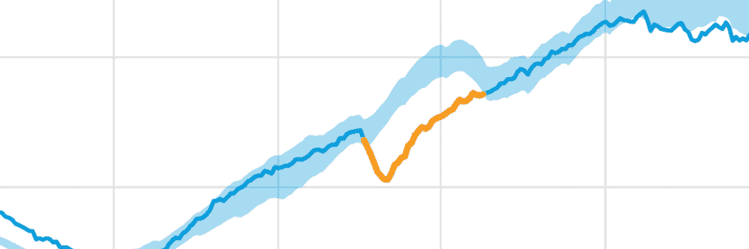
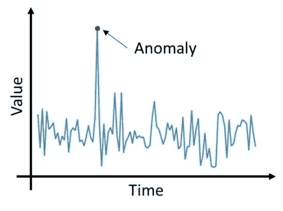
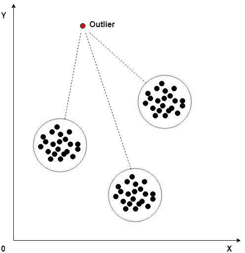

# 机器学习如何实现异常检测

> 原文：<https://medium.datadriveninvestor.com/how-machine-learning-can-enable-anomaly-detection-eed9286c5306?source=collection_archive---------0----------------------->

作为人类，我们的大脑总是能够发现一些“正常”或“平常”的东西。简而言之，一些不符合通常模式的异常现象。随着数据的大量增长，数据科学工具也在寻找不符合正常数据流的异常情况。例如，“异常高”的登录尝试次数可能意味着潜在的网络攻击，或者信用卡交易在短时间内大幅增加可能是信用卡欺诈。

 [## 金融中的机器学习|数据驱动的投资者

### 在我们讲述一些机器学习金融应用之前，我们先来了解一下什么是机器学习。机器…

www.datadriveninvestor.com](https://www.datadriveninvestor.com/2019/02/08/machine-learning-in-finance/) 

与此同时，面对来自各种来源的连续非结构化数据流，检测异常也有其自身的挑战。挑战的一个例子是假设大部分信用卡交易是合法和正当的，同时在一些交易中寻找超出“正常”范围的主要偏差。

由于各种深度学习技术的发展，使用机器学习(或 ML)的异常检测是当今实用的解决方案。[可以部署机器学习](https://www.countants.com/services/machine-learning/?utm_medium=social&utm_source=Medium&utm_campaign=traffic)算法来定义正常的数据模式，并使用 ML 模型来发现偏差或异常。

那么，作为一名数据分析师，如何利用机器学习实现异常检测呢？以及使用深度学习技术进行异常检测的方法和好处是什么？让我们在接下来的部分中回答这些问题以及更多的问题。

# 什么是异常检测？

[异常检测](https://www.kdnuggets.com/2019/10/anomaly-detection-explained.html)也称为异常值检测，是简单地检测和识别任何基于数据的事件或观察中与其余数据有很大不同的异常数据的模式。异常数据对于检测罕见的数据模式或潜在问题(以金融欺诈、医疗状况甚至设备故障的形式出现)至关重要。

你如何着手检测数据中的异常？让我们借助一个使用两个变量(X & Y)的异常检测用例来检验这一点。考虑以下绘制 X 和 Y 变量的可视化数据。

根据右侧绘制的图表考虑这两个变量的数据模式。基于这些数据点，不可能检测到任何异常(或异常值)。然而，当这两个变量相互对应时(如左图所示)，我们可以清楚地发现异常。

这是否给我们带来了一个问题:为什么在异常检测中需要机器学习？如果你在现实生活场景中绘制的不是两个而是数百个这样的变量，那么探测异常是非常具有挑战性的。

机器学习如何帮助离群值分析？让我们在下一节讨论这个问题。

# 机器学习和异常值分析

离群值是指明显偏离其余数据点的任何数据对象或数据点。在数据挖掘中，离群值通常作为异常或简单的噪声被丢弃。然而，在异常检测中不能做同样的事情，因此强调异常值分析。

使用机器学习执行异常检测的一个例子是 K 均值聚类方法。该方法用于根据异常值与最近聚类的标绘距离来检测异常值。

K-means 聚类方法包括形成多个数据点的聚类，每个聚类都有一个平均值。聚类中的对象具有最接近的平均值。阈值大于最近的聚类平均值的任何对象都被识别为异常值。下面是 K-means 聚类中使用的逐步方法:

1.  计算每个聚类的平均值。
2.  设置初始阈值。
3.  在测试过程中，确定每个数据点与平均值的距离。
4.  确定离测试数据点最近的分类。
5.  如果“距离”值大于“阈值”，则将其标记为异常值。

接下来，让我们看看使用机器学习执行异常检测的一些其他方法。

# 异常检测方法

基于不同的机器学习算法，异常检测方法主要分为以下两类

## 监督方法。

顾名思义，这种异常检测方法要求存在包含正常和异常数据点的标记数据集。监督方法的例子包括使用神经网络、贝叶斯网络和 K-最近邻(或 k-NN)方法的异常检测。

监督方法提供了更高的异常检测率，因为它们能够对变量之间的任何相互依赖性进行编码，并在任何预测模型中包括以前的数据。

## 无监督方法

无监督的异常检测方法不依赖于任何带有人工标记的训练数据。这些方法基于统计假设，即大部分流入数据是正常的，只有一小部分是异常数据。这些方法还估计任何恶意数据在统计上将不同于正常数据。一些无监督的方法包括 K-means 方法、自动编码器和基于假设的分析。

在接下来的部分中，我们将看看使用机器学习进行异常检测的一些商业好处。

# 异常检测—业务优势

使用机器学习的能力，异常检测在商业操作的不同领域中具有实际应用和益处。异常检测介质的一些优势包括:

## 入侵检测

任何可能破坏信息系统的恶意活动都可以大致归类为入侵。异常检测可以有效地检测和解决任何类型的入侵。常见的以数据为中心的入侵包括网络攻击、数据泄露甚至数据缺陷。

## 移动传感器数据

使用机器学习的异常检测的另一个好处是在收集和分析移动传感器数据的领域。物联网设备的日益普及以及通过移动传感器获取数据的成本降低无疑推动了这一趋势。

例如，一个特定的行业案例研究是关于 [IBM Data Science Experience](https://towardsdatascience.com/anomaly-detection-in-mobile-sensor-data-48ef62d0f7fc) 开发了一个使用 Jupyter Notebook 进行异常检测的工具，用于从手机和连接的物联网设备中捕获传感器数据。

## 网络服务器或应用程序故障

无论是移动应用还是网络故障，性能的突然下降都会影响任何业务。想要检测失败的服务器请求数量的突然增加吗？**异常检测**在 **Python** 编程中的代码可以用来检测你网络上的任何故障服务器。

此外，异常检测可以为您提供任何可以识别问题根本原因的支持性数据。

## 统计过程控制

统计过程控制(SPC)是制造过程中常见的质量标准。产品或过程测量的质量相关数据在生产运行过程中检索，并绘制在图表上，以监控数据是否在配置的控制限值内。

部署异常检测是为了检查是否有任何数据超出控制限制，并确定根本原因。简而言之，SPC 中的异常检测可用于检测生产过程中出现的任何产品变化或任何需要立即解决的问题。

# 结论

[机器学习](https://www.countants.com/blogs/leveraging-machine-learning-in-text-to-speech-tools-and-applications/?utm_medium=social&utm_source=Medium&utm_campaign=traffic)和深度学习技术的未来发展只会增加异常检测技术的范围及其对业务数据的价值。不断增长的数据量和复杂性转化为利用这些信息取得业务成功的重大机遇。

自成立以来，Countants 已为其全球客户掌握了人工智能和机器学习领域的深度学习解决方案。如果你已经投资了像 [Python](https://www.python.org/) 或 [Jupyter Noteboo](https://jupyter.org/) k 这样的机器学习工具，那么我们可以帮助你从异常检测方法中建立业务杠杆。请访问我们的[网站](https://www.countants.com/?utm_medium=social&utm_source=Medium&utm_campaign=traffic)或[联系我们](https://www.countants.com/contact-us/?utm_medium=social&utm_source=Medium&utm_campaign=traffic)咨询您的数据相关问题。