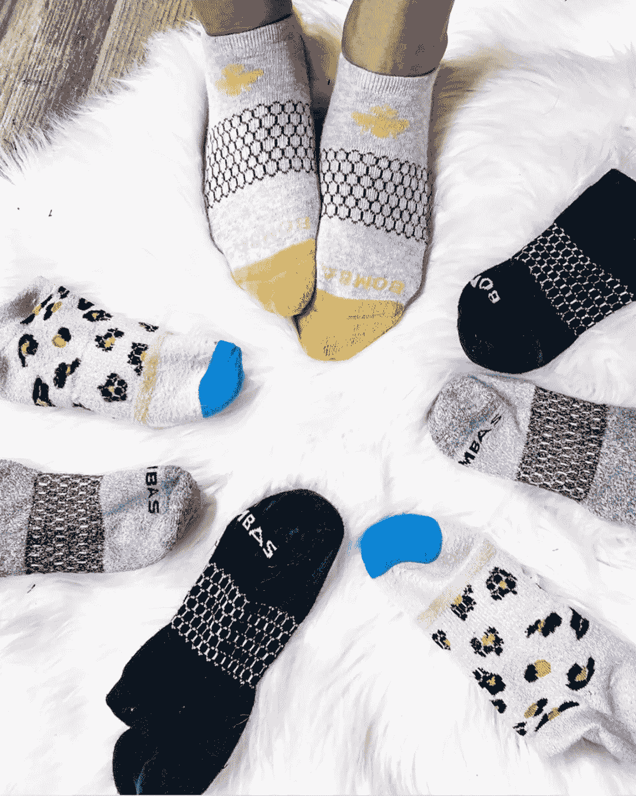
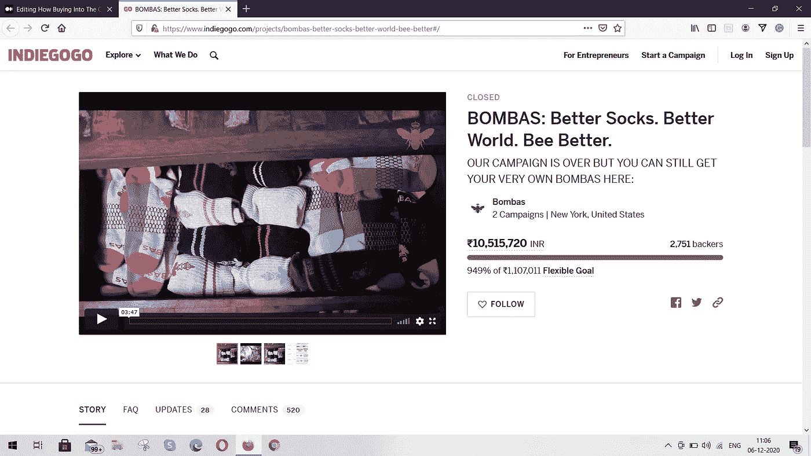
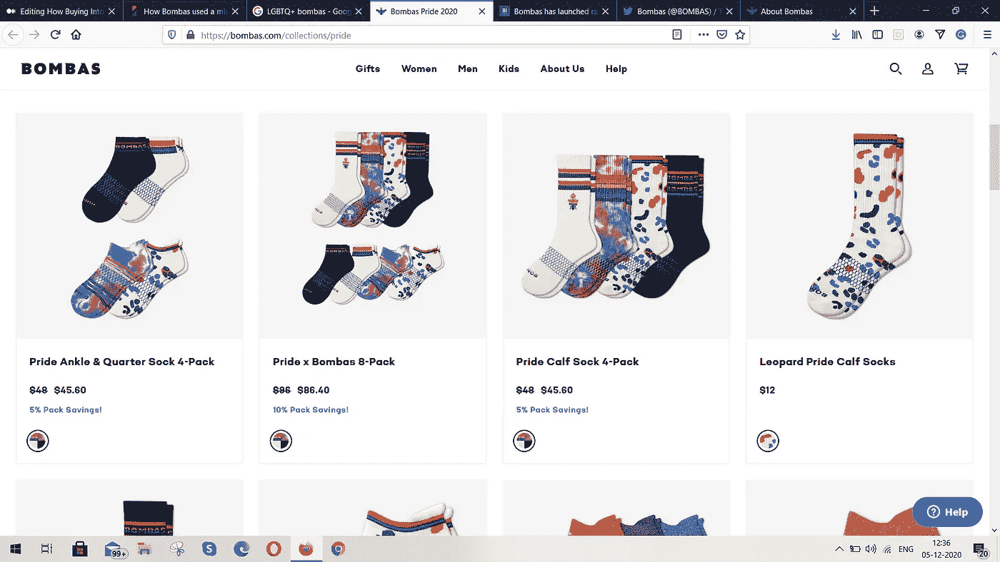
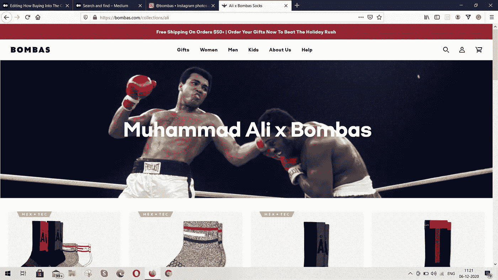
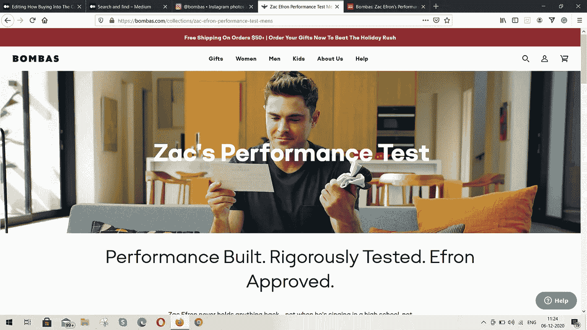

# 如何让人们购买这项事业帮助 Bombas 卖出了 4000 万双袜子

> 原文：<https://medium.datadriveninvestor.com/how-making-people-buy-into-the-cause-has-helped-bombas-sell-40-million-pair-of-socks-3699fe45c67d?source=collection_archive---------11----------------------->

## 仅用 30 个月就完成了他们十年的商业目标

Bombas Socks (Source: [Instagram](https://www.instagram.com/p/CFmorkmF0oj/))

谁会想到一家袜子公司可以通过销售袜子筹集到百万美元,[可以创造数百万美元的收入。](https://medium.com/better-marketing/this-20-year-old-makes-over-1-million-by-selling-custom-dog-socks-dad6f981f649)

Bombas 的创始人兰迪·戈德堡和大卫·希斯肩负着一个愿景。

这一切都是从他们读到脸书的一句名言开始的，

> 袜子是无家可归者收容所最需要的衣物。

看完这篇文章后，他们想把袜子捐给这些无家可归者收容所。他们最初的目标/梦想是捐赠 100 万只袜子。

他们认为这是一个机会，他们想通过推出超级舒适和超级可靠的袜子来打开袜子市场。

2010 年，他们在一个合作办公室工作，不想马上开始一个[新业务](https://medium.com/passive-incomers/step-by-step-guide-to-come-up-with-a-million-dollar-business-idea-459867027ead)。

因此，他们花时间分析、开发和设计了一双比普通袜子好十倍的新袜子。

> 为什么他们设计和开发了一双新袜子？

这一点显而易见，因为袜子是服装区唯一的东西，几十年来从未改变过。所以去找袜子感觉是对的，也确实是正确的事情。

# Bombas 是如何开始并从未安定下来的

2013 年是 Bombas socks 正式上市的年份。但是实际的工作和推出这些袜子的努力要追溯到很久以前。

戈德堡和希斯想要帮助无家可归的社区，满足他们的要求，同时，他们想把这个消息传播出去。

Bombas 成为帮助那些无家可归者庇护所的方式，每卖出一双袜子就捐赠一双袜子成为他们的使命。

为了捐赠袜子，他们必须先卖出很多。所以他们生产和销售比现在/普通袜子更好的袜子。

健康杂志告诉福布斯杂志，

> 我们花了两年多的时间进行研发，以改善商品化产品的所有方面——从鞋头接缝和所用材料，到足弓支撑以及袜子的穿着和洗涤方式。

2013 年推出的袜子经过了有效的设计、开发，并分发给最终用户。

卖出他们的第一大批袜子。Bombas 在 Indiegogo 上发起了一场众筹活动，销售额超过 145，000 美元。

Bombas Campaign on Indiegogo (Screenshot by Author)

作为一个品牌，Bombas 尝到了最初的成功。从那时起，他们没有回头看，而且[看起来也从来没有在他们成功的旅程中跌倒过](https://medium.com/swlh/under-pressure-how-instant-pot-built-a-billion-dollar-empire-c216228bb8a2?source=search_popover-------------------------------------)。

2014 年，Bombas 进入了鲨鱼池，他们的游说为他们赢得了与 FUBU 创始人兼首席执行官 Daymond John 的一笔甜蜜交易。

> 进入袜子市场五年内， [Bombas](https://www.inc.com/magazine/201906/kimberly-weisul/bombas-socks-low-turnover-emergency-fund-best-workplaces-2019.html) 的收入超过 1 亿美元，他们捐赠了超过 1000 万双袜子。

# Bombas 成为 1 亿美元品牌的秘密

我们来看看 Bombas 的商业模式和品牌战略。一切看起来都很简单，很容易分析。值得一提的是，Bombas 作为一个品牌，在很大程度上依赖于基于使命的营销策略。

> 这意味着他们的整个品牌形象和销售目的都致力于向无家可归者收容所捐赠袜子的使命。

让我向您介绍一下他们取得如此成功的一些战略、战术和方法。

 [## 规划和建立您的房地产业务|数据驱动的投资者

### 房地产行业是有史以来最受欢迎的五大职业之一。原因很简单。它确实…

www.datadriveninvestor.com](https://www.datadriveninvestor.com/2020/12/14/plan-and-build-your-real-estate-business/) 

## 建立价值观品牌

Bombas 已经成功地建立了一个单一产品的电子商务商店，但随着时间的推移，他们正在推出多种 t 恤，并寻求加入其他垂直市场。

但无论他们卖什么，Bombas 都与社会使命联系在一起，人们不会停止从他们那里购买。

为什么？

因为当他们的[购买与一个好的原因](https://www.consumerreports.org/cro/magazine/2014/12/a-donation-with-purchase-might-not-be-the-best-way-to-support-a-charity/index.htm)联系在一起时，人们感觉很好，这有助于对社会产生积极的影响。

> 简而言之，他们的购买体验变得更加令人满意和有价值。

Bombas 从来不会在桌子上留下一张卡片来展示他们的社会和环境承诺。

> 一个这样的例子是 Bombas 推出了它的骄傲系列。

袜子是为了庆祝 LGBTQ+骄傲月而推出的，Bombas 说要把所有袜子的 40%捐给 LGBTQ 青少年无家可归者收容所。

Bombas PRIDE Collection (Screenshot)

> Bombas 建立了一个价值观品牌，展示了他们对多个社区和人民的爱，从而为人类的美好事业做出了贡献。

## 设计一个有影响力的产品

两位联合创始人都知道，这些袜子对住在收容所的人来说是多么重要。

而不是生产和销售袜子。他们致力于提高袜子在恶劣环境中使用时的耐用性和性能。

> 换句话说，他们想制造和设计比普通袜子更可持续、更舒适的袜子。

所以他们没有马上推出袜子。他们花了两年时间提出这个想法。

最终在 2013 年，他们推出了这样的袜子

*   **由超长绒棉和美利奴羊毛等环保可持续材料制成**。
*   **设计用于获得支撑和舒适**。*例如*，袜子上的蜂窝结构支撑着中脚，帮助它抓住脚。
*   多种设计的智能袜子非常适合**日常装扮和各行各业**。马拉松运动员、日常皮条客和户外运动者喜欢穿这种袜子。

到 2013 年 Bombas 首次出现在市场上时。没有其他袜子品牌能与他们竞争。尤其是在设计一双袜子的研究和技术方面。

各行各业的顾客开始购买 Bombas 是为了它的社会使命，产品本身就是不可抗拒的。

> 很快，Bombas 的影响在普通人身上看到了，他们开始抛弃统治市场几十年的旧祖母袜。

## 新的 collabs =较新的样式

在短短的 7 年时间里，Bombas 已经能够与名人和传奇偶像进行多次合作。每一次合作都是为了推出一种新款式的袜子，这种新款式的袜子在保持其社会使命不变的情况下献给个人。

如果你在社交媒体上关注过 Bombas。然后你就会知道，一般来说，Bombas 时不时会推出一双新袜子。

每一次新的合作都有助于他们在自己的武器库中增加一种新的袜子。

除了新的设计和风格，该品牌过去常常在新闻中获得大量炒作和关注。对他们有利的是，Bombas 迅速利用其合作作为其社交媒体手柄的推广策略。

这里值得一提的一些合作有

*   穆罕默德·阿里 x·邦巴斯

这种合作使 Bombas 展示了他们与运动员的联系。穆罕默德·阿里 x Bombas 系列从阿里的名言和图片中汲取灵感。

Muhammad Ali x Bombas collection

> 该系列展示了穆罕默德·阿里的遗产和他对社会的贡献。

这次合作后，Bombas as 品牌开始与运动员联系在一起，人们开始注意到穿着他们的袜子进行户外活动。

*   **扎克的性能测试**

今年早些时候，扎克·埃夫隆与 Bombas 的合作导致了最酷的广告活动之一。自 2017 年以来，该品牌与扎克·埃夫隆保持着良好的关系。

在这个特别的活动中，扎克·埃夫隆被要求在他一整天的活动中测试邦巴斯的袜子。从跑步到打高尔夫，甚至在他的跑步日穿着它们，Zac 都穿着这种袜子，并测试它的可持续性。

Zac’s Performance Test (Screenshot)

最后，Efron 说 socks 成功地通过了所有的测试。

目前，Bombas 已经在[捐赠了超过 4000 万双袜子](https://bombas.com/pages/giving-back)，并表示将在全国范围内捐赠更多。

Bombas 以使命为基础的品牌发展和营销方法是一个极好的例子*,说明了一个有着良好的社会公益事业和合适的产品销售的品牌将永远繁荣发展*。

这些年来，他们坚持自己的[真实品牌](https://medium.com/better-marketing/how-supreme-built-a-billion-dollar-brand-with-zero-paid-advertising-2bade70950cc)和有目的的营销。

只要品牌保持其完整性和社会抵押品。没有任何障碍可以阻止人们相信(或)脱离这个品牌。

## 访问专家视图— [订阅 DDI 英特尔](https://datadriveninvestor.com/ddi-intel)