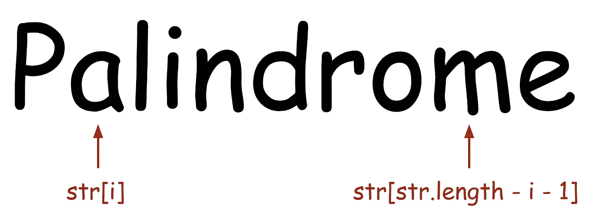

# 你能回答多少个 JavaScript 测验？

> 原文：<https://medium.datadriveninvestor.com/how-many-javascript-quizzes-can-you-answer-to-6a341ad3349e?source=collection_archive---------5----------------------->

## 你可能会在面试中被要求回答！


Photo by [Olav Ahrens Røtne](https://unsplash.com/@olav_ahrens?utm_source=medium&utm_medium=referral) on [Unsplash](https://unsplash.com?utm_source=medium&utm_medium=referral)

# Q1)按正确的顺序打印数字

```
for (var i = 1; i <= 10; i += 1) {
  setTimeout(function() {
    console.log(i);
  }, i * 1000);
}// prints 10 10 10 10 10 10 ... 10
```

这个打印 10 秒钟 10 个 10。你应该按升序打印这些数字。

# Q2)写一个函数，可以告诉你输入是否是一个回文

您可以假设输入总是字符串类型的值。

回文是一个字符串，当它被反转时应该是一样的。例如，“番茄”不是回文，因为它的反过来是“otamot”。但是，“yay”是回文，因为它反过来的字符串还是“yay”。

```
function checkPalindrome(str) {}
```

# Q3)使用 JavaScript 数组创建一个堆栈，其中包含 C++中的函数

C++语言的栈的引用是[这里是](http://www.cplusplus.com/reference/stack/stack/?kw=stack)。

实现所有的函数是相当多的工作，你可以写几个函数。

*   推入:将一个值推入堆栈
*   从堆栈中取出一个值
*   empty:从堆栈中删除所有值
*   top:从栈顶读取一个值，但是不能取出这个值

```
const queue = [];
```

不使用 Array.prototype 中的本机函数`push`或`pop`来尝试一下。

# Q4)编写一个管道函数

```
function add5(x) {
  return x + 5;
}function mul10(x) {
  return x * 10;
}pipe(
  add5,
  mul10,
  add5
)(5);
// The result is 105
```

# Q5)编写一个睡眠函数

```
function sleep(t) {}await sleep(1000);
console.log(1); // print in 1sawait sleep(3000);
console.log(3); // print in 4s
```

提示:使用承诺！

# Q6)编写一个异步管道函数

对于那些能够回答第四季度问题的人来说，这是一个更难的问题。这一次，尝试编写一个只使用异步函数进行处理的管道函数。

```
function sleep(t) {
  // Wait for t seconds 
}function add5(x) {
  return sleep(3000).then(function() {
    return Promise.resolve(x + 5);
  });
}function mul10(x) {
  return sleep(5000).then(function() {
    return Promise.resolve(x * 10);
  });
}asyncPipe(
  add5,
  mul10,
  add5
)(5);
// The result is 105
// It will take 11 seconds to get the result
```

> 检查答案！

# A1)按照正确的顺序打印数字

答案是把`var`关键词改成`let`。

```
for (let i = 1; i <= 10; i += 1) {
  ...
}
```

`var`关键字位于函数块中，而`let`关键字位于语句块中。因此，当每次增加`i`时，对前一个`i`的引用链接就会消失，因此 setTimeout 中的函数不会收到相同的变量。

# A2)写一个能告诉你输入是否是回文的函数

```
function checkPalindrome(str) {
  for (let i = 0; i < str.length / 2; i += 1) {
    if (str[i] !== str[str.length - i - 1]) return false;
  }
  return true;
}
```



你不必检查每一封信。检查字母到整个长度的中间位置就足够了，因为我们在某个位置将后者与相反位置的另一个字母进行比较。这将减少运行时间！

有些人可能会问“我应该缓存长度值吗？”但是你不需要。十年前你必须缓存它，但现在浏览器引擎非常发达，所以故意缓存长度可能是不成熟的优化。

> 过早优化是万恶之源

[](https://www.datadriveninvestor.com/2020/11/19/how-machine-learning-and-artificial-intelligence-changing-the-face-of-ecommerce/) [## 机器学习和人工智能如何改变电子商务的面貌？|数据驱动…

### 电子商务开发公司，现在，整合先进的客户体验到一个新的水平…

www.datadriveninvestor.com](https://www.datadriveninvestor.com/2020/11/19/how-machine-learning-and-artificial-intelligence-changing-the-face-of-ecommerce/) 

# A3)使用 JavaScript 数组创建一个堆栈，其中包含 C++中的函数

我会这样写。但我很确定每个人脑子里可能都有不同的解决方案。

# A4)编写一个管道函数

# A5)编写一个睡眠函数

胡言乱语。🧙‍♂️ … 😴

```
function sleep(t) {
  return new Promise(function(res) {
    setTimeout(res, t);
  });
}
```

# A6)编写一个异步管道函数

# 参考

*   [http://www.cplusplus.com/reference/stack/stack/?kw=stack](http://www.cplusplus.com/reference/stack/stack/?kw=stack)

**访问专家视图—** [**订阅 DDI 英特尔**](https://datadriveninvestor.com/ddi-intel)