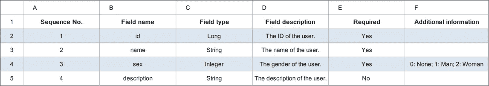
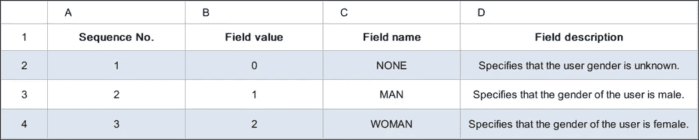
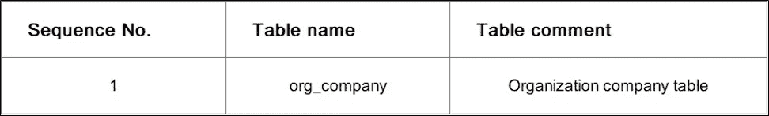
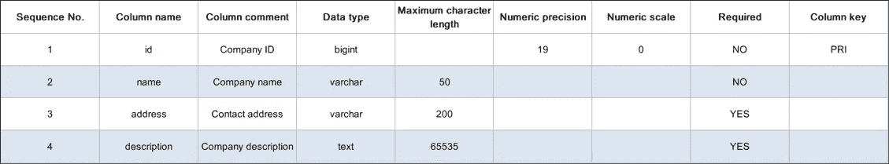

# 你知道六种编码方法中的几种？

> 原文：<https://medium.datadriveninvestor.com/how-many-of-the-six-coding-methods-do-you-know-6077a56500b1?source=collection_archive---------11----------------------->

阿里巴巴的陈昶屹(昌邑)。


不久前，Don Roberts 提出了一种重构的方法:“当你第一次做某事时，你就去做。当你第二次做类似的事情时，你会因为重复而退缩，但你还是做了重复的事情。第三次做类似的事情，你就重构。”

同样，在多次编写代码时，我们需要思考是否有办法提高我们的编码速度。如今，在阿里巴巴手机地图和导航应用 [AMAP](https://global.chinadaily.com.cn/a/201806/25/WS5b30cbc1a3103349141dea94.html?spm=a2c41.14065563.0.0) 工作的技术专家陈昶屹从事敏捷开发多年，在此总结一些编码方法，帮助程序员快速高效地编写代码。

# 方法 1:手动编写代码

大多数 Java 程序员新手会在他们的开发工具上重复输入以下代码，就像这是一种仪式一样:

```
public class Test {
    public static void main(String[] args) {
        System.out.println("Hello world!");
    }
}
```

是的，这是经典的“Hello world”代码，它通常是大多数程序员手动编写的第一个程序。

手工编码可以在很多方面反映程序员的能力。许多公司将计算机编程考试作为面试过程的重要组成部分。受访者需要根据考试需求选择一个编程工具，如 [Eclipse](https://www.eclipse.org/?spm=a2c41.14065563.0.0) ，然后手工编写、调试并运行代码。自然，当编码时，被访问者不能在互联网上搜索答案或查看任何在线帮助文档。受访者必须手动编写代码。这种考试测试受访者的能力，手动编码，以及具体方面，如编码器的语法，功能，逻辑，概念，算法，和一般的实践知识。

[](https://www.datadriveninvestor.com/2019/02/21/best-coding-languages-to-learn-in-2019/) [## 2019 年最值得学习的编码语言|数据驱动的投资者

### 在我读大学的那几年，我跳过了很多次夜游去学习 Java，希望有一天它能帮助我在…

www.datadriveninvestor.com](https://www.datadriveninvestor.com/2019/02/21/best-coding-languages-to-learn-in-2019/) 

手工编码是一个优秀程序员必须具备的基本技能。手动编写代码就像写一篇文章。句法是造句的方法。功能是组成文章的单词和句子。类库是供引用的轶事。建筑是表达的体裁。功能性是写这篇文章的主要目的。算法是组织语言的逻辑。所以，换句话说，你需要掌握一门编程语言的语法，学习一堆基础类库的函数，引用一些需要的第三方类库，选择一个成熟稳定的架构，明确产品需求涉及的特性，选择一个算法实现逻辑。然后，如你所见，一旦你掌握了所有这些，手动编码就像写一篇文章一样简单。

# 方法 2:复制并粘贴代码

正如一句中国谚语所说，“当你学会背诵唐诗三百首时，你就一定能写诗。”编码也是如此。编码的第一步是模仿，只是复制粘贴代码的一种花哨说法。在我看来，复制和粘贴代码是一种艺术。如果操作得当，这种方法可以让你写代码事半功倍。但是，未经测试的代码是不可信的。当你看到你需要的代码时，在复制粘贴之前仔细检查。此外，了解适合一种场景的代码可能不适合另一种场景也很重要。任何一个合格的程序员都知道，他不能不先检查代码就简单地获取和使用代码。

# 1.复制和粘贴代码的原因

*   复制和粘贴现有代码可以节省开发时间。
*   复制粘贴稳定的代码可以降低系统失败的风险。
*   复制粘贴网络代码，或多或少能以一种简单易行的方式将别人的成果转化为自己的成果。

# 2.复制和粘贴代码导致的问题

*   你对复制的代码真正了解多少？实现逻辑是否合理？代码能稳定运行吗？存在多少潜在的 bug？
*   代码在项目中复制粘贴了多少次？并且，基于“做类似的事情第三次重构”的原则，是否需要重构类似的代码？
*   代码复制粘贴的次数越多，就会出现越多的代码维护问题。为了在多个版本中更新代码后保持代码同步，您必须在每个地方进行相同的更改。而且，这增加了维护成本和风险。

因此，简而言之，复制和粘贴代码就像其他编码方法一样，它绝不是一种优于其他任何方法的方法。它只是一种你可以使用或滥用的方法。并且，你需要记住，如果你复制粘贴代码，你仍然要对结果负责，所以复制粘贴代码要小心！

# 方法 3:通过文本替换的方式生成代码

# 1.生成代码的示例

下面是为实现用户查询而编写的一段代码:

```
/** 查询用户服务函数 */
public PageData<UserVO> queryUser(QueryUserParameterVO parameter) {
    Long totalCount = userDAO.countByParameter(parameter);
    List<UserVO> userList = null;
    if (Objects.nonNull(totalCount) && totalCount.compareTo(0L) > 0) {
        userList = userDAO.queryByParameter(parameter);
    }
    return new PageData<>(totalCount, userList);
}/** 查询用户控制器函数 */
@RequestMapping(path = "/queryUser", method = RequestMethod.POST)
public Result<PageData<UserVO>> queryUser(@Valid @RequestBody QueryUserParameterVO parameter) {
    PageData<UserVO> pageData = userService.queryUser(parameter);
    return Result.success(pageData);
}
```

如果您想编写代码来实现公司查询，那么您需要的代码格式类似于用户查询代码。替换就像这个例子一样简单:无论哪里出现“用户”(带有大写的“U”)，就用“公司”替换它，无论哪里出现“用户”(带有小写的“U”)，就把它改为“公司”。它的逻辑真的很简单。当然，事情可能很快变得复杂，所以你仍然需要小心。

您可以使用文本编辑器，如记事本或 [EditPlus](https://www.editplus.com/?spm=a2c41.14065563.0.0) 来替换普通文本，但要确保在区分大小写的模式下进行，以尽量减少错误。最终结果应该是这样的:

```
/** 查询公司服务函数 */
public PageData<CompanyVO> queryCompany(QueryCompanyParameterVO parameter) {
    Long totalCount = companyDAO.countByParameter(parameter);
    List<CompanyVO> companyList = null;
    if (Objects.nonNull(totalCount) && totalCount.compareTo(0L) > 0) {
        companyList = companyDAO.queryByParameter(parameter);
    }
    return new PageData<>(totalCount, companyList);
}/** 查询公司控制器函数 */
@RequestMapping(path = "/queryCompany", method = RequestMethod.POST)
public Result<PageData<CompanyVO>> queryCompany(@Valid @RequestBody QueryCompanyParameterVO parameter) {
    PageData<CompanyVO> pageData = companyService.queryCompany(parameter);
    return Result.success(pageData);
}
```

如果使用文本替换的方法生成代码，所需的代码生成时间通常不会超过一分钟。

# 2.优点和缺点

## 优势

*   你的代码生成速度可以相当快。

## 不足之处

*   必须编译示例代码。
*   此方法仅适用于文本替换情况。

# 方法 4:使用 Excel 公式生成代码

Excel 公式非常强大，可以用来相当快地编译一些公式代码。

# 1.使用 Excel 公式生成模型类

为此，首先，您需要将接口模型定义从 Wiki 复制到 Excel。样本数据如下所示:



现在，您需要编写一个如下所示的 Excel 公式:

```
= "/** "&D6&IF(ISBLANK(F6), "", "("&F6&")")&" */ "&IF(E6 = "否", IF(C6 = "String", "@NotBlank", "@NotNull"), "")&" private "&C6&" "&B6&";"
```

使用公式生成如下所示的代码:

```
/** 用户标识 */ @NotNull private Long id;
/** 用户名称 */ @NotBlank private String name;
/** 用户性别(0:未知;1:男;2:女) */ @NotNull private Integer sex;
/** 用户描述 */  private String description;
```

然后，创建一个模型类并组织代码:

```
/** 用户 DO 类 */
public class UserDO {
    /** 用户标识 */
    @NotNull
    private Long id;
    /** 用户名称 */
    @NotBlank
    private String name;
    /** 用户性别(0:未知;1:男;2:女) */
    @NotNull
    private Integer sex;
    /** 用户描述 */
    private String description;
    ......
}
```

# 2.使用 Excel 公式生成枚举类

您需要将枚举定义从 Wiki 复制到 Excel。示例数据如下:


接下来，您需要编写一个如下所示的 Excel 公式:

```
="/** "&D2&"("&B2&") */"&C2&"("&B2&", """&D2&"""),"
```

并使用公式生成代码:

```
/** 空(0) */NONE(0, "空"),
/** 男(1) */MAN(1, "男"),
/** 女(2) */WOMAN(2, "女"),
```

然后，您需要创建一个枚举类并组织代码:

```
/** 用户性别枚举 */
public enum UserSex {
    /** 枚举定义 */
    /** 空(0) */
    NONE(0, "空"),
    /** 男(1) */
    MAN(1, "男"),
    /** 女(2) */
    WOMAN(2, "女");
    ......
}
```

# 3.使用 Excel 公式生成 SQL 语句

公司列表应按以下示例所示的顺序排序。这对于正确处理很重要，因为您需要编写 SQL 语句来将记录直接插入到基于该列表的数据库中。



然后，您需要编写一个如下所示的 Excel 公式:

```
= "('"&B2&"', '"&C2&"', '"&D2&"', '"&E2&"'),"
```

并使用公式生成 SQL 语句:

```
('高德', '首开大厦', '(010)11111111', 'gaode@xxx.com'),
('阿里云', '绿地中心', '(010)22222222', 'aliyun@xxx.com'),
('菜鸟', '阿里中心', '(010)33333333', 'cainiao@xxx.com'),
```

添加“into”语句头，对 SQL 语句进行排序，如下所示:

```
insert into t_company(name, address, phone, email) values
('高德', '首开大厦', '(010)11111111', 'gaode@xxx.com'),
('阿里云', '绿地中心', '(010)22222222', 'aliyun@xxx.com'),
('菜鸟', '阿里中心', '(010)33333333', 'cainiao@xxx.com');
```

# 4.优点和缺点

## 优势

*   此方法可用于为基于表的数据生成代码。
*   写完公式后，可以拖拽公式生成代码。因此，代码生成是一个非常快速的过程。

## 不足之处

*   此方法不能为复杂功能生成代码。

# 方法 5:使用工具生成代码

在这个方法中，您将使用一个现有的工具来生成代码。许多开发工具包提供了生成代码的工具，例如，生成构造函数、重新加载基类或接口函数、生成 Getter/Setter 函数以及生成 toString 函数。这些工具可以省去你需要手动编码的麻烦，而且很多都是免费的。还可以使用一些代码生成插件来生成适合某些应用场景的代码。

我在这里分享的例子使用了 [MyBatis 生成器](https://mybatis.org/generator/?spm=a2c41.14065563.0.0)来展示如何使用工具生成代码。

# 1.插件安装和运行

安装和运行插件并不困难，所以我不会在这里进行过多的描述，但是这里有一个[插件列表](https://mybatis.org/generator/plugins.html?spm=a2c41.14065563.0.0)可以帮助你开始。

# 2.生成代码的示例

现在，假设您已经安装并开始运行 MyBatis 生成器，让我们继续我们的示例。

## 2.1.生成模型分类代码

`User.java`文件的内容应该是这样的:

```
......
public class User {
    private Long id;
    private String user;
    private String password;
    private Integer age;
    ......
}
```

## 2.2.生成映射器接口代码

`UserMapper.java`文件的内容将如下所示:

```
......
public interface UserMapper {
    User selectByPrimaryKey(Long id);
    ......
}
```

## 2.3.生成映射器 XML 代码

`UserMapper.xml`文件的内容:

```
......
<mapper namespace="com.test.dao.UserMapper" >
  <resultMap id="BaseResultMap" type="com.test.pojo.User" >
    <id column="id" property="id" jdbcType="BIGINT" />
    <result column="user" property="user" jdbcType="VARCHAR" />
    <result column="password" property="password" jdbcType="VARCHAR" />
    <result column="age" property="age" jdbcType="INTEGER" />
  </resultMap>
  <sql id="Base_Column_List" >
    id, user, password, age
  </sql>
  <select id="selectByPrimaryKey" resultMap="BaseResultMap" parameterType="java.lang.Long" >
    select
    <include refid="Base_Column_List" />
    from test_user
    where id = #{id,jdbcType=BIGINT}
  </select>
  ......
</mapper>
```

# 4.优点和缺点

## 优势

*   使用代码生成插件可以大大加快代码生成过程。
*   插件配置文件用于控制所需功能代码的生成。

## 不足之处

*   学习和熟悉代码生成插件的使用可能需要一些时间。
*   生成的代码不一定与相应的代码规范相匹配。每次生成后都需要进行代码符合性检查。
*   代码重新生成后，自定义代码通常会被覆盖。因此，通常建议您维护一个单独的代码库，使用 DIFF 工具来识别代码差异，赋值，然后粘贴不同的代码。

# 方法 6:使用代码生成代码

对于这种方法，您将自己编写代码并以自己的风格生成代码。下面以基于 MyBatis 的数据库访问代码为例来解释这种方法。

# 1.查询表格信息

首先，您需要从数据库中获取代码生成所需的表和列信息。

## 1.1.查询表格信息

查询表信息的语句应该如下所示:

```
select t.table_name as '表名称'
, t.table_comment as '表备注'
from information_schema.tables t
where t.table_schema = ?
and t.table_type = 'BASE TABLE'
and t.table_name = ?;
```

在这里，第一个问号表示分配给数据库名的值，第二个问号表示分配给表名的值。

表格信息查询结果将如下所示:



## 1.2.查询列信息

查询列信息的语句应该如下所示:

```
select c.column_name as '列名称'
, c.column_comment as '列备注'
, c.data_type as '数据类型'
, c.character_maximum_length as '字符长度'
, c.numeric_precision as '数字精度'
, c.numeric_scale as '数字范围'
, c.column_default as ''
, c.is_nullable as '是否可空'
, c.column_key as '列键名'
from information_schema.columns c
where c.table_schema = ?
and c.table_name = ?
order by c.ordinal_position;
```

对于这段代码，像前面一样，第一个问号表示分配给数据库名的值，第二个问号表示分配给表名的值。

列信息查询结果将如下所示:



# 2.编写生成代码

## 2.1.编写模型类生成代码

```
/** 生成模型类文件函数 */
private void generateModelClassFile(File dir, Table table, List<Column> columnList) throws Exception {
    try (PrintWriter writer = new PrintWriter(new File(dir, className + "DO.java"))) {
        String className = getClassName(table.getTableName());
        String classComments = getClassComment(table.getTableComment());
        writer.println("package " + groupName + "." + systemName + ".database;");
        ......
        writer.println("/** " + classComments + "DO 类 */");
        writer.println("@Getter");
        writer.println("@Setter");
        writer.println("@ToString");
        writer.println("public class " + className + "DO {");
        for (Column column : columnList) {
            String fieldType = getFieldType(column);
            String fieldName = getFieldName(column.getColumnName());
            String fieldComment = getFieldComment(column);
            writer.println("\t/** " + fieldComment + " */");
            writer.println("\tprivate " + fieldType + " " + fieldName + ";");
        }
        writer.println("}");
    }
}
```

## 2.2.编写 DAO 接口生成代码

```
/** 生成 DAO 接口文件函数 */
private void generateDaoInterfaceFile(File dir, Table table, List<Column> columnList, List<Column> pkColumnList) throws Exception {
    try (PrintWriter writer = new PrintWriter(new File(dir, className + "DAO.java"))) {
        String className = getClassName(table.getTableName());
        String classComments = getClassComment(table.getTableComment());
        writer.println("package " + groupName + "." + systemName + ".database;");
        ......
        writer.println("/** " + classComments + "DAO 接口 */");
        writer.println("public interface " + className + "DAO {");
        writer.println("\t/** 获取" + classComments + "函数 */");
        writer.print("\tpublic " + className + "DO get(");
        boolean isFirst = true;
        for (Column pkColumn : pkColumnList) {
            if (!isFirst) {
                writer.print(", ");
            } else {
                isFirst = false;
            }
            String fieldType = getFieldType(pkColumn);
            String fieldName = getFieldName(pkColumn.getColumnName());
            writer.print("@Param(\"" + fieldName + "\") " + fieldType + " " + fieldName);
        }
        writer.println(");");
        ......
        writer.println("}");
    }
}
```

## 2.3.编写 DAO 映射器生成代码

```
/** 生成 DAO 映射文件函数 */
private void generateDaoMapperFile(File dir, Table table, List<Column> columnList, List<Column> pkColumnList) throws Exception {
    try (PrintWriter writer = new PrintWriter(new File(dir, className + "DAO.xml"))) {
        String className = getClassName(table.getTableName());
        String classComments = getClassComment(table.getTableComment());
        writer.println("<?xml version=\"1.0\" encoding=\"UTF-8\"?>");
        ......
        writer.println("<!-- " + classComments + "映射 -->");
        writer.println("<mapper namespace=\"" + groupName + "." + systemName + ".database." + className + "DAO\">");
        writer.println("\t<!-- 所有字段语句 -->");
        writer.println("\t<sql id=\"fields\">");
        if (CollectionUtils.isNotEmpty(columnList)) {
            boolean isFirst = true;
            String columnName = getColumnName(pkColumn.getColumnName());
            for (Column column : columnList) {
                if (isFirst) {
                    isFirst = false;
                    writer.println("\t\t" + columnName);
                } else {
                    writer.println("\t\t, " + columnName);
                }
            }
        }
        writer.println("\t</sql>");
        writer.println("\t<!-- 获取" + classComments + "函数语句 -->");
        writer.println("\t<select id=\"get\" resultType=\"" + groupName + "." + systemName + ".database." + className + "DO\">");
        writer.println("\t\tselect");
        writer.println("\t\t<include refid=\"fields\"/>");
        writer.println("\t\tfrom " + table.getTableName());
        boolean isFirst = true;
        for (Column pkColumn : pkColumnList) {
            String columnName = getColumnName(pkColumn.getColumnName());
            String fieldName = getFieldName(pkColumn.getColumnName());
            writer.print("\t\t");
            if (isFirst) {
                writer.print("where");
                isFirst = false;
            } else {
                writer.print("and");
            }
            writer.println(" " + columnName + " = #{" + fieldName + "}");
        }
        writer.println("\t</select>");
        writer.println("</mapper>");
    }
}
```

# 3.生成相关代码

## 3.1.生成的模型分类代码

```
/** 组织公司 DO 类 */
@Getter
@Setter
@ToString
public class OrgCompanyDO {
    /** 公司标识 */
    private Long id;
    /** 公司名称 */
    private String name;
    /** 联系地址 */
    private String address;
    /** 公司描述 */
    private String description;
}
```

## 3.2.生成的 DAO 接口代码

```
/** 组织公司 DAO 接口 */
public interface OrgCompanyDAO {
    /** 获取组织公司函数 */
    public OrgCompanyDO get(@Param("id") Long id);
}
```

## 3.3.生成的 DAO 映射器代码

```
<!-- 组织公司映射 -->
<mapper namespace="xxx.database.OrgCompanyDAO">
    <!-- 所有字段语句 -->
    <sql id="fields">
        id
        , name
        , address
        , description
    </sql>
    <!-- 获取组织公司函数语句 -->
    <select id="get" resultType="xxx.database.OrgCompanyDO">
        select
        <include refid="fields"/>
        from org_company
        where id = #{id}
    </select>
</mapper>
```

# 4.优点和缺点

## 优势

*   您可以自定义代码格式，以确保生成的代码符合规范。
*   您可以自定义代码特性，只生成您想要的代码，而不生成其他代码。
*   经过初步的代码积累，以后就可以直接使用代码了。

## 不足之处

*   需要研究你的相关数据源，以确保可以获得代码生成所需的数据。
*   创建数据模型和编写生成代码可能需要相当长的时间。

# 终极方法:不要只坚持一种方法

当然，在一个梦想的世界里，编码的终极方法是让你告诉计算机你需要什么，然后让计算机自动生成代码。有趣的是，随着未来技术的发展，这可能会成为现实。但在今天，这种方法是不现实的。事实上，除非你是老板、产品经理或技术经理，否则你不能简单地说出你想要什么，并得到必要的代码。

目前可用的最好的编码方法是使用任何合适的方法，而不是坚持只使用一种方法。当然，本文列出的所有编码方法都有各自的优缺点，适用于不同的场景。因此，在我看来，灵活地使用本文中讨论的各种编码方法是最好的编码方法，因为我们还没有生活在一个梦幻世界中。

# 代码标准化

最后一件事，我在这篇文章中讨论的许多编码方法都需要您手动编译示例代码。但是，重要的是要注意，如果您的代码不符合您的工作所需的特定代码规范，则可能很难找到示例中相关代码位之间的共性，并且也很难将示例代码抽象为标准代码。因此，如果作为标准的示例代码不符合任何特定的代码规范，那么生成的代码当然也不符合您的代码规范。而且，随着你继续使用，这种不顺从只会被放大几十倍，几百倍，甚至几千倍！所以，最重要的是，我想在这里强调代码标准化也应该是你编码时的首要任务。

# 原始来源:

[](https://www.alibabacloud.com/blog/how-many-of-the-six-coding-methods-do-you-know_595838?spm=a2c41.14065563.0.0) [## 你知道六种编码方法中的几种？

### 昌邑 2020 年 2 月 16 日 131 由陈昶屹(昌邑)在阿里巴巴。不久前，Don Roberts 提出了一种方法来…

www.alibabacloud.com](https://www.alibabacloud.com/blog/how-many-of-the-six-coding-methods-do-you-know_595838?spm=a2c41.14065563.0.0)