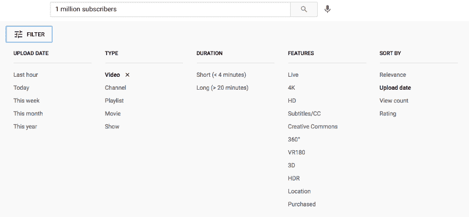
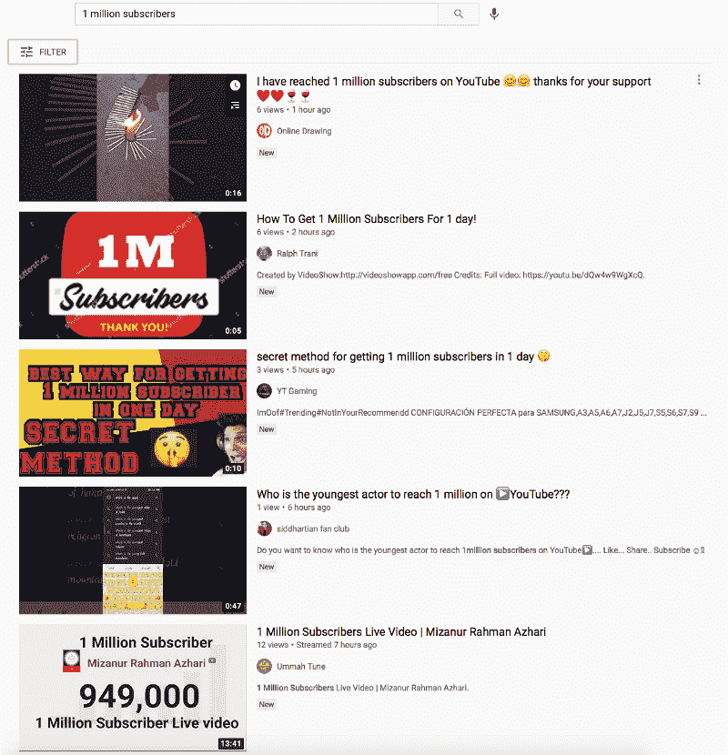
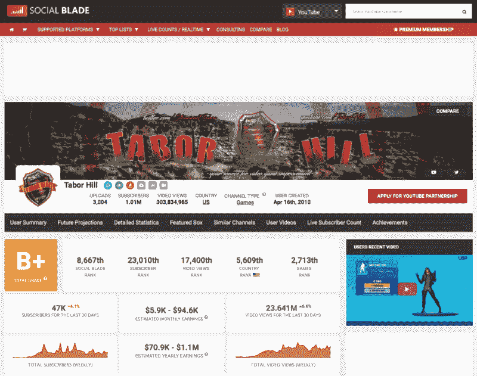

# 有多少 YouTube 频道拥有超过 100 万的用户

> 原文：<https://medium.datadriveninvestor.com/how-many-youtube-channels-have-over-1-million-subscribers-56881000f35a?source=collection_archive---------0----------------------->

## 统计数据包括:

Image Source: TechCrunch

你有没有想过有多少 YouTube 频道达到了 100 万用户大关？

我知道我当然有。

在谷歌上快速搜索了几下后，我发现一些估计值似乎很低，而另一些似乎非常高，而且大多数都非常过时。

一些网站展示的用户数量低至 2，000 人，而另一些网站则称用户数量高达 5 万人。

虽然我没有确切的数字，但我想我已经找到了这个问题的一个非常可靠的答案。

***数学上的方程式:***

Image Source: The Conversation

YouTube 永远不会全速前进，告诉我们 YouTube 赚了多少钱。尽管如此，根据目前的信息，我们可以假设并计算出一些较大的频道每年仅从广告收入中就能获得数百万美元。

同样的道理也适用于达到里程碑的频道数量，以获得金播放按钮奖，即 100 万订户标志。

大多数 YouTubers 都制作了一个视频，宣布他们何时跨越这个巨大的里程碑；我知道如果我击中了它，我肯定会的。不是吹牛，只是为了感谢他们社区的支持，并给他们一些希望在未来实现的想法。

在 YouTube 上搜索时，可以设置过滤器；出于某种原因，大多数人没有意识到或利用这一点。

Image Source: YouTube.com

通过搜索“一百万订阅者”，我将过滤器设置为按最近上传的内容排序。

这首先带给我这些结果:

Image Source: YouTube.com

正如你所看到的，所有这些视频对于一个拥有 100 万订阅者的人来说只有极低的点击率，即使他们只是上传了视频。

如果你有 100 万订阅者，当你上传一个视频，并准备在 YouTube 上观看时，他们会向你所有的订阅者发出通知。这就是为什么每当一个大频道发布一个视频，无论你点击的速度有多快，它都已经有几百或几千的浏览量了。

所以我们在检查了前几个结果后，我很快排除了它们，这就把我们带到了这个视频这里:

Image Source: YouTube.com

Tabor Hill 的视频题为“我的 100 万订户商品商店评论”,两天前刚刚发布，在 YouTube 上已经有超过 13 万次观看。这是一个很好的迹象，表明该频道可能有大量的订户，或者某个视频恰好成为该标题的趋势，并获得了超过其正常水平的大量观看。

点开频道后，塔博尔希尔确实有一百万订户；他实际上拥有 101 万订户，这意味着他刚刚达到里程碑。

Image Source: YouTube.com

在我们继续之前，我想对塔博尔希尔公司取得如此重大的成就表示祝贺。我以前从未听说过他，但祝贺你成为最新的金像奖得主！

***利用信息，我们有:***

Image Source: YouTube.com

在对 YouTube 上众多不同的搜索结果进行分类后，我认为我们找到了一个最新的频道，打破了 100 万订户的里程碑，并发布了一个视频。

但现在我们必须根据频道的订阅人数来看看他们相对于所有其他 YouTube 频道的排名。

如果我们去 Social Blade——一个跟踪关注者、浏览量、订阅者以及更多跨渠道、Twitter 账户和其他社交平台的分析的网站，我们可以输入 Tabor Hill 的名字，因为它是达到 100 万订阅者的最新渠道之一。

Image Source: SocialBlade.com

根据 Social Blade 的数据，根据他的 YouTube 频道与该平台上所有其他频道相比的订阅人数，塔博尔希尔现在排名 23，010。

考虑到这一点，我们现在可以假设拥有超过 100 万订阅者的 YouTube 频道的数量是…

**总共 23，000–24，000 个渠道。**

虽然 Tabor Hill 是最近达到 100 万订户并发布视频的频道之一，但我相信其他人也达到了里程碑，但还没有制作视频。也就是说，我们增加了 500-1000 个额外频道的小缓冲区，以达到 23，000-24，000 个频道的最终总数，从而超过 100 万用户的里程碑。

**访问专家视图—** [**订阅 DDI 英特尔**](https://datadriveninvestor.com/ddi-intel)