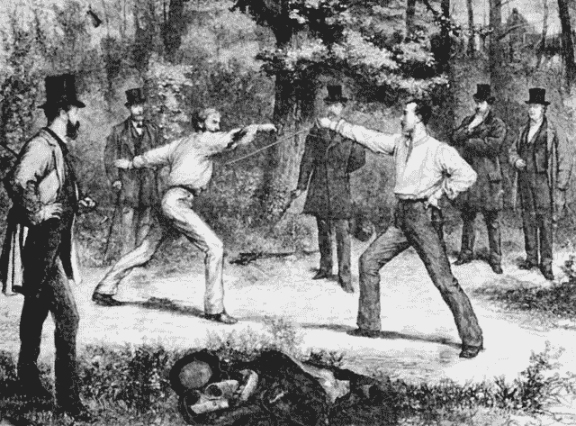

# 精英制度是如何失败的

> 原文：<https://medium.datadriveninvestor.com/how-meritocracies-fail-31a803741283?source=collection_archive---------5----------------------->

精英主义正在衰落，而且经常被高估。

A public test of character.

精英统治并不是一种新的社会形式。它不是西方现代性所特有的。相反，精英管理的一个重要标志——通过考试选拔公务员——是几个世纪前由中国[开创的。](https://en.wikipedia.org/wiki/Imperial_examination)

在[宋朝](https://en.wikipedia.org/wiki/Song_dynasty)(960-1279)期间，考试成为了官方任命的主要途径。除了[元朝](https://en.wikipedia.org/wiki/Yuan_dynasty)(1271-1368)的部分例外，随后的[明](https://en.wikipedia.org/wiki/Ming_dynasty)(1368-1644)和[清](https://en.wikipedia.org/wiki/Qing_dynasty)(1644-1912)也从通过科举考试的人中选拔官员。

奥斯曼帝国(1299-1922)也是一个实质上的精英政体。奥斯曼精英统治的基础是对非穆斯林家庭征收的男孩税。每一批男孩都根据他们明显的天资来分类。他们接受了培训和测试，并在国家机器中走上了不同的职业道路。

然而，奥斯曼帝国成了“欧洲病夫”，大清帝国未能应对欧洲的挑战和日本的挑战，成了亚洲的“病夫”。因为精英制度有相当长的历史，我们可以研究精英制度是如何衰落的。

精英管理经常被高估。

在决定社会系统如何运转方面，激励和反馈比任人唯贤的任命过程更重要。尤其是因为这往往涉及相当狭隘的优点概念。

此外，精英制度正在衰落。他们堕落成腐败、懦弱和文化傲慢(甚至狂热)。它们以这些方式衰退，正是因为(1)所涉及的优点的概念相对狭窄，以及(2)除了获得相关证书的足够持久性(和能力)这一最起码的测试之外，精英选拔过程通常不涉及任何严肃的品格或承诺测试。

到 1870 年左右，任人唯贤成为英国官方任命的主导模式(特别是英国军队的卡德威尔改革)，在美国，随着 1883 年《T2 彭德尔顿法案》的通过。因此，150-130 年前，尽管向精英统治的过渡发生在 19 世纪。大约在中国朝代更替的 150 年左右，政权衰落的过程开始变得明显。

奥斯曼帝国精英统治的核心建立于 1380 年代，到 1600 年左右开始衰落。但奥斯曼帝国是一个好战、扩张的国家，其精英在战斗中经历了不断的考验。腐败的过程直到苏莱曼*卡努尼*(又名[苏莱曼一世](https://en.wikipedia.org/wiki/Suleiman_the_Magnificent)，1520-1566 年在位)统治之后才真正开始。奥斯曼精英统治核心建立后大约 190 年。

中国向更精英化的列宁主义的转变，对于精英主义特有的衰退过程来说，可能太晚了。官僚主义特有的腐败过程已经出现了几十年，但由于文化大革命(1966-1976)造成的网络中断以及向更加市场化的经济转型，这一过程有所减缓。

**贪污:卖官鬻爵**

金融腐败是出售官员的自由裁量权(即主动和被动的决定)。任人唯贤可以为腐败提供掩护，因为官员被认为是任人唯贤的。对功绩的依赖越多，官员的自由裁量权就越大，为个人利益出售或使用这些自由裁量权的能力就越强。

官员中的金融腐败可能会对统治者产生影响。它可以通过向支持者提供收入机会，为统治者提供行使庇护的途径。此外，腐败官员作为合作者缺乏规范性的可靠性，因为他们的行动是为了销售。这种规范性可靠性的缺乏转化为规范性地位的缺乏，阻碍了他们参与对统治者的任何积极威胁的可能性。(缺乏规范的可靠性是腐败倾向于网络化的原因，因为未能“被收买”会通过网络反弹。)

然而，缺乏规范可靠性的腐败官员是一把双刃剑。他们缺乏合作的可靠性，这使得他们在一般的压力情况下不可靠，不仅仅是作为潜在的政治阴谋者。在社会压力或危机的情况下，统治者会发现他们的权力工具由于腐败而有效地消失，使他们名义上的代理人成为不可靠的合作者。

随着每个朝代政权的老化，中国的朝代都经历了官员腐败加剧的循环模式。

我们可以看到伊本·哈尔顿(1332-1406)的王朝(或政权)周期模型在这里运行。在他的模型中，一个有很强规范纽带的团体掌权。随着时间的推移，在一个互动的过程中，腐败增加，规范纽带削弱。最终，统治系统被不可靠的合作者所充斥，并崩溃，被一个具有强大规范纽带的新团体所取代。然后，冲洗并重复。

欧洲圈政治在很大程度上避免了伊本·哈尔顿(ibn Khaldun)确定的模式，因为它们在历史上对官员的品格和承诺进行了抵消性测试。比如[决斗文化](https://www.researchgate.net/publication/5207104_The_Duel_of_Honor_Screening_For_Unobservable_Social_Capital)。随着精英政治的兴起，相对来说缺乏对性格和承诺的测试。因此，伊本·哈尔顿对失去 [*asabiyya*](https://en.wikipedia.org/wiki/Asabiyyah) 或群体感觉(我们可以称之为*规范承诺*)的后果的分析可能会越来越有说服力。

除了公开出售官方自由裁量权，还有其他类型的腐败。例如，让那些与知名官员有关系的人获得优势，或者在官员之间建立相互支持的网络。值得注意的是，精英媒体中的许多评论者发现，亨特·拜登能够在没有任何明显天赋或能力的情况下获得如此高薪的公司董事职位，更不用说他的父亲是谁了。

现代英国社会相对擅长于将彻底的金融腐败最小化。然而，自助网络更为普遍。

如果对担任公职不进行重大的品格测试或规范性承诺，随着时间的推移，由于机构选择有利于玩这种游戏的人，可以预计精英腐败的各种过程将会增加。

(关于狭隘的优点概念，最近一项关于首席执行官特质的研究[发现，与认知能力无关的特质——我们可以说是*的性格标志*——如社交成熟度、强度、心理能量、情绪稳定性、承担责任的意愿、独立、性格外向、表现出毅力和情绪稳定性、表现出主动性，这些特质比认知能力特质更能预测成为首席执行官。)](https://www.hbs.edu/faculty/Publication%20Files/16-044_9c05278e-9d11-4315-a744-de008edf4d80.pdf)

**官方无刺…**

懦弱是对风险的厌恶和缺乏规范的承诺。官僚机构通常选择规避风险。

如果没有对担任公职的品格和规范承诺进行重大测试，也可以预期规避风险的文化会增加，因为这就是选择的目的，没有对品格和承诺的反作用选择。因此，随着精英制度的老化，官员中缺乏骨气的人越来越多。

我们当然可以在自己的时代看到这一点。“wokeness”的问题远不是活动家的要求，而是官员和高管经常向他们让步。评论员道格拉斯·默里(Douglas Murray)在他的在线评论中的抱怨，以及他的**，*“房间里的成年人”对激进分子纯洁性螺旋的行动一再失败，以及在线围攻，与这种不断扩大的官方软弱(即没有规范承诺的风险厌恶)有很大关系。*

***…和模仿的傲慢***

*失败的精英制度的第三个特征是模仿的傲慢(对他们头脑中的精彩事物的相互钦佩)。在某种程度上，这是精英管理的自然趋势，因为一个人被任命为优秀人才的观念有一定的自我提升效应。尤其是对于一个*共享*的优点概念。精英阶层的成员可以激烈地认同他们都是多么优秀的人，因为他们获得了相关的价值标志。*

*更大的社会背景变得越尴尬或越具有威胁性，退回到这种模仿性的傲慢就变得越有吸引力。我们可以在抵制现代化或自由化的伊斯兰精英中看到这种模仿的傲慢，因为思想和技术来自异教徒。我们可以在中国官员和东罗马(“拜占庭”)官员身上看到这一点，他们认为自己丰富的文化遗产比欧洲(19 世纪的海上强国)或法兰克(威尼斯和热那亚)的海上蛮族可能带来的任何东西都重要。*

*这种文化模仿的傲慢也表现在日本人对海军准将佩里的“黑船”到来的反应上。日本有采纳中国思想的悠久历史，但又根据自己的环境对其进行调整，以及长期的权力中心竞争和随之而来的公开政治讨价还价，这意味着他们(大部分)回避了这种模仿式傲慢的负面影响。(我说*主要是*，因为一种经过改造的模仿性文化傲慢在 20 世纪 30 年代和 40 年代灾难性地重新出现。)*

*我们在当代发达的欧洲圈民主国家看到的不是那种文化传统的傲慢，至少在精英阶层中不是，除非是未经检验的假设。相反，在精英阶层中，对自己社会的文化遗产持不屑一顾或轻蔑的态度变得更加普遍。相反，我们看到一种不同形式的模仿傲慢正在兴起。产生模仿狂热的人。*

*这是从*声望观点*的发展演变而来的，坚持这一观点显示出一个人的道德价值。除了对语言禁忌和“适当的”意见的变化有一定的注意之外，很少要求人们通过遵守相关的权威意见来表现自己的道德品质。因此，显示一个人对道德价值的坚持的最有效的方式是显示一个人对任何不同想法的人的蔑视。换句话说，公开投资于推动声望观点的地位分化=道德价值社会策略。正如维多利亚州州长丹·安德鲁斯所说，任何不同意权威观点的人都是“顽固分子”。*

*事实上，如今精英(“高质量”)媒体向精英读者提供的大部分服务都是为了表明应该鄙视谁以及为什么。因此- *ist* 和- *phobe* 术语和其他违背道德价值的罪恶(如文化挪用)无休止地泛滥。这促使公众坚持(或至少默许)作为道德价值标志的权威观点，因为人们不希望自己的名誉受到攻击、遭到恶意围攻和可能导致职业灾难的回避。*

*因为没有人愿意向自己承认他们是出于懦弱而默许，所以有强大的认知压力去完全接受权威意见。这是更普遍模式的一部分，由于希望避免认知失调，社会规范*(由社会期望维持，并伴随着对分歧的制裁)被视为道德规范*(凭自身权利采纳的规范)。***

***一套权威意见对官僚机构(无论是政府、非营利组织还是企业)也很有用。它们提供了简化的选择标准(坚持权威意见)。他们在官僚机构内部提供更容易的协调(通过调整期望)。他们提供了可以相处的道德项目(扩大了官僚行动的范围)。因此，他们提供了网络和社会动力，这些网络和社会动力正像任何极权主义政党一样完全渗透到各个机构中，尽管它们是通过相互发信号而不是中央指挥来协调的。***

***他们没有提供任何真正的性格或承诺的测试。相反，鉴于它们缺乏严肃的(即对个人来说代价高昂的)信号，它们对持不同意见者的蔑视和优越感，以及它们作为社会主导机制的价值，它们实际上为不良行为者提供了大量机会。尤其是那些有[黑暗三联征](https://en.wikipedia.org/wiki/Dark_triad)的。***

***所以，作为道德价值标志的声望观点实际上是消极地选择性格和对更广泛社会的承诺，这也许在对这种社会遗产的日益扩大的蔑视中最为明显；一种文化上的蔑视，它有效地标志着道德上有价值的成员和(甚至更好的)地位——特别是与工人阶级的分离。***

***但这比那更糟，因为声望-意见-道德-价值-社会-支配战略天生就对发现过程怀有敌意。权威意见是根据目标群体的共鸣来选择的。那么，什么是修辞上有效的，社会上对精英有利的，以及方便的地位。这些标准没有一个与真相或准确性有任何强有力的联系，更不用说与他人的关注了。(事实上，他们更容易因为他人的关注而被敌视，因为这增加了他们的地位分化价值:道德上的沾沾自喜是一种特征，而不是一种缺陷。)***

***因此，任何一套作为道德价值标志的权威观点必然会对发现过程产生敌意；通过威胁抛出矛盾的事实或不方便的关注点来威胁权威意见的过程。***

***因此，我们可以看到精英阶层内部对自由、民主和科学日益增长的敌意，这些都是发现的过程，因此威胁到使用权威意见作为道德价值的标志。这种敌意是由对权威意见的保护所驱动的。(鉴于目前的一系列权威观点，这意味着进化生物学、性研究和心理学远比物理学受到更大的威胁)。***

***随着取消文化的发展，书籍、电影的退出，作者、演讲者等的封锁，对自由的威胁变得非常明显。这种对知识自由的敌意正在渗透到主流学术界，比如哲学。***

***对民主的威胁只是稍微不那么明显，比如，人们系统性地拒绝投票给道德(和智力)不良的川普或英国退出欧盟。至于对科学的威胁，如果 2+2=5 的废话还不够的话，对于那些有眼睛的人来说，阻止研究和发表不方便的论文的企图是非常明显的。***

***当然，如果你公开注意到这些，你就确立了自己是*而不是*道德高尚者的一员。***

**通过采纳权威意见(然后将其用于各种社会控制游戏)来建立道德价值的模式是一个社会进化的过程。它不仅产生了某种形式的模仿傲慢，还产生了[模仿狂热](https://hiddentribes.us/profiles/progressive-activists)(对他们头脑中的精彩事物的共同崇拜)。这不仅给人们一种意义和目的感，而且还提升和强化了随之而来的社会统治策略。**

**利用取消文化来解雇员工的好处是，它创造了晋升机会。最近从大学毕业的一代人，课程(甚至学校)越来越被这些模式所渗透，他们可以利用他们在技术和禁忌方面的更大能力来超越他们的前辈，让他们离开 T2。**

**当然，这进一步增加了对坏演员的选择，阻碍了发现过程和精英腐败的过程。**

**因此，期待更多自私的网络，官方的懦弱，模仿的傲慢和狂热的选择，反对良好的品格，反对对更广泛的社会的承诺，反对对发现过程的开放。**

**不用说，这不是管理一个先进技术社会的方式。也不是免费的。也不是民主的。**

**欢迎来到 2021 年，历史正在发生。**

**历史可能不会重复，但它可以押韵，它可以非常强烈地押韵。的确如此。**