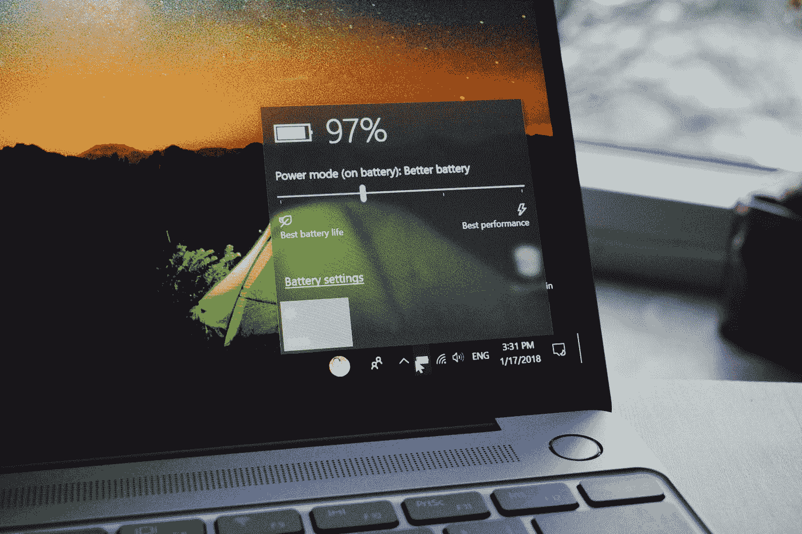

# 微软如何赚钱

> 原文：<https://medium.datadriveninvestor.com/how-microsoft-makes-their-money-fe3c20096358?source=collection_archive---------8----------------------->

## 一个关于巨人再造的故事

Photo by [Mackenzie Marco](https://unsplash.com/@kenziem?utm_source=medium&utm_medium=referral) on [Unsplash](https://unsplash.com?utm_source=medium&utm_medium=referral)

微软是一家与众不同的公司，尤其是如果我们看看它过去几年的活动。

在此期间，它已经在**取得了几项成功**，比如在指令**塞特亚·纳德拉**的推动下，其服务器业务的扩张，Office 从按许可付费模式向**订阅环境的转变**，其视频游戏控制台部门新业务模式的开发，或者是 Windows 10 操作系统的创造，这一操作系统受到了评论家的好评**。**

 [## 幸福的算法？数据驱动的投资者

### 从一开始，我们就认为技术正在使我们的生活变得更好、更快、更容易和更实用。社交媒体…

www.datadriveninvestor.com](https://www.datadriveninvestor.com/2019/03/08/an-algorithm-for-happiness/) 

**在记录的** **B 面**上，几经挫折:**智能手机被放弃**转而支持谷歌和苹果，Windows 应用商店没有跟上竞争对手的步伐，没有找到办法扭转**Windows PC 和平板电脑及其操作系统的糟糕销售趋势**也没有取得成功。

# 办公室和云

Photo by [Pero Kalimero](https://unsplash.com/@pericakalimerica?utm_source=medium&utm_medium=referral) on [Unsplash](https://unsplash.com?utm_source=medium&utm_medium=referral)

微软将所有收入分成三大业务部门:

*   **智能云**:Azure、Windows Server、微软咨询服务等服务器和云服务。
*   **更多个人计算**:从 Windows 操作系统、平板电脑 surfaces、Xbox 业务和必应搜索引擎获得收入。
*   **生产力和业务流程:**面向企业和消费者销售微软 Office 或其他产品。

这是自 2015 年年中以来每个部门季度收入的演变，当时纳德拉作为公司负责人的第一批决定开始实现，这是她在几个季度前达成的。

虽然这些部门的收入顺序在过去三年中保持不变，但趋势却不同:虽然**办公和商业服务部门以非常好的速度增长**并且云业务是一个峡谷——尽管离 AWS 的数据还有一段距离——但消费者和设备部门下降了近五分之一，这是一个坏消息，但其总收入已经增加，现在达到了**每季度 300 亿美元**。

# Windows 不是主要产品

Photo by [Panos Sakalakis](https://unsplash.com/@meymigrou?utm_source=medium&utm_medium=referral) on [Unsplash](https://unsplash.com?utm_source=medium&utm_medium=referral)

这解释了为什么纳德拉与鲍尔默的计划相反，已经**取消了 Windows** 的单一部门，这不再是他的主要产品，而是选择了**人工智能**和**云**。

这也解释了为什么在对他的移动操作系统、Windows Phone、**收购诺基亚的毁灭性业务**和他对 **Lumia** 的坚持进行了几次重大更新后，纳德拉承认失败，并承认微软错过了智能手机的列车。

纳德拉做出了一些标志着其当前进展的决定，例如让公司转向拥抱**开源**，在 **Xamarin 收购**中实现，发布 6 万**专利**，收购 GitHub** 或在 Windows 10 中整合**Bash**。**

然而，最能标志其未来的是对**人工智能**的承诺:超过 5000 名工程师已经在从事相关项目，如用于 ***【认知服务】*** 的 API，这些 API 翻译成产品如 **Skype 自动翻译**或**实验**，如与人类聊天的**机器人**或放置**自动字幕**、**情感识别的技术**

**Xbox** 和 **Surface** 相反，是*阴阳师*的**更个人计算**。尽管 Xbox 在这一代的销售中被 PlayStation 击败，但它仍呈现出强大且不断上升的数字。去年，Xbox Live 用户从 5300 万增长到 5700 万——在堡垒之夜繁荣时期达到 5900 万。

Surface 的数字略低，利润也较低。

这种轨迹，尤其是在纳德拉到来之后，意味着微软的品牌价值和市值最近都有所增加:在这两种情况下，第一种情况下它排在苹果和谷歌之后，第二种情况下排在苹果和亚马逊之后。

现在，微软如何适应这个后智能手机时代还有待观察。

Photo by [Diego Jimenez](https://unsplash.com/@diegojimenez?utm_source=medium&utm_medium=referral) on [Unsplash](https://unsplash.com?utm_source=medium&utm_medium=referral)

**我希望你喜欢它，并在你的网络上分享它！😉**