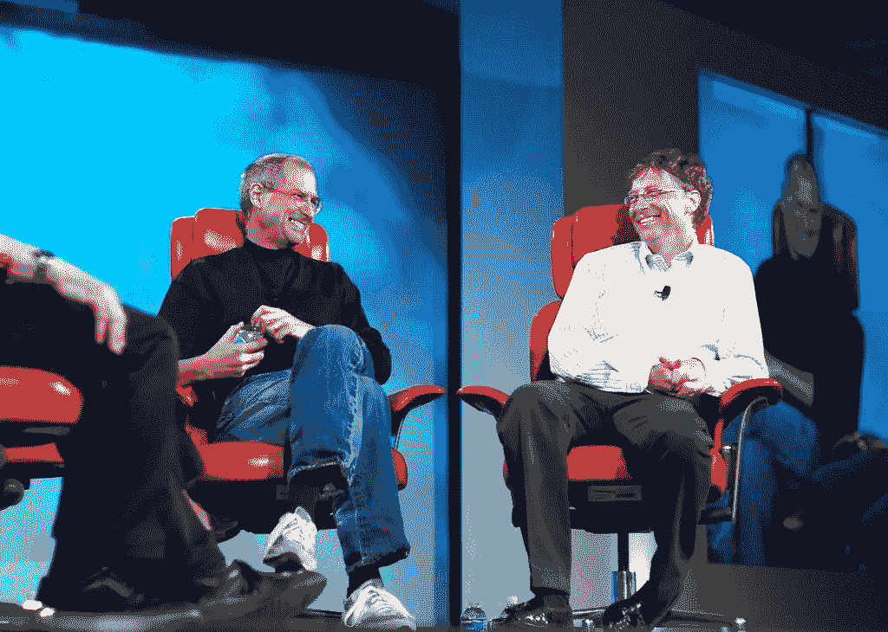

# 微软如何拯救苹果免于破产

> 原文：<https://medium.datadriveninvestor.com/how-microsoft-saved-apple-from-bankruptcy-99e643b8b758?source=collection_archive---------0----------------------->

## 比尔·盖茨拯救了苹果免于消失

[Photo](https://www.flickr.com/photos/35034362831@N01/522695099) by [Joi](https://www.flickr.com/photos/35034362831@N01) licensed under [CC BY 2.0](https://creativecommons.org/licenses/by/2.0/?ref=ccsearch&atype=rich)

> “比尔，谢谢你。世界变得更美好"

这是史蒂夫·乔布斯在电话中告诉比尔·盖茨的。你不能无缘无故对你最大的竞争对手这么说。史蒂夫·乔布斯说出这些话是因为这是苹果公司发生的最好的事情。1997 年，当苹果濒临破产时，盖茨向其投资了 1.5 亿美元(相当于今天的 2.43 亿美元)。

这里需要注意的重要一点是，这是一笔[无投票权](https://en.m.wikipedia.org/wiki/Non-voting_stock)投资，这意味着他们在苹果的重要决策中没有投票权。所以，他们实际上是在资助苹果公司，无意收购该公司。

当史蒂夫·乔布斯宣布苹果与微软合作时，他遭到了观众的嘘声。

比尔·盖茨拯救了苹果公司，使其免于化为灰烬。但是等等，不像现在，比尔·盖茨那时不是一个慷慨的人道主义者。一谈到生意，他的竞争对手就被击倒了。他是一个无情的商人，他必须摧毁他的竞争对手才能崛起。苹果是他最大的竞争对手。那么，为什么科技公司的穆罕默德·阿里会在倒计时开始的时候去拯救一个倒下的竞争对手呢？

 [## 数据驱动的投资者|微软比 Chrome 有“优势”

### 简史我从来不是浏览器的粉丝，确切地说，我只是一个浏览器的粉丝，Chrome。这是我的…

www.datadriveninvestor.com](https://www.datadriveninvestor.com/2020/03/29/microsoft-having-an-edge-over-chrome/) 

# 这不是出于慷慨

这与司法部正在准备的[反垄断诉讼](https://en.m.wikipedia.org/wiki/United_States_v._Microsoft_Corp.)有关。这对微软可能是非常有害的。所以，为了证明微软不是垄断者，他拯救了他的竞争对手。不用说，这奏效了。三年后，司法部撤销了那个案子。

微软还获得了其他好处。苹果撤销了关于微软窃取 Mac OS 的诉讼。史蒂夫·乔布斯还宣布，Internet Explorer 将成为 Mac 电脑的默认浏览器。微软还承诺在未来 5 年内为苹果生产微软 Office，这对苹果来说是一件大事。

比尔·盖茨不希望微软因为反垄断法而破产。帮助竞争对手赢得了政府的信任。

# 余波

我不认为我需要说这些，但这项投资给了苹果一个上升到顶端的巨大机会。苹果现在价值 2 万亿美元，微软价值 1.6 万亿美元。苹果很好地利用了这种帮助，成为了美国最大的科技公司。

比尔·盖茨和史蒂夫·乔布斯之间苦乐参半的关系一直持续到 2011 年史蒂夫·乔布斯去世。

[Photo](https://www.flickr.com/photos/32792548@N04/14334118470) by [SoniaT 360.](https://www.flickr.com/photos/32792548@N04) licensed under [CC BY 2.0](https://creativecommons.org/licenses/by/2.0/?ref=ccsearch&atype=rich)

那个电话仍然被认为是科技史上最伟大的时刻之一。

这种伙伴关系表明，即使是竞争对手也可以为消费者一起工作，为世界创造伟大的东西。事实证明，这些合作关系对科技行业至关重要。

如果你翻开历史的一页，你可以看到一些重要的合作伙伴关系，比如苹果与谷歌的合作伙伴关系，这使得 iPhone 成为第一款内置 YouTube 和谷歌地图等谷歌应用的设备。这种合作关系导致人们更喜欢 iPhone 而不是其他手机。

即使比尔·盖茨这样做是为了让微软免于一场官司，苹果现在的样子也可能是因为他。

**访问专家视图—** [**订阅 DDI 英特尔**](https://datadriveninvestor.com/ddi-intel)