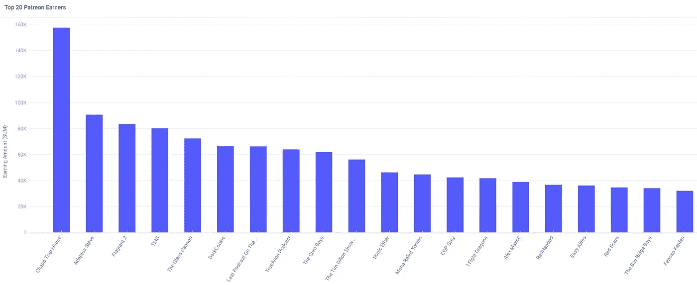

# Patreon 上的“精英”赚多少钱？

> 原文：<https://medium.datadriveninvestor.com/how-much-do-the-cr%C3%A8me-de-la-cr%C3%A8me-earn-on-patreon-b7312f677965?source=collection_archive---------6----------------------->

## 瞄准什么。

Photo by [NeONBRAND](https://unsplash.com/@neonbrand?utm_source=medium&utm_medium=referral) on [Unsplash](https://unsplash.com?utm_source=medium&utm_medium=referral)

近年来，随着 Medium、OnlyFans、SubStack 和 Patreon 等平台的激增，激情经济已经成为一种增长趋势。它始于像优步和 Airbnb 这样的平台，让人们将他们的汽车和房屋货币化。今天，你可以将任何东西货币化:你的博客，你的电子邮件，你的视频，甚至你的身体。

[大萧条 2.0](https://medium.com/datadriveninvestor/will-the-great-depression-2-0-cause-an-ai-winter-7c3c353d7b53) 催化了这一趋势，因为我们花更多的时间上网，人们正在寻找额外的收入来源。

Patreon 使超过 20 万名创作者能够从他们最忠实的粉丝那里获得报酬。和所有激情经济平台一样，*典型的*创造者挣得不多。OnlyFans 的月平均税后收入为 136 美元，大多数中型作家和创作者的月收入不到 100 美元，Fiverr 的月平均收入为 60 美元。

简而言之，普通的创作者不应该期望赚得比ˢᵐᵃˡˡ ᵇˡᵃᶜᵏ咖啡多一点钱。但是如果你力争上游，又有什么可能呢？我找到了前 1000 名 Patreon 收入最高的人的数据(大约是前 0.5%)，并用 Apteo 进行了分析，看看最好的人能挣多少钱。

 [## 一瞬间学会数据科学！？数据驱动的投资者

### 在我之前的职业生涯中，我是一名训练有素的古典钢琴家。还记得那些声称你可以…

www.datadriveninvestor.com](https://www.datadriveninvestor.com/2020/07/23/learn-data-science-in-a-flash/) 

# 世界级的收入

第 997 位创作者每月收入 2534 美元(这是最接近前 0.5%的数字，因为并非所有创作者在数据集中都有月收入数字)。他们的 Patreon 页面有多层，这意味着他们可能会在 Patreon Pro 版本上，收取 8%的费用。

假设再加上 30%的税率，**收入最高的 0.5%创造者的月实得工资约为 1600 美元**。

让我们跳到前 200 名。没有第 200 名的收入数据，但 201 号每月收入 14，752 美元。假设 8%的 Patreon 费用和 40%的税率，**顶尖的 0.1%的创造者的月实得工资大约是 8000 美元**。

那么真正的精英——1%中的 1% *,或者说最顶尖的 0.01%呢？没有第 20 名的数据，但是第 19 名的月薪是 61，868 美元。假设 12% (Patreon Premium)的费用和 50%的税率，**收入最高的 1%的人每月的税后工资约为 27，000 美元**。*

下面，我们可以看到前 20 个月收入者(没有收入数据的 Patreon 帐户被跳过)。

如果你的目标是成为 20 多万名创作者中收入第一的人，你必须击败反资本主义播客 Chapo Trap House，它每月收入 157，753 美元。

请注意，高收入者通常有其他收入来源，以更好地利用他们庞大的社区。例如，Chapo Trap House 出售一本名为“Chapo 革命指南”的书，经营一家 merch 商店，从播客本身获得支出，并可能有品牌交易。

这很容易每月带来几十万美元的收入。

# 漫长的游戏

在任何平台上，在网上获得关注都是一个漫长的过程。除非你已经很出名了，并把你的观众带到帕特里翁，否则这需要一段时间。

前 1000 名创作者的平均账户年龄为 1205 天，即 3 年零 4 个月左右。Patreon 从 2013 年中期才出现，所以高收入者在 Patreon 存在的一半时间里都在从事这项工作。

# 摘要

要想在激情经济中获得有意义的收入，你需要成为一名精英创作者——尽管许多人会反驳说，创作者免费做的事情可以获得报酬。

大多数人收入不高，尽管你会看到许多 Patreon 创作者通过其他方式补充收入，如品牌交易、书籍、付费通讯等。

## 获得专家观点— [订阅 DDI 英特尔](https://datadriveninvestor.com/ddi-intel)