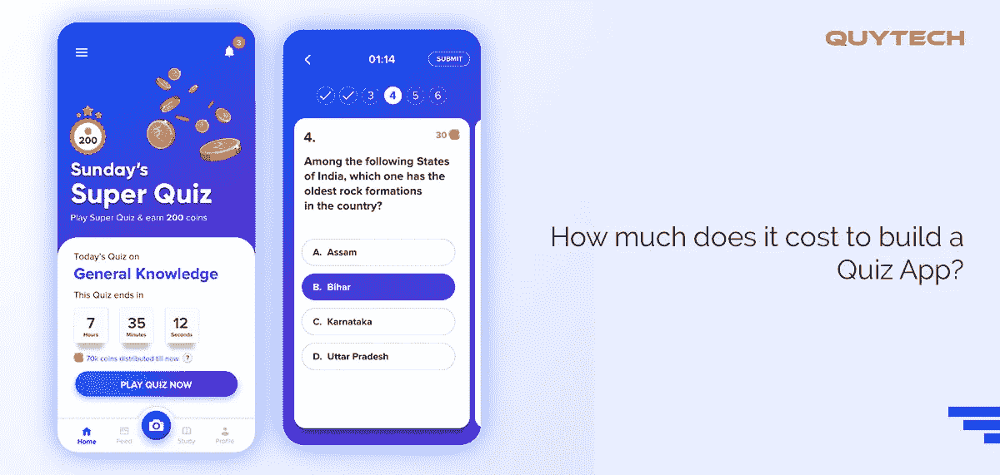

# 做一个竞猜 App 要多少钱？

> 原文：<https://medium.datadriveninvestor.com/how-much-does-it-cost-to-build-a-quiz-app-b6aa16a61f66?source=collection_archive---------3----------------------->

想要构建一个测验应用程序，但不知道其开发成本？

这篇文章值得一读。在这里，我们提供了关于测验应用程序开发的一切，包括开发成本。

查看以下内容:

# 创建测验应用程序的确切成本是多少？

任何一家[移动应用开发公司](https://www.quytech.com/)都只能在你对以下问题有答案的情况下，为你提供开发问答应用的估算成本:

*   您希望在哪个平台上发布应用程序
*   应用程序的特性和功能
*   测验应用的类型
*   应用程序的复杂性
*   构建应用程序所需的工具和技术
*   应用程序的用户界面/UX 设计

*创建一个测验应用程序的成本大约在 1 万到 5 万美元之间。这可能会根据您的特定应用程序要求而有所不同。*

# **问答游戏应用的基本特性**

测验应用程序的功能主要取决于应用程序的类型。但是，该应用程序的一些常见功能包括:

**主题选择** -允许用户选择他们感兴趣的主题，并获得与之相关的问题。

**日常挑战** -培养兴趣，增加用户参与度。回答每日挑战问题可以获得双倍奖励。这会吸引你的用户。

**推送通知** -发送关于更新、每日挑战等的通知。

**奖励**——每当用户答对问题时给予积分。

**注册/登录** -允许用户注册、创建账户，然后随时随地从任何设备访问账户。

 [## 隐私指南，关于应用开发|数据驱动投资者

### 挪威隐私机构 DPA 对当地的一个现实处以 20 万欧元的罚款，原因是…

www.datadriveninvestor.com](https://www.datadriveninvestor.com/2020/04/29/privacy-guidelines-about-app-development/) 

**语言选择** -让用户自由选择自己喜欢的语言，并以他们喜欢的语言回答问题。

为了让你的应用脱颖而出，你可以添加其他特殊功能，如社交媒体共享或用户讨论。这将有助于提高你的品牌知名度和用户参与度。

# **如何通过一个竞猜 app 赚取？**

为测验应用、教育应用或任何其他移动应用选择正确的盈利策略是必要的，以确保您在发布后获得最大的投资回报。通过你的问答应用赚钱的最好方法是添加应用内广告。在用户观看广告后，您可以给予一些奖励积分，这些积分可用于解锁测验中的进一步关卡。

# **打造成功问答手机应用的技巧**

请记住以下提示，以确保您的测验应用程序在 Play Store、App Store 或两个平台上都能成功:

**1。简单的界面**——因为一个问答应用不需要惊人的图形(除非它只是关于问题和答案)，因此，保持界面简单。对于现场测试应用程序，您可以考虑添加额外的图形。

**2。低延迟** -确保你的应用程序具有超低延迟。这意味着用户操作和应用程序响应之间的时间应该非常短。

**3。定期更新** -用新的问答数据库定期更新你的应用，让你的用户永远不会感到无聊。

**4。移动应用程序开发服务提供商**——确保你选择一个有开发测试应用程序经验的人。

搭建直播竞猜 app 请注意，比如花絮，选择万能服务器，视频流媒体服务器，录音棚，制作安排，精心挑选后台团队。

# **最佳问答手机应用**

以下是一些广受欢迎的问答应用，它们拥有庞大的客户群:

*   总部琐事
*   Live .我
*   发疯的
*   94%
*   标志游戏
*   爆米花琐事
*   奎祖普
*   Quizoid
*   问答天地
*   琐事 360

您可以在开始使用自己的测验移动应用程序之前查看它们。这将帮助你决定你可以添加哪些功能到你的应用程序中，使其与众不同。

现在，当你熟悉了一个**测验应用开发**的所有方面，联系一个可靠的移动应用开发服务提供商来开始你的项目。如果你选择的公司拥有教育应用程序开发或虚拟教室开发的经验，那么这将是你的项目的额外优势。

# **遗言**

在过去的几十年里，问答应用程序或琐事应用程序在移动应用程序行业占据了重要地位。这些应用程序不仅可以娱乐用户，还可以增强他们的一般知识，建立认知能力。智力竞赛应用面向大众受众，因此受到成人和儿童的喜爱。考虑到对智力竞赛应用程序的需求日益增长，为你的创业公司开发一个智力竞赛应用程序绝对是一个有利可图的选择。

如果你已经有了相同的决定，那么看看这篇文章，了解开发这样一个应用程序的成本，影响成本的因素，测验应用程序的基本功能，以及如何创建应用程序。

为了以防万一，如果你已经准备好了你的应用需求，那么就去找一家[教育应用开发公司](https://www.quytech.com/solutions-enterprise/education-industry.php)或者雇佣专门的开发人员来实现你的梦想。

联系我们:**info@quytech.com**

## 访问专家视图— [订阅 DDI 英特尔](https://datadriveninvestor.com/ddi-intel)