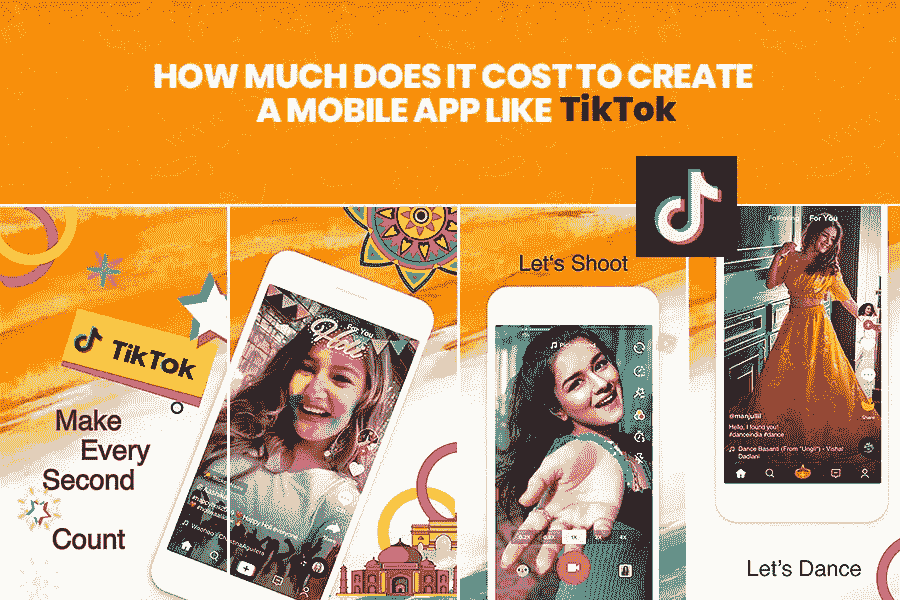

# 创建一个像 Tiktok 这样的应用程序需要多少成本？

> 原文：<https://medium.datadriveninvestor.com/how-much-does-it-cost-to-create-an-app-like-tiktok-4e8cb14e81d2?source=collection_archive---------20----------------------->

在很短的时间内，**已经成为网络红人。由于这一应用的成功，许多企业家和企业也想在这类应用中试试运气。如果你想了解抖音的一切，比如应用程序、特性、功能、技术和成本；那么这就是你必读的博客。所以，事不宜迟，让我们开始吧:**

# **什么是抖音？**

**抖音是一个极好的娱乐工具，因为它允许用户创建与音乐相关的视频，并在不同的社交媒体渠道上与他们的朋友圈分享。它是一个中文音乐视频平台，原名 Musicl.ly。除此之外，你会惊讶地发现，凭借其美丽的功能，它已经成为世界上增长最快的移动应用程序。**

**尽管在印尼面临不同的法律问题，但抖音在全球范围内发展迅速。在印度，抖音也遇到了一些最初的障碍，因此而受阻，但现在它又回来了。再者，这种移动应用天生就是疯狂的，普通用户甚至一天都无法远离使用它。除此之外，同时录制流行歌曲和影视对白也是很棒的方式。**

**这款手机应用可以让你将视频保存到手机上，或者分享到朋友圈。除此之外，您还可以将其公开，以扩大您的影响范围。移动应用程序提供的另一个显著特征是，它还允许您与其他用户的内容进行交互。为了访问数以百万计的视频，您还可以根据自己的喜好选择不同的类别。**

**抖音也为那些想展示才华的年轻人提供了一个绝佳的平台。不仅仅是原创的有趣的视频、动画和音乐，你还会得到不同的内容，比如摇滚、说唱、流行、电子等等。在 app 上。人们还发现，抖音手机应用程序的 Spotify 下载量超过了 Snapchat 和应用商店中的 Gmail。**

# **抖音风靡全球吗？**

**这款应用致力于创造高质量的内容，这是其广泛流行的真正原因，并有可能在未来保持相关性。Brandnaro 公布了拥有最多 Tictoc 用户的十个最佳国家。**

*   **印度—1.193 亿用户**
*   **美国—3960 万用户**
*   **土耳其——2840 万用户**
*   **俄罗斯—2430 万用户**
*   **墨西哥—1970 万用户**
*   **巴西—1840 万用户**
*   **巴基斯坦—1180 万用户**
*   **沙特阿拉伯—970 万用户**
*   **法国—910 万用户**
*   **德国—880 万用户**

**Tiktok 击败了脸书、YouTube 和 Messenger 等巨头，后者是 2019 年下载量最大的非游戏移动应用。最初，musical.ly 是母公司，后来被中国公司字节跳动收购，当时所有用户账户都从音乐中移除。该公司的简介表明，“我们看到了一个将人工智能的力量和移动互联网的增长以及人们消费和接收信息的方式相结合的机会。”距离使人们能够享受机器学习和人工智能驱动的内容。**

# **抖音:最新的社交媒体热点**

**你会习惯流行的社交媒体平台，如 Whatsapp、Youtube 和 Facebook Messenger。现在，如果我们告诉你，抖音在 2018 年 Q1 iOS 全球下载最多的应用程序方面胜过这些平台，会怎么样？根据审查塔，其余的排在第二到第四位。因此，字节跳动目前拥有的大多数应用程序都是由益铭·常在 2012 年创立的抖音。除此之外，这家手机 app 开发公司在原产国中国也被称为段。**

**2019 年 7 月，抖音宣布全球用户达到 50 万。Music.ly 的流行音乐社交媒体移动应用程序现已更名为抖音 Well，并于去年年初继续收购中国公司 Bytedance 的流行音乐社交媒体 Music.ly。今年，稍微有些忙乱的是，Music.ly 被换成了抖音，一个由字节跳动创建并提供支持的类似服务。**

**随着音乐帐户迁移到 Tiktok，它包含了两个移动应用程序中最卓越的元素。我们看到了一个将人工智能的力量和移动互联网的发展结合起来的机会，以彻底改变人们消费和接收信息的方式。**

**Bytedance 使人们能够享受机器驱动的内容和人工智能技术？公司说了吗？音乐应用程序开发“2018 年第一季度，抖音在短短三个月内已被下载 4580 万次。目前，该应用在中国每天包含超过 4500 万活跃年，高于其他社交媒体平台“请求报价”**

# **类似抖音的移动应用程序所需的顶级特性和功能**

**对于那些对构建像抖音这样的定制移动应用感兴趣的人来说，这里有一些重要的功能是所有用户都应该知道的。以下是一些最重要的特性和功能-**

## **简单的用户界面**

**这是移动应用开发者应该为用户提供简单用户界面的主要步骤。因此，用户和人们可以简单地使用您创建的移动应用程序。该移动应用程序易于使用。通过这样做，用户和人们在使用应用程序时获得更多更好的体验。**

## **让红心成为货币**

**好吧，如果你喜欢应用程序上的视频，而不关注制作视频的特定人。所以，不用担心，你只需要双击这个视频和这样一个视频。抖音手机应用程序类似于 Instagram 手机应用程序。唯一的例外是抖音的每一颗心都很重要。**

## **快速工具**

**Tiktok 移动应用程序中存在不同的设备。这些设备都是必不可少的，都是最高级别的。所有设备都包括许多不同的滤镜，增强现实效果，以及有趣或非常有趣的。**

## **社会特征**

**这意味着抖音手机应用程序提供了二重唱功能。在其中，产品与选定的对话同步，并构建其视频。在那之后，所有其他抖音用户在他们的网站上找到最成功的视频，然后用他们自己的方式制作他们自己的视频。**

## **抖音的一些其他高级功能**

*   **实时分析**
*   **视频流架构**
*   **推送通知**
*   **地理定位**

# **创建类似抖音的移动应用程序需要一些先进的技术**

*   **数据库:Postgress，Mail Chimp Integration，Cassandra，Mongo DB，HBase**
*   **实时分析:Spark Streaming、Azure Stream Analytics、Apache Flink**
*   **对于电子邮件:山魈**
*   **云环境:AWS**
*   **通用操作系统:Debian**
*   **支付:电子钱包、Paypal& Braintree、Stripe**
*   **对于数据库管理:数据税**
*   **强大的编程:GWT**
*   **云存储:为此，可以使用云存储解决方案，如 Azure、谷歌云存储和亚马逊 S3。**
*   **电话、语音和短信验证:Nexmo、Twilio**
*   **推送通知:Twilio，Push.io**
*   **内容交付网络(CDSs):为了提供用户体验，您应该要求使用高度可扩展和安全的内容交付网络服务来安全和迅速地传输流媒体。**
*   **媒体服务器配置:需要对服务器进行配置，以支持所有主流浏览器和设备。需要配置 RTMP、HTTPS 和 HTTP。**
*   **播放器配置:它需要被做为移动和桌面服务器质量的基础上的用户上网速度的内容。**
*   **视频和音频代码转换:在这个业务流程中，媒体文件应该以多种媒体格式进行代码转换，以使它们更受所有主流浏览器和设备的支持。对于这个问题，要么可以使用开源软件，例如像亚马逊弹性转码器和 FFMPEG 这样的第三方解决方案。**

# **Tiktok 移动应用程序的开发成本**

**创建一个像抖音这样的移动应用程序的成本，所有上述因素和功能都需要首先考虑。应用程序开发的成本因您希望开发该应用程序的地区、资源需求、小时数、设计复杂性等因素而异。你应该联系迪拜 的一家优秀的 [**移动应用开发公司，为你的应用获得正确的预算。**](https://www.xicom.ae/services/mobile-app-development/)**

**在这里，我可以给你一个公平的成本概念。平均而言，包括一个平台的一些基本功能在内，它的成本约为 25000 美元。虽然，像抖音这样的音乐应用程序的开发成本可能会为多个平台筹集高达 35000 美元和 40000 美元。如果你想创建一个音乐视频制作应用，那么你也可以 [**雇佣移动应用开发者**](https://www.xicom.ae/services/mobile-app-developers/) 。**

# **让我们结束吧**

**我希望在这个视频中，你对抖音这样的应用程序有一个清晰的认识。毫无疑问，这种应用在大众中越来越受欢迎，越来越多的人将这些应用用于娱乐目的。迪拜有许多安卓 [**应用开发公司**](https://www.xicom.ae/services/mobile-app-development/) 正在以非常低廉的价格开发类似抖音的应用。如果你也想拥有自己的应用程序，那么你可以联系这些公司。**

***原载于 2020 年 3 月 16 日*[*https://www . xicom . AE*](https://www.xicom.ae/blog/tiktok/)*。***